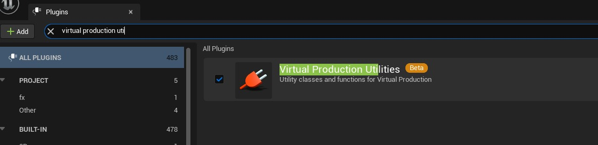
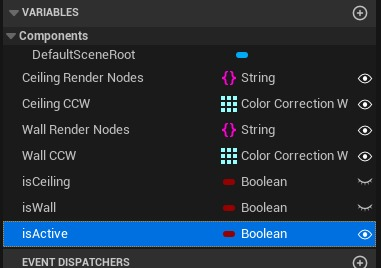
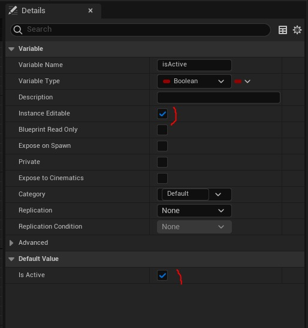
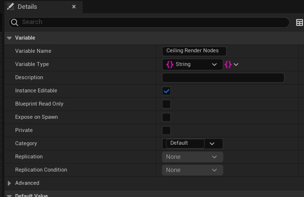
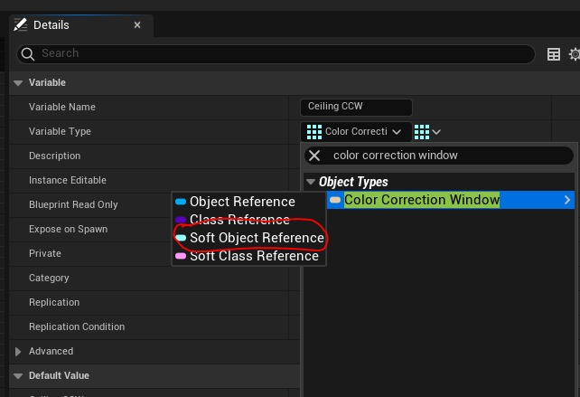
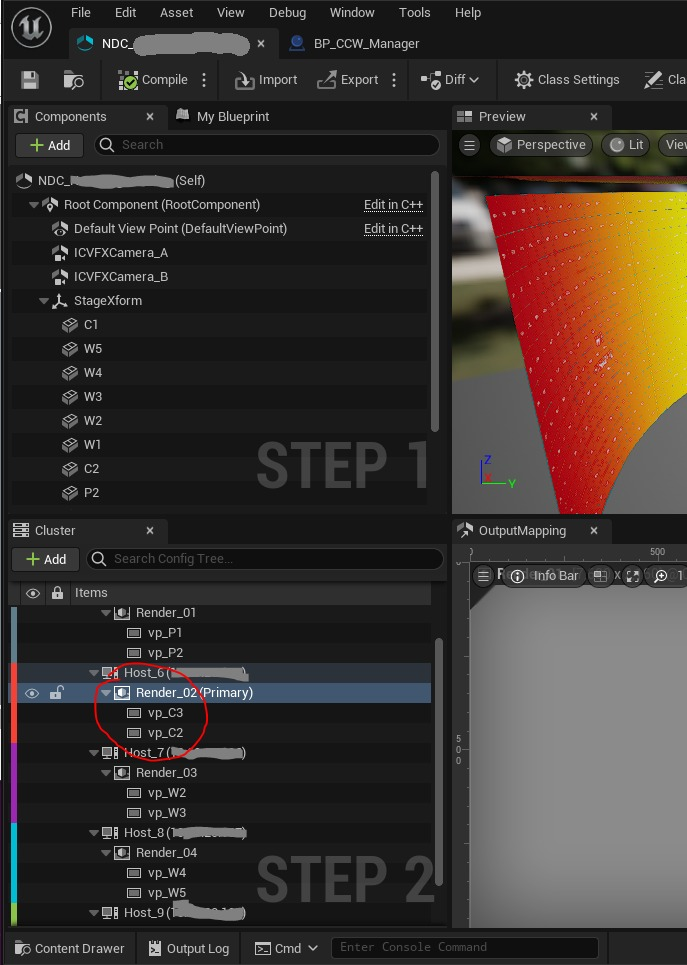
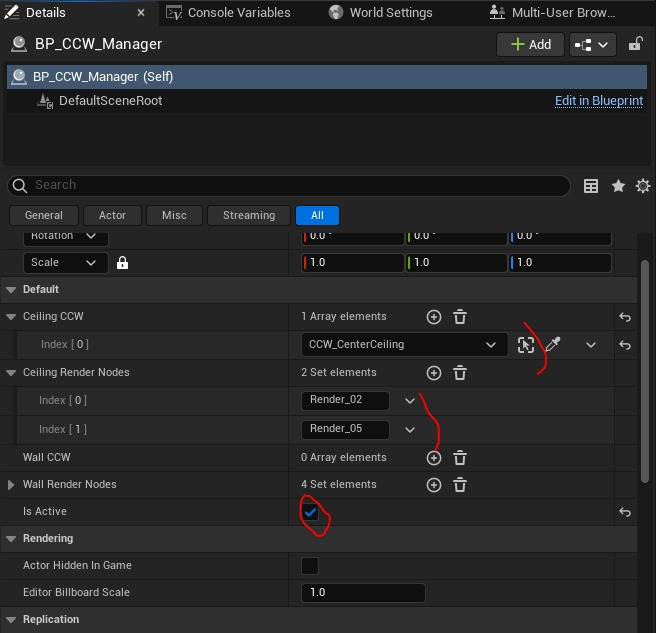

# ICVFX：获取仅应用于某些渲染节点的颜色校正窗口的蓝图

## 来源与状态

- 原始 URL：https://dev.epicgames.com/community/learning/tutorials/xrrX/unreal-engine-icvfx-blueprint-to-get-color-correction-windows-only-applied-to-some-of-the-render-nodes

## 运行时分类

- 类型：图文教程
- 判断：API 未识别到核心视频信号，可整理正文约 3247 字符。

## 摘要

当在“体积”上拍摄时，使用 LED 墙作为背景，您可能希望创建仅在某些渲染节点上可见的资源。例如，一个色彩校正窗口可以让您对墙壁交界处的天花板进行色彩校正。在本教程中，我们将创建一个充当“管理器”的蓝图 Actor：它将根据虚幻引擎正在运行的渲染节点打开或关闭所选颜色校正窗口的可见性。相同的逻辑可以用于任何其他类型的演员......

## 中文整理

### 介绍

当在“体积”上拍摄时，使用 LED 墙作为背景，您可能希望创建仅在某些渲染节点上可见的资源。例如，一个色彩校正窗口可以让您对墙壁交界处的天花板进行色彩校正。在本教程中，我们将创建一个充当“管理器”的蓝图 Actor：它将根据虚幻引擎正在运行的渲染节点打开或关闭所选颜色校正窗口的可见性。相同的逻辑可用于任何其他类型的演员...由于这是专门针对卷和我们的 nDisplay 设置而设计的，因此您需要加载插件 Virtual Production Utilities



让我们创建一个继承自 actor 的新蓝图。就我而言，我称之为 **BP_CCW_Manager**

### 变量

创建后，我们可以对其进行编辑并添加以下变量：



请注意，**天花板渲染节点**、**天花板 CCW**、**墙壁渲染节点**、**墙壁 CCW** 和 **isActive** 都是实例可编辑的（睁开眼睛的图标）。您还需要默认情况下 **isActive** 为 true



**天花板渲染节点**和**墙壁渲染节点**是字符串集。



**天花板 CCW** 和 **墙壁 CCW** 是颜色校正窗口软对象引用的数组



### 构建脚本

在构造脚本函数中，我们检查运行的机器是天花板渲染节点还是墙壁渲染节点。我们正在使用函数**获取节点 ID **（来自**显示集群模块 API**），并检查结果是否是 2 个集合之一的一部分。

**构建脚本**

```
Begin Object Class=/Script/BlueprintGraph.K2Node_FunctionEntry Name="K2Node_FunctionEntry_0"
   FunctionReference=(MemberParent=/Script/CoreUObject.Class'"/Script/Engine.Actor"',MemberName="UserConstructionScript")
   NodePosX=-512
   NodePosY=-16
   NodeGuid=229B7C4B490282E26C0F01BE916DF14C
   CustomProperties Pin (PinId=E30BAF184D67221E6FAA6E959A918D68,PinName="then",Direction="EGPD_Output",PinType.PinCategory="exec",PinType.PinSubCategory="",PinType.PinSubCategoryObject=None,PinType.PinSubCategoryMemberReference=(),PinType.PinValueType=(),PinType.ContainerType=None,PinType.bIsReference=False,PinType.bIsConst=False,PinType.bIsWeakPointer=False,PinType.bIsUObjectWrapper=False,PinType.bSerializeAsSinglePrecisionFloat=False,LinkedTo=(K2Node_VariableSet_0 77E53F9E43579E2663887E8E5A040B7E,),PersistentGuid=00000000000000000000000000000000,bHidden=False,bNotConnectable=False,bDefaultValueIsReadOnly=False,bDefaultValueIsIgnored=False,bAdvancedView=False,bOrphanedPin=False,)
End Object
Begin Object Class=/Script/BlueprintGraph.K2Node_CallFunction Name="K2Node_CallFunction_0"
   bIsPureFunc=True
   FunctionReference=(MemberParent=/Script/CoreUObject.Class'"/Script/DisplayCluster.DisplayClusterBlueprintLib"',MemberName="GetAPI")
```

### 事件勾选

在 Even Tick 期间，我们在 **Ceiling CCW** 和 **Wall CCW** 两个数组中引用的所有颜色校正 Windows actor 上设置参数“**Hidden in Game**”。

**事件勾选**

```
Begin Object Class=/Script/BlueprintGraph.K2Node_Event Name="K2Node_Event_2"
   EventReference=(MemberParent=/Script/CoreUObject.Class'"/Script/Engine.Actor"',MemberName="ReceiveTick")
   bOverrideFunction=True
   NodePosY=416
   bCommentBubblePinned=True
   NodeGuid=E9E122884AC67C3E5F3D4BA82ABEEF5D
   CustomProperties Pin (PinId=DC5B620B44D6686E9BBF80B85A19B40F,PinName="OutputDelegate",Direction="EGPD_Output",PinType.PinCategory="delegate",PinType.PinSubCategory="",PinType.PinSubCategoryObject=None,PinType.PinSubCategoryMemberReference=(MemberParent=/Script/CoreUObject.Class'"/Script/Engine.Actor"',MemberName="ReceiveTick"),PinType.PinValueType=(),PinType.ContainerType=None,PinType.bIsReference=False,PinType.bIsConst=False,PinType.bIsWeakPointer=False,PinType.bIsUObjectWrapper=False,PinType.bSerializeAsSinglePrecisionFloat=False,PersistentGuid=00000000000000000000000000000000,bHidden=False,bNotConnectable=False,bDefaultValueIsReadOnly=False,bDefaultValueIsIgnored=False,bAdvancedView=False,bOrphanedPin=False,)
   CustomProperties Pin (PinId=C7151CD74F02804F834DEE8E36A251BC,PinName="then",Direction="EGPD_Output",PinType.PinCategory="exec",PinType.PinSubCategory="",PinType.PinSubCategoryObject=None,PinType.PinSubCategoryMemberReference=(),PinType.PinValueType=(),PinType.ContainerType=None,PinType.bIsReference=False,PinType.bIsConst=False,PinType.bIsWeakPointer=False,PinType.bIsUObjectWrapper=False,PinType.bSerializeAsSinglePrecisionFloat=False,LinkedTo=(K2Node_IfThenElse_0 35AA43C1482EC447BC547488F3DF1F03,),PersistentGuid=00000000000000000000000000000000,bHidden=False,bNotConnectable=False,bDefaultValueIsReadOnly=False,bDefaultValueIsIgnored=False,bAdvancedView=False,bOrphanedPin=False,)
   CustomProperties Pin (PinId=371356024AD6FF4FFC0317A2217CC259,PinName="DeltaSeconds",PinToolTip="Delta Seconds\nFloat (single-precision)",Direction="EGPD_Output",PinType.PinCategory="real",PinType.PinSubCategory="float",PinType.PinSubCategoryObject=None,PinType.PinSubCategoryMemberReference=(),PinType.PinValueType=(),PinType.ContainerType=None,PinType.bIsReference=False,PinType.bIsConst=False,PinType.bIsWeakPointer=False,PinType.bIsUObjectWrapper=False,PinType.bSerializeAsSinglePrecisionFloat=False,DefaultValue="0.0",AutogeneratedDefaultValue="0.0",PersistentGuid=00000000000000000000000000000000,bHidden=False,bNotConnectable=False,bDefaultValueIsReadOnly=False,bDefaultValueIsIgnored=False,bAdvancedView=False,bOrphanedPin=False,)
End Object
```

### 演员在场景中布置

将新资源 **BP_CCW_Manager** 拖到场景中。它的位置并不重要。在 **Ceiling Render Nodes** 参数中，添加运行天花板的计算机的名称。请注意，该名称需要与您在 nDisplay 配置中看到的名称匹配。就我而言，我有两个渲染节点：**Render_02** 和 **Render_05**，这是我可以找到名称的地方。



添加渲染节点的名称后，您可以引用仅在天花板上可见的所有颜色校正窗口。就我而言，我有一个：**CCW_CenterCeiling**，我将其添加到** Ceiliing CCW **参数中



最后，请务必将*** *****Is Active ** 设置为 True。如果您知道您不会修改场景或添加色彩校正窗口，则可以将其设置为 false：它不会删除之前设置的内容。您的色彩校正窗口将隐藏在游戏值中。但您的蓝图将停止更新“Tick 事件”以优化性能。
