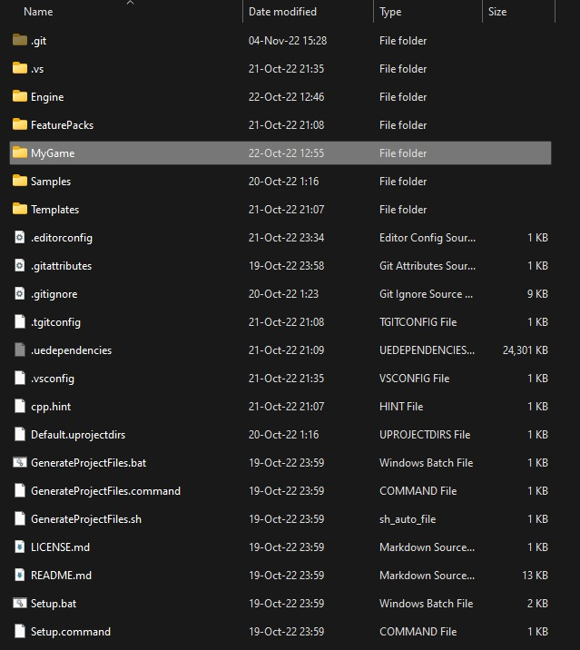

# 将 GitHub 上的引擎源集成到项目的 Perfoce 存储库

## 来源与状态

- 原始 URL：https://dev.epicgames.com/community/learning/tutorials/oZ9d/unreal-engine-integrating-engine-source-from-github-to-project-s-perfoce-repository

## 运行时分类

- 类型：图文教程
- 判断：API 未识别到核心视频信号，可整理正文约 10830 字符。

## 摘要

许多开发人员害怕使用“源代码构建”——由团队从源代码编译的虚幻引擎，这为修改引擎打开了大门。原因之一是他们认为集成新引擎版本的过程既痛苦又耗时。本教程介绍了通过 GitHub 集成引擎更改的简单过程，每个人都可以在 GitHub 上获取引擎源代码。它利用 Git 基础设施轻松合并引擎更改。

## 中文整理

### 概览

使用 Perforce 作为项目的版本控制系统是一种常见的做法，因为它是大型二进制数据集最有效的 VCS。 （如果您想了解如何使用 Perforce，这里有另一个关于 [使用和设置 Perforce 存储库](https://dev.epicgames.com/community/learning/tutorials/Gxoj/unreal-engine-using-and-setting-up-perforce-repository) 的教程）问题是，一些团队从 Epic 的 GitHub 存储库中的另一个 VCS 获取虚幻引擎源代码。当一个团队想要更新引擎时，许多程序员都会采取手动比较两个代码库的方式。这可能是一项乏味且耗时的工作。不用担心，如果我们使用优秀的 Git 生态系统来完成这项工作，事情就会变得容易得多。整个过程可能会使用 GitHub Desktop 界面，因此您无需深入命令行！基本上，我们将欺骗 GitHub 使用与 Perforce 工作区相同的文件夹！如果您采用这种方式，则花费在引擎合并上的大部分时间将只是等待该过程（例如下载/上传引擎源代码）完成。同时，你可以专注于其他工作。如果您有简单的合并冲突，实际的程序员工作可能只需要几分钟。注意：我在一些全职程序员的项目中使用了这个流程，但引擎修改的数量有限。我知道工程师喜欢不同的设置，比如通过 Perforce 处理合并冲突。就我而言，我曾经通过 GitHub Desktop 处理冲突，因为如果所有冲突都可以由单个程序员处理，这是最不麻烦的方法。您可能觉得需要以不同的方式处理这个问题。无论您使用什么方法来集成引擎更改，都不要将重大更改直接集成到您的开发分支中。强烈建议使用P4流库。在单独的升级分支上执行集成，该分支将是与您的开发分支位于同一仓库下的开发流。集成后确认项目正常运行后，将升级分支的变更合并到开发分支。否则，你和你的队友仍然会很痛苦。注意：在撰写本文时，我还没有使用像 Helix4Git 这样的解决方案，不确定它们是否提供了更简单的管道。下面描述的方法已经在许多项目中进行了测试并且工作起来足够简单。所以我们没有动力去测试其他方法。

### 设置 Perforce-to-Git 引擎副本

1. 最重要的是直接使用Git创建自己的引擎的fork。 1. 我的做法是简单地在 GitHub.com 上进行分叉。只需转到[引擎存储库](https://github.com/EpicGames/UnrealEngine) 并分叉它即可。 1. 这里有一个问题。您可能希望将您的分叉保密，因为它包含受 NDA 保护的代码。现在，如果您想将一个私有存储库（即虚幻引擎存储库，只有将您的 GitHub 帐户连接到 Epic 帐户才能访问）分叉到另一个私有存储库，您需要支付 [GitHub Team 订阅](https://github.com/team) 的费用。简而言之，拥有您的存储库的团队需要至少有一名成员，您需要为其支付月费或年费。就我个人而言，考虑到 GitHub 作为一项服务为世界贡献了多少价值，我很乐意支付这笔费用。 2. 注意：我的朋友建议了其他方法，即将 git 文件添加到 Perforce 存储库。其他人更喜欢通过 Perforce 执行引擎合并，使用单独的流来存储引擎的普通版本。不管怎样，我没有使用这些方法的经验，所以本指南的其余部分继续假设我们使用“我的方式”，即 GitHub.com 的分支。 2. 好的，创建引擎叉后...将其下载到您的计算机上。只是不要使用 Zip 下载，它在这里毫无用处。 3. 如果尚未安装 [GitHub Desktop](https://desktop.github.com/)，请安装它。 4. 分叉特定引擎的分支，即将 **5.0** 分支分叉为 **5.0-MyProjectName**。 5. 使用 **Setup.bat** 通过 GitDependency 下载引擎二进制资源。因为在 Git 下存储数十 GB 的版本化资产将是非常糟糕的。是的，即使是 Git LFS 也不是完美的解决方案。而且 GitHub 限制了存储库的总大小，因此不能通过简单地克隆存储库来下载引擎二进制资源。 6. **现在我们要欺骗 Git 使用与 Perforce 相同的文件夹！** 这将使我们的集成工作变得容易。 1. 关闭 GitHub Desktop。 2. 如果您的项目中还没有引擎源（您现在从预编译的 Launcher 版本进行切换），只需将整个 Git 克隆的存储库与游戏一起移动到您的 Perforce 文件夹即可。标准设置是将 **Engine** 文件夹与 **Project** 文件夹并排放置。因此，您的项目直接位于软件仓库根目录中，首先将其移动到以您的项目命名的子文件夹中。 3. 如果您的引擎源已存在于您的存储库中，只需将 **.git** 文件夹移动到您的 Perforce 文件夹。它需要与引擎文件保持相对关系，并且需要与 **Engine** 文件夹位于同一文件夹中。 7. 打开 GitHub Desktop。它会抛出错误“未找到存储库”。使用 **Location** 选项将其指向移动 **.git** 文件夹时的文件夹。 Git 现在将处理这个更改。这可能需要很多分钟，更新 100k 文件的信息也是如此。 8. 如果您修改了任何引擎文件，它们都会在“更改”选项卡中列出。这正是我们的目标！您希望将所有这些更改提交到您的分叉分支，即 **5.0-MyProjectName**。 1. 好吧，除了它可能会列出所有项目文件。我们不想将其推送到 GitHub。我们只关心引擎文件，以便简化所有未来的引擎更新。只需将您的项目文件夹添加到 .gitignore 即可。将此更改与其他引擎修改一起推动。 9. 就这样。以下部分描述了更新引擎的方法，因为我们已经准备好了分叉的 Git 分支。

### 集成新的主要引擎版本

因此，假设我们正在开发 UE 5.0 并进行了大量修改。现在我们要迁移 UE 5.1。 1. 如果 Perforce 文件夹中仍有 Git 存储库（存在 .git 文件夹），请转到步骤 2。 1. 如果没有，则需要克隆它并应用第一部分中的步骤 6-9。 2. 打开 GitHub Desktop，它应该会处理更改。自上次提交以来对当前引擎版本（即 50）的所有更改都应该在“更改”选项卡中可见。承担这一切。 3. 现在从上游 **5.1** 分支创建一个新的分叉分支，即 **5.1-MyProjectName**。 4. 返回**5.0-MyProjectName**。 5. （可选）使用 git squash 命令将所有提交合并为一个提交。这将简化将所有更改合并到另一个分支的过程。特别是，如果某些文件被多次修改。 6. 您可以通过拖放来开始合并从 5.0 到 5.1 的所有更改。转到“历史记录”选项卡。选择带有引擎修改的所有提交，并将它们拖到“分支”列表中。握住它并将其放在 **5.1-MyProjectName ** 分支上。 1. 这只是触发标准 Git 的 **cherry-pick** 命令，而不需要使用命令行。 2. 如果没有任何冲突，5.0 中的所有提交都将移至 5.1 分支。您只需将这些提交推送到这个新分支即可。 3. 如果有任何冲突，GitHub Desktop 现在会显示一个很好的冲突列表。您可以通过上下文菜单一一打开每个冲突文件。就我个人而言，我使用 Visual Studio Code 来处理合并冲突。它是轻量级的，并提供易于使用的 UI 来处理 Git 冲突。您可以直接在给定文件中的冲突之间跳转。您可以选择应接受哪个版本的代码。 1. 解决冲突后，您应该会在“已更改”选项卡中列出所有更改。准备好提交。 7. 现在您已经通过 GitHub 集成了所有引擎更改，所有文件也在 Perforce 文件夹中本地修改。 8. 您还需要运行Setup.bat才能下载引擎二进制资源。 1. 这里有一个问题。此操作可能会引发 GitDependency update 无法覆盖只读文件的错误。如果给定文件之前已添加到 Perforce 存储库，并将文件设置为只读（如果给定文件类型是通过 p4 类型映射设置的），则会发生这种情况。快速解决方法是将许多引擎文件夹设置为可写。它只会影响您的本地 Perforce 存储库副本。 9. 现在只需通过 P4V 运行 Reconcile，它将收集通过 GitHub 所做的更改。这就是您需要对 Git 之外的文件执行的全部操作。 1. 通过远程连接对整个引擎执行 Reconcile 可能需要数小时。这主要是因为 Perforce 会测试每个新添加的文件（如果它没有重命名或从不同版本的位置移动）。在这种情况下，文件状态将被标记为“已移动/已添加”而不是“已添加”。您可以通过首先对文件夹运行“标记为添加”操作来绕过此测试。 10. 显然，现在您需要照常执行其余集成。编译引擎并修复所有问题。最后一点。有时我发现在步骤 7 中执行“使文件可写”很烦人。所以有时我只是这样做 - 将 GitHub 存储库克隆到我的 Perforce 文件夹中的单独文件夹中。 - 在那里合并，因为所有文件都是可读的。 - 然后删除 Perforce 存储库中的引擎文件。将此新文件夹的内容移至 Perforce 存储库。唯一需要注意的是，您需要将 Perforce 的所有更改都提交到 GitHub 分支。不知道，它可能对你有用。

### 同步当前引擎版本

经常发生的情况是，我们已经在 UE 5.0 分支上工作，但 Epic 在过去几周提交了很多更改，我们希望同步它。程序稍微简单一些。无需创建新的 GitHub 分支。 1. 打开 GitHub Desktop。确保您位于 ** 5.0-MyProjectName** 分支。 2. 打开 **Branch** 菜单，然后选择 **Rebase currentbranch** 选项。选择根据 Epic 的 **upstream/5.0** 分支重新调整您的分支。效果应该是上游分支的所有更改都包含在您的分支中。您的所有提交仍将显示在更改的顶部列表中。 3. 您仍然需要运行 **Setup.bat** 并在 Perforce 工作区上协调您的更改。如果 Rebase 操作由于某种原因不起作用，您可以使用 **合并到当前分支** 选项。它只是不会那么好地重写分支历史。
