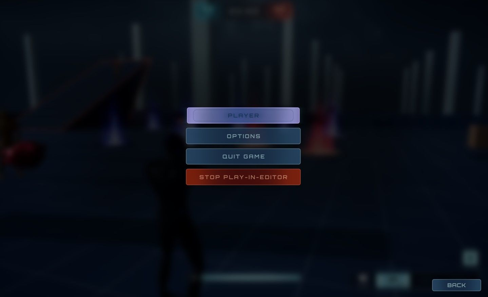

# Lyra：向 ESC 菜单添加新按钮

## 来源与状态

- 原始 URL：https://dev.epicgames.com/community/learning/tutorials/Dljx/unreal-engine-lyra-add-a-new-button-to-esc-menu

## 运行时分类

- 类型：图文教程
- 判断：API 未识别到核心视频信号，可整理正文约 1625 字符。

## 摘要

以 Lyra 功能插件友好的方式向 Escape 菜单添加新按钮的简单指南。

## 中文整理

### 概览

这是一个关于以与 Lyra 功能插件友好的方式向退出菜单添加新按钮的简单指南。现在您只需打开 **W_LyraGameMenu** 并复制其中一个按钮即可完成。但很可能您的按钮想要在功能插件（例如 ShooterCore）中打开一个新的小部件，而这样做将是非法引用 - 因为 W_LyraGameMenu 只能合法引用基本内容。如果某个按钮仅与特定的游戏体验相关，例如想要为您的大厅和游戏或季节性功能使用不同的按钮，该怎么办？

### 这是如何...

1. 打开 **W_LyraGameMenu ** 并搜索 ExtensionPointWidget。 1. 将其添加到其他按钮上方（或任何您想要添加内容的位置）。选择它并向下滚动到底部。 2. 创建并添加一个新的扩展点标签，例如 ShooterGame.ExtensionPoint.EscMenu 即可。 2. 创建一个包含一个或多个按钮的**新小部件**。 1. 将它们包裹在垂直的盒子中。 2. 如果要与其他按钮保持一致，请使用W_LyraMenuButton。如果你想要那种一致性，他们确实使用不同的纹理。 3. 为按钮指定插槽最小宽度 448，底部填充为 16。 4. 为按钮指定您想要的任何 *On Button Base Clicked* 逻辑。 3. 现在打开您希望显示的体验定义，例如 B_ShooterGame_Elimination。 1. 滚动到底部并添加新的 UI > 小部件 2. 使用步骤 2 中创建的新小部件对其进行设置。 3. 将插槽 ID 设置为步骤 1b 中创建的扩展点。现在，在使用该体验时，您的 Escape 菜单中会出现新按钮。
