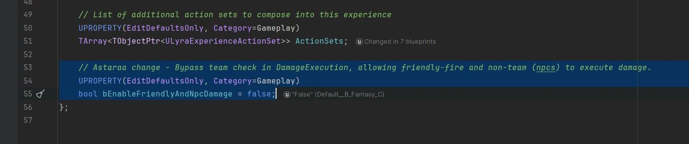
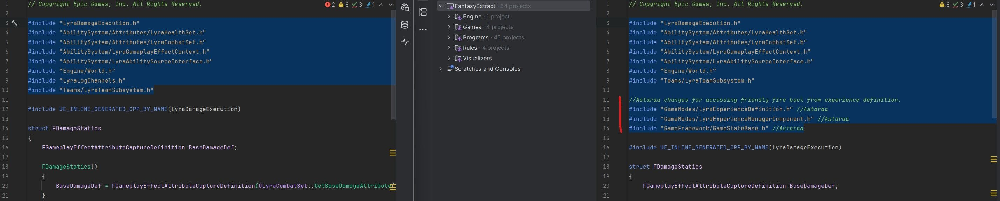
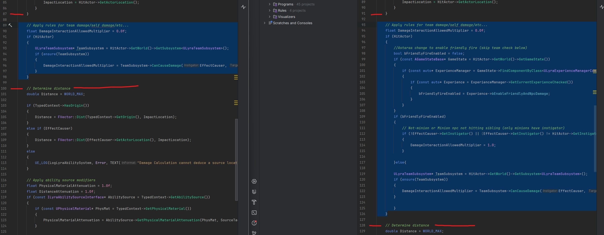

# 天琴座：友军火力+来自 NPC 的伤害

## 来源与状态

- 原始 URL：https://dev.epicgames.com/community/learning/tutorials/3XXd/unreal-engine-lyra-friendly-fire-damage-from-npcs

## 运行时分类

- 类型：图文教程
- 判断：API 未识别到核心视频信号，可整理正文约 2033 字符。

## 摘要

添加混战和 NPC 伤害选项。

## 中文整理

### 概览

我将NPC定义为基本角色，与“机器人”不同。我的基于 LyraCharacterWithAbilities。他们并不像机器人那样成为虚拟玩家。默认情况下，Lyra 是根据基于团队的规则制定的。演员必须在一个团队中才能施加伤害，并且只能对不在同一团队中的其他人造成伤害。 （演员在没有团队的情况下也会受到伤害。）这意味着： 1. 基本 NPC（无团队）无法造成伤害 2. 没有混战或友军火力 3. 玩家需要类似 B_TeamSetup_TwoTeams 组件的组件来将玩家分配到团队中，这不适合非团队游戏（Fortnite、GTA 等）。一种解决方法是为每个玩家提供足够的团队 - 即，如果您预计一个游戏中有 16 名玩家比赛，有16支球队。这很好，但如果我们想让基本 NPC 造成伤害，这对我们没有帮助。如果在团队中，我们可能希望维持基于团队的规则，并且也将非团队视为团队。我们可能想考虑另一种派系识别方法，这样同一派系就不会互相伤害……例如。如果有相同派系的游戏标签。最终取决于我们想要什么，但我认为这为我们提供了不同规则的良好起点，同时可以选择使用原始团队规则。当前的迭代还可以防止手榴弹伤害自己（没有人希望这样），因为它具有与我的“奴才”类似的煽动者逻辑（你是他们的煽动者，你不希望他们伤害你或彼此）。该 if 语句可以被注释掉，以实现真正的自由混战（提到了小黄人的那个）。这样做可以让任何人伤害任何人。

### 概述

1. 添加切换到 LyraExperienceDefinition，以便我们可以切换新规则或使用默认团队规则。 2. 修改 LyraDamageExecution 以允许新规则。

### 1.添加切换开关

添加新选项到 **LyraExperienceDefiniton.h**



**LyraExperienceDefiniton.h**

```cpp
// Astaraa change - Bypass team check in DamageExecution, allowing friendly-fire and non-team (npcs) to execute damage.
	UPROPERTY(EditDefaultsOnly, Category=Gameplay)
	bool bEnableFriendlyAndNpcDamage = false;
```

### 2.添加新规则

**LyraDamageExecution.cpp (1)**

```cpp
//Astaraa changes for accessing friendly fire bool from experience definition.
#include "GameModes/LyraExperienceDefinition.h" //Astaraa
#include "GameModes/LyraExperienceManagerComponent.h" //Astaraa
#include "GameFramework/GameStateBase.h" //Astaraa
```

**LyraDamageExecution.cpp (2)**

```cpp
	// Apply rules for team damage/self damage/etc...
	float DamageInteractionAllowedMultiplier = 0.0f;
	if (HitActor)
	{
		//Astaraa change to enable friendly fire (skip team check below)
		bool bFriendlyFireEnabled = false;
		if (const AGameStateBase* GameState = HitActor->GetWorld()->GetGameState())
		{
			if (const auto* ExperienceManager = GameState->FindComponentByClass<ULyraExperienceManagerComponent>())
			{
```

### 前后对比





- [Lyra：如何损坏立方体或非立方体](https://dev.epicgames.com/community/learning/tutorials/PJVG/unreal-engine-lyra-how-to-damage-a-cube-or-non-cube)

## 相关链接

- [Lyra: How to damage a cube or non-cube](https://dev.epicgames.com/community/learning/tutorials/PJVG/unreal-engine-lyra-how-to-damage-a-cube-or-non-cube)
