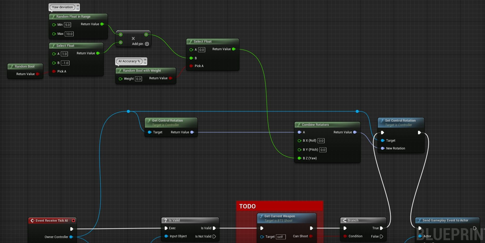

# Lyra：Nerf 人工智能机器人

## 来源与状态

- 原始 URL：https://dev.epicgames.com/community/learning/tutorials/kGrB/unreal-engine-lyra-nerf-ai-bots

## 运行时分类

- 类型：图文教程
- 判断：API 未识别到核心视频信号，可整理正文约 1108 字符。

## 摘要

让你的机器人摆脱噩梦模式。超级简单。

## 中文整理

### 概览

机器人无情且准确率 100%。他们之所以会失手，是因为他们继续射击时武器已经扩散。但只要齐心协力，我们就能阻止他们。我们需要做的就是添加一个 **SetControlRotation** 到 **BTS_Shoot **(ShooterCore/Bot/Services)，并带有随机的 Yaw 值。 （参见下图）此示例导致机器人在 30% 的时间内进行攻击，其余时间它们将目标瞄准两侧 5-10 度。调整数字以提高或降低难度。我发现 30-40% (0.3-0.4) 很舒服。 100%（或 1.0）将使它们的行为与默认情况一样。我们使用组合旋转器将随机偏航值与其当前的控制旋转相结合。就是这样。现在享受不会让你想哭的人工智能吧。 *要尝试的事情...* - 将 SetControlRotation 设置为 0 看看它的作用。无论他们面朝哪个方向，你都会看到他们向 0 开火。这就是我们想要的，在不旋转角色的情况下影响目标。 - 将准确度 % 设置为 0，看看他们错过时会发生什么。它总是会向右或向左射击 5-10 度，永远不会击中您。



**Lyra AI nerf 的 Ez 复制面食**

```
Begin Object Class=/Script/BlueprintGraph.K2Node_CallFunction Name="K2Node_CallFunction_0" ExportPath="/Script/BlueprintGraph.K2Node_CallFunction'/ShooterCore/Bot/Services/BTS_Shoot.BTS_Shoot:EventGraph.K2Node_CallFunction_0'"
   FunctionReference=(MemberParent="/Script/CoreUObject.Class'/Script/Engine.Controller'",MemberName="SetControlRotation")
   NodePosX=1728
   NodePosY=192
   NodeGuid=BA1F060A437644CBBF5756AB4AE36A39
   CustomProperties Pin (PinId=720F0FA6450036E1FBA64A8A7C27FD09,PinName="execute",PinToolTip="\nExec",PinType.PinCategory="exec",PinType.PinSubCategory="",PinType.PinSubCategoryObject=None,PinType.PinSubCategoryMemberReference=(),PinType.PinValueType=(),PinType.ContainerType=None,PinType.bIsReference=False,PinType.bIsConst=False,PinType.bIsWeakPointer=False,PinType.bIsUObjectWrapper=False,PinType.bSerializeAsSinglePrecisionFloat=False,LinkedTo=(K2Node_IfThenElse_0 B18B48CB43BC82397A4DD08FF5B2194B,),PersistentGuid=00000000000000000000000000000000,bHidden=False,bNotConnectable=False,bDefaultValueIsReadOnly=False,bDefaultValueIsIgnored=False,bAdvancedView=False,bOrphanedPin=False,)
   CustomProperties Pin (PinId=2A788D724D9D2A25C8E1FA956C3E09AC,PinName="then",PinToolTip="\nExec",Direction="EGPD_Output",PinType.PinCategory="exec",PinType.PinSubCategory="",PinType.PinSubCategoryObject=None,PinType.PinSubCategoryMemberReference=(),PinType.PinValueType=(),PinType.ContainerType=None,PinType.bIsReference=False,PinType.bIsConst=False,PinType.bIsWeakPointer=False,PinType.bIsUObjectWrapper=False,PinType.bSerializeAsSinglePrecisionFloat=False,LinkedTo=(K2Node_CallFunction_16 D720639449EE65F78601D181EF0E5B76,),PersistentGuid=00000000000000000000000000000000,bHidden=False,bNotConnectable=False,bDefaultValueIsReadOnly=False,bDefaultValueIsIgnored=False,bAdvancedView=False,bOrphanedPin=False,)
   CustomProperties Pin (PinId=6818D35F4FA4BD668A716585B36D85D0,PinName="self",PinFriendlyName=NSLOCTEXT("K2Node", "Target", "Target"),PinToolTip="Target\nController Object Reference",PinType.PinCategory="object",PinType.PinSubCategory="",PinType.PinSubCategoryObject="/Script/CoreUObject.Class'/Script/Engine.Controller'",PinType.PinSubCategoryMemberReference=(),PinType.PinValueType=(),PinType.ContainerType=None,PinType.bIsReference=False,PinType.bIsConst=False,PinType.bIsWeakPointer=False,PinType.bIsUObjectWrapper=False,PinType.bSerializeAsSinglePrecisionFloat=False,LinkedTo=(K2Node_Knot_3 53D81C7D47DE2A6EAC0E34866CC0A567,),PersistentGuid=00000000000000000000000000000000,bHidden=False,bNotConnectable=False,bDefaultValueIsReadOnly=False,bDefaultValueIsIgnored=False,bAdvancedView=False,bOrphanedPin=False,)
   CustomProperties Pin (PinId=ADDAB2F54705B1B4211249BF1C7F9044,PinName="NewRotation",PinToolTip="New Rotation\nRotator (by ref)",PinType.PinCategory="struct",PinType.PinSubCategory="",PinType.PinSubCategoryObject="/Script/CoreUObject.ScriptStruct'/Script/CoreUObject.Rotator'",PinType.PinSubCategoryMemberReference=(),PinType.PinValueType=(),PinType.ContainerType=None,PinType.bIsReference=True,PinType.bIsConst=True,PinType.bIsWeakPointer=False,PinType.bIsUObjectWrapper=False,PinType.bSerializeAsSinglePrecisionFloat=False,DefaultValue="0, 0, 0",AutogeneratedDefaultValue="0, 0, 0",LinkedTo=(K2Node_CallFunction_7 ADB7330A453FABFB4BBE1C90368FFCEC,),PersistentGuid=00000000000000000000000000000000,bHidden=False,bNotConnectable=False,bDefaultValueIsReadOnly=False,bDefaultValueIsIgnored=True,bAdvancedView=False,bOrphanedPin=False,)
End Object
```
