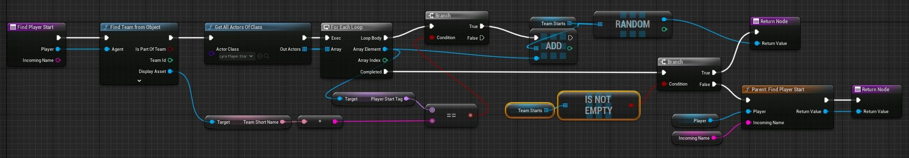

# Lyra：基于团队的生成点

## 来源与状态

- 原始 URL：https://dev.epicgames.com/community/learning/tutorials/XjBe/unreal-engine-lyra-team-based-spawn-points

## 运行时分类

- 类型：图文教程
- 判断：API 未识别到核心视频信号，可整理正文约 1263 字符。

## 摘要

想要确保在自己的基地中生成玩家，或者以其他方式分配一个团队到生成点？

## 中文整理

### 概览



### 步骤

1. 重写 **B_LyraGameMode** 中的 **FindPlayerStart** 函数，如图所示（或复制粘贴下图）。 - 添加 *LyraPlayerStart* 类型的 [LOCAL](https://forums.unrealengine.com/t/community-tutorial-lyra-team-based-spawn-points/1316160/3?u=astaraa) 变量 *TeamStarts* 作为数组。 - 右键单击​​ FindPlayerStart 获取 Parent 调用节点。 2. 现在，在 LyraPlayerStarts > Player Start Tag 中，输入 Red 或 Blue。红队将始终在随机的“红”处生成，蓝队将始终在随机的“蓝”处生成。 - 名称由团队数据资产设置（例如 TeamDA_Red）。 - 只要名字匹配，更多的团队也应该可以工作。其他逻辑可以在这里完成。它只需要返回一个 actor（一个 PlayerStart）。

### 它是如何运作的

1. 在 FindPlayerStart 上，我们获取玩家的团队名称。 2. 我们获取所有 LyraPlayerStart 并循环检查每个玩家的开始标签是否与玩家的团队名称匹配。 3. 如果是，我们将其添加到本地变量：TeamStarts。 4. 如果找到任何一个，我们会随机获得一个并将其作为我们的玩家开始返回。 5. 如果没有找到，我们将回退到默认方法。 - 这意味着如果您不使用任何“玩家开始标签”，它将表现为默认的 Lyra。

**B_LyraGameMode FindPlayerStart**

```
Begin Object Class=/Script/BlueprintGraph.K2Node_FunctionEntry Name="K2Node_FunctionEntry_0" ExportPath="/Script/BlueprintGraph.K2Node_FunctionEntry'/Game/B_LyraGameMode.B_LyraGameMode:FindPlayerStart.K2Node_FunctionEntry_0'"
   LocalVariables(0)=(VarName="TeamStarts",VarGuid=EEAB3E0C492DF32B2171F08ACFEE5661,VarType=(PinCategory="object",PinSubCategoryObject="/Script/CoreUObject.Class'/Script/LyraGame.LyraPlayerStart'",ContainerType=Array),FriendlyName="Team Starts",Category=NSLOCTEXT("KismetSchema", "Default", "Default"),PropertyFlags=2053)
   FunctionReference=(MemberParent="/Script/CoreUObject.Class'/Script/Engine.GameModeBase'",MemberName="FindPlayerStart")
   NodeGuid=81BF210D4AA9199CBE75188BA8C6DB25
   CustomProperties Pin (PinId=C48FBD9344522AAA9193E888059DF63A,PinName="then",Direction="EGPD_Output",PinType.PinCategory="exec",PinType.PinSubCategory="",PinType.PinSubCategoryObject=None,PinType.PinSubCategoryMemberReference=(),PinType.PinValueType=(),PinType.ContainerType=None,PinType.bIsReference=False,PinType.bIsConst=False,PinType.bIsWeakPointer=False,PinType.bIsUObjectWrapper=False,PinType.bSerializeAsSinglePrecisionFloat=False,LinkedTo=(K2Node_CallFunction_1 F5BCE03347A7848F7AF4E8AD1B5DA8F7,),PersistentGuid=00000000000000000000000000000000,bHidden=False,bNotConnectable=False,bDefaultValueIsReadOnly=False,bDefaultValueIsIgnored=False,bAdvancedView=False,bOrphanedPin=False,)
   CustomProperties Pin (PinId=EE66630F4CECEAF1297EF7B7CB2D61F7,PinName="Player",PinToolTip="Player\nController Object Reference\n\nThe AController for whom we are choosing a Player Start",Direction="EGPD_Output",PinType.PinCategory="object",PinType.PinSubCategory="",PinType.PinSubCategoryObject="/Script/CoreUObject.Class'/Script/Engine.Controller'",PinType.PinSubCategoryMemberReference=(),PinType.PinValueType=(),PinType.ContainerType=None,PinType.bIsReference=False,PinType.bIsConst=False,PinType.bIsWeakPointer=False,PinType.bIsUObjectWrapper=False,PinType.bSerializeAsSinglePrecisionFloat=False,LinkedTo=(K2Node_CallFunction_1 15D9D6D44A656CEE747733A95F6BE1A7,),PersistentGuid=00000000000000000000000000000000,bHidden=False,bNotConnectable=False,bDefaultValueIsReadOnly=False,bDefaultValueIsIgnored=False,bAdvancedView=False,bOrphanedPin=False,)
   CustomProperties Pin (PinId=AF3534654BE59905FBB116BD27E7BA4F,PinName="IncomingName",PinToolTip="Incoming Name\nString\n\nSpecifies the tag of a Player Start to use",Direction="EGPD_Output",PinType.PinCategory="string",PinType.PinSubCategory="",PinType.PinSubCategoryObject=None,PinType.PinSubCategoryMemberReference=(),PinType.PinValueType=(),PinType.ContainerType=None,PinType.bIsReference=False,PinType.bIsConst=False,PinType.bIsWeakPointer=False,PinType.bIsUObjectWrapper=False,PinType.bSerializeAsSinglePrecisionFloat=False,PersistentGuid=00000000000000000000000000000000,bHidden=False,bNotConnectable=False,bDefaultValueIsReadOnly=False,bDefaultValueIsIgnored=False,bAdvancedView=False,bOrphanedPin=False,)
End Object
Begin Object Class=/Script/BlueprintGraph.K2Node_FunctionResult Name="K2Node_FunctionResult_1" ExportPath="/Script/BlueprintGraph.K2Node_FunctionResult'/Game/B_LyraGameMode.B_LyraGameMode:FindPlayerStart.K2Node_FunctionResult_1'"
   FunctionReference=(MemberParent="/Script/CoreUObject.Class'/Script/Engine.GameModeBase'",MemberName="FindPlayerStart")
```
