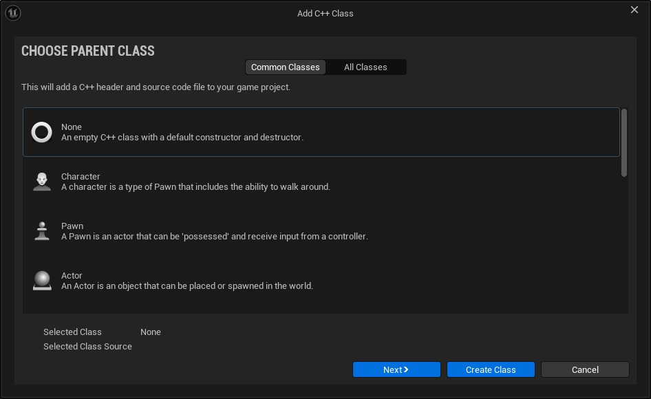
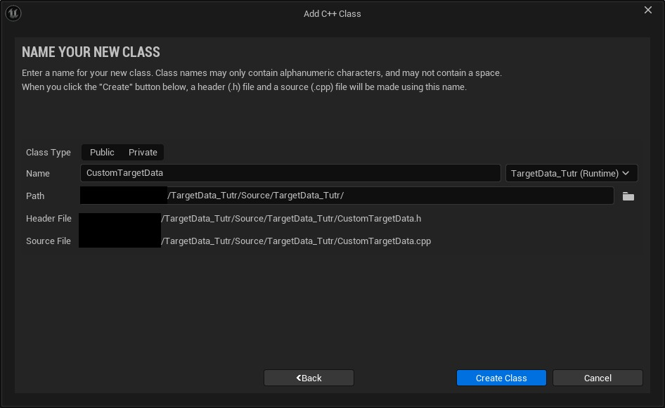
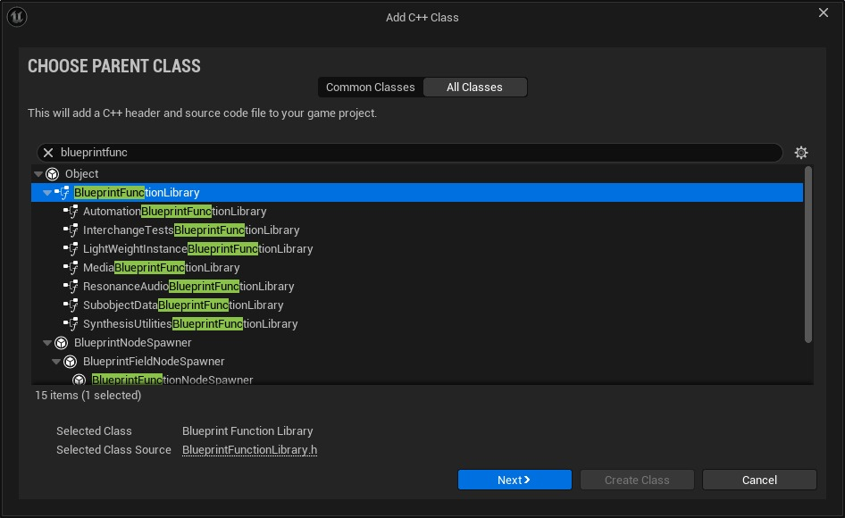
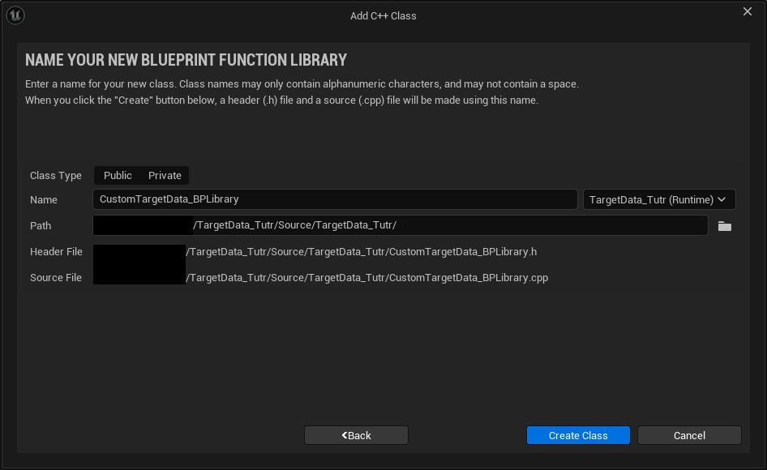

# 制作自定义目标数据以通过游戏事件传递变量

## 来源与状态

- 原始 URL：https://dev.epicgames.com/community/learning/tutorials/Z2Zv/unreal-engine-make-custom-target-data-to-pass-your-variables-via-gameplay-event

## 运行时分类

- 类型：图文教程
- 判断：API 未识别到核心视频信号，可整理正文约 3117 字符。

## 摘要

在本教程中，我将教您如何创建自定义目标数据并在游戏事件中通过它传递变量。

## 中文整理

### 你好

如果您已经开始使用 Gameplay 能力系统，您可能遇到过类似的问题：如何通过 Gameplay Event 传递变量？我有答案给你：目标数据。

### 什么是目标数据？

目标数据是用于通过网络传递的目标数据的通用结构。目标数据通常包含 [AActor](https://dev.epicgames.com/documentation/en-us/unreal-engine/API/Runtime/Engine/GameFramework/AActor)/[UObject](https://dev.epicgames.com/documentation/en-us/unreal-engine/API/Runtime/CoreUObject/UObject/UObject) 引用， [FHitResult](https://dev.epicgames.com/documentation/en-us/unreal-engine/API/Runtime/Engine/Engine/FHitResult)，以及其他通用位置/方向/原点信息。但我们可以创建 FGameplayAbilityTargetData 的子类并添加我们自己的变量。

### 创建自定义目标数据结构

在编辑器或 IDE 中创建新的空 C++ 类





现在，让我们编写一些代码！

**自定义目标数据.h**

```cpp
#pragma once

#include "CoreMinimal.h"
#include "Abilities/GameplayAbilityTargetTypes.h"

#include  "CustomTargetData.generated.h"


USTRUCT(Blueprintable)
struct FCustomTargetData  : public FGameplayAbilityTargetData
```

此代码的工作原理： 1. 我们声明一个继承基础 [FGameplayAbilityTargetData](https://dev.epicgames.com/documentation/en-us/unreal-engine/API/Plugins/GameplayAbilities/Abilities/FGameplayAbilityTargetData) 功能的数据结构。 2. 我们创建自己的变量。 3. 在构造函数中初始化变量的默认值。 4. GetScriptStruct 函数返回所有 [FGameplayAbilityTargetData](https://dev.epicgames.com/documentation/en-us/unreal-engine/API/Plugins/GameplayAbilities/Abilities/FGameplayAbilityTargetData) 子类必需的结构描述。 5. 在 bool NetSerialize 中，我们将变量添加到 Ar([FArchive](https://dev.epicgames.com/documentation/en-us/unreal-engine/API/Runtime/Core/Serialization/FArchive)) 并返回 true。 6. 添加目标数据句柄工作所需的 TStructOpsTypeTraits 模板。

### 目标数据句柄

要传输目标数据并接收它，您需要将其添加到[目标数据句柄](https://dev.epicgames.com/documentation/en-us/unreal-engine/API/Plugins/GameplayAbilities/Abilities/FGameplayAbilityTargetDataHandle)。您可以创建一个蓝图函数库，其中的函数将在蓝图中可用。





**CustomTargetData_BPLibrary.h**

```cpp
#pragma once

#include "CoreMinimal.h"
#include "CustomTargetData.h"
#include "Kismet/BlueprintFunctionLibrary.h"
#include "CustomTargetData_BPLibrary.generated.h"


UCLASS()
class TARGETDATA_TUTR_API UCustomTargetData_BPLibrary : public UBlueprintFunctionLibrary
```

**CustomTargetData_BPLibrary.cpp**

```cpp
#include "CustomTargetData_BPLibrary.h"

FGameplayAbilityTargetDataHandle UCustomTargetData_BPLibrary::MakeCustomDataTargetHandle(const FVector MyVector,
	const bool MyBool)
{
	FCustomTargetData* CustomData = new FCustomTargetData();

	CustomData->CustomVectorData = MyVector;
	CustomData->CustomBoolData = MyBool;
```

此代码的工作原理： [FGameplayAbilityTargetDataHandle](https://dev.epicgames.com/documentation/en-us/unreal-engine/API/Plugins/GameplayAbilities/Abilities/FGameplayAbilityTargetDataHandle) MakeCustomTargetDataHandle() 1. 构造 FCustomTargetData 2. 设置变量 3. 为其创建句柄并返回 FCustomTargetData GetCustomTargetData() 1. 通过索引获取目标数据指针。 2. 如果我们没有什么可使用的，则返回空的FCustomTargetData()。 3. 我们检查我们的指针是否确实是FCustomTargetData。如果没有，我们返回一个空的 FCustomTargetData。 4. 如果一切正常，我们对 FCustomTargetData 执行 static_cast，将其添加到局部变量中，然后返回它。

### 决赛！

您现在可以创建自定义目标数据并通过游戏事件传递变量。
