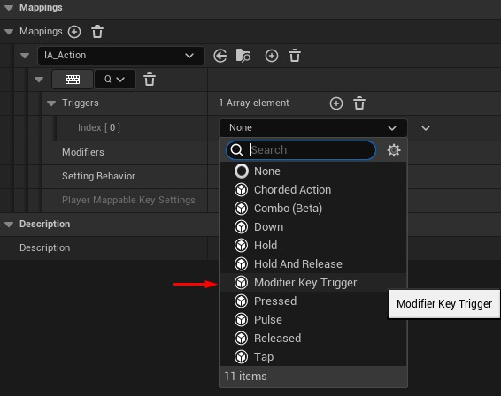
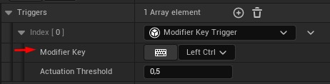
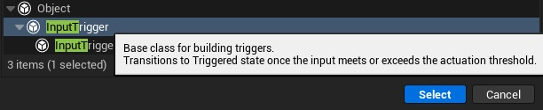
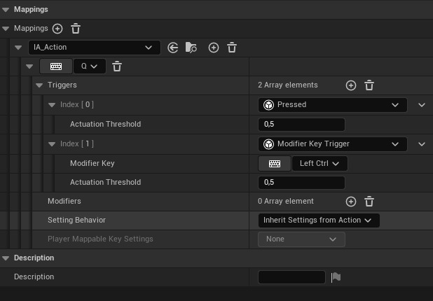

# 修改键触发器 - 增强输入

## 来源与状态

- 原始 URL：https://dev.epicgames.com/community/learning/tutorials/vz52/unreal-engine-modifier-key-triggers-enhanced-input

## 运行时分类

- 类型：图文教程
- 判断：API 未识别到核心视频信号，可整理正文约 5067 字符。

## 摘要

在这个简短的教程中，我想向您展示如何仅在按下某些修饰键（Ctrl、Alt、Shift...）时才触发输入操作。所有这些信息都可以使用并扩展到任何按键组合。

## 中文整理

### 前言

首先，我想提一下，本教程“开门见山”，所以我希望您来到这里的原因是您已经知道 **EnhancedInput** 是什么，并且您已经掌握了基础知识。如果没有，请先检查[此概述](https://docs.unrealengine.com/5.3/en-US/enhanced-input-in-unreal-engine/)。已经有多个关于该主题的资源。其次，“多个所需按键”的概念已经可以通过使用 **Chorded Action** 触发器来完成，但这种方法对我来说似乎有点像，因为它只需要单独的动作资源来按下一个按键，因此如果它被称为“**IA_CtrlPressed”** 或类似的东西，那么用动作来表示游戏中实际“动作”的整个概念突然就不再有意义了，而且设置也不是那么简单。 *在撰写本文时，我不知道已经实现的另一种方法。 *如果事实证明已经存在这样的方式，我会非常高兴:)

### 我们最终会得到什么

我们希望能够从“触发器”组合框中选择一种新的触发器类型，并指定需要按下的键。





### C++

### 构建依赖关系

如果您尚未在 C++ 中执行任何与 **EnhancedInput ** 相关的操作，则很有可能需要先编辑 **ProjectName.Build.cs ** 文件并将 **EnhancedInput ** 添加到依赖模块名称中。这使我们能够链接到我们项目中的该模块。

### 执行

**修改器KeyTrigger.h**

```cpp
#pragma once

#include "CoreMinimal.h"
#include "InputTriggers.h"
#include "ModifierKeyTrigger.generated.h"

/**
 *
 */
UCLASS()
```

**修改键触发器.cpp**

```cpp
#include "ModifierKeyTrigger.h"

#include "EnhancedPlayerInput.h"

ETriggerState UModifierKeyTrigger::UpdateState_Implementation(const UEnhancedPlayerInput* PlayerInput,
                                                                    FInputActionValue ModifiedValue, float DeltaTime)
{
	if (IsActuated(ModifiedValue) && PlayerInput->IsPressed(ModifierKey))
	{
		return ETriggerState::Triggered;
```

就是这样。让我带您浏览一下代码的一些部分。第一件重要的事情是让这个触发器成为**隐式**类型。这意味着它需要触发，但如果至少存在一个显式触发器，则它本身不足以触发操作本身。因此，如果我们有需要 **Ctrl+Q 的操作，则仅按下 **Ctrl** 时不会触发该操作。第二件事是 **PostEditChangeProperty** 方法。这确保您不能将非修饰键分配给该变量。所以像 **E+Q** 这样的东西是不允许的。显然，这个限制可以被消除，您可以进行任何您喜欢的组合，甚至将变量更改为 **TArray** 并需要多个按键。我只想要单一组合，因此一个变量就足够了。

### 蓝图

在蓝图中也可以实现同样的效果。这种方法的缺点是，据我所知，我们无法强制 **ModifierKey** 变量成为实际的修饰键，就像我们在 C++ 中使用 **PostEditChangeProperty** 所做的那样，因此我们应该在更新状态中添加一个条件，检查该键是否为修饰键，但这完全取决于您，第二个条件是 **PlayerInput** 类没有向蓝图公开其方法，因此我们需要首先获取 **PlayerController**。其余的都是一样的，我们只是从 **InputTrigger** 类派生。



创建 **Key ** 类型的 **ModifierKey** 变量并覆盖函数 **GetTriggerType** 和 **UpdateState**。我不完全确定为什么，但变量不必是公共的才能在映射上下文中编辑。

**覆盖 GetTriggerType**

```
Begin Object Class=/Script/BlueprintGraph.K2Node_FunctionEntry Name="K2Node_FunctionEntry_0" ExportPath="/Script/BlueprintGraph.K2Node_FunctionEntry'/Game/MirageSet/VCS/EnhancedInput/MappingContexts/BP_ModifierKeyTrigger.BP_ModifierKeyTrigger:GetTriggerType.K2Node_FunctionEntry_0'"
   ExtraFlags=1342177280
   FunctionReference=(MemberParent="/Script/CoreUObject.Class'/Script/EnhancedInput.InputTrigger'",MemberName="GetTriggerType")
   NodeGuid=90120ECD4582478F78B0289885258C08
   CustomProperties Pin (PinId=0DE708C54E4B9220B654ACBABF457A12,PinName="then",Direction="EGPD_Output",PinType.PinCategory="exec",PinType.PinSubCategory="",PinType.PinSubCategoryObject=None,PinType.PinSubCategoryMemberReference=(),PinType.PinValueType=(),PinType.ContainerType=None,PinType.bIsReference=False,PinType.bIsConst=False,PinType.bIsWeakPointer=False,PinType.bIsUObjectWrapper=False,PinType.bSerializeAsSinglePrecisionFloat=False,LinkedTo=(K2Node_FunctionResult_0 5CCCA39B4C63F5AC4BE4219CE8B402C6,),PersistentGuid=00000000000000000000000000000000,bHidden=False,bNotConnectable=False,bDefaultValueIsReadOnly=False,bDefaultValueIsIgnored=False,bAdvancedView=False,bOrphanedPin=False,)
End Object
Begin Object Class=/Script/BlueprintGraph.K2Node_FunctionResult Name="K2Node_FunctionResult_0" ExportPath="/Script/BlueprintGraph.K2Node_FunctionResult'/Game/MirageSet/VCS/EnhancedInput/MappingContexts/BP_ModifierKeyTrigger.BP_ModifierKeyTrigger:GetTriggerType.K2Node_FunctionResult_0'"
   FunctionReference=(MemberParent="/Script/CoreUObject.Class'/Script/EnhancedInput.InputTrigger'",MemberName="GetTriggerType")
   NodePosX=256
   NodeGuid=177C3FAC4D560F7C3A057AA13B0DA5B6
```

**覆盖更新状态**

```
Begin Object Class=/Script/BlueprintGraph.K2Node_FunctionEntry Name="K2Node_FunctionEntry_0" ExportPath="/Script/BlueprintGraph.K2Node_FunctionEntry'/Game/MirageSet/VCS/EnhancedInput/MappingContexts/BP_ModifierKeyTrigger.BP_ModifierKeyTrigger:UpdateState.K2Node_FunctionEntry_0'"
   FunctionReference=(MemberParent="/Script/CoreUObject.Class'/Script/EnhancedInput.InputTrigger'",MemberName="UpdateState")
   NodePosX=-144
   NodePosY=-96
   NodeGuid=AD97B9B8495B2A94708B9D87981A6E5F
   CustomProperties Pin (PinId=F86D717C45A7227DFA2B628D67575729,PinName="then",Direction="EGPD_Output",PinType.PinCategory="exec",PinType.PinSubCategory="",PinType.PinSubCategoryObject=None,PinType.PinSubCategoryMemberReference=(),PinType.PinValueType=(),PinType.ContainerType=None,PinType.bIsReference=False,PinType.bIsConst=False,PinType.bIsWeakPointer=False,PinType.bIsUObjectWrapper=False,PinType.bSerializeAsSinglePrecisionFloat=False,LinkedTo=(K2Node_IfThenElse_0 A5B1F414465EC02BE25D4986C0BB8054,),PersistentGuid=00000000000000000000000000000000,bHidden=False,bNotConnectable=False,bDefaultValueIsReadOnly=False,bDefaultValueIsIgnored=False,bAdvancedView=False,bOrphanedPin=False,)
   CustomProperties Pin (PinId=C3AC856B470DBCBA9D8C6A8D24B0B5F9,PinName="PlayerInput",PinToolTip="Player Input\nEnhanced Player Input Object Reference",Direction="EGPD_Output",PinType.PinCategory="object",PinType.PinSubCategory="",PinType.PinSubCategoryObject="/Script/CoreUObject.Class'/Script/EnhancedInput.EnhancedPlayerInput'",PinType.PinSubCategoryMemberReference=(),PinType.PinValueType=(),PinType.ContainerType=None,PinType.bIsReference=False,PinType.bIsConst=True,PinType.bIsWeakPointer=False,PinType.bIsUObjectWrapper=False,PinType.bSerializeAsSinglePrecisionFloat=False,LinkedTo=(K2Node_CallFunction_2 548E9EC342FEF04663AB869811512192,),PersistentGuid=00000000000000000000000000000000,bHidden=False,bNotConnectable=False,bDefaultValueIsReadOnly=False,bDefaultValueIsIgnored=False,bAdvancedView=False,bOrphanedPin=False,)
   CustomProperties Pin (PinId=4A52B55E4AC6B111E5FDDC91178BDDB6,PinName="ModifiedValue",PinToolTip="Modified Value\nInput Action Value Structure",Direction="EGPD_Output",PinType.PinCategory="struct",PinType.PinSubCategory="",PinType.PinSubCategoryObject="/Script/CoreUObject.ScriptStruct'/Script/EnhancedInput.InputActionValue'",PinType.PinSubCategoryMemberReference=(),PinType.PinValueType=(),PinType.ContainerType=None,PinType.bIsReference=False,PinType.bIsConst=False,PinType.bIsWeakPointer=False,PinType.bIsUObjectWrapper=False,PinType.bSerializeAsSinglePrecisionFloat=False,LinkedTo=(K2Node_CallFunction_1 026BF4E74651106A9A5097A3531D994B,),PersistentGuid=00000000000000000000000000000000,bHidden=False,bNotConnectable=False,bDefaultValueIsReadOnly=False,bDefaultValueIsIgnored=False,bAdvancedView=False,bOrphanedPin=False,)
   CustomProperties Pin (PinId=FC199403449C7F581A262AB368CDF2B7,PinName="DeltaTime",PinToolTip="Delta Time\nFloat (single-precision)",Direction="EGPD_Output",PinType.PinCategory="real",PinType.PinSubCategory="float",PinType.PinSubCategoryObject=None,PinType.PinSubCategoryMemberReference=(),PinType.PinValueType=(),PinType.ContainerType=None,PinType.bIsReference=False,PinType.bIsConst=False,PinType.bIsWeakPointer=False,PinType.bIsUObjectWrapper=False,PinType.bSerializeAsSinglePrecisionFloat=False,DefaultValue="0.0",AutogeneratedDefaultValue="0.0",PersistentGuid=00000000000000000000000000000000,bHidden=False,bNotConnectable=False,bDefaultValueIsReadOnly=False,bDefaultValueIsIgnored=False,bAdvancedView=False,bOrphanedPin=False,)
End Object
```

### 最终结果

行为因其他触发器而异。如果存在向下触发器，由于它会在每次更新时更新，因此无论按键顺序如何，整个操作都会被触发 -> 因此 Ctrl+Q 以及 Q+Ctrl 都会触发该操作。这可能是您想要的，也可能是您不想要的。如果您希望保留按键的顺序，那么您需要按下触发器。只有 Ctrl+Q 才有效，因为仅按 Q 时，UpdateState 中的条件 IsPressed() 此时不成立。您的映射上下文应该与此类似。触发器的顺序并不重要。



老实说，我不确定为什么默认情况下不会实现这样的功能，我不确定我是否会违背 **EnhancedInput** 的核心概念，或者是否确实有一些东西可以让我们实现此功能，但我没有找到它。因此，让我至少为您提供另一种方法来实现相同的结果。

### 编辑：

一段时间过去了，我想我应该添加更多有关其用法的信息。这种方法非常适合简单直接的系统。但是，如果您有两个具有映射 **E ** 和 **Ctrl+E** 的操作，当您按 **Ctrl+E** 时，这两个操作都会被触发。要修复此行为，您必须创建另一个触发器类型，该类型将允许仅在未按下此类键时触发操作。不过，这仅在一定程度上是可维护的。对于严格的设置，我建议使用另一个映射上下文，只有在按下所需的修饰键并在释放后删除该映射上下文时，才会以更高的优先级添加该映射上下文，并且该映射上下文将包含需要所述修饰键的操作的所有映射。
