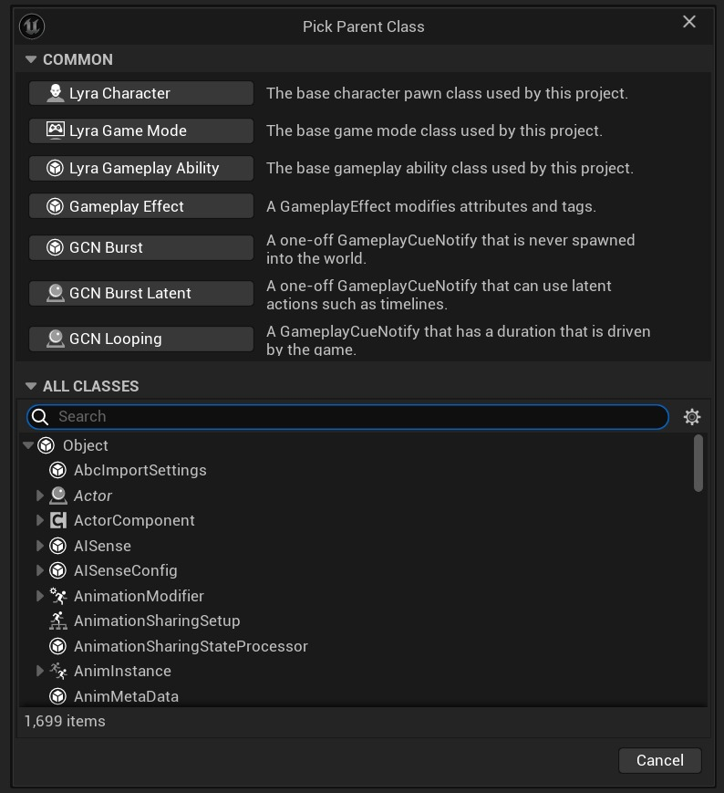

# 修改公共蓝图类

## 来源与状态

- 原始 URL：https://dev.epicgames.com/community/learning/tutorials/q3D2/unreal-engine-modifying-common-blueprint-classes

## 运行时分类

- 类型：图文教程
- 判断：API 未识别到核心视频信号，可整理正文约 1273 字符。

## 摘要

在这个快速教程中，我们学习如何在蓝图类选择器中自定义常见的蓝图父类。

## 中文整理

### 介绍

正如您可能在 [LyraStarterGame](https://www.fab.com/listings/93faede1-4434-47c0-85f1-bf27c0820ad0) 中看到的，他们将自己的自定义类添加到蓝图类选择器的公共部分。



这在您自己的项目中也很容易完成，我将快速向您展示它是如何完成的。

### 修改“公共”部分

1. 在 Config 文件夹中找到 DefaultEditor.ini（如果不存在则创建一个）。 2、在文件中放入以下代码，清除当前的公共类：

**默认编辑器.ini**

```
[/Script/UnrealEd.UnrealEdOptions]
!NewAssetDefaultClasses=ClearArray
```

3. 现在您可以开始将本机 C++ 类或蓝图类链接到公共部分：

**默认编辑器.ini**

```
+NewAssetDefaultClasses=(ClassName="/Script/Engine.Actor", AssetClass="/Script/Engine.Blueprint")
```

**默认编辑器.ini**

```
+NewAssetDefaultClasses=(ClassName="/Game/MyFolder/BP_TestActor.BP_TestActor_C", AssetClass="/Script/Engine.Blueprint")
```

在我的示例中，BP_TestActor 位于 MyFolder 目录内。 (Content/MyFolder/BP_TestActor) - 确保指定完整路径并将 Content 替换为 Game。 - 另外，在路径的末尾添加一个额外的 .BP_TestActor_C ，以便引擎知道您正在引用一个类。示例如下：

**默认编辑器.ini**

```
[/Script/UnrealEd.UnrealEdOptions]
!NewAssetDefaultClasses=ClearArray
+NewAssetDefaultClasses=(ClassName="/Script/LyraGame.LyraCharacter", AssetClass="/Script/Engine.Blueprint")
+NewAssetDefaultClasses=(ClassName="/Script/LyraGame.LyraGameMode", AssetClass="/Script/Engine.Blueprint")
+NewAssetDefaultClasses=(ClassName="/Script/LyraGame.LyraGameplayAbility", AssetClass="/Script/Engine.Blueprint")
+NewAssetDefaultClasses=(ClassName="/Script/GameplayAbilities.GameplayEffect", AssetClass="/Script/Engine.Blueprint")
+NewAssetDefaultClasses=(ClassName="/Script/GameplayAbilities.GameplayCueNotify_Burst", AssetClass="/Script/Engine.Blueprint")
+NewAssetDefaultClasses=(ClassName="/Script/GameplayAbilities.GameplayCueNotify_BurstLatent", AssetClass="/Script/Engine.Blueprint")
+NewAssetDefaultClasses=(ClassName="/Script/GameplayAbilities.GameplayCueNotify_Looping", AssetClass="/Script/Engine.Blueprint")
```

### 精加工

这就是您在蓝图类选择器中修改公共类列表的方法。工作量并不大，但它给你自己的项目带来了一点个人风格。
