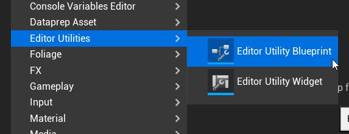
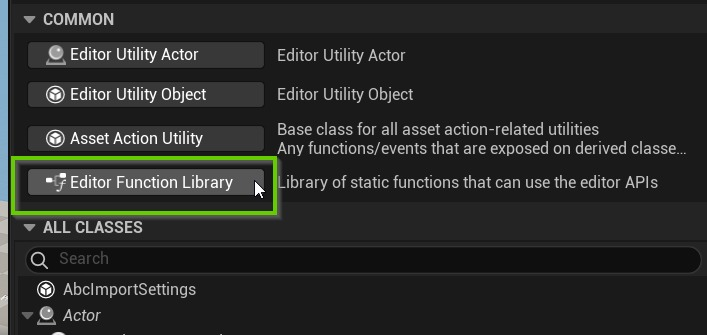
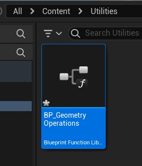

# 使用几何脚本 + Dataprep 修改导入后的网格 (Part 1/3)

Source file: `unreal-engine-modifying-meshes-upon-import-with-geometry-script-dataprep.origin.md`.

This document was split during ue-kb import to keep source chunks buildable.

## 来源与状态

- 原始 URL：https://dev.epicgames.com/community/learning/tutorials/jwq8/unreal-engine-modifying-meshes-upon-import-with-geometry-script-dataprep
## 运行时分类

- 类型：图文教程
- 判断：API 未识别到核心视频信号，可整理正文约 17115 字符。
## 摘要

Geometry Script 是一个功能强大的插件，可让您为任何类型的模型操作创建蓝图，例如斜角、拉伸、布尔值等。但是，它与 Visual Dataprep（UE 用于自动化 Datasmith 导入的系统）不兼容。本教程提供了一个框架，介绍如何将 Dataprep 配方和几何脚本蓝图与编辑器实用程序小部件结合起来，以创建修改传入网格的有趣机会。
## 中文整理
### 背景

Datasmith 在将 CAD 或 BIM 数据引入虚幻引擎方面做得非常出色，但通常这些模型都非常基础。当您希望一块玻璃有厚度时，它可以是单面的。或者混凝土楼梯上的90度角需要倒圆角并软化。也许网格上没有足够的顶点来支持您需要的轮廓或材质效果。这些常见问题可以轻松解决，通常通过在其他 DCC 应用程序中进行初始数据准备来解决。您可以将 CAD 模型引入 Blender 或 3ds Max 等工具中，手动清理它或应用修改器堆栈，然后将其重新导出到虚幻引擎。理想情况下，您不需要在源数据和最终场景之间使用这个额外的软件，一位客户联系我，询问其中的一些内容是否可以在虚幻引擎中自动化。 UE 在其[建模模式](https://dev.epicgames.com/documentation/en-us/unreal-engine/modeling-mode-in-unreal-engine) 中确实拥有种类繁多且不断增长的网格工具，但关键问题是自动化。我们如何在一个又一个项目中一遍又一遍地将这些简单的更改应用于网格？ **[Dataprep](https://dev.epicgames.com/documentation/en-us/unreal-engine/dataprep-import-customization-in-unreal-engine) **是虚幻引擎的系统，用于自动对传入的 Datasmith 模型进行常见修改。有多种过滤器和修改器可让您轻松交换材质、打开 Nanite、删除某些对象、合并网格、设置 LOD 等。它允许您在模型更改时一遍又一遍地运行自定义配方，并且您可以将相同的逻辑应用于另一个项目的任何其他 Datasmith 文件。我们还有 [Geometry Script](https://dev.epicgames.com/documentation/en-us/unreal-engine/geometry-scripting-users-guide-in-unreal-engine)，这是一个庞大的蓝图和 C++ 库，可让您通过自己的自定义脚本和工具使用建模模式的所有功能。这两者听起来完美契合，但不幸的是，截至撰写本文时，它们还不兼容。在幕后，Dataprep 正在处理瞬态临时网格，而几何脚本的设计根本没有考虑到这一点。本教程的目的是展示一个潜在的工作流程，该工作流程使用编辑器实用程序将 Dataprep 自动化与几何脚本操作相结合。为了解决上面概述的确切问题，这实际上是一种解决方法，但如果您是编辑器实用程序的新手，我希望您会发现它实际上是为您的团队制作有用工具的一种非常强大的方法。
### 先决条件

本教程不会立即进入高级主题，但您应该对以下主题有基本的了解，以便正确遵循。 - Visual Dataprep - 编辑器实用程序小部件 - 几何脚本 由于稍后解释的原因，本教程使用了仅存在于 5.4 及更高版本中的一些特定功能。几乎所有功能都可以在早期版本中使用，我将在出现异常时指出它们。您将需要启用以下插件。架构模板项目中唯一默认未启用的脚本是 [Geometry Script](https://dev.epicgames.com/documentation/en-us/unreal-engine/geometry-scripting-users-guide-in-unreal-engine)。 - Dataprep 编辑器 - 编辑器实用程序 我将使用 Autodesk 的 Revit [“高级示例项目”](https://help.autodesk.com/view/RVT/2025/ENU/?guid=GUID-61EF2F22-3A1F-4317-B925-1E85F138BE88) 来演示此工作流程。所有 Revit 用户均可免费使用它，并可轻松导出为 Datasmith 文件。您可以在 Dataprep 部分使用任何您喜欢的 Datasmith 模型，也可以在项目中的非 Datasmith 模型上使用几何脚本函数。
### 基本框架

以下是该管道的基本部分： 1. **蓝图函数库**将保存各种可修改网格的**几何脚本**操作。 2. **Dataprep** 配方将标记我们希望修改的参与者。 3. **编辑器实用程序小部件**将顺序执行 Dataprep 配方，然后在标记的网格上运行几何脚本函数
### 编辑器函数库

当我之前说过我们正在使用**蓝图函数库**时，我部分撒谎了。 BFL 是存储常用蓝图逻辑的绝佳方式，可以在整个项目中的任何其他蓝图之间共享，但是，它们不能包含仅限编辑器的功能，因为它们必须为最终游戏进行编译。 5.4 中引入了一个名为 **编辑器函数库** 的新蓝图，它是完全相同的东西，但仅适用于编辑器函数。我们要做的 90% 的事情都可以放入原始类型的 BFL 中，但我们将在这里使用新类型，因为最终我们需要在项目中创建和编辑资产。因此，您要做的第一件事是在内容浏览器中右键单击，然后选择 **编辑器实用程序 > 编辑器实用程序蓝图**。

选择蓝图的类时，选择**编辑器函数库**并根据需要命名。

