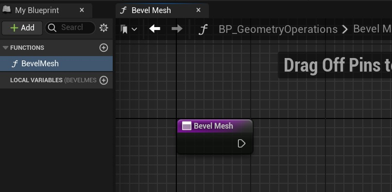
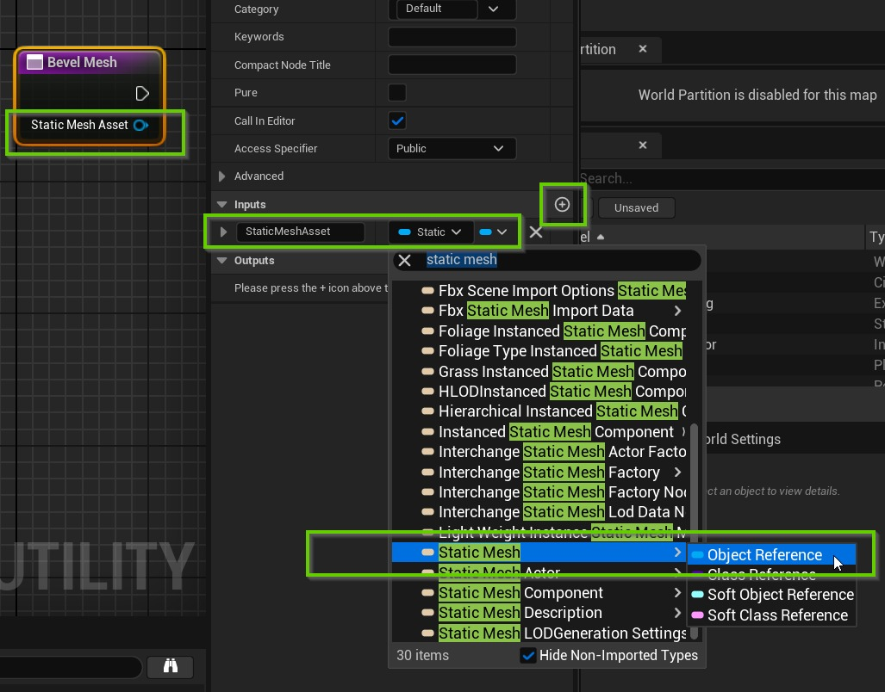
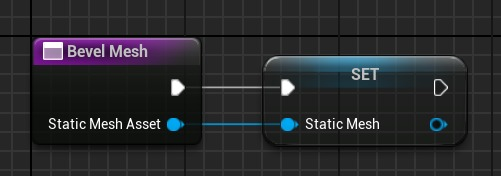
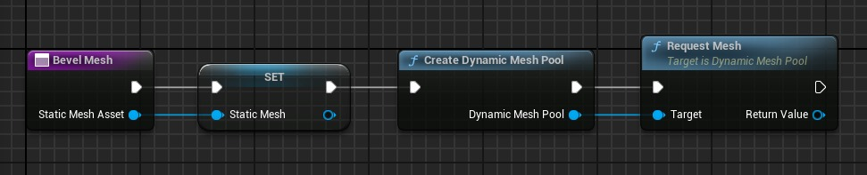
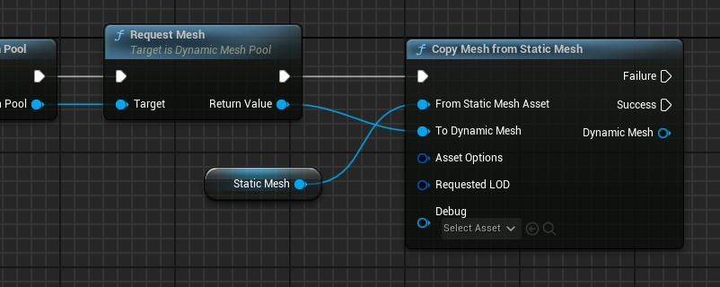
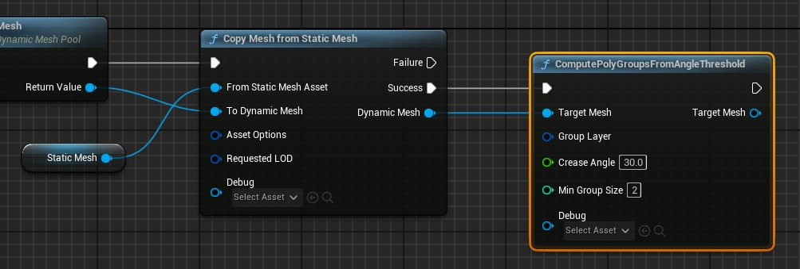
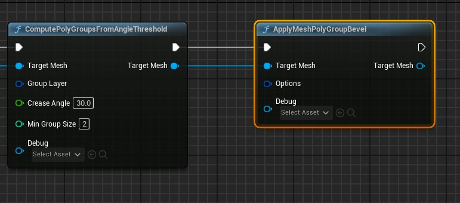

# 使用几何脚本 + Dataprep 修改导入后的网格 (Part 2/3)

Source file: `unreal-engine-modifying-meshes-upon-import-with-geometry-script-dataprep.origin.md`.

This document was split during ue-kb import to keep source chunks buildable.

### 几何脚本函数 - 斜角

打开这个蓝图，它将显示一个我们可以直接进入的空新函数。我们要制作的第一个脚本是可以斜切网格的脚本，因此我将函数重命名为“BevelMesh”。



有先见之明，我知道这个函数并不直接有一个网格可供引用，而是会从其他地方传递一个网格。因此，当选择函数的主要起始节点时，我可以转到右侧的“详细信息”面板，并为此函数添加类型为“**StaticMesh**”的**输入**。值得注意的是，我们将在这里处理资产（又名“StaticMesh”），而不是组件或演员。这些选项之间的差异很快就会再次出现。现在我们的图表中有一个输入引脚。



我右键单击新的输入引脚并选择“升级到局部变量”，以便我们更轻松地访问图表。新变量不能与函数输入具有完全相同的名称。



现在开始使用几何脚本本身。 GeoScript 的确切代码模式一开始可能会令人困惑，但要点如下。您无法直接对虚幻引擎中的网格体进行操作，只能对称为 **动态网格体** 的类类型进行操作。首先，我们需要为动态网格创建一个“池”。然后，每当我们想要执行网格操作时，我们都必须从该池中获取动态网格，然后将常规网格资源复制到该动态网格中。开始了。创建一个名为 **Create Dynamic Mesh Pool** 的新节点。如果它没有显示，则意味着您没有启用几何脚本插件。从该节点的输出引脚，您可以拖出并**请求网格。** 现在我们有了一个动态网格，可以将其用于未来的任何几何脚本操作。



**请求网格**上的输出引脚是动态网格，但默认情况下动态网格没有三角形，没有材质，什么都没有。因此，您接下来要做的就是向其提供您实际想要处理的网格资源的所有数据。根据具体情况有多种“复制”节点，这里我们将使用**从静态网格体复制网格体**。将动态网格物体插入 **To Dynamic Mesh** 输入，并使用之前的静态网格物体变量作为 **From Static Mesh Asset**。



好的，现在我们实际上有了一个输入网格的版本，我们可以完全控制并完全访问其所有属性。下一步是进行斜切。建模模式和几何脚本中的斜角工具主要在 [PolyGroups](https://dev.epicgames.com/documentation/en-en/unreal-engine/understanding-polygroups-in-unreal-engine?application_version=5.3) 上运行，这就是我在本教程中坚持使用的方法。典型的网格默认没有多边形组，因此我们必须自己设置它。有几个蓝图选项可以执行此操作，在这种情况下最有效的一个是**从角度阈值计算多边形组**。基本上，如果您将标准立方体传递给此函数，它将为立方体的每一面创建不同的多边形组，无论它由多少个顶点组成。我将 **Crease Angle** 增加到 30 度，您可以并且应该在某个时候将其转换为另一个输入变量。上一个节点的动态网格输出将传递到**目标网格**，我们将继续像这样菊花链几何脚本操作。



下一部分是**应用网格多边形组斜角**，我们将其连接到前一个节点和动态网格。



在虚幻引擎的很多地方，您都可以在蓝图节点中找到各种“选项”，通常带有深蓝色图钉。这些结构可以通过额外的节点创建和连接，但我个人更喜欢通过右键单击它并选择 **Split Struct Pin** 来将它们展开。这里我们需要调整一些参数以获得良好的斜角结果。同样，最佳实践是为每个变量创建一个变量，但对于这个例子，我认为一种尺寸适合所有情况。我将 **斜面距离** 设置为 1 厘米，但这是一个需要您自己决定的重要设置。我打开了推断材质 ID，以便它可以对每个面的材质分配做出最佳猜测，而不是将一种材质应用于整个斜角。 **细分 **我设置为 4。这应该提供非常详细和平滑的边缘，但对于复杂的场景可能会产生大量额外的几何图形。 **圆形权重** 我保留默认值 1.0，以获得边缘完美平均的圆度。注意：圆形重量和细分仅在 5.4+ 中可用。如果使用旧版本，则仅限于一个斜角（倒角）。通过斜切添加新的几何体不一定会改变预先存在的边缘上的法线。为了消除硬边，我们可以使用**计算分割法线**，并将 Opening Angle Deg 设置为 30。这就是对动态网格的修改。为了保存我们的更改，我们需要使用**将网格物体复制到静态网格物体**，用新的网格物体覆盖旧的网格物体资源。现在要做的最后一件事是清理我们用于操作的临时动态网格。我们不想通过不断创建无限期地存在的新网格来导致任何内存泄漏或奇怪的行为。我们使用“释放所有网格”节点来执行此操作，该节点从函数一开始就连接到我们的动态网格池。完整的图表嵌入在下面。

**斜角网格**

```
Begin Object Class=/Script/BlueprintGraph.K2Node_FunctionEntry Name="K2Node_FunctionEntry_0" ExportPath="/Script/BlueprintGraph.K2Node_FunctionEntry'/Game/Utilities/BP_GeometryOperations.BP_GeometryOperations:BevelMesh.K2Node_FunctionEntry_0'"
   MetaData=(bCallInEditor=True)
   LocalVariables(0)=(VarName="StaticMesh",VarGuid=06ED8551458619EC97480D8AA865CD78,VarType=(PinCategory="object",PinSubCategoryObject="/Script/CoreUObject.Class'/Script/Engine.StaticMesh'"),FriendlyName="Static Mesh",Category=NSLOCTEXT("KismetSchema", "Default", "Default"),PropertyFlags=5)
   ExtraFlags=201465856
   FunctionReference=(MemberName="BevelMesh")
   bIsEditable=True
   NodeGuid=BC368EA349DC663DC794A4927355469E
   CustomProperties Pin (PinId=B2238D724F2A9E00073BB78A5B75ACC2,PinName="then",Direction="EGPD_Output",PinType.PinCategory="exec",PinType.PinSubCategory="",PinType.PinSubCategoryObject=None,PinType.PinSubCategoryMemberReference=(),PinType.PinValueType=(),PinType.ContainerType=None,PinType.bIsReference=False,PinType.bIsConst=False,PinType.bIsWeakPointer=False,PinType.bIsUObjectWrapper=False,PinType.bSerializeAsSinglePrecisionFloat=False,LinkedTo=(K2Node_VariableSet_2 A5B5E5064889D784E83861BA0FD174D4,),PersistentGuid=00000000000000000000000000000000,bHidden=False,bNotConnectable=False,bDefaultValueIsReadOnly=False,bDefaultValueIsIgnored=False,bAdvancedView=False,bOrphanedPin=False,)
   CustomProperties Pin (PinId=7609FA114F43D998C08B0CB4A39D962F,PinName="StaticMeshAsset",Direction="EGPD_Output",PinType.PinCategory="object",PinType.PinSubCategory="",PinType.PinSubCategoryObject="/Script/CoreUObject.Class'/Script/Engine.StaticMesh'",PinType.PinSubCategoryMemberReference=(),PinType.PinValueType=(),PinType.ContainerType=None,PinType.bIsReference=False,PinType.bIsConst=False,PinType.bIsWeakPointer=False,PinType.bIsUObjectWrapper=False,PinType.bSerializeAsSinglePrecisionFloat=False,LinkedTo=(K2Node_VariableSet_2 43C477A34938DE7035091CB92153D415,),PersistentGuid=00000000000000000000000000000000,bHidden=False,bNotConnectable=False,bDefaultValueIsReadOnly=False,bDefaultValueIsIgnored=False,bAdvancedView=False,bOrphanedPin=False,)
   CustomProperties Pin (PinId=0A11C6514F9213E194812B9AD4BBDD55,PinName="__WorldContext",Direction="EGPD_Output",PinType.PinCategory="object",PinType.PinSubCategory="",PinType.PinSubCategoryObject="/Script/CoreUObject.Class'/Script/CoreUObject.Object'",PinType.PinSubCategoryMemberReference=(),PinType.PinValueType=(),PinType.ContainerType=None,PinType.bIsReference=False,PinType.bIsConst=False,PinType.bIsWeakPointer=False,PinType.bIsUObjectWrapper=False,PinType.bSerializeAsSinglePrecisionFloat=False,PersistentGuid=00000000000000000000000000000000,bHidden=True,bNotConnectable=False,bDefaultValueIsReadOnly=False,bDefaultValueIsIgnored=False,bAdvancedView=False,bOrphanedPin=False,)
```
### 数据准备标记

现在我们有了要在网格上运行的操作，我们需要一个要操作的网格。在我们的示例中，我们使用 Dataprep 做好准备，因此我假设您知道如何制作 Dataprep 资产并导入您选择的模型。在我的这里，我加载了我之前提到的高级示例项目。举个最简单的例子，我将对建筑物上层的边桌进行斜切。默认情况下它们是相当块状的。为了选择它在我们的配方中使用，我使用了 Actor Label 过滤器，并为其指定了 *furtniture_table* 通配符名称。表已被过滤，所以现在我们可以应用斜角操作，对吗？请不要忘记，遗憾的是我们无法直接在 Dataprep 内部执行几何脚本。相反，我们可以做的是向该演员添加一个**标签**，并在其完全导入到我们的场景中后重新访问它。继续**执行并提交**管道，然后保存全部。
