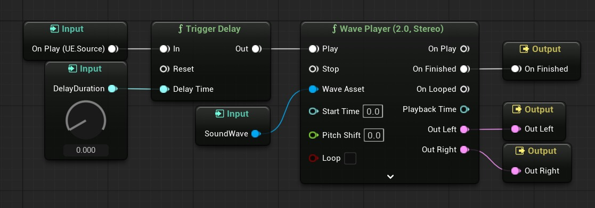

# 不间断地播放一系列声波

## 来源与状态

- 原始 URL：https://dev.epicgames.com/community/learning/tutorials/qEZY/unreal-engine-play-a-sequence-of-sound-waves-without-pauses

## 运行时分类

- 类型：图文教程
- 判断：API 未识别到核心视频信号，可整理正文约 2723 字符。

## 摘要

连续播放任意声波序列的精确方法，中间没有任何停顿

## 中文整理

### 介绍

本教程介绍如何连续播放任意序列的声波，重点是**精确播放**，中间没有暂停。它假设您需要播放**在运行时构建的声波数组** - 如果您提前知道剪辑的顺序，请考虑在音频编辑软件中连接它们或在单个 MetaSound 中使用多个 Wave 播放器。最简单的方法是等待每个声音的 *OnFinished *事件，或者通过计时器安排声音。不幸的是，由于游戏逻辑和音频是由单独的线程处理的，这会导致之间出现可听见的间隙（最多约 50 毫秒）。所提出的解决方案可实现准确的播放，甚至适合拼接人类语音或连续音乐。

### 解决方案

关键是利用 **MetaSounds** 的精确音频播放。虽然不可能直接创建一个循环来处理 MetaSound 图中的任何数组，但我们可以在蓝图中**为每个声波**单独设置一个 MetaSound，并让它们处理正确的时序。

### 元声音设置

首先，我们需要创建一个通用的 MetaSound，它接收声波和延迟作为输入，并**在指定的延迟后播放提供的声音**。首先创建一个新的 **MetaSound Source**，我们将其命名为 *MSS_PlayAfterDelay*（确保您启用了 MetaSound 插件。）在“详细信息”面板中，您可以选择您喜欢的输出格式（例如单声道或立体声）。然后，在 Members 面板中添加两个附加输入：Time 类型的 *DelayDuration * 和 Wave Asset 类型的 *SoundWave *。然后，重新创建图表，如下图所示。



### 蓝图设置

其次，我们需要从 **蓝图** 生成 MetaSounds。通过累积每个声波被触发之前的延迟，它们将无缝地连续播放。为此，我们将创建一个**函数**，它接受声波数组作为播放的输入。它需要以下局部变量： - *CurrentSoundWave *类型为 Sound Wave（对象引用） - *CurrentAudioComponent *类型为音频组件（对象引用） - *DurationSoFar *类型为 Float，默认值为 0.0 下面是完整的函数，将放置在 **蓝图函数库** 中（或只是单个 actor）。

**功能：播放声波**

```
Begin Object Class=/Script/BlueprintGraph.K2Node_FunctionEntry Name="K2Node_FunctionEntry_1" ExportPath="/Script/BlueprintGraph.K2Node_FunctionEntry'/SportsCommentary/Outputs/BPFL_Audio.BPFL_Audio:PlaySoundWaves.K2Node_FunctionEntry_1'"
   LocalVariables(0)=(VarName="CurrentSoundWave",VarGuid=77D77C2845A334A67A405C9C1032FF38,VarType=(PinCategory="object",PinSubCategoryObject="/Script/CoreUObject.Class'/Script/Engine.SoundWave'"),FriendlyName="Current Sound Wave",Category=NSLOCTEXT("KismetSchema", "Default", "Default"),PropertyFlags=5)
   LocalVariables(1)=(VarName="CurrentAudioComponent",VarGuid=D3F72DB640A0F272DD2652A8D6D66DB0,VarType=(PinCategory="object",PinSubCategoryObject="/Script/CoreUObject.Class'/Script/Engine.AudioComponent'"),FriendlyName="Current Audio Component",Category=NSLOCTEXT("KismetSchema", "Default", "Default"),PropertyFlags=5)
   LocalVariables(2)=(VarName="DurationSoFar",VarGuid=F66DD61340CC7817D3A4E3B5C19CD8C3,VarType=(PinCategory="real",PinSubCategory="double"),FriendlyName="Duration So Far",Category=NSLOCTEXT("KismetSchema", "Default", "Default"),PropertyFlags=5)
   ExtraFlags=201465856
   FunctionReference=(MemberName="PlaySoundWaves")
   bIsEditable=True
   NodePosX=-1424
   NodePosY=32
   NodeGuid=115E7B1E4340BDE7BFA343A106C2EA1C
```

### 结论

有了这两个资产，只需一次函数调用就可以准确地播放任何声波序列。播放设置（例如音量和音高）仍可以在 *Create Sound 2D* 节点或 MetaSound Source 中进行调整。如果您需要提前终止序列，可以存储创建的音频组件并对其调用 *Stop *。
