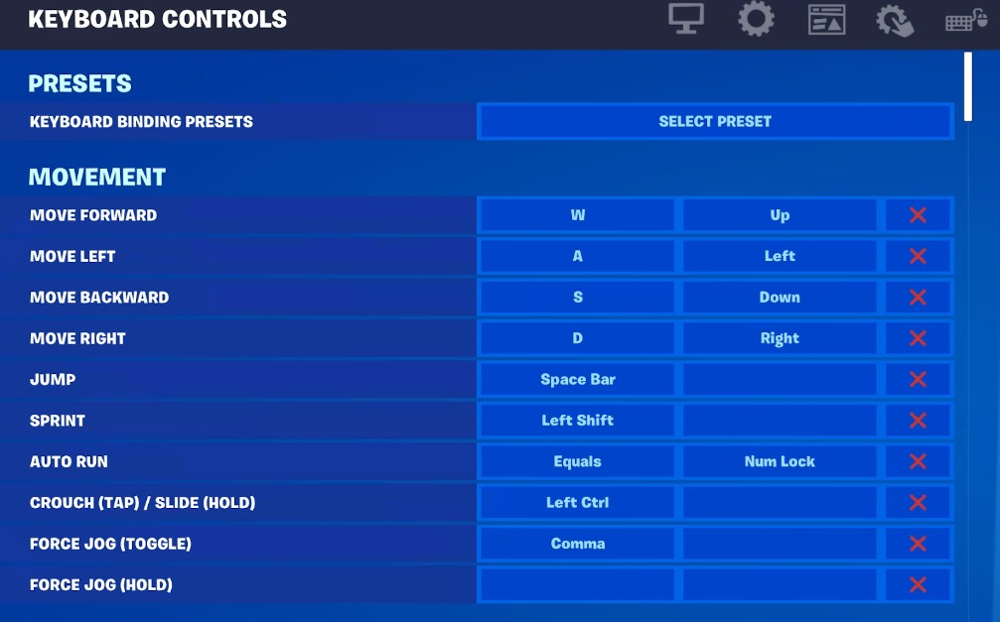
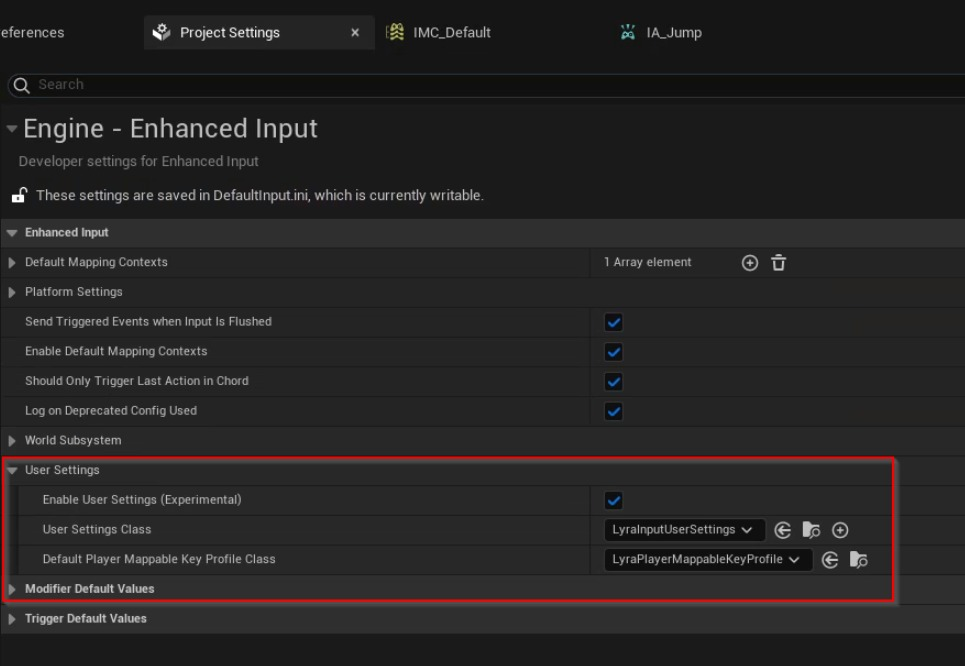
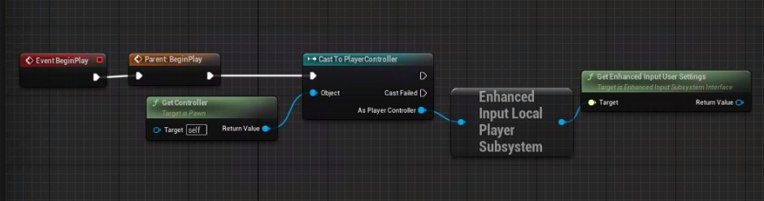
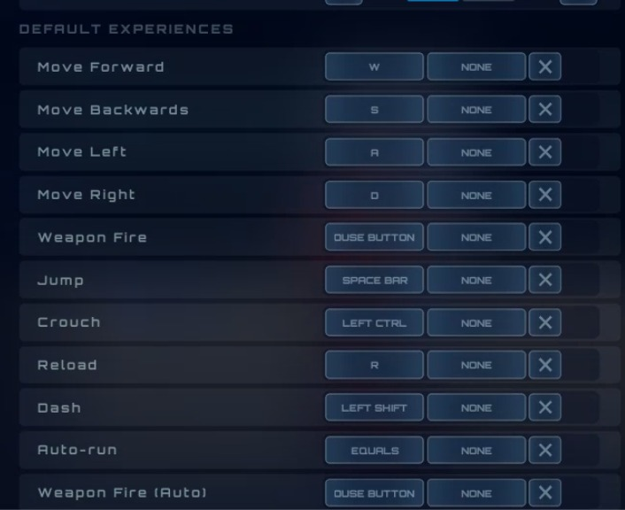
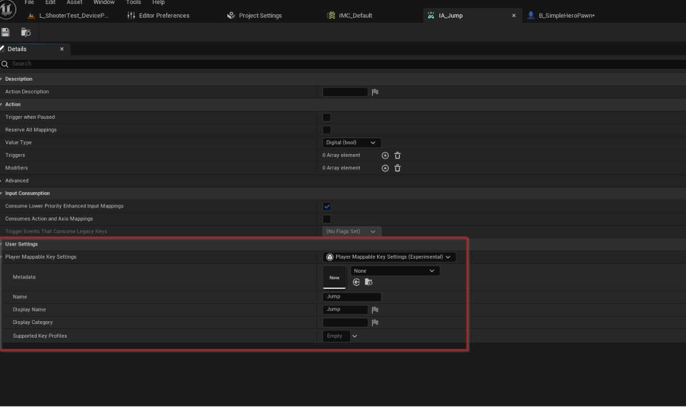
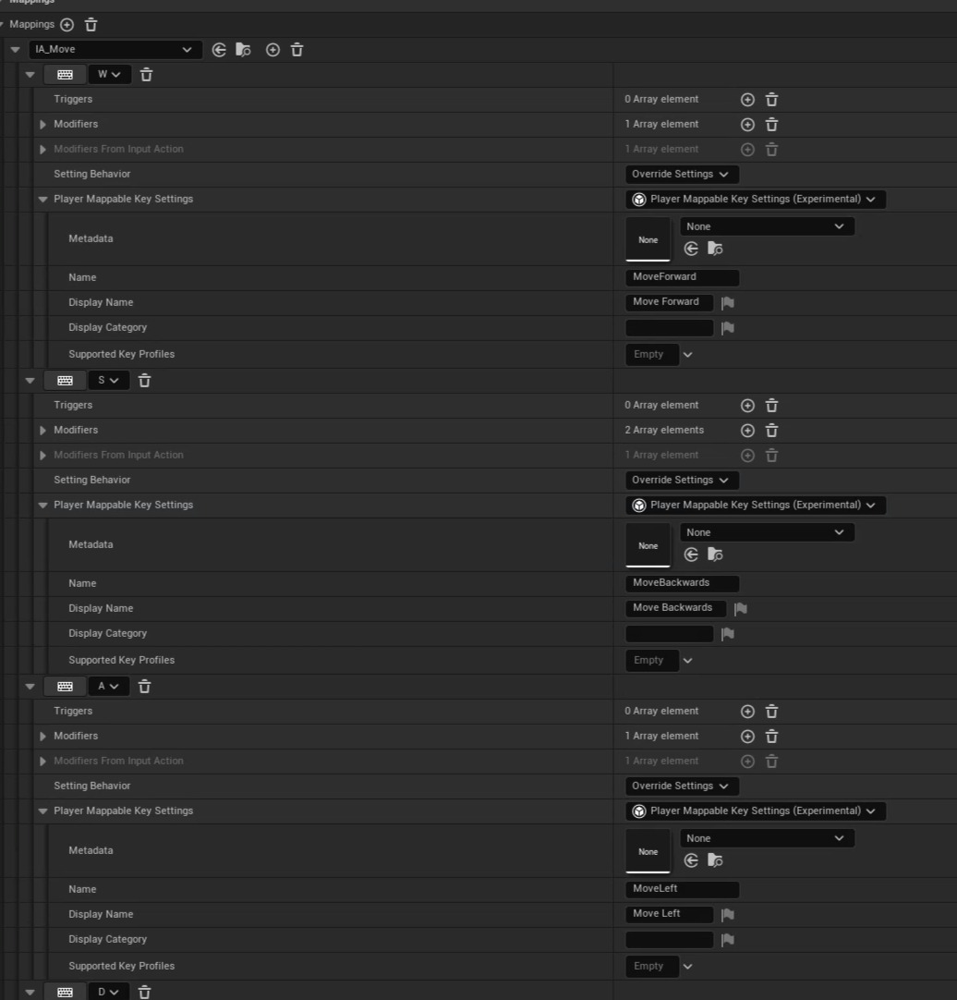
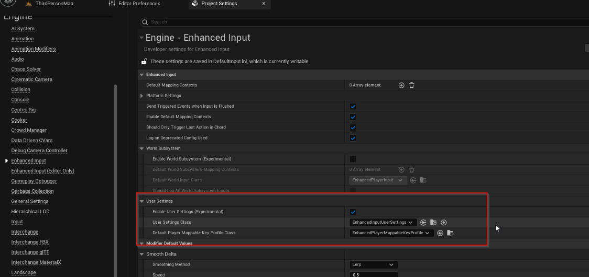
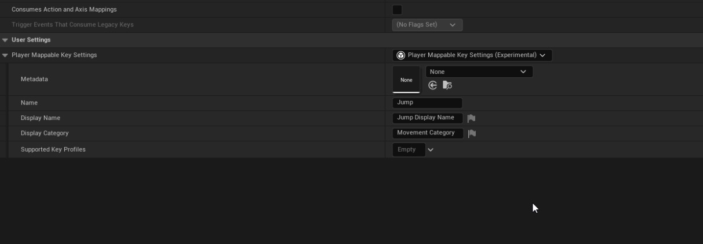
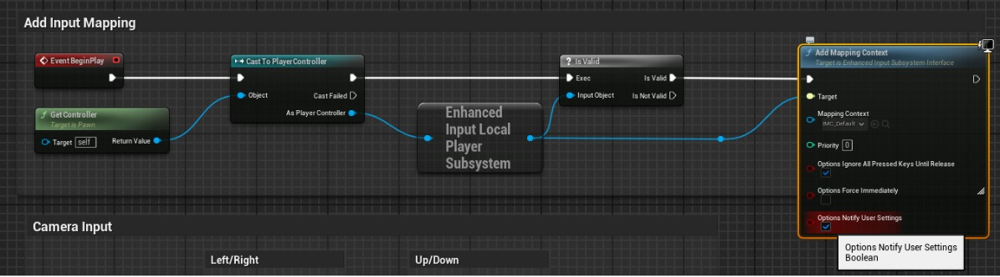
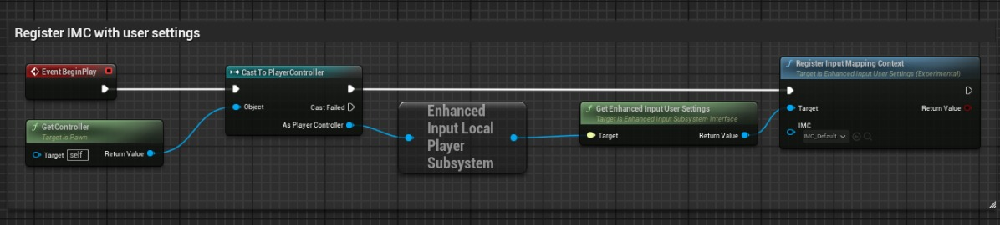

# 使用增强输入的玩家可映射按键

## 来源与状态

- 原始 URL：https://dev.epicgames.com/community/learning/tutorials/Vp69/unreal-engine-player-mappable-keys-using-enhanced-input

## 运行时分类

- 类型：图文教程
- 判断：API 未识别到核心视频信号，可整理正文约 13222 字符。

## 摘要

概述如何使用增强输入为游戏设置玩家可映射按键。

## 中文整理

### 概览

除了 UE 5.3 之外，还带来了一些增强输入的新功能，使将玩家可映射按键添加到游戏中比以往任何时候都更加容易。该系统目前已在《堡垒之夜》中使用，并且在 Lyra 内容样本中拥有深入的样本，因此它已在 Epic 中尽可能地进行了“战斗测试”。与往常一样，如果您有疑问或错误报告，请随时在 [开发者论坛](https://forums.unrealengine.com/categories?tag=unreal-engine) 上发帖！

### 要求

本教程适用于[增强输入](https://dev.epicgames.com/community/learning/tutorials/eD13/unreal-engine-enhanced-input-in-ue5)，您的项目需要使用增强输入才能执行此操作。如果您不确定您的项目是否正在使用增强输入，或者您想启用它，请先参阅[文档](https://docs.unrealengine.com/en-US/enhanced-input-in-unreal-engine/)。

### 虚幻引擎中的“玩家可映射按键”是什么？

“玩家可映射按键”是我们在虚幻引擎中使用的术语，用于描述允许玩家“重新映射”或“重新绑定”他们在游戏中执行某​​些操作所需按下的按钮。此功能对玩家有很多好处，并且是任何大型游戏中“期望”存在的游戏功能之一，但在开发过程中经常被忽视。



值得庆幸的是，增强输入现在有一个“用户设置”界面，您可以利用该界面快速轻松地将此功能添加到您的游戏中。

### 入门

首先，打开项目设置并导航至引擎 > 增强输入 > 用户设置，然后启用“启用用户设置（实验）”复选框。在这里您将看到两个新的类别选项已启用，“用户设置类别”和“默认玩家可映射密钥配置文件类别”。这是用户设置界面的两个核心概念。



我们建议您从项目一开始就为这两个子类创建一个自定义子类，以便在整个开发过程中更轻松地进行重构或添加新设置。

### 用户设置类 (UEnhancedInputUserSettings)

增强输入用户设置对象是主界面，用于执行与输入设置相关的任何操作，例如重新映射玩家的按键。在这个对象中，所有用户输入相关的设置都可以存在，并且可以在增强输入中的任何位置轻松访问。默认情况下，它存储来自玩家的所有键映射，但您可以创建自己的子类以添加游戏所需的任何输入设置。一些很好的例子包括瞄准灵敏度、可访问性设置（按钮的切换与按住），甚至陀螺仪瞄准的选项。玩家可以根据游戏中的输入体验自定义的任何内容。可以使用 C++ 或蓝图中的 GetUserSettings 函数从任何增强输入子系统访问用户设置对象。默认情况下，每个增强输入本地播放器子系统都有自己的设置对象，因此该系统确实支持分屏或多个本地播放器。



### 可映射按键配置文件 (UEnhancedPlayerMappableKeyProfile)

密钥配置文件代表玩家当前设置的一个实例。您一次可以“装备”一个配置文件。每个配置文件都可以通过游戏标签来识别。如果您愿意，可以将每个配置文件视为为玩家提供游戏的多个不同“预设”的一种方式，例如“默认”和“southpaw”。这些是仅运行时的对象，将根据需要动态创建。对于大多数游戏来说，只有一个配置文件可能就足够了，然后让玩家重新映射他们关心的按键即可。用户设置系统的最后一个“难题”是玩家可映射按键设置类型。这是一个对象，其中保存有关每个单独的可重映射输入操作的信息。将此对象视为游戏中每个单独可重映射键的“定义”。您希望玩家能够重新映射的每个动作都将具有这些对象之一。在下面的示例图中，这些操作中的每一个在其关联的输入操作资产或输入映射上下文资产（向前移动、跳跃、蹲伏等）上都有一个玩家可映射设置对象的唯一定义。





您会注意到有一个下拉菜单可以选择玩家可映射关键设置对象的类型。与该系统的其余部分一样，它是完全可定制的，您可以轻松创建此类型的子类来存储您可能想要访问每个操作的任何其他数据。有时您希望能够将多个键映射到单个逻辑操作。例如，玩家在键盘和鼠标上的移动使用四个键，WASD。您可能希望使按 WASD 所代表的每个方向都可重新映射。为了支持这一点，您还可以“覆盖”输入映射上下文资产内各个键映射本身的输入操作资产的数据。 Lyra 中的 IMC_Default 资源就是这种情况：



如您所见，每个键映射都为其“设置行为”选择“覆盖设置”，并为每个映射指定唯一的设置。如果您愿意，您还可以选择“忽略设置”选项，使此键映射不可让玩家重新映射。让我们总结一下该属性的每个字段的含义：这是一个 UObject 引用，您可以使用游戏可能需要的任何元数据填充该引用。这在生成任何类型的 UI 元素时非常有用。默认情况下，引擎对此不执行任何操作，完全由您自行决定其用途。 - 姓名 |这是一个唯一的 FName，将用于实际序列化和保存与此键映射关联的数据。 **这是最重要的部分，也是您最常接触的部分。** 这是您将传递给“QueryPlayerMappedKeys”等函数的内容，以检查当前映射到此操作的键。这些 FName 中的每一个都应该是唯一的。 - 显示名称 |这是一个本地化的 FText 值，您可以使用它来填充具有有效显示名称的任何设置 UI - 显示类别 |这是一个可选类别，可用于生成键映射的 UI。

### 如何开始映射键

现在我们已经概述了用于创建可重映射键的重要类和类型，让​​我们通过一个简短的示例来了解如何让它在游戏运行时实际工作。在这里，我们将介绍您在运行时保存和加载设置所需了解的所有内容。对于此示例，我们将使用一个新的第三人称模板项目。首先，确保您已在项目设置中启用“播放器可映射按键”设置（“编辑”>“项目设置”>“增强输入”>“用户设置”>“启用用户设置”）



接下来，我们需要一个输入动作，我们希望玩家能够重新映射它。让我们使用模板中提供的“IA_Jump”资源。该资源位于 ThirdPerson/Input/Actions/IA_Jump 下的内容文件夹中。在“用户设置”类别下，选择有效的玩家可映射按键设置对象类型。在此处填写“名称”属性，并填写一些独特的内容。由于这是一个简单的示例，我们将仅使用“jump”。为其指定显示名称和类别，例如“跳跃（显示）”和“移动”。您可以在这里给它起任何您喜欢的名称。



现在是保存 IA_Jump 资源的好时机。接下来，打开蓝图，将此输入映射上下文添加到增强输入本地播放器子系统。确保选中“使用设置注册”复选框。这将确保映射上下文已在我们的用户设置系统中注册。您可以通过两种方式注册映射上下文。 1. 在增强输入用户设置对象 1 上显式调用“注册输入映射上下文”。当您希望 IMC 注册设置但它不会立即在游戏中激活时，这非常有用。 2. 这可能是大多数用户的首选方法。 2. 添加映射上下文时设置“bNotifyUserSettings”标志 1。如果您有始终应用的“默认”映射上下文，则非常有用。以下是如何在蓝图中执行此操作的示例： 选项 1：添加输入映射上下文时检查该标志。当您添加始终应用或在游戏开始时添加“默认”映射上下文时，这非常有用。



选项 2：如果您不想将输入映射上下文应用于播放器，但确实希望显示在设置屏幕中，请调用“注册输入映射上下文”。



如果您使用的是 C++ 模板，则输入映射上下文将添加到 ATP_ThirdPersonCharacter::SetupPlayerInputComponent 函数的 TP_ThirdPersonCharacter.cpp 中。我们可以通过两种方式告诉它注册设置。

```cpp
// Option 1: Explicitly add to the settings
if (UEnhancedInputUserSettings* UserSettings =  Subsystem->GetUserSettings())
{
	UserSettings->RegisterInputMappingContext(DefaultMappingContext);
}


// Option 2: Set the flag to register with the settings when you add the mapping context
FModifyContextOptions Opts = {};
Opts.bNotifyUserSettings = true;
```

**注册映射上下文意味着什么？为什么我们需要这样做？ ** 由于增强输入是一个动态的上下文输入系统，因此您可以随意添加和删除输入映射上下文。不过，当您构建设置系统或屏幕时，您可能希望同时查看游戏中可能重新映射的所有按键，无论是否将输入映射上下文添加到播放器。现在映射上下文已注册到用户设置中，我们可以从增强输入用户设置对象中查询所有玩家可重映射键。您可以获取每个按键配置文件的所有当前玩家可映射按键，如下所示：

```cpp

const UEnhancedInputLocalPlayerSubsystem* EISubsystem = InLocalPlayer->GetSubsystem<UEnhancedInputLocalPlayerSubsystem>();


const UEnhancedInputUserSettings* UserSettings = EISubsystem->GetUserSettings();

for (const TPair<FGameplayTag, TObjectPtr<UEnhancedPlayerMappableKeyProfile>>& ProfilePair : UserSettings->GetAllSavedKeyProfiles())
		{
			const FGameplayTag& ProfileName = ProfilePair.Key;
			const TObjectPtr<UEnhancedPlayerMappableKeyProfile>& Profile = ProfilePair.Value;
```

或者在蓝图中：获取当前密钥配置文件的辅助函数：然后我们可以循环遍历可用于重新映射的所有密钥，如下所示：

### 重新映射键

现在映射已注册并且我们可以查询所有映射，让我们看一个如何实际重新映射键的快速示例。这通常是由向玩家公开的一些 UI 驱动的，您在其中提示他们输入他们想要重新映射到的键。

```cpp
FMapPlayerKeyArgs Args = {};
Args.MappingName = ActionMappingName;
Args.Slot = EPlayerMappableKeySlot::First;
Args.NewKey = NewKey;
// If you want to, you can additionally specify this mapping to only be applied to a certain hardware device or key profile
//Args.ProfileId =
//Args.HardwareDeviceId =
		
if (UEnhancedInputUserSettings* Settings = GetUserSettings())
{
```

正如您所看到的，您只需调用“MapPlayerKey”函数，并使用一些有关您想要更改的映射的**名称**的参数，例如插槽、要映射到的新键等。取消映射（重置）按键是相同的，但你调用“UnmapPlayerKey”！

### 保存设置

一旦您的玩家对其设置进行了修改，您还需要保存它们。 You can this in two main ways.

### “简单”的方法

第一种方式是“内置”方式，对于单人游戏或小型游戏来说更容易。您只需调用增强输入用户设置上的“保存设置”功能即可。这会将您的设置保存到名为“EnhancedInputUserSettings.sav”的 SaveGame 插槽文件中。您可以在项目的“Saved/SaveGames”文件夹中找到它。您也可以如您所期望的那样从 C++ 调用此函数。

### 自定义实现 (C++)

第二种方法是一种更“高级”的方法，这对于任何具有某种云存储或自定义在线设置配置文件解决方案的游戏都很有用。您可以在EnhancedInput 用户设置对象上调用“Serialize”函数，并将该数据序列化到任何FArchive 上。我们可以在这里为您提供一些“护栏”，但总的来说，每个游戏的实施都是非常定制的，具体取决于您决定使用的后端服务。您可能遇到的唯一“问题”是增强型输入用户设置共享其关联的 ULocalPlayer 的生命周期，因此您需要确保增强型输入本地播放器子系统在您保存和加载设置时可用。对于任何大型游戏或任何将以任何方式将这些设置保存到云的东西，这是推荐的解决方案。

### 天琴座例子

Lyra 目前已设置为使用这个新系统并提供示例！在 [GitHub](https://github.com/EpicGames/UnrealEngine/blob/ue5-main/Samples/Games/Lyra/Source/LyraGame/Settings/CustomSettings/LyraSettingKeyboardInput.cpp) 上查看具体示例，或从 [Epic Games 下载内容启动器](https://dev.epicgames.com/documentation/en-us/unreal-engine/lyra-sample-game-in-unreal-engine)！这提供了有关如何基于键映射生成动态 UI、重新映射播放器键等的示例。
