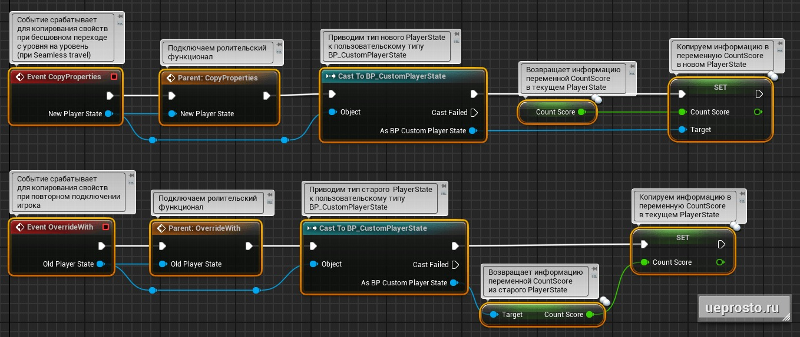

# 当移动到另一关时将信息从旧的玩家状态复制到新的玩家状态

## 来源与状态

- 原始 URL：https://dev.epicgames.com/community/learning/tutorials/7ddz/unreal-engine-player-state

## 运行时分类

- 类型：图文教程
- 判断：API 未识别到核心视频信号，可整理正文约 2561 字符。

## 摘要

我们使用两个覆盖事件“Event Copy Properties”和“Event Override With”将信息从旧的 Player State 对象复制到新的 Player State 对象

## 中文整理

### 概览

作为示例，请考虑在移动到不同游戏关卡时将计数分数变量信息从旧玩家状态对象复制到新玩家状态对象的代码。此代码将位于自定义类“BP_CustomPlayerState”的事件图表中。 1. 事件复制属性 为了在关卡无缝过渡期间保存信息，让我们重新定义“事件复制属性”事件。当此事件被触发时，输出事件引脚将从新游戏级别返回新的玩家状态对象。事件本身将在当前玩家状态下启动，然后再进入下一个级别。由于我们要重写“Event Copy Properties”事件以使用父类中的所有功能，因此我们将通过右键单击“Event Copy Properties”来连接“Parent: CopyProperties”节点。然后我们将“Event Copy Properties”返回的参数“New Player State”转换为自定义类对象“BP_CustomPlayerState”。这将允许我们返回一个新的自定义 PlayerState 对象。之后，使用 SET 函数，我们将在新的 PlayerState 对象中设置“Count Score”变量的值，并将当前（旧）PlayerState 中的“Count Score”值传递到此处。 2. Event Override With 为了在玩家重新连接时复制信息，我们将覆盖“Event Override With”事件。当此事件被触发时，上一级别的旧玩家状态对象将返回到输出引脚。事件本身将在玩家重新连接后以新状态发生。接下来类比前面1点，我们将“Parent: Override With”节点连接到事件上。然后我们将“Event Override With”返回的参数“Old Player State”转换为自定义类对象“BP_CustomPlayerState”。这将允许我们访问旧的自定义 PlayerState 对象。接下来，我们将使用 GET 函数从中提取“Count Score”变量的值。最后，我们将此值传递给当前（新）PlayerState 的“Count Score”变量。

* 您可以在我们的文章中学习对 Player State 类及其所有设置、功能、实践和示例的详细分析：[虚幻引擎 Player State](https://ueprosto.ru/blueprints/player-state.html) 👉👉👉 书籍 [Blueprint.鸟瞰图】：【下载虚幻引擎蓝图书籍】(https://ueprosto.ru/lp/bp-book-eg.html)
