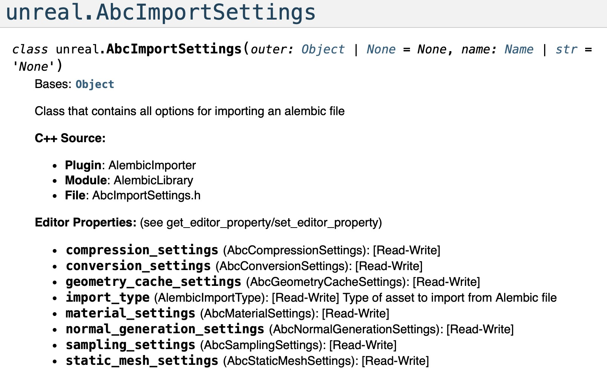
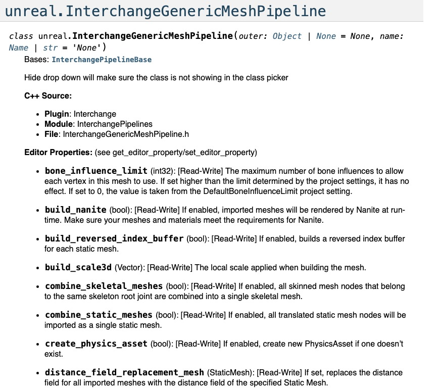

# VFX Pipeline TD 的 Unreal Python 资产摄取工作流程实用指南

## 来源与状态

- 原始 URL：https://dev.epicgames.com/community/learning/tutorials/0ybq/unreal-engine-practical-guide-to-unreal-python-asset-ingest-workflows-for-vfx-pipeline-tds

## 运行时分类

- 类型：图文教程
- 判断：API 未识别到核心视频信号，可整理正文约 9840 字符。

## 摘要

实用指南，包含大量专门针对 VFX Pipeline TD 的代码示例，用于使用 Python 将虚幻引擎资产工作流程集成到已建立的管道中。

## 中文整理

### 概览

*最近，我的任务是将虚幻引擎完全集成到一家大型视觉特效工作室已建立的视觉特效管道中。这是一项艰巨的任务，我在网上找不到太多有关该主题的信息，这就是我决定编写本指南的原因。*从艺术家的角度来看，将资源导入虚幻引擎似乎很简单。您放入 FBX 文件，调整一些设置，它会在内容浏览器中显示为“静态网格体”，准备好放入场景中。然而，在导入过程中，在幕后发生了许多过程。本指南的目标是通过解释关键概念并显示当前生产中使用的工作代码示例来简化这些流程的使用。

### 到底什么是资产？

要将虚幻的资产系统理解为 Pipeline TD，您应该首先了解“资产”更多地用作总括术语。在幕后使用了您应该了解的更具体的词汇：**包**：包是资产的容器。一个包*可以*包含多个资产，但对于我们的资产工作流程，我们实际上只使用其中包含一项资产的包。包的示例路径是 /Game/Assets/Teapot。 **资产：** 资产是虚幻存储导入文件的方式。 FBX 文件作为 StaticMesh 导入，.EXR 文件作为纹理导入，等等。因为资源位于包内，所以资源的路径变为：/Game/Assets/Teapot.Teapot。该包和资产都称为 Teapot，这就是该名称在资产路径中出现两次的原因。 **对象**：包和资产*都是*对象。 /Game/Assets/Teapot 是包对象。 /Game/Assets/Teapot.Teapot 是资产对象。对象还有两个您应该知道的术语：外部和最外部。资产对象的外部对象是包对象。然而，最外层*是存储资产的包。对象路径与其类型相同，因此包对象路径仍然是/Game/Assets/Teapot，资产对象路径仍然是/Game/Assets/Teapot.Teapot。一开始这让我有点困惑，因为 API 文档可能指定需要输入对象路径，而资产路径似乎也工作得很好。您不必太担心这一点，但在参考 Python API 文档时请记住这一点。

### 将资源路径转换为包路径，反之亦然

API 函数通常会要求提供资产路径或包路径，因此您必须时不时地在两者之间进行转换。请注意，资产或包路径只是一个字符串，而不是资产本身。为了查看和操作与资产相关的实际数据，我们通常需要首先加载它们。我们可以使用资产注册表来检索正确的路径并转换它们，而无需诉诸字符串操作。

**从资产路径到包路径**

```
asset_registry = unreal.AssetRegistryHelpers.get_asset_registry()
asset = asset_registry.get_asset_by_object_path(asset_path)
package_path = asset.package_name
```

**从包路径到资产路径**

```cpp
asset_registry = unreal.AssetRegistryHelpers.get_asset_registry()
package_assets = asset_registry.get_assets_by_package_name(package_path)
asset_path = package_assets[0].object_path
```

### 导入资产

您的工作室可能正在使用某种制作跟踪系统，该系统存储您可以访问的已发布文件的路径，但我不会在这里讨论这一点，因为各个工作室的处理方式都略有不同。其中一些系统（例如 Flow、AYON 和 Prism）带有引导逻辑和 UI，使得开始为 Unreal 编写代码变得更快一些。如果您的管道是完全自定义的，您将需要某种方式来运行导入代码，我个人在虚幻中使用 QT 编写显示可导入文件的 UI 方面取得了巨大成功。现在让我们开始编写导入代码。导入资产的常规（非交换）方式非常简单。您创建资产导入任务，设置选项，然后运行它。像这样：

**导入 PNG 纹理**

```
task = unreal.AssetImportTask()
task.filename = "/data/users/username/Downloads/grumpycat.png"
task.destination_path = "/Game/Assets/Textures/"

task.replace_existing = True
task.automated = True

unreal.AssetToolsHelpers.get_asset_tools().import_asset_tasks([task])
```

某些资源类型具有您可以在任务中设置的额外选项，如以下 FBX 静态网格物体示例：

**FBX 额外导入选项**

```
task.options = unreal.FbxImportUI()
task.options.import_materials = False
task.options.import_textures = False

task.options.static_mesh_import_data = unreal.FbxStaticMeshImportData()
task.options.static_mesh_import_data.combine_meshes = True
```

您基本上拥有 UI 中可用的所有选项，因此有“FbxImportUI”。每个文件类型的选项都不同，因此请务必阅读要导入的文件类型的 Python API 文档。不过，虚幻有一个更新的导入系统，现在越来越多的资产类型使用该系统。



### 使用 Interchange 导入文件

虚幻引擎最近引入了用于导入和导出文件的交换系统。它是一种通用、格式无关、异步且可定制的资产管理方法。然而，文档仍然有些有限，所以我将尝试解释它是如何工作的以及如何使用它。让我们分解一些关键概念： **管道**：在 Interchange 中，管道是指用于导入文件的逻辑。管道还可以具有导入选项，例如资产名称或导入 UDIM。管道存储在磁盘上，因此可以复制、修改和共享，这使得它们非常强大。您还可以自定义默认管道，这对于配置标准导入选项非常有用。我不会在这里编写自定义管道，因为这是一个更高级的主题。 **工厂**：负责将给定文件类型内的数据实际转换为 .uasset 文件的代码称为工厂。因此，管道更多地处理“在哪里”和“如何”导入，而工厂则负责“实际上”转换数据并使其在编辑器中可用。 **导入参数**：每次交换导入时需要设置的标准参数。这些并不特定于单个管道，请考虑诸如destination_name、replace_existing 等设置。因此，现在让我们使用Interchange 将纹理导入到Unreal 中。为了简单起见，我们将修改默认交换纹理管道的副本。我们将一步一步地讨论它。我们将使用这些数据：

```
file_path = "/data/users/username/Downloads/grumpycat.png"
destination_path = "/Game/Assets/Textures/"
destination_name = "T_GrumpyCat"
```

首先，我们应该设置导入参数并告诉 Unreal 这是自动导入，如下所示：

```
import_asset_parameters = unreal.ImportAssetParameters()
import_asset_parameters.is_automated = True
```

接下来，我们将复制默认纹理管道并将其存储在临时位置。请记住，管道只是 .uasset 文件，因此我们可以像任何其他资产一样操作它们。我们之所以在这里复制默认选项，是因为我们想要设置一些与默认选项不同的自定义选项。

```
temporary_texture_pipeline_path = "/Game/Temp/Interchange/Pipelines/TemporaryTexturePipeline"
asset_tools = unreal.AssetToolsHelpers.get_asset_tools()
pipeline = asset_tools.duplicate_asset(“/Interchange/Pipelines/DefaultTexturePipeline", temporary_texture_pipeline_path)
```

现在我们可以修改管道上特定于纹理的导入设置。

```
pipeline.asset_name = asset_name
pipeline.allow_non_power_of_two = False
pipeline.import_udi_ms = True
```

我们的管道现已配置完毕，让我们将其添加到导入参数中。我们在这里不使用默认管道，因此我们将其添加到 override_pipelines 列表中。

```
# Use the code mentioned earlier to convert between package and asset paths. I recommend turning that code into a function like I'm using here
temporary_texture_pipeline_asset_path = get_asset_path_from_package_path(temporary_texture_pipeline_path)

# This function only accepts soft object paths to an asset
import_asset_parameters.override_pipelines.append(unreal.SoftObjectPath(temporary_texture_pipeline_asset_path))
```

现在我们已经有了所有的配置数据，我们可以导入我们的文件。首先，我们将文件作为源数据加载，以便 Unreal 可以使用它，然后我们使用导入参数导入该数据。

```
source_data = unreal.InterchangeManager.create_source_data(file_path)

interchange_manager = unreal.InterchangeManager.get_interchange_manager_scripted()
interchange_manager.import_asset(destination_path, source_data, import_asset_parameters)
```

根据管道的不同，可用的设置也不同，因此在使用通用管道时请务必检查 API 文档。



### 重新导入文件

一旦有新的文件发布，您将希望您的艺术家能够更新它们。为此，必须使用与先前文件相同的设置来导入新文件。遗憾的是，没有“一刀切”的 API 调用可以重新导入未使用 Interchange 导入的文件。我们能做的最好的事情就是创建一个新的导入任务并将其传递给我们存储的设置。虽然这段代码可能看起来会替换一些数据，但 Unreal 似乎明白以这种方式替换文件是一个重新导入操作。

**重新导入文件而不进行交换**

```
new_file_path = "/data/users/username/Downloads/new_teapot.fbx"
package_path = "/Game/Assets/Teapot"
asset_to_replace = unreal.EditorAssetLibrary.load_asset(package_path)

task = unreal.AssetImportTask()
task.filename = new_file_path
task.destination_path = unreal.Paths.get_path(package_path)
task.destination_name = unreal.Paths.get_base_filename(package_path)
task.replace_existing = True
task.automated = True
```

您可能想知道如何在资产上存储外部版本控制信息，这对于版本控制是必需的。我个人一直在为此使用元数据标签，这些标签存储在资产上并且可以轻松设置和检索。

**使用元数据标签**

```
# Setting metadata tag
asset = unreal.EditorAssetLibrary.load_asset("/Game/Assets/Teapot")
unreal.EditorAssetLibrary.set_metadata_tag(asset, unreal.Name("MyVersion"), "V003")

# Getting metadata tag
asset = unreal.EditorAssetLibrary.load_asset("/Game/Assets/Teapot")
metadata_value = unreal.EditorAssetLibrary.get_metadata_tag(asset, unreal.Name("MyVersion"))
print(metadata_value)
# prints "V003"
```

### 使用 Interchange 重新导入文件

Interchange 的一件非常巧妙的事情是用于导入的管道存储在资产上。这使得重新导入变得更加容易，因为您不必进行太多配置，并且您的文件肯定会以与以前完全相同的方式导入。您所要做的就是将资产传递给导入参数上的 reimport_asset 。

**使用 Interchange 重新导入文件**

```
new_file_path = "/data/users/username/Downloads/new_teapot.fbx"
package_path = "/Game/Assets/Teapot"
asset = unreal.EditorAssetLibrary.load_asset(package_path)

destination_path = unreal.Paths.get_path(package_path)
source_data = unreal.InterchangeManager.create_source_data(new_file_path)

import_asset_parameters = unreal.ImportAssetParameters()
import_asset_parameters.is_automated = True
import_asset_parameters.reimport_asset = asset
```

### 重命名资产

有时您会想要重命名已导入的资源，特别是当单次导入创建多个资源时，例如从 FBX 文件导入骨架数据时。为此，您需要构造一个 AssetRenameData 类，该类采用加载的资源、新名称和资源的目录路径。然后将其传递到 rename_assets 函数中：

**重命名资产**

```
package_path = "/Game/Assets/Teapot"
asset = unreal.EditorAssetLibrary.load_asset(package_path)

new_asset_name = "CoffeePot"

asset_path = unreal.EditorAssetLibrary.get_path_name_for_loaded_asset(asset)
folder_path = unreal.Paths.get_path(asset_path)

asset_rename_data = unreal.AssetRenameData(
    asset=asset,
```

### 最后一句话

我希望本指南对其他 Pipeline TD 有用，因为所有这些信息将使我免于几周的反复试验。祝您好运，将虚幻引擎集成到您工作室的流程中！
