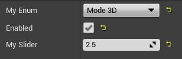
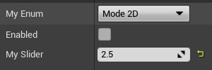

# 虚幻引擎属性编辑条件

## 来源与状态

- 原始 URL：https://dev.epicgames.com/community/learning/knowledge-base/baX0/unreal-engine-property-edit-conditions

## 运行时分类

- 类型：图文教程
- 判断：API 未识别到核心视频信号，可整理正文约 6226 字符。

## 摘要

文章作者：Jon L. 4.23 之前的编辑条件 每个 UPROPERTY 声明都可以在其元数据中定义一个 EditCondition。此编辑条件控制其附加的属性是否被编辑......

## 中文整理

### 概览

*文章作者：[Jon L.](https://dev.epicgames.com/community/profile/6Qv/Jon.Lambert)*

### 4.23之前编辑条件

每个 UPROPERTY 声明都可以在其元数据中定义一个 EditCondition。此编辑条件控制其附加的属性是否可在详细信息视图中编辑。此编辑条件是单个布尔值，例如： meta=( EditCondition="bAllowOverride" ) 当 bAllowOverride 为 true 时，该属性将是可编辑的：**** 此条件也可以被否定 (!bAllowOverride)，在这种情况下，当条件为 true 时该属性将不可编辑： 由于每个编辑条件是单个布尔值，因此通过将其添加到编辑条件属性的元中来内联属性也很简单，例如。 UPROPERTY(..., 元 =(InlineEditConditionToggle)) bool bLoopPositionOverride;看起来像这样： 但是，这意味着使用该编辑条件的每个属性都会重复该属性：这可能会令人困惑，因此可以使用属性上的元数据标记 HideEditConditionToggle 来隐藏某些属性上的内联复选框，例如：这允许对详细信息视图进行大量自定义，而无需编写成熟的 IDetailCustomization。然而，单个布尔值仍然具有极大的局限性，并且有许多简单的事情需要更多的表达能力。输入 4.23...

### 编辑4.23之后的条件

首先，以上所有内容在4.23之后仍然适用！但是，现在使用成熟的表达式解析器来评估编辑条件。这允许计算更复杂的表达式，例如： UPROPERTY(..., meta=(EditCondition="!bEnabled || Mode != EMode::MyMode && Duration > 10")) 有关有效表达式的更多示例，您可以仔细阅读 EditConditionParserTests.cpp。您还可以通过在编辑器中打开控制台并输入命令 testprops 并滚动到“编辑条件”类别来尝试设置一些示例。如果您想检查它，则使用 PropertyEditorTestObject.h 来获取其数据。表达式解析器使用标准 C++ 语法，支持的全套运算符包括：==、!=、>、>=、<、<=、||、&&、!、+、-、*、/ *请注意，这不包括子表达式的括号，因此运算符优先级很重要（与 C++ 中相同）。* 支持的类型是所有数字类型（属性和文字）、布尔值和枚举（必须定义为UENUM)，即： uint8, ..., uint64, int8, ..., int64, float, double, bool, UENUM() 数字类型全部转换为双精度数进行比较，因此这些表达式有效： MyFloat > MyInteger MyInteger <= 5.5 您可能已经注意到运算符列表末尾的算术运算符。这意味着您可以在表达式中执行一些基本算术，例如： MyInteger < MyFloat - 5 但是，请注意，这些都被计算为双精度数，因此您不能依赖整数除法语义。例如。当 MyInteger 为 5 时，这将计算为 true： MyInteger / 2 == 2.5 简单布尔表达式仍然与内联编辑条件切换兼容，启用了一些附加语法，因为它们在计算时相当于以前的版本，例如： bAllowOverride == true 或 false == bAllowOverride 支持的枚举比较是相等和不相等： MyEnum == EMode::A 或 MyEnum != EMode::A 对于枚举标记有 Bitflags 元数据，还可以使用按位与运算符 (&) 来测试某些标志： UENUM(meta=(Bitflags)) enum EBitflags { Zero = 0, One = 1 } MyEnum & EBitflags::One

### 限制

仅支持所属类的字段。没有方法或函数！当属性可见时，编辑条件会在每次勾选时进行评估。没有优化器，因此即使是常量表达式最终也会变得昂贵，例如。 5 * 2 / 10 - 1 == 0 枚举必须命名空间，即使对于旧式枚举也是如此，例如： enum MyEnum { A }; TEnumAsByte<MyEnum> EnumValue; UPROPERTY(..., EditCondition="EnumValue == MyEnum::A") 枚举不实现除等于和不等于以及按位与标志之外的任何比较。不支持结构内部的属性，甚至是内置结构，因此不会解析： MyColor.R == 0 没有括号，因此不会解析： (A || B) && (C || D) 整数没有按位运算符或位移位。

### 相关元数据

还有与编辑条件相关的其他元数据属性，可以帮助您设置所需的详细信息视图，而无需进行大量自定义。以下是一些可能对您有帮助的内容。

### 编辑条件隐藏

顾名思义，EditConditionHides 表示属性的 EditCondition 表达式也应该用于计算其可见性。例如：meta=(EditCondition=”bEnabled”, EditConditionHides) 这也适用于更复杂的编辑条件，例如：meta=(EditCondition=”MyEnum == EMode::Mode2D || bEnabled”, EditConditionHides)





这对于使用单个复选框来启用和显示多个属性，或者使用不同的控件具有不同的模式非常有用，例如：此属性还可以与我们的以下元数据属性结合应用，以创建更多自定义的 UI。

### 内联类别属性

InlineCategoryProperty 元数据告诉详细信息视图从其通常所在的默认详细信息视图位置隐藏布尔或枚举属性，而是将其与类别内联显示，例如： UPROPERTY(EditAnywhere, Category=”My Category”, meta=(InlineCategoryProperty)) 但是，有时我们希望显式创建一个具有独占启用的不同模式的 UI。将 InlineCategoryProperty 元数据和 EditConditionHides 添加到我们的子属性中：

```cpp
UPROPERTY(EditAnywhere, Category=”My Category”, meta=(InlineCategoryProperty))

EMode MyMode;

 
UPROPERTY(EditAnywhere, Category = MyCategory, meta = (EditCondition="MyMode == EMode::Mode2D", EditConditionHides))

FVector2D MyVector2;
```

虽然当前仅支持布尔或枚举属性，但这仍然可以让您了解如何使用此功能来创建动态且手工制作的 UI，但无需付出太多努力。
