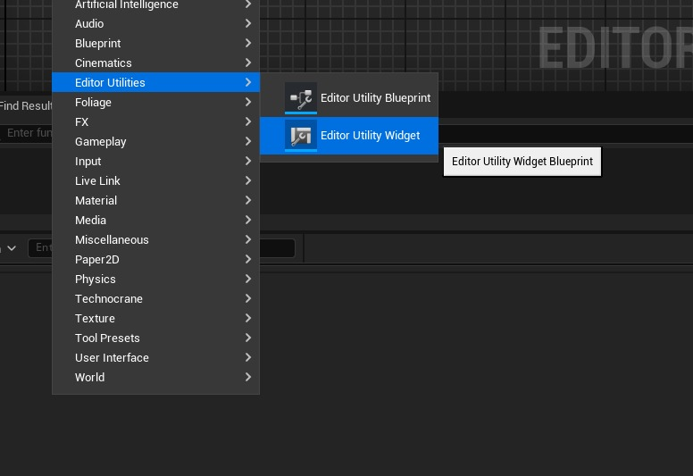
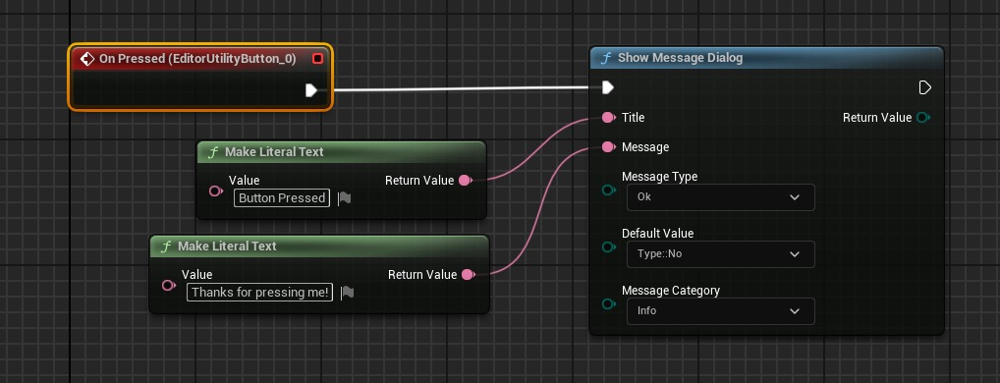
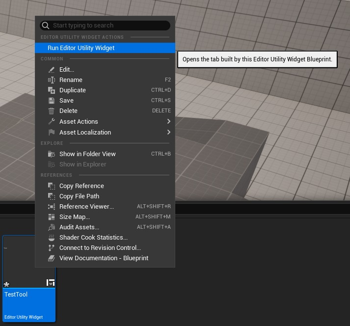
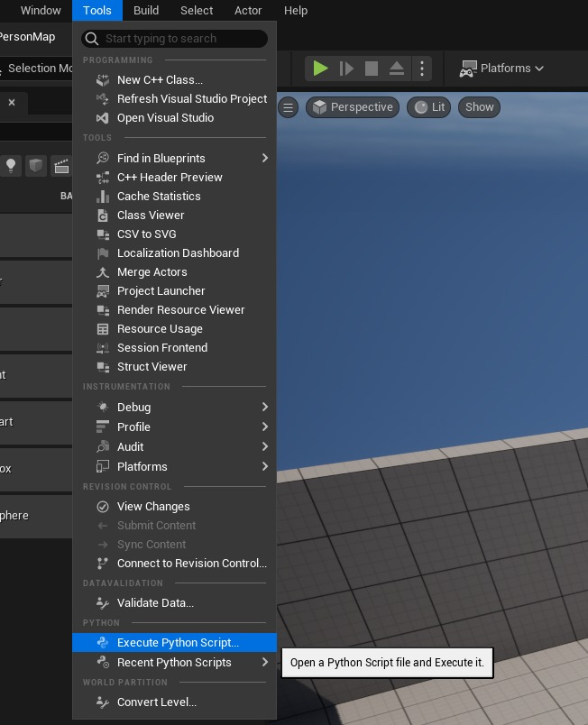
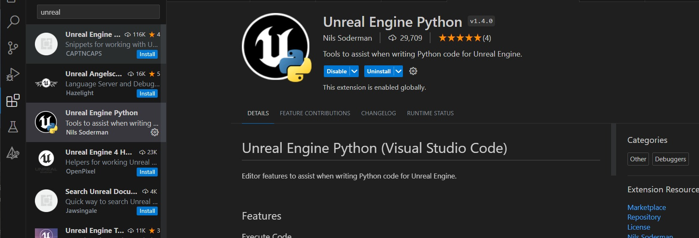
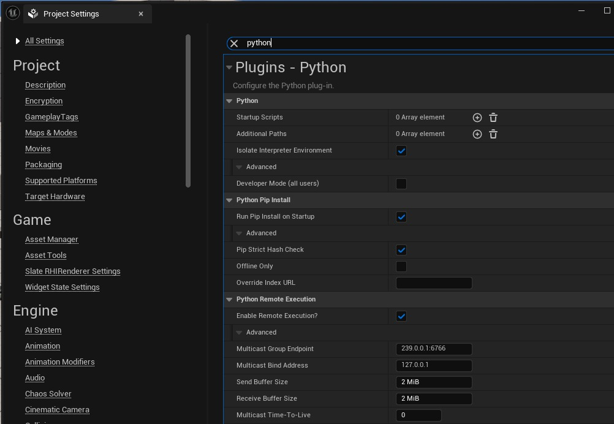
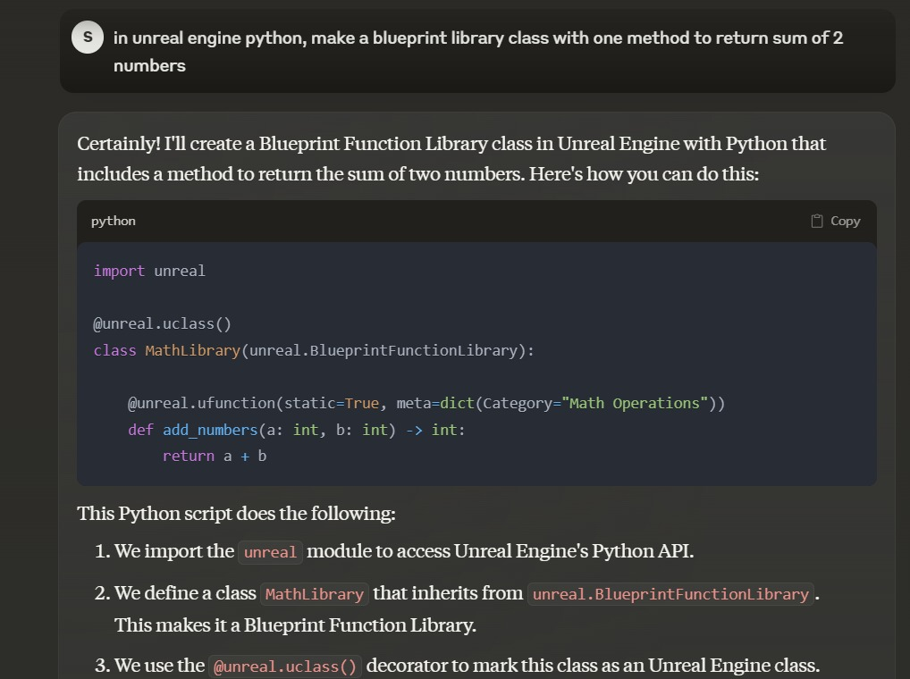
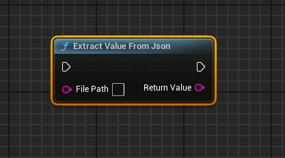
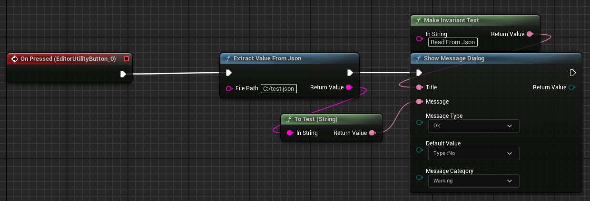
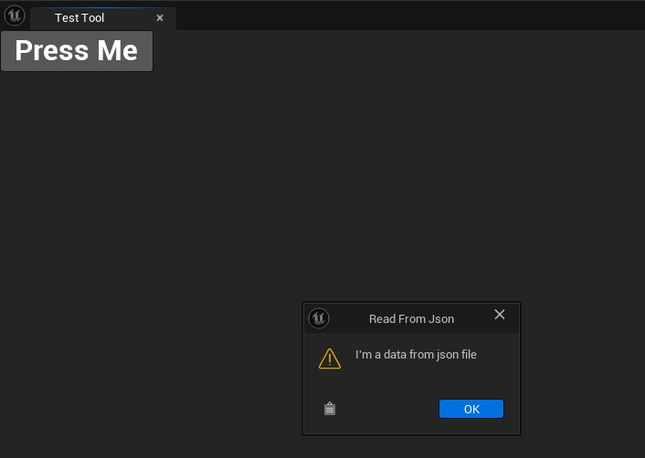

# Python 在实用工具小部件创建中的应用

## 来源与状态

- 原始 URL：https://dev.epicgames.com/community/learning/tutorials/0yV9/unreal-engine-python-in-utility-widgets-creation

## 运行时分类

- 类型：图文教程
- 判断：API 未识别到核心视频信号，可整理正文约 9523 字符。

## 摘要

我们探索如何使用 python 代码扩展蓝图图以及如何在实用小部件创建中使用它

## 中文整理

### 概览

在本文中，我想演示如何使用 Python 快速扩展和迭代蓝图函数的功能。即使您不熟悉 Python 脚本编写，您也可以利用 AI 帮助来帮助您编写代码块。您可能会想，既然已经有这么多可用的蓝图函数，为什么还要编写 Python 来扩展蓝图函数呢？让我给你举个例子。有一次，我需要一个工具从 JSON 文件中读取数据。虽然虚幻引擎有一个 JSON 插件，但事实证明该插件不支持读取我的数据文件中存在的数组数组。使用 Python 是克服此限制的快速解决方案 - 我只需使用 Python 读取 JSON 数据并将必要的信息返回到蓝图节点即可。我将文章分为 1. 部分：制作带有按钮 ui 元素的实用小部件。 2. 学习如何使用 python 公开新的蓝图图节点 3. 在按钮单击上创建一个事件，并使用我们实现的节点读取 json 文件并从中输出一些信息 现在让我详细介绍每个部分

### 制作一个实用小部件

您可以从“内容抽屉”人民币（鼠标右键）上下文菜单中的“编辑器实用程序”/“编辑器实用程序小部件”类别下创建它



小部件编辑器由设计器和图表组成。在设计器中，您将必要的 UI 元素放置在画布上并定义它们的属性。在图表中，您定义事件的逻辑，例如按下按钮时会发生什么。让我们制作一个带有标题的按钮，并在按下时向用户显示一个对话框。首先，在调色板左侧面板中找到编辑器实用程序按钮。将其拖动并放置在画布上。然后我们需要一个标题，将文本元素拖放到按钮顶部。在画布中选择新的文本元素后，在右侧“详细信息”面板上找到一个文本属性。在那里，我们可以将标题更改为“Press me”，所有添加的视觉组件都显示在左下角的“层次结构”面板中。您可以从画布或层次结构中选择元素。选择一个按钮组件并导航到“详细信息”面板中的“事件”部分。在那里，您可以单击“按下时”事件旁边的加号按钮。这将带您进入该实用程序的图形模式，其中已经为您创建了按钮按下事件。让我们创建一个新节点，以便在按下按钮后向用户显示一个对话框。



就是这样，为了测试它，我们必须编译我们的蓝图并按实用程序编辑器主工具栏上的“运行实用程序小部件”。您还可以从内容抽屉上下文菜单选项“运行编辑器实用程序小部件”运行实用程序小部件



### 使用 Python 的蓝图库类

蓝图库类是一组静态方法，您可以在蓝图中将其作为附加图形节点进行访问。通常，这是使用 C++ 插件完成的，但您也可以通过 Python 实现。换句话说，您在类下创建的每个函数都会成为可以在蓝图编辑器中使用的新图形节点。该声明与 C++ 非常相似。您需要使用 uclass() 装饰器公开从 BlueprintFunctionLibrary 派生的类，并使用 ufunction() 装饰器为每个方法标记类方法。在装饰器 ufunction() 的参数中，我们应该定义一些裸露的最小值作为图形节点公开 - static=True - 必须为我们类中的每个函数定义 - params=[<type>,...] - 这里我们定义函数的每个参数的值类型 - ret=<type> - 这是可选的，我们定义函数的返回值类型（如果函数返回任何值） - meta=dict(Category="Custom") - 我们的图形节点的附加元数据，例如，类别，以便我们知道应该在哪个类别下查找该函数

```
import unreal

@unreal.uclass()
class MathLibrary(unreal.BlueprintFunctionLibrary):
    
    @unreal.ufunction(static=True, params=[int, int], ret=int, meta=dict(Category="Math Operations"))
    def add_numbers(a: int, b: int) -> int:
        return a + b
```

对于 int、float 或 str 等简单数据类型，我们可以使用 python 类型。如果你想使用虚幻引擎类型（如向量、四元数、数组）进行操作，则必须使用虚幻引擎内部类型

```
unreal.Array(str)
unreal.Vector
unreal.Quat
unreal.Rotator
```

要创建自己的枚举器类型（这就像一个下拉选择器，为用户提供选择），您应该使用装饰器 unreal.uenum() 创建一个新类，该类派生自 unreal.EnumBase 类

```
@unreal.uenum()
class MyPythonEnum(unreal.EnumBase):
    ITEM1 = unreal.uvalue(0)
    ITEM2 = unreal.uvalue(1)
    ITEM3 = unreal.uvalue(2)
```

要创建自己的结构类型，请使用装饰器 unreal.ustruct() 创建一个类，并从 unreal.StructBase 类派生您的类。自己的结构化可以帮助将值打包到您的类型中，然后在蓝图中您可以“制作”您的结构并填充值或“打破”结构类型以访问每个单独的内部值

```
@unreal.ustruct()
class PythonUnrealStruct(unreal.StructBase):
    my_string = unreal.uproperty(str)
    my_number = unreal.uproperty(float)
    my_array_of_string = unreal.uproperty(unreal.Array(str))
    my_vector = unreal.uproperty(unreal.Vector)
```

我发现 Python 实现的结构在启动时无法正确加载，并且事件图可能会加载损坏的节点（无法将结构“分解”为值）。您可以使用主菜单 -> 工具 -> 执行 Python 脚本中的命令来运行 Python 脚本...



每次都以这种方式运行脚本并不是迭代或调试代码的最佳方法。如何让虚幻引擎中的 Python 编码变得更容易？我们可以使用 VSCode 的虚幻引擎 Python 扩展来简化代码编写，还可以利用 AI 辅助来帮助编写或调整代码块。

### 从 VSCode 或 Cursor App 远程执行 Python 代码

要在 VSCode 或 Cursor 中编写代码脚本，并使用 Unreal Engine Python 扩展（由 Nils Soderman 制作）将其发送到 UnrealEngine 中执行，[github](https://github.com/nils-soderman/vscode-unreal-python) 我将 Cursor 应用程序放在这里，因为它基于 VSCode 并且扩展在两个应用程序中都是兼容的



我们可以发送选定的行或整个文件以在虚幻引擎中执行，方法是按 Ctrl+Enter 或从命令面板 (Ctrl + Shirt + P) 并输入 Unreal Execute 为了在虚幻引擎中运行远程命令，您必须在项目设置中启用连接 搜索 python 并在“启用删除执行”下放置一个复选框



### 使用 AI 帮助编写 Python 代码

现代法学硕士（Cursor 应用程序、claude.ai.chatGPT 等）可以很好地回答使用方法创建此类的问题。让我举个例子



如果使用 Cursor App，您可以轻松地结合 AI 提示和虚幻引擎扩展，将代码行发送到 UE 编辑器中。以类似的方式，您可以找到 VSCode 的扩展，它可以帮助做同样的事情，为 chatGPT 或 claude.ai 提供提示

### 启动时执行Python

创建工具和管道时，我们需要确保该功能在编辑器每次运行时都能正常工作。为了实现这一点，我们的 Python 脚本（包括其类和函数）必须在编辑器启动时执行。要在项目启动时执行 python 脚本，您必须在项目或插件文件夹下的 Content\Python 文件夹中创建 init_unreal.py 脚本文件。您可以使用 init_unreal 脚本导入模块。要在蓝图初始化之前执行启动 python 脚本，您可以在项目中使用一个特殊的插件，名为 - [PythonBlueprintFixer](https://github.com/Gradess2019/PythonBlueprintFixer) 它也可以在官方市场上使用 - **Python Blueprint Fixer** init_unreal 加载模块的示例

```
import <our module name or folder with out module>

def reload():
    import importlib
    importlib.reload(<module name>)
```

### 做一个工具

让我们创建一个函数，从给定的文件名读取 JSON 文件，从 JSON 数据中提取所需的值，并在按下按钮时向用户显示该值。我要读取的 json 文件如下所示：

```
{
 "Data" : "I'm a data from json file"
}
```

我不会展示 python 代码迭代的每一步，对我来说，这几乎是通过 LLM 提示的 1 步完成的。由于 AI 结果是不确定的，我的提示可能会给您带来一点不同的结果，但我所要求的是 - 在 UnrealEngine Python 中，为我创建一个派生自 unreal.BlueprintFunctionLibrary 的类，该类具有接收一个 str 参数并返回 str 的函数。函数的装饰器应包含参数、返回类型和类别元信息。在函数内部，它应该从给定的输入参数读取 json 文件，并返回属性“Data”的值，或者如果未找到属性，则返回“错误，未找到数据”。

**从 json 中提取值**

```
import unreal
import json

@unreal.uclass()
class MyBlueprintLibrary(unreal.BlueprintFunctionLibrary):

    @unreal.ufunction(static=True, params=[str], ret=str, meta=dict(Category="My Utilities"))
    def extract_value_from_json(file_path: str) -> str:
        try:
            # Open and read the JSON file
```

执行脚本后，我可以返回工具蓝图图形编辑器并在“我的实用程序”类别下搜索一个新节点，它看起来像这样



在节点中，我将文件路径分配给 json 文件，并将返回值连接到消息框的消息输入。



编译并运行该工具后，我收到了一个消息框结果，如下图所示。



### 结论

就是这样！在本文中，我们逐步完成了创建实用程序小部件（工具）并使用 Python 扩展蓝图图功能的步骤。为了迭代 Python 代码，我建议使用 VSCode 和 LLM 提示。最后，我们编写了脚本来创建一个新的蓝图节点，在蓝图中执行它，并打印出输出值。希望这篇文章对您有所帮助，祝您编码愉快！
