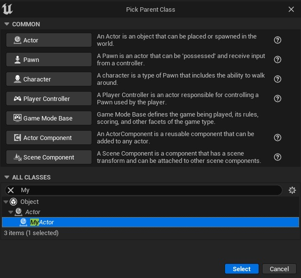

# 蓝图事件中的参考参数 (Part 1/4)

Source file: `unreal-engine-reference-parameters-in-blueprint-events.origin.md`.

This document was split during ue-kb import to keep source chunks buildable.

## 来源与状态

- 原始 URL：https://dev.epicgames.com/community/learning/tutorials/eK9V/unreal-engine-reference-parameters-in-blueprint-events
## 运行时分类

- 类型：图文教程
- 判断：API 未识别到核心视频信号，可整理正文约 18627 字符。
## 摘要

如果您想从 C++ 调用一个由蓝图实现的事件，并且该事件应该以某种方式返回一个整数，该怎么办？一般来说，我们希望能够通过事件将一些信息从蓝图发送到 C++。如果你尝试解决这个问题，你会发现你做不到。有可能吗？事实上...这是...需要一些额外的工作。让我们看看如何。
## 中文整理
### 问题

我们有一个简单的任务。我们希望从蓝图端使用事件将整数发送到 C++ 端。让我们看看通常有哪些尝试来做到这一点。如果你只是想看看我遇到的两个解决方案，它们就在最后。
### DECLARE_DYNAMIC_MULTICAST_DELEGATE_RetVal

这对于任何人来说可能都是第一次尝试。这个想法很简单，只是一个返回整数的委托。这应该有效...不是吗？

```cpp
DECLARE_DYNAMIC_MULTICAST_DELEGATE_RetVal(int, FOnGetInteger);
```

让我们创建一个使用此委托的参与者。

```cpp
UCLASS()
class PROCEDURALTEST_API AMyActor : public AActor
{
	GENERATED_BODY()

public:
	UPROPERTY(BlueprintAssignable)	
	FOnGetInteger GetIntegerFunc;

	UFUNCTION(BlueprintCallable)
```

该参与者具有 **GetIntegerFunc** 属性，即我们的动态多播委托。下面我编写了一个函数，该函数请求广播委托的整数，然后记录其值。让我们编译并尝试... ***“错误：多播委托函数签名不得返回值”*** 哦不...
### DECLARE_DYNAMIC_DELEGATE_RetVal

好的，如果我们不能使用多播委托，我们应该尝试使用非多播委托。让我们更改委托签名。

```cpp
DECLARE_DYNAMIC_DELEGATE_RetVal(int, FOnGetInteger);
```

另外，我们必须稍微改变一下我们的演员。

```cpp
UCLASS()
class PROCEDURALTEST_API AMyActor : public AActor
{
	GENERATED_BODY()

public:
	UPROPERTY(BlueprintAssignable)	
	FOnGetInteger GetIntegerFunc;

	UFUNCTION(BlueprintCallable)
```

我刚刚将广播调用更改为执行。现在我们来编译一下。观察我们的 GetIntegerFunc 属性仍然是 BlueprintAssi...“***错误：'BlueprintAssignable' 只允许在多播委托属性上***”我可以删除该说明符，但是...如果属性不是 BlueprintAssignable，如何在蓝图中实现事件？好吧，我们可以使用另一种方法来显式地执行此操作。演员现在是这样的。

```cpp
UCLASS()
class PROCEDURALTEST_API AMyActor : public AActor
{
	GENERATED_BODY()

public:
	UPROPERTY()	
	FOnGetInteger GetIntegerFunc;

	UFUNCTION(BlueprintCallable)
```

从字面上看，新方法接收一个委托并用它初始化我们的委托。让我们编译...哦，...是的。它确实可以编译！现在让我们转到蓝图方面。首先，我创建 AMyActor 的子类。



现在我正在实现 BeginPlay 事件来绑定 GetIntegerFunc 事件，然后调用 LogInteger 方法。要实现 GetInteger 事件，我们需要创建一个自定义事件。

```
Begin Object Class=/Script/BlueprintGraph.K2Node_Event Name="K2Node_Event_0"
   EventReference=(MemberParent=/Script/CoreUObject.Class'"/Script/Engine.Actor"',MemberName="ReceiveBeginPlay")
   bOverrideFunction=True
   bCommentBubblePinned=True
   NodeGuid=C23BD34948F390344710B28F89BE5372
   CustomProperties Pin (PinId=9A0299304B502A85CF68F5B2B7FC347E,PinName="OutputDelegate",Direction="EGPD_Output",PinType.PinCategory="delegate",PinType.PinSubCategory="",PinType.PinSubCategoryObject=None,PinType.PinSubCategoryMemberReference=(MemberParent=/Script/CoreUObject.Class'"/Script/Engine.Actor"',MemberName="ReceiveBeginPlay"),PinType.PinValueType=(),PinType.ContainerType=None,PinType.bIsReference=False,PinType.bIsConst=False,PinType.bIsWeakPointer=False,PinType.bIsUObjectWrapper=False,PinType.bSerializeAsSinglePrecisionFloat=False,PersistentGuid=00000000000000000000000000000000,bHidden=False,bNotConnectable=False,bDefaultValueIsReadOnly=False,bDefaultValueIsIgnored=False,bAdvancedView=False,bOrphanedPin=False,)
   CustomProperties Pin (PinId=783D96FA4AE6FB1E1A807C83F63E17F6,PinName="then",Direction="EGPD_Output",PinType.PinCategory="exec",PinType.PinSubCategory="",PinType.PinSubCategoryObject=None,PinType.PinSubCategoryMemberReference=(),PinType.PinValueType=(),PinType.ContainerType=None,PinType.bIsReference=False,PinType.bIsConst=False,PinType.bIsWeakPointer=False,PinType.bIsUObjectWrapper=False,PinType.bSerializeAsSinglePrecisionFloat=False,LinkedTo=(K2Node_CallFunction_0 AA1B23634DF64DB17C26FF887B3ED5F8,),PersistentGuid=00000000000000000000000000000000,bHidden=False,bNotConnectable=False,bDefaultValueIsReadOnly=False,bDefaultValueIsIgnored=False,bAdvancedView=False,bOrphanedPin=False,)
End Object
Begin Object Class=/Script/BlueprintGraph.K2Node_CallFunction Name="K2Node_CallFunction_0"
   FunctionReference=(MemberName="BindGetInteger",bSelfContext=True)
```

现在我们可以完成事件并最终返回...等一下...我无法返回任何东西！我无法返回我的整数！不存在这样的 Return 节点！
