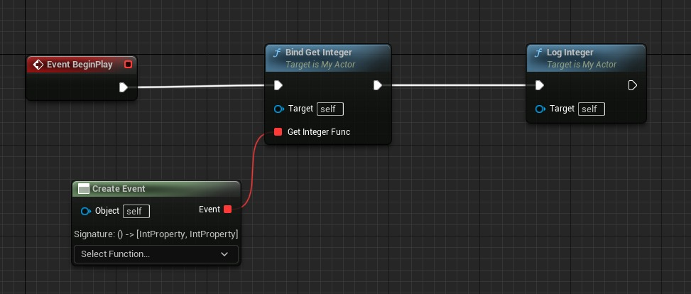
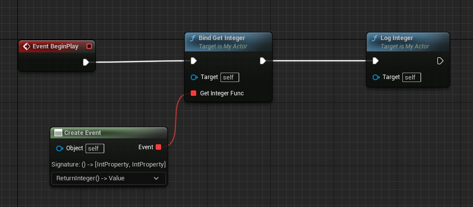
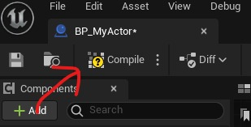
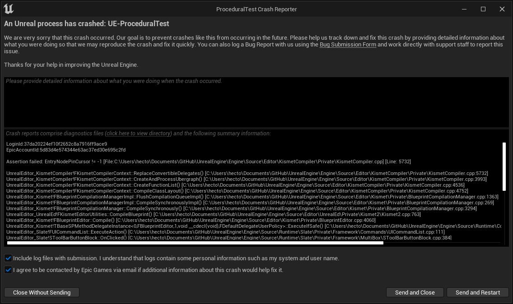
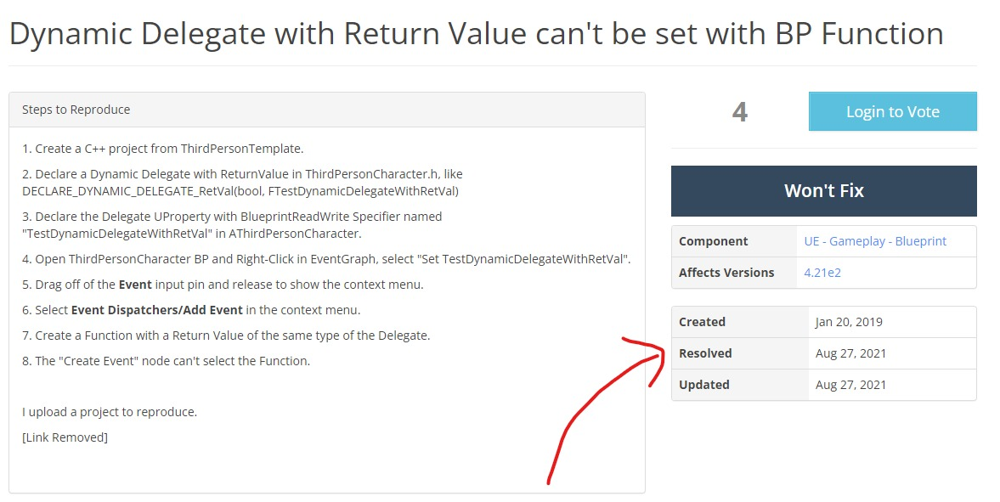
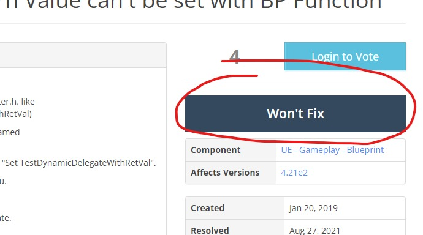
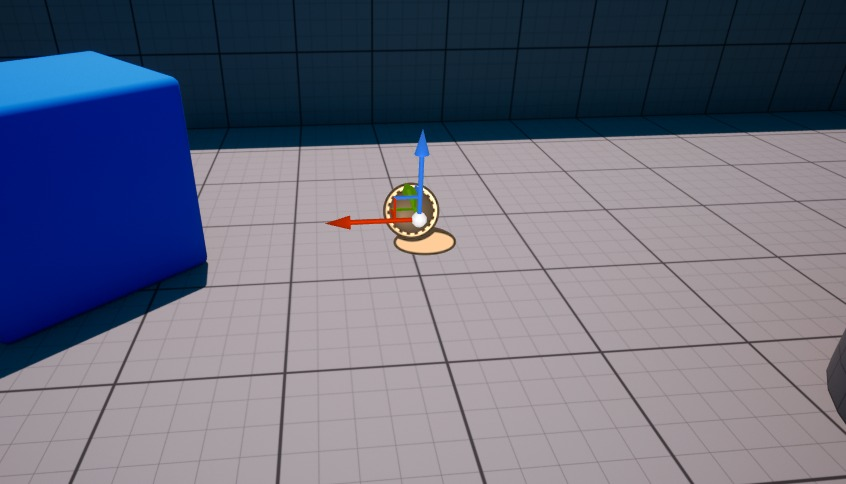

# 蓝图事件中的参考参数 (Part 3/4)

Source file: `unreal-engine-reference-parameters-in-blueprint-events.origin.md`.

This document was split during ue-kb import to keep source chunks buildable.

### 使用 CreateEvent 节点

我刚刚记得有一个名为 CreateEvent 的节点存在。您可以将一个函数传递给它并创建一个事件。蓝图函数可以返回一个值。因此，我们可以再次尝试使用该节点进行的第一次尝试。让我们使用 RetVal 和 BindGetInteger 方法恢复非多播委托。

```cpp
DECLARE_DYNAMIC_DELEGATE_RetVal(int, FOnGetInteger);

UCLASS()
class PROCEDURALTEST_API AMyActor : public AActor
{
	GENERATED_BODY()

public:
	UPROPERTY()	
	FOnGetInteger GetIntegerFunc;
```

再次回到蓝图一侧，让我们创建一个返回整数的函数。

```
Begin Object Class=/Script/BlueprintGraph.K2Node_FunctionEntry Name="K2Node_FunctionEntry_0"
   ExtraFlags=201457664
   FunctionReference=(MemberName="ReturnInteger")
   bIsEditable=True
   NodeGuid=3BCB80EA494086AB94ABA197D0797EC8
   CustomProperties Pin (PinId=3269575041C741822D29F58460516661,PinName="then",Direction="EGPD_Output",PinType.PinCategory="exec",PinType.PinSubCategory="",PinType.PinSubCategoryObject=None,PinType.PinSubCategoryMemberReference=(),PinType.PinValueType=(),PinType.ContainerType=None,PinType.bIsReference=False,PinType.bIsConst=False,PinType.bIsWeakPointer=False,PinType.bIsUObjectWrapper=False,PinType.bSerializeAsSinglePrecisionFloat=False,LinkedTo=(K2Node_FunctionResult_0 899F74B54A0511B28107C0B283C2494C,),PersistentGuid=00000000000000000000000000000000,bHidden=False,bNotConnectable=False,bDefaultValueIsReadOnly=False,bDefaultValueIsIgnored=False,bAdvancedView=False,bOrphanedPin=False,)
End Object
Begin Object Class=/Script/BlueprintGraph.K2Node_FunctionResult Name="K2Node_FunctionResult_0"
   FunctionReference=(MemberName="ReturnInteger")
   bIsEditable=True
```

好吧，这看起来很有希望。我觉得它想要工作。现在是 CreateEvent 节点。



哦，这可能真的有效！好的，现在我选择刚刚创建的函数。



我们来编译一下。



再次放置动作...



这似乎是……一个bug？让我们做一些互联网研究。好的，我找到了一个存在该问题或类似问题的问题跟踪器。 [问题跟踪器](https://unreal-engine-issues.herokuapp.com/issue/UE-68763)



等一下...它说问题已解决...但事实并非如此...



好吧，够了。让我们严肃点吧。
### 解决方案 1（共 2）：包含整数的 UObject

虽然我们不能通过引用传递原始值，但我们可以传递指向 UObject 的指针。因此，这个想法非常简单：使用包含整数的 UObject 和设置其值的方法。

```cpp
UCLASS()
class PROCEDURALTEST_API UInteger : public UObject
{
	GENERATED_BODY()

private:
	int Integer;

public:
	UFUNCTION(BlueprintCallable, BlueprintPure)
```

该类称为 UInteger。代表应该是这样的。

```cpp
DECLARE_DYNAMIC_MULTICAST_DELEGATE_OneParam(FOnGetInteger, UInteger*, Integer);
```

参与者应该创建这个对象并将其传递给委托。

```cpp
UCLASS()
class PROCEDURALTEST_API AMyActor : public AActor
{
	GENERATED_BODY()

public:
	UPROPERTY(BlueprintAssignable)	
	FOnGetInteger GetIntegerFunc;

	UFUNCTION(BlueprintCallable)
```

在蓝图方面，我们只需要使用SetInteger方法。

```
Begin Object Class=/Script/BlueprintGraph.K2Node_Event Name="K2Node_Event_0"
   EventReference=(MemberParent=/Script/CoreUObject.Class'"/Script/Engine.Actor"',MemberName="ReceiveBeginPlay")
   bOverrideFunction=True
   bCommentBubblePinned=True
   NodeGuid=C23BD34948F390344710B28F89BE5372
   CustomProperties Pin (PinId=9A0299304B502A85CF68F5B2B7FC347E,PinName="OutputDelegate",Direction="EGPD_Output",PinType.PinCategory="delegate",PinType.PinSubCategory="",PinType.PinSubCategoryObject=None,PinType.PinSubCategoryMemberReference=(MemberParent=/Script/CoreUObject.Class'"/Script/Engine.Actor"',MemberName="ReceiveBeginPlay"),PinType.PinValueType=(),PinType.ContainerType=None,PinType.bIsReference=False,PinType.bIsConst=False,PinType.bIsWeakPointer=False,PinType.bIsUObjectWrapper=False,PinType.bSerializeAsSinglePrecisionFloat=False,PersistentGuid=00000000000000000000000000000000,bHidden=False,bNotConnectable=False,bDefaultValueIsReadOnly=False,bDefaultValueIsIgnored=False,bAdvancedView=False,bOrphanedPin=False,)
   CustomProperties Pin (PinId=783D96FA4AE6FB1E1A807C83F63E17F6,PinName="then",Direction="EGPD_Output",PinType.PinCategory="exec",PinType.PinSubCategory="",PinType.PinSubCategoryObject=None,PinType.PinSubCategoryMemberReference=(),PinType.PinValueType=(),PinType.ContainerType=None,PinType.bIsReference=False,PinType.bIsConst=False,PinType.bIsWeakPointer=False,PinType.bIsUObjectWrapper=False,PinType.bSerializeAsSinglePrecisionFloat=False,LinkedTo=(K2Node_AddDelegate_0 2C8830BF4B4B196E549797A36C49B5A0,),PersistentGuid=00000000000000000000000000000000,bHidden=False,bNotConnectable=False,bDefaultValueIsReadOnly=False,bDefaultValueIsIgnored=False,bAdvancedView=False,bOrphanedPin=False,)
End Object
Begin Object Class=/Script/BlueprintGraph.K2Node_CallFunction Name="K2Node_CallFunction_1"
   FunctionReference=(MemberName="LogInteger",bSelfContext=True)
```

将演员放置在关卡中。



启动游戏并打开输出日志窗口。你应该看到这个。 “***LogTemp：警告：整数为 1234***”哦，是的...
