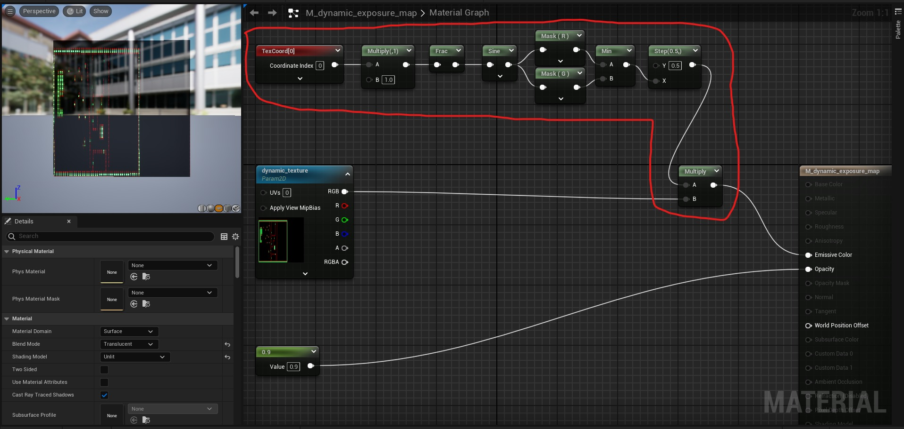
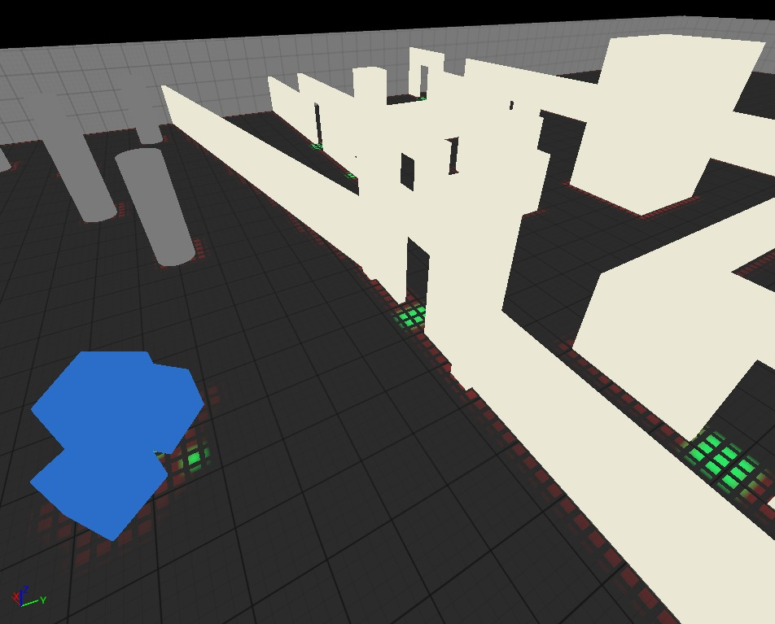
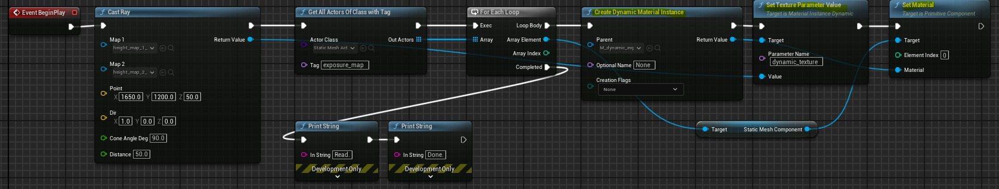
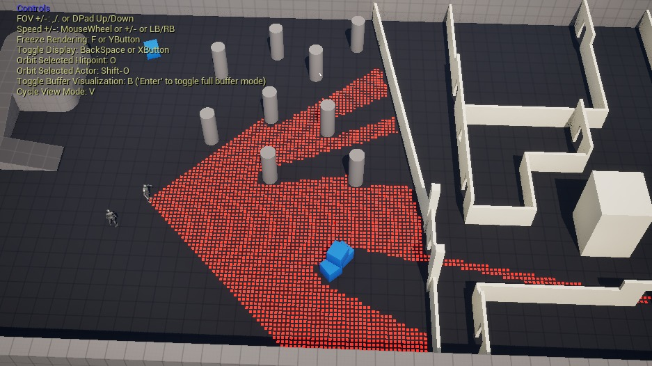

# 使用 C++ 和蓝图进行调试可视化的简单可修改动态纹理

## 来源与状态

- 原始 URL：https://dev.epicgames.com/community/learning/tutorials/Jpqq/unreal-engine-simple-modifiable-dynamic-texture-using-c-blueprint-for-debug-visualization

## 运行时分类

- 类型：图文教程
- 判断：API 未识别到核心视频信号，可整理正文约 2183 字符。

## 摘要

使用 C++ 和蓝图进行调试可视化的动态纹理/材质。

## 中文整理

### BG

我最近开始构建我的 UE5 游戏演示。逻辑在我的C++代码中，它将更新纹理并返回BP。 **我的计划是将信息存储在游戏地图中。也就是说，为了性能而进行时空交易。** **这需要可修改的数据纹理来可视化信息。** 正如你们所知，目的是调试。我从（https://dev.epicgames.com/community/learning/tutorials/ow9v/unreal-engine-creating-a-runtime-editable-texture-in-c）中学到了一些东西，这是一个非常好的教程。我和其他人一样使用 BP 中的“创建动态材质实例”。

### 创建 C++ 类

```cpp
// Dynamic texture that will parse gamplay map info.
class dynamic_texture
{
  public:
    dynamic_texture(int _w, int _h, int _c) : w(_w), h(_h), pixel_stride(_c)
    {
        pixel_size = w * h * pixel_stride;

        // Initialize Texture Data Array.
        texture_data.Init(0, pixel_size);
```

**dynamic_texture** 是构造函数。 **fill_texture** 只是将数据填充到纹理中。如果您只想更新纹理的一小部分，则需要修改 MEMORY COPY 以仅复制一小块数据。

### 测试

测试代码。

```cpp
dynamic_texture dynamic_exposure_map_texture(*w, *h, PIXEL_STRIDE);

// Cast test.
agent1_ray_util.cast_ray_on_height_map_agent(height_map_shared_ptr.Get(), gameplay_map_shared_ptr.Get());

UE_LOG(LogTemp, Warning, TEXT("Ray cast finished."));
// gameplay_map_shared_ptr.Get()->print_data();
dynamic_exposure_map_texture.fill_texture(gameplay_map_shared_ptr.Get());
```

然后为我的游戏平面（地面）创建一个材质。默认纹理是一个占位符，稍后将被动态纹理替换。红圈内的节点是绘制图块的。可以忽略。



将材料放置在地平面上。这是点击“播放”按钮之前的可视化效果。



现在在英国石油公司。 BeginPlay -> 我的 Func -> 查找地平面 -> 创建动态材质实例 -> 将 My Func 返回的新纹理传递给材质 -> 将动态材质设置为地平面。



### 结果

现在运行游戏。然后绘制并更新地平面材质。



光线投射效果只是我使用动态纹理进行可视化的演示测试。它与动态纹理核心代码无关。
