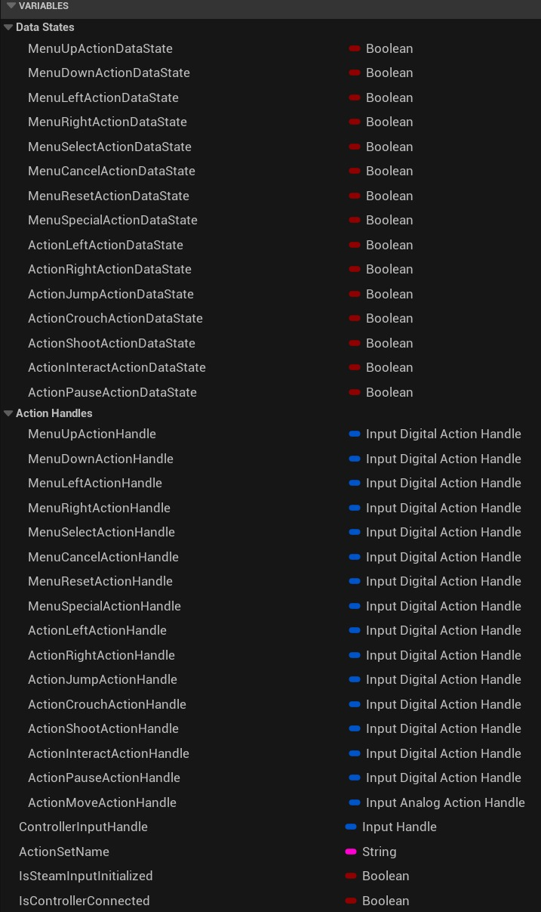
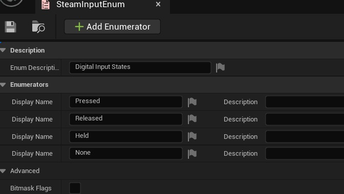
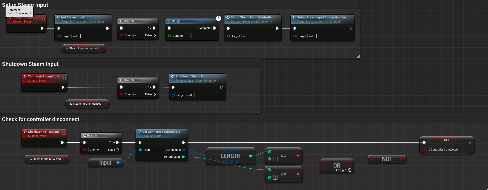
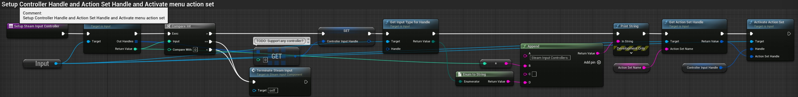
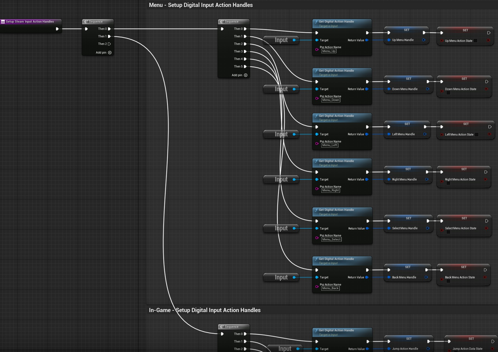
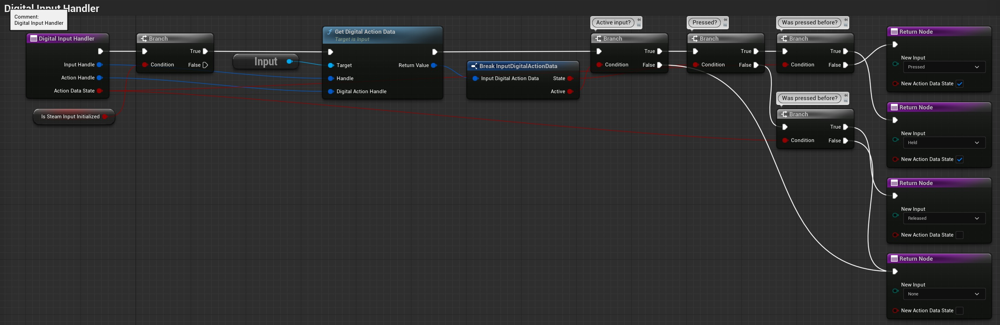
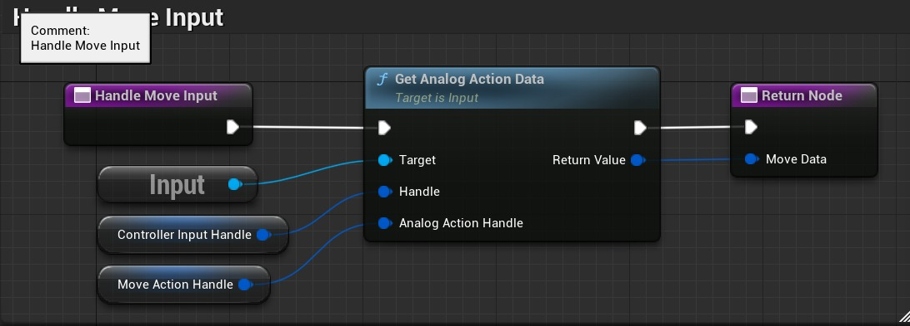
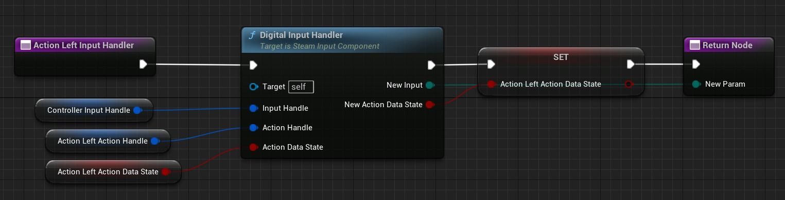
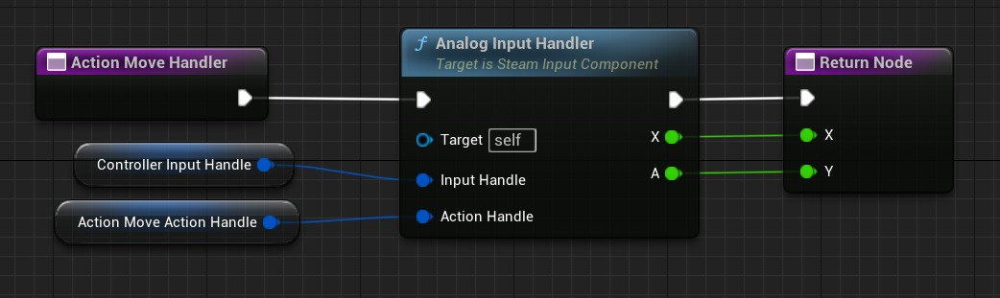
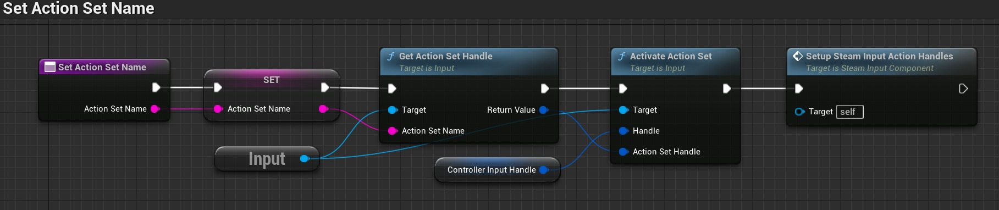

# SteamWorks 输入 API

## 来源与状态

- 原始 URL：https://dev.epicgames.com/community/learning/tutorials/qM7o/unreal-engine-steamworks-input-api

## 运行时分类

- 类型：图文教程
- 判断：API 未识别到核心视频信号，可整理正文约 19034 字符。

## 摘要

本教程提供了如何为虚幻引擎 5.1 中开发的游戏实现 Steam 输入的分步说明。我将主要介绍如何使用 EeelDev SteamCore 插件在 BluePrints 中执行操作，但也会介绍一些 C++。 SteamCore 插件只是 Steam 输入 API 的包装器，因此在 C++ 和 BluePrints 之间来回切换应该相对简单。

## 中文整理

### 介绍

虽然有许多关于 Steamworks 的参考资料，甚至还有一些为 C++ 和蓝图提供 Steamworks API 包装器的虚幻引擎插件，但到目前为止，我还没有找到任何关于如何让 Steamworks Steam 输入 API 与虚幻引擎配合使用的演练或示例。我确信很多人都已经这样做了，而且我确信他们中的许多人会读到这篇文章并对我的实现摇头，但在花了一些时间尝试自己解决这个问题后，我想我应该尝试为下一个人节省一些时间并记录我如何让 Steam 输入完全适用于我的游戏。

### 背景

如果您要在 Steam 上发布游戏，如果不付出大量努力，可能很难达到完全控制器支持“认证”的要求。 Steam 输入应该有助于简化这一过程，但它与虚幻引擎的工作方式可能会让事情变得困难。虚幻引擎有一些内置的输入机制，包括“旧版”输入管理器和新的增强输入系统。 Steam 输入在这些之外工作，并且不提供许多 UE 提供的优秀功能，例如事件驱动的输入信号。当然，Steamworks 是一个跨平台和跨引擎的系统，因此它们提供 API 但没有很好的扩展来使它们更容易在任何特定引擎中使用也就不足为奇了。对于我的游戏，我希望为输入提供尽可能最佳的用户体验，确保所有输入类型都被视为一等公民。作为 2.5D 平台游戏，我不需要游戏本身的鼠标输入，因此我决定做一个仅使用键盘或游戏手柄的完整实现。游戏玩法相对简单，因为它只需要左/右移动、跳跃、蹲伏、射击和交互输入，以及暂停/显示游戏菜单的选项。菜单输入也相对简单；大多数情况下，玩家只需要使用上/下和选择/返回输入来导航菜单，然后使用左/右更改设置。话虽这么说，本教程几乎可以用于任何支持游戏手柄输入的游戏，因此没有真正的限制。

### 注意事项

1. 在测试过程中，我多次导致 Steam 崩溃。一些简单的事情，例如通过将其添加为非 Steam 游戏来运行本地构建，然后尝试启动控制器配置，每次都会崩溃。 2. 如果您使用PIE模式，Steam API将不会加载。您必须使用“独立游戏”选项进行测试。 3. Xbox、Playstation 和其他控制器的控制映射必须在 Steam 中单独设置。请查看上面 Steamworks 页面上的说明以了解详细信息。 4.我不得不时不时地重新启动虚幻引擎，因为Steam抓住了它并且不肯放手。如果您发现非 Steam 输入（即增强型或传统输入）不再在 PIE 模式下工作，请尝试退出 UE 和 Steam。

### 先决条件：

1. 您可以使用Steam 480测试应用程序ID完成本教程中的所有工作，因此您不需要在Steam商店注册您的游戏。 2. 我的大部分工作都是使用市场上的 SteamCore 插件 (https://steamcore.eeldev.com/docfiles/getting_started/configuring-plugin) 完成的。我将展示的大部分内容都会直接转换为 C++，因为该插件“只是”一个在蓝图中公开 Steamworks API 的包装器（至少对于输入而言）。不过，在 C++ 中可能有更好/更简单的方法，所以如果您打算采用源代码路线，请务必提前计划。 3. Steam 必须安装在您的开发系统上并运行，SteamWorks API 才能正常工作。 Steam建议使用大图片模式进行控制器测试，这肯定会提供更好的用户体验。

### 设置步骤

1. 下载并安装 Epic Launcher，然后安装虚幻引擎 5.1。 1. 注意：在撰写本文时，Steamworks 的版本为 1.55，而 UE 5.1 和 SteamCore 插件运行的版本为 1.53。我对此没有任何问题，但 Steamworks 偏离 UE 5.1 支持的版本越远，出现贬值或更改的 API 的可能性就越大。 2. 启动 UE 5.1 并基于第三人称模板（蓝图或 C++）以及入门内容创建一个新项目。 3. 如果您打算使用蓝图，请购买 SteamCore 插件并将其安装到 5.1 引擎。 1. 进入编辑->插件，启用SteamCore和Steam在线子系统。确保“Steam 控制器插件”和“SteamVR”未启用（因为它们已被折旧）。重新启动UE。 2. 转到“编辑”->“项目设置”，然后在“游戏”->“SteamCore 插件”下，输入您的 Steam 应用程序 ID 和 Steam 开发应用程序 ID（如果您尚未上线，则这些 ID 可以相同，但如果您已经上线，则应使用开发版本）。

### 创建 Steam 输入配置

我发现 SteamWorks 上的说明有点神秘，但在浏览了几次并进行了一些尝试和错误之后，我想我已经弄清楚了它的主要工作原理。也感谢游戏社区分享他们的见解！为新游戏设置输入配置有两个步骤： 1. 创建一个 game_actions_N.vdf 文件，其中 N 是您的游戏的应用程序 ID（例如测试游戏的 480），设置操作并将其保存在名为“controller_config”的文件夹（可能不存在）内的 Steam 文件夹中（例如 C:\Program Files (x86)\Steam\controller_config\game_actions_480.vdf)。 2. 从 UE 5.1 以独立玩家模式启动游戏。几秒钟后，您应该会看到 Steam 菜单出现在右下角。按 Shift-Tab（或您设置的用于显示 Steam 界面的任何按键序列）并打开控制器布局应用程序。 1. 您应该看到一个空白配置。 VDF 文件中的操作名称可分配给每个输入，因此请进入“编辑布局”并进行设置。在这种情况下，您将只有一个动作集（游戏内控件），并且只有跳跃、移动和摄像机等动作。分别将它们分配给按钮 A（跳跃）、左操纵杆（移动）和右操纵杆（摄像机）。您可能还想将相机的灵敏度调低至 25% 左右，否则它会疯狂旋转。 2. 单击控制器布局主页上“编辑布局”旁边的齿轮图标，并将布局导出到您的个人设置。 3. 对每种控制器类型（Xbox、PS、Switch 等）重复此步骤。这是我为游戏创建的 game_actions_N.vdf 文件的内容，包括菜单系统和关卡编辑器。您的行动集和行动可能会有所不同。

**游戏动作_N.vdf**

```
"In Game Actions"
{
    "actions"
    {
        "GameControls"
        {
            "title"                 "#Set_GameControls"
            "Button"
            {
                "Action_Jump"       "#Action_Jump"
```

### 蓝图组件

1. 在内容浏览器中，浏览至 ThirdPerson->BluePrints，右键单击并创建蓝图。选择“Actor Component”并将其命名为“SteamInputComponent”。打开它。您可以删除“Event Begin Play”和“Event Tick”，因为它们不会被使用。 2. 如果您的游戏使用“设置游戏暂停”蓝图节点暂停游戏，您需要转到“类默认值”并选中该组件的“即使暂停时也勾选”选项，否则输入将不起作用。我还更改了我的角色，以允许在暂停时勾选，因为那是我的游戏内菜单循环的地方。您可以在本教程的第三人称角色蓝图上启用此功能。 3. 创建一些变量来处理各种操作及其状态。对于每个操作，我创建了一个输入（数字/模拟）操作句柄和一个布尔值来指示其中是否包含任何活动数据。您也可以使用数组、映射或其他结构来跟踪它们，但您需要很好地跟踪它们。鉴于我的游戏输入数量有限，这对我来说更简单。



我最终创建了一个 SteamInputEnum 来跟踪玩家在最后一次点击中是否按下、释放或按住了按钮。我还有一个 none 选项，您可以使用它来了解没有新输入进来。这与 UE 的增强输入功能类似，使您能够根据当前按钮状态执行不同的操作。



### Steam 输入事件

我在 SteamInputComponents 事件图中创建了 3 个自定义事件： 1.SetupSteamInput 执行基本初始化。事件发生的顺序至关重要！以错误的顺序执行操作意味着您将无法获得输入，尤其是当您更改操作集（例如在菜单/游戏/编辑器之间）时。 1. InitSteamInput 只是调用 Input->Init() 并设置一个布尔值来指示 Steam 输入已初始化。 2. 下面我将介绍其他功能。 2. ShutdownSteamInput 只是调用 Input->Shutdown() 并设置一个布尔值来指示 Steam 输入未初始化。这可用于用户在游戏运行时断开控制器连接或关闭 Steam 控制器支持的情况。在这些情况下，您需要切换回 UE 输入法。 3. CheckControllerState 用于查看是否有任何控制器实际连接。作为返回控制器状态而不是设置变量的公共函数，这可能会更好。



此函数执行以下操作： - 获取所有连接的控制器并将其中第一个控制器设置为要使用的 Steam 输入。我只使用第一个；如果您的游戏需要，您可以在此处添加一个循环来查找特定的控制器，那么您还需要跟踪所有控制器！ - 然后，我从操作集名称（例如游戏、菜单、编辑器）获取操作集的句柄，并为第一个控制器激活它。稍后会详细介绍。



### 蒸汽操作手柄

配置控制器和操作集后，您需要为数字和模拟输入绑定可用的操作手柄。同样，这将是使用数组、映射或结构集的好地方，但为了清楚起见，我只是保持简单。这将为所有操作集创建操作句柄并将它们存储在变量中。同时，我将数据状态布尔值设置为each，以指示其中没有活动数据。



### 输入方式

虚幻引擎有两种输入“模式”。游戏和用户界面。这些是独立的，但又是相互联系的。如果您曾经见过蓝图节点“设置输入模式 NNN”，您就会意识到这一点。这对于标准 UE 输入和增强输入非常有用；它们服从这些节点，让你轻松地来回切换。 Steam 输入提供了类似的功能，但对内置输入控件一无所知。您可以根据需要多次调用“仅设置输入模式游戏”和“仅设置输入模式 UI”，并且不会发生任何变化。您可能可以跳入 C++ 并自己实现此功能，但这感觉工作量很大......现在，让我们关注游戏输入；我们稍后会担心菜单/UI 输入。

### 模拟与数字

您还需要创建更多函数。我有来自 Steam 输入的模拟和数字数据的通用输入处理程序。每个操作都会调用它们来处理每个刻度，因此它们需要“精益且平均”。下面是这两个函数以及它们的调用方式的两个示例。我为每个输入处理程序都有单独的函数（例如，游戏->跳转和菜单->向上是两个不同的函数）。









### 改变动作集

最后，也可能是最重要的，您需要一种在游戏过程中在动作集之间切换的方法。就我而言，我有 3 个操作集：游戏、菜单和编辑器。这被无害地称为 SetActionSetName，虽然它确实更改了操作集名称，但它还确保 Steam 输入设置为通过激活新操作集并重置所有操作句柄来使用新操作集。不幸的是，Steam Input 似乎仅激活活动操作集的操作句柄（比如说快 5 倍），因此每当您更改操作集时，您还需要更新操作句柄。花了一些时间才弄清楚这一点，因为它没有记录在案......



### 附加菜单输入

您现在已准备好将输入附加到播放器。 Open up the ThirdPerson character Blueprint (BP_ThirdPersonCharacter) and browse to the Event Graph.您应该已经在其中看到了一堆用于处理增强输入的逻辑（如果您使用的是 UE 5.1 或更高版本）。留下它；我们将利用它来进行 Steam 输入。您需要添加上面创建的 SteamInputComponent，因此单击“组件”窗口上的“+添加”按钮并将其添加到此处。将 Possessed 和 Unposssed 事件添加到图表中并按如下所示进行设置。这将使用 GameControls 操作集启动和停止 Steam 输入，然后创建一个计时器来检查来自 Steam 输入的输入数据，我们接下来将对其进行设置。您可以将 Tick 事件而不是计时器添加到图表中，但我更喜欢拥有更多控制权。使用计时器循环可以让我在需要时停止和暂停它。拖出计时器的红色块并创建一个新的自定义事件来处理 Steam 输入（或者您可以使用 Tick 事件）。无论哪种情况，都创建一个序列节点。现在您可以添加各种输入事件，如图所示。我建议将增强输入事件保留在适当的位置，然后将其逻辑复制并连接起来，如图所示。我们所做的就是调用我们之前创建的 SteamInputComponent 操作处理程序并处理它们给我们的任何新输入。这就是游戏输入的内容，如果您没有为您的游戏计划任何 UMG/Slate 小部件，您可以在此停止并扩展您已实现的内容，以使 Steam 输入适用于您的游戏。

### 使用蒸汽输入控制菜单系统

如果您为您的游戏规划了基于 Slate 的 UI，并希望它能够与 Steam 输入配合使用，那么您还需要做一些事情。在 ThirdPerson 角色蓝图中，添加一个部分来处理按下暂停按钮，这将显示游戏中的 UI。在此示例中，我打开一个简单的小部件进行测试，将其添加到视口，暂停增强输入，然后将 Steam 输入操作设置切换为 MenuControls。

### 明白了！

不幸的是，这行不通！ UMG/Slate 小部件具有与游戏内不同的输入事件。当虚幻引擎使用仅 UI、仅游戏或 UI 和游戏两者的设置输入模式节点时，它会启用或禁用每个节点的内置输入机制。游戏内响应旧输入系统或增强输入事件。小部件仅响应一组不同的事件，包括 OnKeyUp、OnKeyDown、OnMouseMove、OnMouseButtonPressed 等（要查看完整列表，请在小部件蓝图图表中选择函数覆盖菜单）。 Steam Input 对此一无所知。它是虚幻引擎的输入设备，使用自己的驱动程序等来提供来自控制器的输入原始数据，有点像 Raw Input 或 XInput。我花了大约一周的时间试图找出一种仅蓝图的方法来解决这个问题，但没有......

**SteamInputFunctions.h**

```cpp
// Fill out your copyright notice in the Description page of Project Settings.

#pragma once

#include "CoreMinimal.h"
#include "GenericPlatform/IInputInterface.h"
#include "GenericPlatform/GenericApplicationMessageHandler.h"
#include "Math/Color.h"
#include "Kismet/BlueprintFunctionLibrary.h"
#include "SteamInputFunctions.generated.h"
```

**SteamInputFunctions.cpp**

```cpp
// Fill out your copyright notice in the Description page of Project Settings.


#include "SteamInputFunctions.h"
#include "Misc/CoreDelegates.h"
#include "GenericPlatform/GenericApplication.h"
#include "Framework/Application/SlateApplication.h"


void USteamInputFunctions::BroadcastSteamInputWidgetKeyDown(uint8 KeyIndex)
```

**SteamInputTutorial.Build.cs**

```cpp
// Fill out your copyright notice in the Description page of Project Settings.

using UnrealBuildTool;

public class SteamInputTutorial : ModuleRules
{
	public SteamInputTutorial(ReadOnlyTargetRules Target) : base(Target)
	{
		PCHUsage = PCHUsageMode.UseExplicitOrSharedPCHs;
```

### 瞧，那还不错！？

### 事件广播

### 控制器断开连接

### 结论

## 相关链接

- [Steam Input documentation](https://partner.steamgames.com/doc/features/steam_controller)
- [Tutorial Project](https://github.com/rtargosz/SteamCoreInputTutorial)
- [SteamCore Plugin by eelDev](https://unrealengine.com/marketplace/en-US/product/steamcore)
