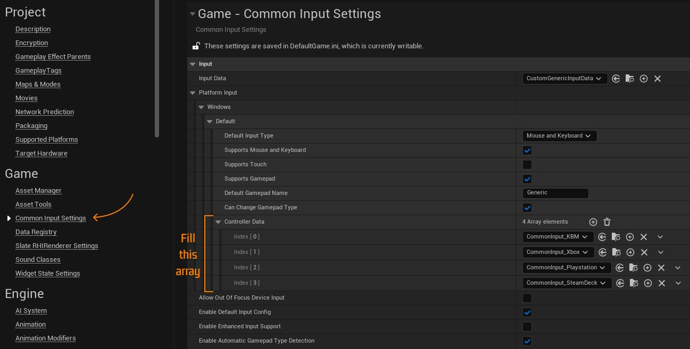
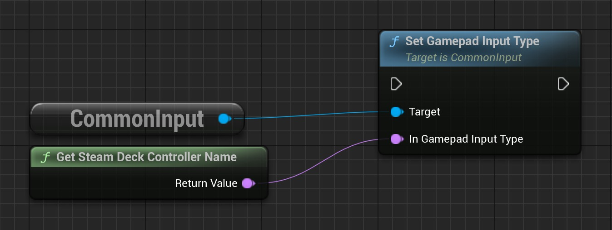

# 使用 Common UI 在运行时切换游戏手柄图标

## 来源与状态

- 原始 URL：https://dev.epicgames.com/community/learning/tutorials/aw8o/unreal-engine-switching-gamepad-icons-at-runtime-with-common-ui

## 运行时分类

- 类型：图文教程
- 判断：API 未识别到核心视频信号，可整理正文约 2564 字符。

## 摘要

在通用 UI 中的不同控制器之间切换游戏手柄图标的快速教程。这解决了虚幻引擎 5.4 中的 GamepadName 属性无法更改为“Generic”以外的问题。

## 中文整理

### 概览

这是使用通用 UI 在运行时动态切换不同游戏手柄图标（Xbox、Playstation、Steam Deck...）的快速指南。这解决了 Common UI 中将 GamepadName 中的可用选项限制为 Generic 的问题。我即将推出的游戏 **The Throng** 需要此功能，其中包括对多种控制器类型的完整控制器支持。本教程和更多内容可以在我的个人博客 [blog.lorwenpyramid.com](https://blog.lorwenpyramid.com) 中找到。

### 要求

1. 一个虚幻引擎 C++ 项目。 2. 启用通用 UI 插件。 3. 已设置一组可用的游戏手柄图标。

### 步骤

首先将“CommonInput”依赖项添加到 *.Build.cs 文件中的 PrivateDependencyModuleNames 数组中。

```cpp
PrivateDependencyModuleNames.AddRange(new string[]
{
    // ... the rest of our private dependencies (if any)
    "CommonInput",
});
```

创建一个继承自 UCommonInputBaseControllerData 的类，该类对应于您想要支持的每组游戏手柄图标。例如，我的 *Steam Deck* 类如下所示：

```cpp
#pragma once

#include "CoreMinimal.h"
#include "CommonInput/Public/CommonInputBaseTypes.h"
#include "SteamDeckControllerData.generated.h"

UCLASS()
class THE_THRONG_API USteamDeckControllerData : public UCommonInputBaseControllerData
{
	GENERATED_BODY()
```

请记住将 THE_THRONG_API 替换为您自己的 API 符号。为之前创建的每个 UCommonInputBaseControllerData 子类创建（或重新设置父级）一个 Blueprint 子类，并检查 Gamepad Name 是否不再是 Generic（即使下拉列表中只有 Generic 选项可用）。请记住还要使用您选择的图标填充 InputBrushDataMap 字段，并将 UCommonInputBaseControllerData 子类放置在“项目设置”的 CommonInputSettings 类别中。



可以使用 SetGamepadInputType 方法在运行时切换图标。



### 结论

现在任何游戏都可以轻松自动切换所选的游戏手柄图标。我希望你学到了新东西！ *由 Lorwen 制作* 🧡

### 如果您喜欢该指南

如果您能在 Steam 上快速浏览一下 [The Throng](https://store.steampowered.com/app/3424870?utm_source=epictutorials&utm_campaign=blog)，我将非常感激。

### 资源

- [CommonUI：在运行时切换 CommonInputBaseControllerData](https://dev.epicgames.com/community/learning/tutorials/KPOD/unreal-engine-commonui-switch-commoninputbasecontrollerdata-at-runtime)

## 相关链接

- [CommonUI: Switch CommonInputBaseControllerData at Runtime](https://dev.epicgames.com/community/learning/tutorials/KPOD/unreal-engine-commonui-switch-commoninputbasecontrollerdata-at-runtime)
