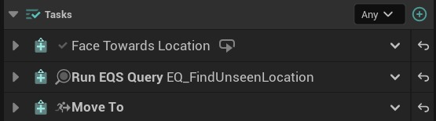
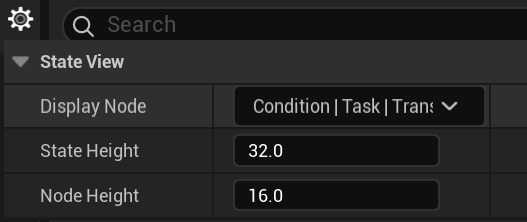
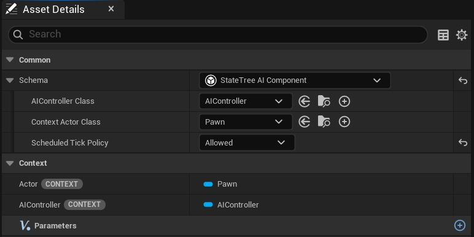
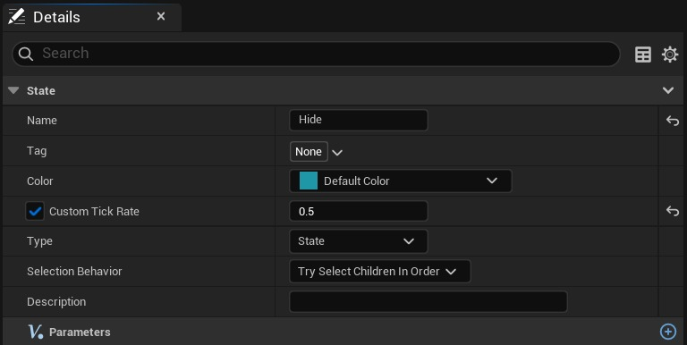
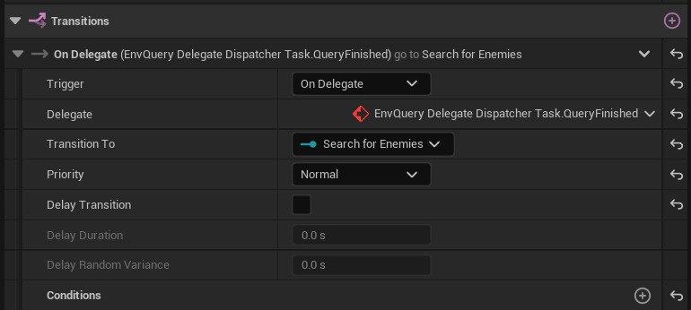
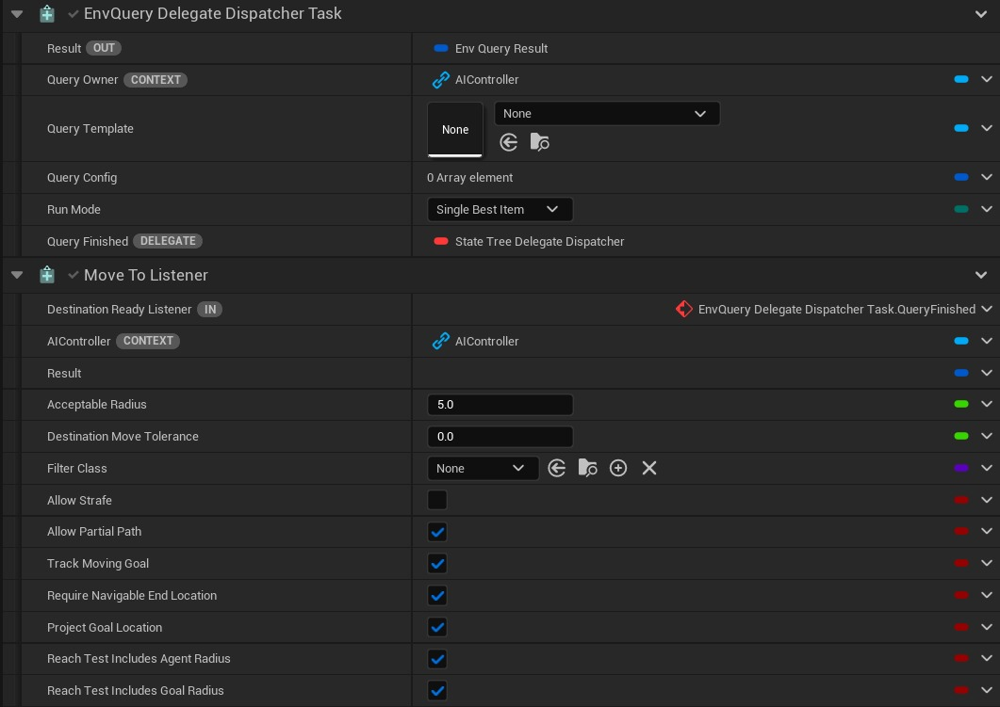

# 无滴答状态树更改

## 来源与状态

- 原始 URL：https://dev.epicgames.com/community/learning/tutorials/z3km/unreal-engine-tickless-statetree-changes

## 运行时分类

- 类型：图文教程
- 判断：API 未识别到核心视频信号，可整理正文约 6571 字符。

## 摘要

通过利用新的计划刻度策略来限制刻度数量或使用在 StateTree 中不刻度的异步任务来优化 StateTree 性能的提示和技巧。

## 中文整理

### 再见，蒂克！感谢所有的框架！

在 5.6 中，StateTree 任务现在可以使用计划的滴答策略，允许它们指定滴答的频率。任务也可以完全关闭其勾选。 StateTree UI 也经过了改进，通过在任务名称右侧添加图标，可以在树被勾选时快速辨别哪些任务正在工作。如果启用了“可以勾选”或“可以影响转换”标志，则该任务将具有 图标。在下面的示例中，**Face Towards Location** 是一个任务，其函数在每个刻度中运行，如任务名称右侧的循环图标所示，而 **Run EQS Query** 和 **Move To** 是不参与刻度的任务。

勾选图标可以在 UI 中打开/关闭。默认情况下会显示。但是，也可以通过单击“状态”选项卡右上角的齿轮图标（显示树层次结构）在“状态树”编辑器窗口中进行设置。控制图标可见性的 **Flag** 选项位于 **Display Node** 下拉列表中。

### 这听起来不错，现在我该如何打开它？

好消息是，基于组件的模式默认启用计划刻度策略。可以通过在项目中设置 CVar 来更改默认值，但引擎默认将其设置为 true。控制此行为的 CVar 是 StateTree.Component.DefaultScheduledTickAllowed。您可以更改 StateTree 资产的计划刻度策略，方法是打开资产并更改显示在 StateTree 编辑器窗口左上角的架构下的计划刻度策略下拉框的值。默认列出的策略已启用，但可以选择将其显式标记为**允许**。将计划刻度标记为允许将保留计划刻度行为，即使项目的计划刻度策略 CVar 发生更改也是如此。

Scheduled Tick 策略仅适用于 StateTree 组件架构，例如 StateTreeComponentSchema 和 StateTreeAIComponentSchema。其他架构（例如 GameplayInteractionSchema 或 MassStateTree）没有此选项。 Mass StateTree 已经在没有恒定滴答的情况下运行，因为它仅在从 MassSignals 接收信号时调用 Tick。启用计划刻度策略后，每个状态都可以设置其所需的刻度率。单击树层次结构中的状态。 “详细信息”面板中的 **State ** 标题下有一个新字段，标记为 **Custom Tick Rate**，默认情况下该字段将呈灰色显示。单击该框以启用该州的自定义滴答率，然后在字段中输入所需的滴答率（以秒为单位）。

### 这如何处理具有不同自定义报价率的多个状态？

仅仅因为一个状态启用并设置了其自定义滴答率并不意味着它总是且仅以该速率滴答。由于 StateTree 中可以有多个活动状态，因此滴答率设置为活动状态中的最小值。例如，StateTree 中有 3 个启用了自定义滴答率的活动状态：Root.Combat.MeleeCombat.WaitForTurn。战斗每 0.5 秒计时一次，MeleeCombat 每 0.25 秒计时一次，WaitForTurn 使用 1.0 秒。 StateTree 将勾选 ***所有 *** 状态任务，每 0.25 秒勾选一次，因为这是活动状态中最快的勾选时间。尽管某些状态的滴答率尚未完全过去，但启用了滴答的任务仍会被滴答。

### 不频繁的蜱虫很好，但任务怎么可能不蜱虫呢？

您可以通过将 bShouldCallTick 和 bShouldCallTickOnlyOnEvents 设置为 false 来禁用任务的 Tick。虽然这些属性不会暴露给 BP，但未实现 Tick 函数的 BP StateTreeTask 不会进行勾选。有几个示例说明如何在引擎提供的任务中完成此操作，例如 **运行 EQS 查询**、**移动到** 和 **调试文本任务**。这可以通过只需要在进入或退出任务时运行一些逻辑的任务来完成。

### StateTree 代表提供了另一种方法来限制在数据准备好之前完成的工作

除了调度标记的更改之外，StateTree 还添加了委托侦听器，任务和转换可以使用这些侦听器来响应特定绑定的委托调度程序。该转换直观地称为 **On Delegate**，并允许绑定要使用的委托调度程序，就像绑定 StateTree 中的任何其他属性一样。

这里使用的 EQS 和 Move To 任务是自定义任务，它们派生自引擎类并分别添加委托调度程序和侦听器。要重现本文中看到的内容，您需要创建任务的自定义版本。委托的另一种用途是向其他任务发出数据已准备就绪的信号。作为一个快速场景，也许 NPC 正在进行战斗，受到了一些伤害，并且想要在战斗期间找到一个地方来治疗/重新加载/隐藏。虽然立即拥有所有这些数据可能很棒，但事实是需要时间来计算，这可能会导致犹豫或 NPC 看起来会破坏沉浸感。现在，可以在继续运行战斗逻辑并将信息传递给另一个任务的同时找到该地点和路径。这允许 EQS 中的昂贵查询与多个昂贵的测试一起运行，并且只有在数据准备好后才开始相应的任务，例如移动到。因此，即使 NPC 离开视线，也可以继续运行战斗逻辑，以增加其行为的可信度。

### 异步任务的一些注意事项

如果要在 C++ 中向任务添加委托调度程序和侦听器，则应在节点模板结构上完成这些操作，而不是在任务的实例数据上完成。这是对内存的优化，以避免在运行时重新初始化。编译器计划在未来的版本中检测并向用户发出警告。要提到的第二个重要事项是，任何异步任务或使用委托回调的任务都应该***始终***使用 Wea​​kExecutionContext/StrongExecutionContext 来捕获捕获的 StateTree ExecutionContext。 **FStateTreeRunEnvQueryTask **有一个很好的示例，说明如何将 lambda 绑定到 EnvQuery 的 **OnQueryFinished **委托，以及如何绑定到调度程序，StateTreeTestSuite 中有一些示例，例如 **FTestTask_RebroadcastDelegate**。它与用于创建 StrongExecutionContext 的 WeakExecutionContext 绑定。然后，强执行上下文可用于访问实例数据或完成任务。
