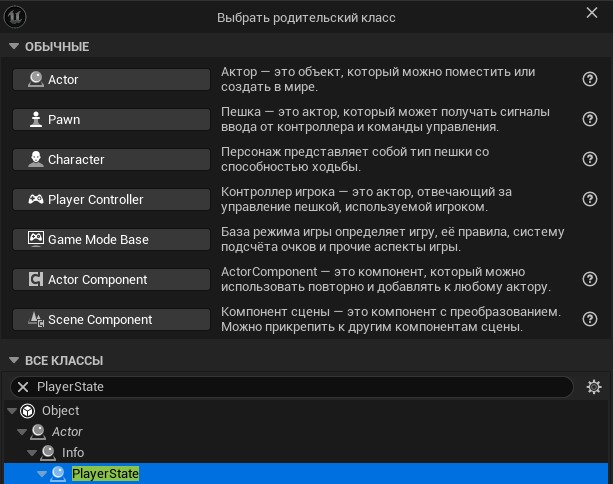
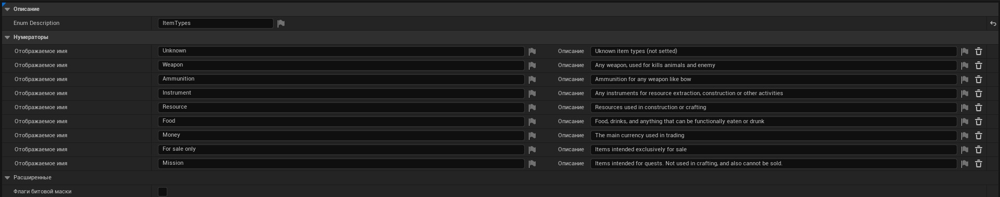
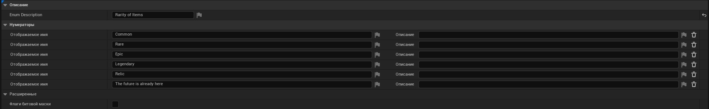
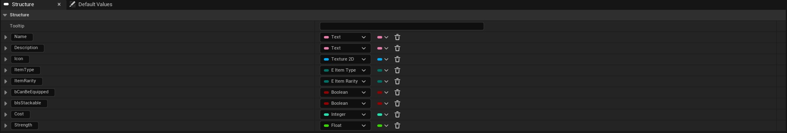
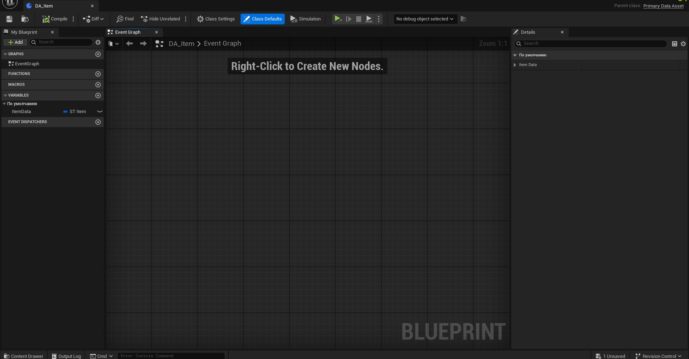
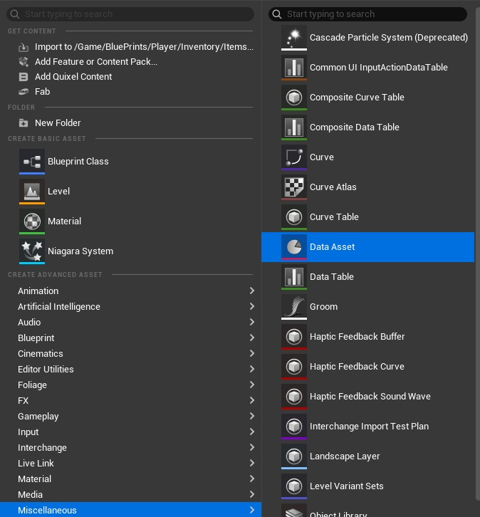
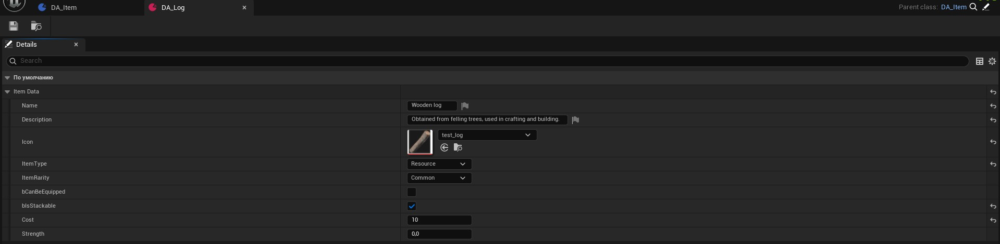
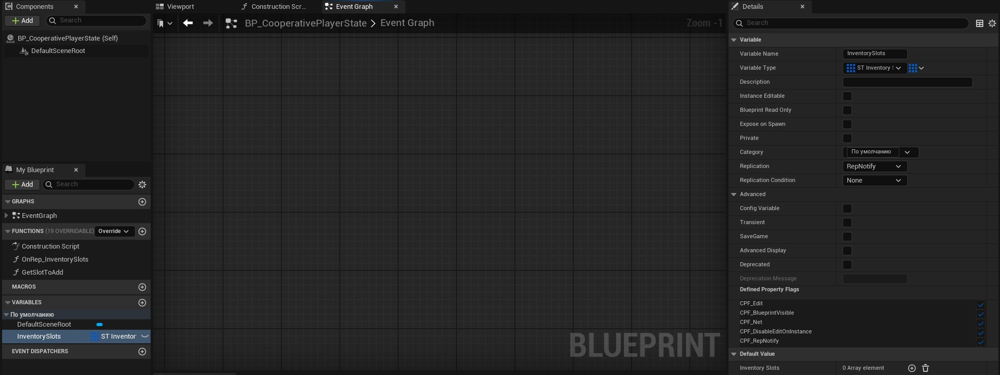
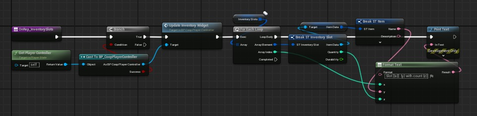
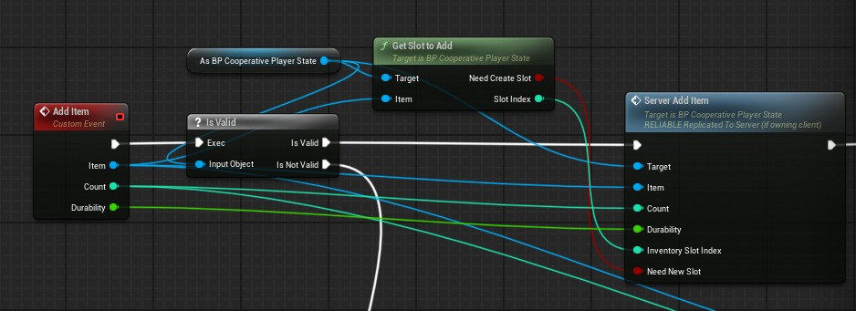

# [教程]如何使用蓝图制作简单的库存系统：系统、复制、UI

## 来源与状态

- 原始 URL：https://dev.epicgames.com/community/learning/tutorials/kyrP/unreal-engine-tutorial-how-to-make-simple-inventory-system-using-blueprints-systems-replication-ui

## 运行时分类

- 类型：图文教程
- 判断：API 未识别到核心视频信号，可整理正文约 9680 字符。

## 摘要

使用具有复制支持以及扩展空间的蓝图创建通用库存系统。

## 中文整理

### 概览

大家好，我是Two Sided Game Studio工作室的开发者之一，现在我们正在虚幻引擎5.5上开发一个生存类型的项目，其中库存是一个非常必要的机制。

### 介绍

我和你们中的许多人一样，是虚幻引擎工作的新手，必须在论坛或 YouTube 上寻找所有内容，但我设法找到的许多解决方案要么不适合我的任务，要么太复杂（我们正在谈论的复杂性不应该出现在这样一个相当简单的系统中，这只会给项目和游戏带来负担）。因此，您必须自己完善许多东西，或者完全按照您的需要从头开始创建所有东西。让我们言归正传吧。今天我们将逐步创建一个在用户界面中显示的库存系统，我还将添加一些有关复制和网络交互的内容，以便您可以使用该系统，包括用于合作或多人游戏。我想立即指出，该系统并不声称是视频游戏开发领域的奥斯卡奖，但该系统对于大多数项目和您的任务来说都是最佳的。首先，本教程是为可能没有足够经验或资金来购买现成系统的新开发人员或独立工作室而创建的。如果您是一位经验丰富的程序员，那么本教程很可能不适合您，并且此类系统最好用 C++ 创建，但该系统将在蓝图上完美运行，除非您正在制作具有大量玩家的多人游戏。

### 第一步

1. 我们将开发虚幻引擎的最新版本，即 5.5。我建议下载此版本以避免不准确以及可能的错误和/或差异。无论如何，如果您有早期版本，很可能一切都会好起来的。 2. 为您的游戏创建基类。我们需要以下类：PlayerController、PlayerState、GameState（用于多人或合作游戏）或 GameInstance（用于单人游戏）、Character。 *无论如何，我将更详细地介绍每个课程，因此应该不会有任何困难。我使用俄语版本的虚幻引擎，但为了便于理解，如果某些内容是用俄语编写的，我将单独评论所有操作。*

### 让我们开始创建

首先，让我们创建一个继承自 **Player State** 类的蓝图。我们将在其中存储我们的库存。

*我们将玩家的库存存储在玩家状态中，因为如果您的游戏支持角色死亡，则角色死亡后将重新创建玩家控制器。如果您希望玩家的物品在死亡后得以保存，这是存储库存的最佳方式。否则，死亡后，只需在玩家状态中创建一个自定义事件并清除带有物品的数组，但稍后会详细介绍。*接下来我们将**创建两个枚举**：一个用于物品类型，另一个用于稀有性（可选）。如果您的项目在某些其他属性上有所不同 - 您还可以为它们创建枚举。

如何创建枚举：*右键单击内容浏览器空白处的任意位置，选择“蓝图原理图”（可能称为不同的名称）并在那里找到枚举。*现在我们有几个项目属性列表。首先，让我们使用项目的属性为我们的项目创建一个**结构。您可以在创建枚举的同一菜单中创建结构。

我们将使用 DataAsset 创建对象本身。首先，让我们创建一个蓝图类，就像您创建 Player State 一样。在搜索中，输入主数据资产，为方便起见，将其命名为 DA_Item。让我们添加一个变量 Item，它将存储项目的结构。

现在我们可以为每个项目创建数据资产。

例如，我为我的日志项创建了名为 DA_LOG 的数据资产：

*顺便说一句，如果你实现了一个拾取系统（拾起物品并扔掉它们，即你已经有了物品对应的角色），你可以将它们添加到物品结构中。*所以现在我们可以创建我们的物品并分别为每个物品设置属性。现在我们可以继续实施库存本身。让我们为我们的槽创建一个新的**结构**，我将其命名为 ST_InventorySlot。它将包含我们物品的数据资产、其数量以及耐用性（就我而言，因为我有诸如具有耐用性的工具之类的物品）。我们的库存快准备好了。让我们将 InventorySlots 变量添加到玩家状态中。

您只需将数组单元添加到默认值即可设置默认槽数。如果您制作的是单人游戏，则不需要设置复制。如果您正在制作支持合作或多人游戏的游戏，请设置 RepNotify，以便当我们的数组更新时，数据会自动复制。 *需要注意的是，如果你正在制作合作游戏，但不要忘记正确的复制。更准确地说，不要忘记复制的变量应该从服务器更新，即在服务器事件（在服务器上运行）中更改。*在多人/合作游戏的情况下，复制 RepNotify 时，您会自动创建一个在服务器更改变量时调用的函数。在其中，我更新了播放器的 UI，并通过迭代所有项目的循环显示项目的调试（如果您不需要这个，则不必添加循环）。

如果您正在制作单人游戏，您可以立即调用更新玩家 UI 的函数或事件，而无需复制，因为您不需要它。但稍后我们将继续更新玩家的用户界面，当我们为库存创建小部件时，现在我们将重点关注添加项目的逻辑。在播放器控制器中，我创建了一个事件来添加项目。

为了方便起见，我创建了一个函数来检查是否有空闲插槽来添加给定项目。该函数返回是否需要创建新的槽位，如果不需要，则返回可以添加该项目的库存数组的索引。如果您的物品仅限于一个插槽中的物品数量，或者您的插槽数量有限，那么逻辑可能会略有不同。 *由于我立即创建支持合作的库存，因此在自定义事件之后，我在玩家状态下调用服务器事件。您可以执行相同的操作，或者在单人游戏的情况下，正如我之前所写，不要使用复制。添加项目的逻辑可以存储在其他地方，具体取决于您将项目添加到玩家库存的具体方式。*添加项目的逻辑已实现。现在我们可以继续显示项目。

### 库存界面

首先，让我们为我们的插槽创建一个小部件 - 这是使用界面的最重要的部分。在小部件本身中，我们通过绑定更新图标、数量显示和其他参数，但在此之前，直接在小部件中创建必要的变量。以使用此函数（绑定）更新项目图标为例，不要忘记检查项目的有效性，以防止可能的错误或错误。接下来，我们将为库存创建一个小部件。为了方便起见，我使用 WrapBox 元素，它将正确显示所有库存项目。根据您使用的内容，将您的包装盒或网格作为变量。还添加一个数组作为变量，其中包含所有插槽的小部件，以及库存本身的数组，以方便使用。接下来，我们将创建一个函数来更新我们的库存。每当我们的库存（其内容）发生变化时，我们都会调用此函数。在复制的情况下，我们调用 RepNotify 中的函数，我之前通过示例对此进行了描述。一切准备就绪。现在我们可以添加物品并立即看到它们显示在库存中。无论您扮演客户端（Play As Client）还是服务器（Play As Server）都没有关系。你可以自己进一步完善逻辑，这并不困难，因为系统本身虽然看起来很庞大，但非常简单。祝您创建良好的库存并在游戏中使用该系统好运。

### 问答

1. **此库存是否支持复制（即在多人游戏或合作游戏中使用）？** 是的，您可以以任何格式使用此系统。 2. **如何保存我的库存？** 如果您正在创建单人游戏，则只需将库存数组添加到 SaveGame 中即可。在合作游戏的情况下，您将所有库存保存在主机保存游戏中，在多人游戏的情况下 - 在服务器上。在这种情况下，我建议创建一个包含库存数组和用户 ID 的结构，而不是库存变量，例如，如果您使用 Steam 集成 - 他的 Steam ID 或适用于您的游戏的任何其他标识。 3. **为什么我们使用数据资产而不是数据表来创建库存？ **我们正在创建一个易于在开发过程中随时进行编辑的系统。在蓝图中，我们可以通过数据表向玩家提供一个项目，只需传递表行的名称，但记住每个项目行的名称很不方便。对于数据资产，您只需从列表中选择一个项目即可。我认为这要方便得多。 4. **如何使用该系统实现投掷或捡起物体？ **这完全取决于您的需求和要求。您必须自己创建并实施这样的系统。例如，如果您实现一个用于拾取物品的系统，只需调用本教程中实现的用于添加物品的事件即可。如果要完全删除某个项目，请删除阵列中的库存槽位（或清除它）。如果你想扔掉它，请实现 actor spawn（拾取）并删除该项目。您可以用同样的方式实现其他交互系统。
