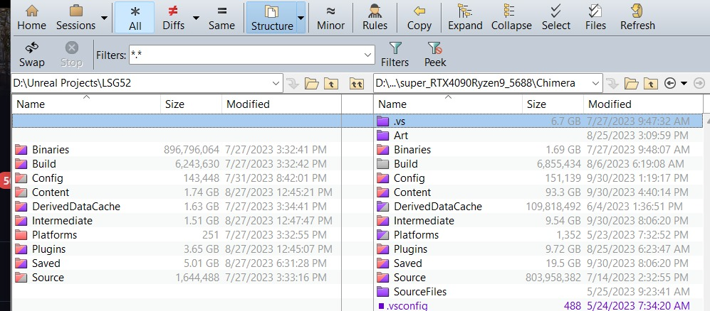
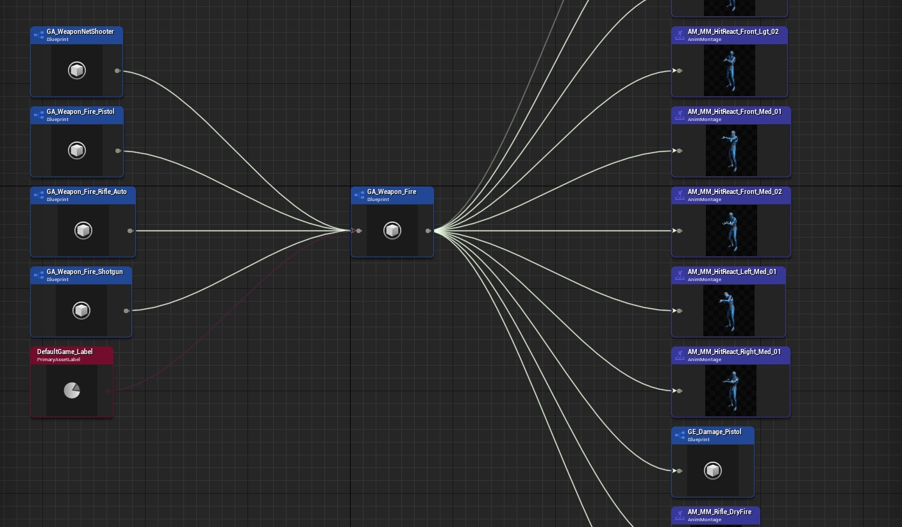

# 升级 Lyra 项目

## 来源与状态

- 原始 URL：https://dev.epicgames.com/community/learning/tutorials/dXzw/unreal-engine-upgrading-a-lyra-project

## 运行时分类

- 类型：图文教程
- 判断：API 未识别到核心视频信号，可整理正文约 9115 字符。

## 摘要

您是否正在考虑将 Lyra 项目升级到 5.3？您是否很高兴看到 5.3 中的所有新内容......但又担心升级项目的努力？如果你使用过Lyra，那么在升级它时你还需要一些额外的考虑。

## 中文整理

### 概览

你可能会问天琴座是什么？尽管您在阅读本文后可能已经知道，Lyra 是一个示例游戏，可以在启动器的“示例”选项卡上下载。其架构设计为模块化，包括核心系统和插件，随着UE5的发展定期更新。以 Lyra 为基础的游戏可以成为创建游戏的巨大起点。由于 Lyra 本身会在 Unreal 更新时更新，因此升级您的游戏需要与新引擎 * 和 * 新的 Lyra 更改集成。 Lyra 本身作为一个游戏项目进行分发。它不仅包含大量插件和游戏功能，而且还有自己的配置、内容和源目录，并且这些目录可能会在版本之间更新。这使得升级基于 Lyra 的游戏变得更加复杂，因为您必须将 Epics 更改与您自己的更改合并。有 2 种基本方法需要考虑： **1) 将 Epic 的 Lyra 5.3 更改应用到您的项目** **2) 将您的项目更改应用到新的 Lyra 5.3 项目** 两者都有优点和缺点。不管怎样，在升级时，使用像 [BeyondCompare](https://www.scootersoftware.com/) 这样的比较工具是非常有价值的。使用它，您可以确定两个目录之间的“增量”。例如，在您的项目和它所基于的库存 5.2 Lyra 项目之间。 BeyondCompare 将帮助您确定哪些目录中的哪些文件已更改。



我确信每个人都使用和了解的另一个关键工具是内置的 ReferenceViewer。如果您使用虚幻引擎，那么您很可能已经是它的专家了。但如果不会，请立即学习使用它。根本没有其他方法可以理解资产之间的依赖关系。 ReferenceViewer 在中心显示选定的资源。左边是直接依赖该资产的所有资产。右侧显示了该资产所依赖的所有资产。



还值得强调的是，如果您勤奋并且主要将游戏实现为一组游戏功能和插件，则可以使升级变得更加容易。这些都更容易升级。每当您在游戏 Content 目录中创建内容或在游戏 Source 目录中创建源代码时，您都在为未来的自己创建更多的升级工作。相反，尝试将您的工作封装在插件或游戏功能中。话虽如此，这样做说起来容易做起来难。在尝试升级之前，您不会学到这个教训。最终目标是让您的游戏在新版本的 Lyra 中运行。如果您的整个游戏主要在您创建的 GameFeature 和插件中实现，那么升级只需复制它们即可。将所有 Marketplace 内容视为“参考材料”，必须将其复制并复制到您自己的 GameFeature 或插件中才能使用。如果您必须将资源添加到游戏的内容目录中，请将所有内容放在一个“/Content/000Game”文件夹中，以便您可以轻松找到它。话虽这么说 - 我们大多数人都没有那么勤奋，并且不再修改内容和源目录中的一堆东西而不是插件。方法出于本文的目的，我选择使用方法 **#2:**** 将项目更改应用到新的 Lyra 5.3 项目** 我采用这种方式的原因是我可以立即运行一个新的 5.3 Lyra 项目，并将我自己的项目的各个部分迁移到其中。我也比 Epic 对 Lyra 所做的更改更了解我自己的项目更改，因此我更容易将更改带到 5.3 Lyra，反之亦然。我的项目是在库存 Lyra 5.2 项目中创建的。如果您使用旧版本开始项目，例如5.1，同样的方法应该有效，只需使用该版本作为您的库存基础差异。

### 步骤 0：安装 5.3 并创建新的空白 Lyra 项目

-首先安装5.3 Unreal。 （如果您更改了引擎，则从源代码安装；如果未更改，则从启动器安装。如果您更改了引擎，请立即应用并测试它们）。 - 创建一个新的 5.3 Lyra 项目。这将成为你的新游戏。 -还创建一个旧库存 5.2 Lyra 项目。 （如果你没有的话）。这用于创建增量差异。

### 第 1 步：安装升级的 Marketplace 资产和插件

将您想要的任何市场资产和第三方插件安装到新的 5.3 Lyra 项目中。请务必更新到最新的 5.3 兼容版本。关于市场资产的注意事项：在新引擎版本发布后，产品所有者经常推送更新和错误修复，以使他们的产品与新引擎兼容。接受他们的改变比自己尝试修复他们的产品要容易得多。大多数产品会在一周内更新。这是使用他们的产品的一个好处，如果不更新你就会失去它。关于市场资产的另一个注意事项：不要更改它们的位置，也不要直接在游戏中使用这些资产。将原始内容保留为内容文件夹，然后将您想要的任何内容复制并复制到您自己的插件中。目标是您只需要自己的插件。如果创建者在市场中更新了他们的内容，请更新它，然后复制到您的插件。 （极端的方法甚至可能不会将 Stock Marketplace 文件夹推送到源代码管理，以确保仅引用插件）重要提示：请确保您还记得启用任何可选的内置插件，例如 PCG、Substrate 等...许多插件默认情况下不会启用，特别是如果它们被标记为实验性的。

### 第 2 步：确定原始项目和创建它的 Lyra 项目之间的差异

确定您的原始项目和您启动项目时使用的原始基础 Lyra 版本之间的更改。使用 BeyondCompare，将您的整个项目与原始 Stock Lyra 项目（您创建此项目所用的版本）进行比较。我们将这些变化称为“Delta”。您可能会对分布在多个目录中的源代码、ini 文件和 uassets 进行更改。理想情况下，这些更改是独立包含在 GameFeatures 中的。但您可能还对 /Source 和 /Content 进行了更改。记录所有更改，以便您确保将它们复制到新项目中。 **关于代码更改** 强烈建议的做法是对您从 Lyra 源代码中修改、添加或删除的每一段库存代码进行注释。这是许多工作室用于引擎修改的标准做法，因此您可以轻松搜索所做的任何修改，并且差异/合并变得更加容易。它也适用于您对 Lyra 所做的任何更改。

**注释更改**

```cpp
// ProjectOverrides start: <optional_reason>
<code_changes>
// ProjectOverrides end
```

别担心——这个过程很乏味，但并非不可能。它主要包括识别您对配置、内容和源的更改并复制您的插件。

### 第 3 步：应用您的更改

现在将此增量应用到新的 5.3 中。正如您对步骤 2 中确定的 5.2 Lyra 版本进行更改一样，现在您需要将它们应用到 5.3 Lyra。将您的游戏想象为一个可以应用于任何 Lyra 项目的功能。确保获得源代码和内容更改。根据您的游戏，您可以分阶段执行此步骤 - 例如，让此核心功能或地图正常工作。您不必一次完成所有这些操作。将新项目的关键区域与 OG 项目进行比较以确定缺少什么通常也很有用。一些提示： **要完全忽略的目录：** - .vs - 二进制文件 - 构建 - DerivedDataCache - 中间 - 平台 - 已保存 **要调查和合并的目录** **配置 **- 合并您所做的任何 ini 更改。 5.3 中已经有您想要的新 ini 设置，并且可能还有您所做的旧自定义更改和设置。你两者都需要。例如，不要忘记跟踪通道。 **内容 **- 合并您添加的新内容。理想情况下，您可以保持 Marketplace 资产“纯净”，并且只需将新的 5.3 版本从启动器添加到您的新项目即可。您创建的任何新内容都希望位于 GameFeature 或插件中。如果没有，那就迁移过来。这可能很困难 - 考虑是否更改 GA_Weapon_Fire。如果你创造一个新武器而不是修改他们的武器，那就容易得多。一般来说，您希望将这些更改应用到新的 5.3 版本。 **插件 **- 这些通常是最简单的。理想情况下，市场中的所有插件都已从启动器添加。这样就留下了您为游戏创建的任何插件和游戏功能，您可以复制它们。理想情况下，这是游戏的大部分内容，并且可以轻松添加。 **源 **- 合并您对源目录所做的任何更改。理想情况下，您对 LyraGame 和 LyraEditor 进行了最少的更改。如果您对 Lyra 进行了一系列更改，希望您在可以轻松迁移的模块或命名空间中进行了更改。

### 第四步：完成！

你完成了！将其与您的仓库集成。升级后，我经常发现创建新的仓库或文件夹比处理 P4 中的集成更容易。例如，只需将其作为全新的软件仓库或现有软件仓库中的新文件夹进行加载（将多个项目存储在单个软件仓库中可能很有用）保留旧的 5.2 版本通常很有用，以防您需要错过一些东西。就是这样！
