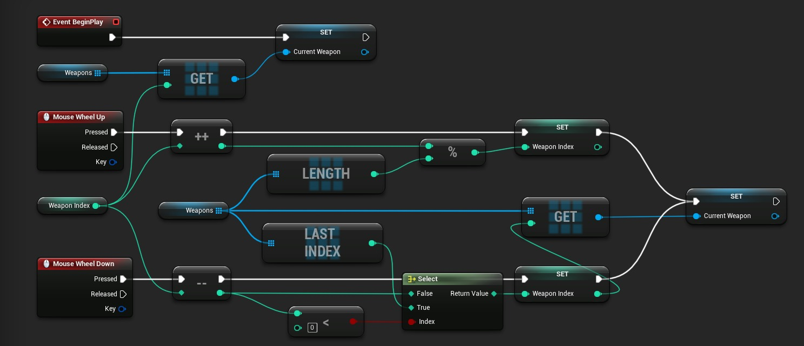
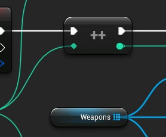

# 武器循环

## 来源与状态

- 原始 URL：https://dev.epicgames.com/community/learning/tutorials/qZ7/unreal-engine-weapon-cycling

## 运行时分类

- 类型：图文教程
- 判断：API 未识别到核心视频信号，可整理正文约 384 字符。

## 摘要

允许使用鼠标滚轮来循环武器。

## 中文整理

### 概览



**武器循环脚本**

```
Begin Object Class=/Script/BlueprintGraph.K2Node_InputKey Name="K2Node_InputKey_1"
   InputKey=MouseScrollDown
   NodePosX=640
   NodePosY=304
   NodeGuid=6AAFE1E34AB592C30659B3B81F08A0F2
   CustomProperties Pin (PinId=8FDDACE543AC161BB53D69AC33FC18A4,PinName="Pressed",Direction="EGPD_Output",PinType.PinCategory="exec",PinType.PinSubCategory="",PinType.PinSubCategoryObject=None,PinType.PinSubCategoryMemberReference=(),PinType.PinValueType=(),PinType.ContainerType=None,PinType.bIsReference=False,PinType.bIsConst=False,PinType.bIsWeakPointer=False,PinType.bIsUObjectWrapper=False,LinkedTo=(K2Node_MacroInstance_3 05A632324D6030EF1A69EB80B4FFC09C,),PersistentGuid=00000000000000000000000000000000,bHidden=False,bNotConnectable=False,bDefaultValueIsReadOnly=False,bDefaultValueIsIgnored=False,bAdvancedView=False,bOrphanedPin=False,)
   CustomProperties Pin (PinId=102AC37744836935035566BA912BBED7,PinName="Released",Direction="EGPD_Output",PinType.PinCategory="exec",PinType.PinSubCategory="",PinType.PinSubCategoryObject=None,PinType.PinSubCategoryMemberReference=(),PinType.PinValueType=(),PinType.ContainerType=None,PinType.bIsReference=False,PinType.bIsConst=False,PinType.bIsWeakPointer=False,PinType.bIsUObjectWrapper=False,PersistentGuid=00000000000000000000000000000000,bHidden=False,bNotConnectable=False,bDefaultValueIsReadOnly=False,bDefaultValueIsIgnored=False,bAdvancedView=False,bOrphanedPin=False,)
   CustomProperties Pin (PinId=651C3FC44E1A478331779583A7951D50,PinName="Key",Direction="EGPD_Output",PinType.PinCategory="struct",PinType.PinSubCategory="",PinType.PinSubCategoryObject=ScriptStruct'"/Script/InputCore.Key"',PinType.PinSubCategoryMemberReference=(),PinType.PinValueType=(),PinType.ContainerType=None,PinType.bIsReference=False,PinType.bIsConst=False,PinType.bIsWeakPointer=False,PinType.bIsUObjectWrapper=False,DefaultValue="None",AutogeneratedDefaultValue="None",PersistentGuid=00000000000000000000000000000000,bHidden=False,bNotConnectable=False,bDefaultValueIsReadOnly=False,bDefaultValueIsIgnored=False,bAdvancedView=False,bOrphanedPin=False,)
End Object
Begin Object Class=/Script/BlueprintGraph.K2Node_InputKey Name="K2Node_InputKey_3"
```

- 将武器保留在数组中 - 向上/向下滚动时增加/减少索引 - 确保索引包含在数组边界中 - 从武器数组中获取所需元素并存储其引用



- [与测试无关的东西](https://drive.google.com/file/d/1RzyOnFLwG7u9xddnxm-OBSoeAZhWNjW6/view?usp=sharing)

**一些材料**

```
Begin Object Class=/Script/UnrealEd.MaterialGraphNode_Root Name="MaterialGraphNode_Root_0"
   Material=PreviewMaterial'"/Engine/Transient.NewMaterial"'
   NodeGuid=5B56E8474418DA6DC0203AA607D3B42A
   CustomProperties Pin (PinId=DFC909BA4B2FC78B72077FBF405C0387,PinName="Base Color",PinType.PinCategory="materialinput",PinType.PinSubCategory="5",PinType.PinSubCategoryObject=None,PinType.PinSubCategoryMemberReference=(),PinType.PinValueType=(),PinType.ContainerType=None,PinType.bIsReference=False,PinType.bIsConst=False,PinType.bIsWeakPointer=False,PinType.bIsUObjectWrapper=False,LinkedTo=(MaterialGraphNode_0 A27A089F4E7EC07FB9ED21B0AF7A6652,),PersistentGuid=00000000000000000000000000000000,bHidden=False,bNotConnectable=False,bDefaultValueIsReadOnly=False,bDefaultValueIsIgnored=False,bAdvancedView=False,bOrphanedPin=False,)
   CustomProperties Pin (PinId=0BC5CCB448A27BE522260D96F756CF86,PinName="Metallic",PinType.PinCategory="materialinput",PinType.PinSubCategory="6",PinType.PinSubCategoryObject=None,PinType.PinSubCategoryMemberReference=(),PinType.PinValueType=(),PinType.ContainerType=None,PinType.bIsReference=False,PinType.bIsConst=False,PinType.bIsWeakPointer=False,PinType.bIsUObjectWrapper=False,LinkedTo=(MaterialGraphNode_1 C73C3C124337AD28AB5A978BD2CA4E5D,),PersistentGuid=00000000000000000000000000000000,bHidden=False,bNotConnectable=False,bDefaultValueIsReadOnly=False,bDefaultValueIsIgnored=False,bAdvancedView=False,bOrphanedPin=False,)
   CustomProperties Pin (PinId=59C8AC1E42CD370AA722F9BAFD2E9CFF,PinName="Specular",PinType.PinCategory="materialinput",PinType.PinSubCategory="7",PinType.PinSubCategoryObject=None,PinType.PinSubCategoryMemberReference=(),PinType.PinValueType=(),PinType.ContainerType=None,PinType.bIsReference=False,PinType.bIsConst=False,PinType.bIsWeakPointer=False,PinType.bIsUObjectWrapper=False,PersistentGuid=00000000000000000000000000000000,bHidden=False,bNotConnectable=False,bDefaultValueIsReadOnly=False,bDefaultValueIsIgnored=False,bAdvancedView=False,bOrphanedPin=False,)
   CustomProperties Pin (PinId=10B0E944464DDD07CCA7D0B19DD201E2,PinName="Roughness",PinType.PinCategory="materialinput",PinType.PinSubCategory="8",PinType.PinSubCategoryObject=None,PinType.PinSubCategoryMemberReference=(),PinType.PinValueType=(),PinType.ContainerType=None,PinType.bIsReference=False,PinType.bIsConst=False,PinType.bIsWeakPointer=False,PinType.bIsUObjectWrapper=False,PersistentGuid=00000000000000000000000000000000,bHidden=False,bNotConnectable=False,bDefaultValueIsReadOnly=False,bDefaultValueIsIgnored=False,bAdvancedView=False,bOrphanedPin=False,)
   CustomProperties Pin (PinId=1C95F90F4826DA89A78E0CBE7AD795B5,PinName="Anisotropy",PinType.PinCategory="materialinput",PinType.PinSubCategory="9",PinType.PinSubCategoryObject=None,PinType.PinSubCategoryMemberReference=(),PinType.PinValueType=(),PinType.ContainerType=None,PinType.bIsReference=False,PinType.bIsConst=False,PinType.bIsWeakPointer=False,PinType.bIsUObjectWrapper=False,PersistentGuid=00000000000000000000000000000000,bHidden=False,bNotConnectable=False,bDefaultValueIsReadOnly=False,bDefaultValueIsIgnored=False,bAdvancedView=False,bOrphanedPin=False,)
   CustomProperties Pin (PinId=E9F3C41D4181019CC9DFE2BBBE3976CD,PinName="Emissive Color",PinType.PinCategory="materialinput",PinType.PinSubCategory="0",PinType.PinSubCategoryObject=None,PinType.PinSubCategoryMemberReference=(),PinType.PinValueType=(),PinType.ContainerType=None,PinType.bIsReference=False,PinType.bIsConst=False,PinType.bIsWeakPointer=False,PinType.bIsUObjectWrapper=False,PersistentGuid=00000000000000000000000000000000,bHidden=False,bNotConnectable=False,bDefaultValueIsReadOnly=False,bDefaultValueIsIgnored=False,bAdvancedView=False,bOrphanedPin=False,)
   CustomProperties Pin (PinId=C7502C4A4318141ECC4E72B9329F1EAC,PinName="Opacity",PinType.PinCategory="materialinput",PinType.PinSubCategory="1",PinType.PinSubCategoryObject=None,PinType.PinSubCategoryMemberReference=(),PinType.PinValueType=(),PinType.ContainerType=None,PinType.bIsReference=False,PinType.bIsConst=False,PinType.bIsWeakPointer=False,PinType.bIsUObjectWrapper=False,PersistentGuid=00000000000000000000000000000000,bHidden=False,bNotConnectable=False,bDefaultValueIsReadOnly=False,bDefaultValueIsIgnored=False,bAdvancedView=False,bOrphanedPin=False,)
```

## 相关链接

- [Something unrelated to test it out](https://drive.google.com/file/d/1RzyOnFLwG7u9xddnxm-OBSoeAZhWNjW6/view?usp=sharing)
