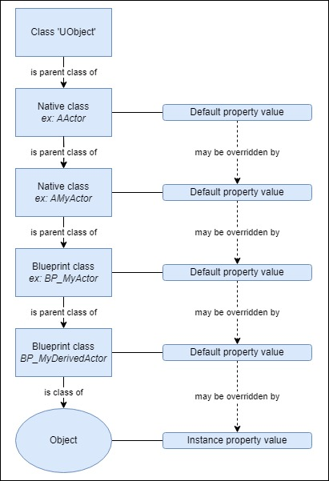
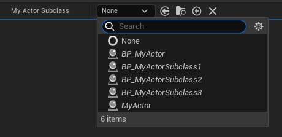
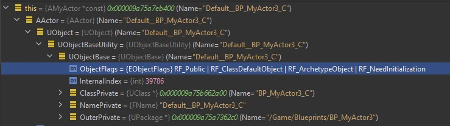

# 指南：调查虚幻引擎中的蓝图数据丢失问题

## 来源与状态

- 原始 URL：https://dev.epicgames.com/community/learning/knowledge-base/oEn6/guide-investigating-blueprint-data-loss-issues-in-unreal-engine

## 运行时分类

- 类型：图文教程
- 判断：API 未识别到核心视频信号，可整理正文约 60911 字符。

## 摘要

蓝图数据丢失问题的调查可能令人畏惧且耗时。本教程旨在作为默认值和实例值序列化的入门知识，以及调查虚幻引擎项目中的数据丢失问题的参考，特别是当蓝图资源或地图 act​​or 加载时的值与保存时的值不同时，或者在使用虚幻编辑器时意外重置值时。仅讨论非崩溃。

## 中文整理

### 一、简介

蓝图数据丢失问题的调查可能令人畏惧且耗时。本教程旨在作为默认值和实例值序列化的入门知识，并作为调查虚幻引擎项目中的数据丢失问题的参考，特别是当蓝图资源或地图 act​​or 加载时的值与保存时的值不同时，或者在使用虚幻编辑器时意外重置值时。仅讨论非崩溃。并非所有显示数据丢失问题的资产都可以恢复。如果保存资产时发生数据丢失（例如文件中的数据丢失），则在没有源代码控制的情况下将无法从资产中恢复数据。然而，在所有情况下，确定在保存、加载、蓝图编译或对象重新实例期间是否出现问题将有助于决定适当的操作，无论是修复、解决方法还是[报告引擎错误](https://www.unrealengine.com/en-US/support/report-a-bug)。本教程面向已经在虚幻引擎中具有 C++ 经验的程序员。本教程中的一些建议假设您可以[修改并重新编译引擎代码](https://docs.unrealengine.com/5.2/en-US/building-unreal-engine-from-source/)。仅讨论蓝图类和蓝图对象重新实例，因此不讨论 Verse 类，也不讨论使用实时编码进行更改后本机类的重新实例。对象重新实例化是指修改类后重新创建内存中的对象，例如重新编译蓝图类后重建蓝图对象。序列化是一个复杂的主题，因为存在多种类型的属性、可以组织类和属性的多种方式（容器、结构、各种类型的子对象、子对象层次结构）以及相关代码在整个引擎代码库中的分布方式。本教程将主要关注通过在虚幻编辑器会话中跟踪参与者的非嵌套整数属性来探索与属性序列化相关的代码。如果某些值未按预期加载或保存，您将能够通过在关键时刻使用调试器检查对象状态的过程来缩小在哪段代码中引入错误值的范围。本教程中的大部分讨论都适用于子对象，但还有其他问题将在以后的教程中讨论。在引擎代码中明确处理的子对象包括：（1）默认子对象，例如本机组件，（2）蓝图组件和（3）实例化子对象。阅读本教程后，您将了解： - 蓝图类的默认值在运行时 (CDO) 中位于内存中的位置 - 如何从磁盘加载资产修改后的默认值 - 引擎如何实现从父类到子类的默认值继承 - 如何加载和应用对对象实例（例如：地图放置的 actor）的修改 - 在蓝图重新编译期间如何重建类默认对象 (CDO) - 蓝图重新编译如何将继承的值从父类重新传播到子类 - 如何以及为何重建（重新实例化）蓝图重新编译实例后 - 保存资源时，引擎如何检测哪些属性已修改值 您可以调查数据丢失问题，然后对数据丢失问题进行分类，例如： - 保存蓝图类或实例时，重新启动编辑器并加载不同的值，您可以确定错误值何时首次出现：在加载、类编译或对象重新实例化期间。对于可重复的问题，您可以验证是否保存了正确的值。 - 当子蓝图无法正确从其父类继承默认值时，您可以确定正确的值是否曾经复制到该子蓝图但被错误覆盖，或者根本没有复制。实例和继承类默认值也是如此。

### 1.1 值继承概述

类有属性，属性有默认值。类的属性默认值可以由 C++ 或蓝图中的子类覆盖。类实例上的属性值也可以更改，例如放置在关卡中的 Actor 实例、蓝图类中的 Actor 组件以及实例化对象属性。图 1 说明了属性值的来源。虽然图 1 显示了意图，但此行为的实现发生在整个引擎代码库的多个位置。相同的行为（例如子类从父类继承值）会发生在引擎代码中的多个位置，因为在不同的上下文中操作值并需要重新处理。其中一些上下文包括：从资源加载值时、直接在蓝图或父蓝图上修改值时。本教程提供了这些步骤在引擎代码中发生的位置的高级解释，并提供了调用堆栈，以便您可以通过调试来验证值是否按预期加载、复制和保存。



### 1.2 如何使用本教程

第 2 部分总结了与默认值和实例值序列化相关的虚幻引擎概念。如果您当前面临数据丢失问题，第 3 节提供了一个流程图，作为如何确定引擎代码中首次出现问题的位置的建议。第 4 节演示了在执行期间检查属性值的一些方法，包括蓝图和子对象变量。最后，第 5 节描述了行为并提供了引擎代码中用于保存、加载、类编译和对象重新实例化目的的值操作位置的调用堆栈。

### 1.3 使用公共问题跟踪器

遇到问题时，我建议搜索[公共问题跟踪器](https://issues.unrealengine.com/) 以检查该问题是否已知。如果不是，请考虑提交错误报告。请注意，问题可能已经存在很长时间但尚未解决，例如请参阅 [UE-96195](https://issues.unrealengine.com/issue/UE-96195)。如果您遇到长期已知的问题，请在公共问题跟踪器上投票。

### 2.相关虚幻知识

### 2.1 术语表

本教程中使用的行话和虚幻术语的快速概述。 - **本机类** – 在 C++ 中定义的类。在本教程中，类指的是 UObject 的任何子类。 - **蓝图类** – 由蓝图资源定义的类。始终具有 UObject 类型的本机祖先类。 - **父类** – 也称为：基类、超类。在本教程中，我将使用父类，因为这在谈论蓝图时很常见。 - **祖先类** – 父类，或父类的父类等。 - **子类** – 也称为：派生类、子类。在本教程中，我将使用子类，因为这在谈论蓝图时很常见。 - **原生属性** – 也称为：成员变量。在 C++ 中声明的类属性。在本教程中，它指的是使用 UPROPERTY() 宏声明的属性。 - **蓝图属性** – 在变量下的蓝图中添加的类属性。 - **序列化**——将对象转换为二进制数据（字节序列）或将二进制数据转换为对象。 - **反序列化**——具体是将二进制数据转换为对象的方向。 - **重新实例化 ** – UClass 重新编译后，将内存中基于旧类布局的现有 UObject 实例替换为基于新类布局的新实例。不适用于已卸载的资源，因为它们尚未存储在内存中。 - **UClass ** - 包含有关从 UObject 继承的本机类和蓝图类的运行时类型信息的引擎类型。 - **类默认对象 (CDO)** – 与 UClass 关联的特殊 UObject 实例，用于存储该类的默认值。 - **原型、模板** – 在构造对象的上下文中：对象在应用自己的修改之前继承其默认值的类的 CDO。对于子类，原型或模板是父类的 CDO。例如，它是同类产品中的 CDO。 - **事务对象** - 与事务关联的 UObject 的特殊实例，例如用于编辑器撤消/重做功能。这些对象可以在调试期间通过 RF Transactional ObjectFlag 进行识别。讨论事务对象超出了本教程的范围。 - **骨架 (SKEL) 蓝图** – 表示蓝图的轻量级 UClass，仅存储函数签名和属性信息，而不存储值或函数体。 - **重新安装 (REINST) 类** – 在蓝图编译期间，是指在 UClass 更新以存储最新类信息时保留旧类信息的 UClass 副本。重复项具有 REINST 前缀。 - **CPFUO **- 函数 UEngine::CopyPropertiesForUnlatedObjects() 的简写，该函数将源对象的修改属性增量序列化到目标对象中。用于多种目的，例如值继承以及将修改后的值从旧的 CDO 和实例迁移到新的 CDO 和实例。

### 2.2 类默认对象

虚幻引擎将属性的默认值存储在 UClass 的类默认对象 (CDO) 上。可以通过调用 GetDefaultObject<T>() 来访问 CDO，其中 T 是您想要捕获对象的本机类型。对于本机类，调用类的 StaticClass() 函数提供了可以在其上调用 GetDefaultObject<T>() 的 UClass：

```cpp
const UClass* MyClass = AMyActor::StaticClass();
const AMyActor* MyActorCDO = MyClass→GetDefaultObject<AMyActor>();
```

对于蓝图类，可以通过将蓝图类分配给可编辑的 TSubclassOf<T> 来检索 CDO，其中 T 是任何本机父类，并通过编辑器 UI 为其分配蓝图类：

```cpp
// Class can be assigned via editor
UPROPERTY(EditAnywhere)
TSubclassOf<AMyActor> MyActorSubclass;
```

如图 2 所示。然后可以检索指定类的 CDO 以访问其默认值

```cpp
const AMyActor* MyActorCDO = MyActorSubclass→GetDefaultObject<AMyActor>();
```



每个蓝图类都有自己的 CDO。在蓝图类上调用 GetDefaultObject<T>() 可以获得一个对象，该对象存储您在蓝图中输入的默认值以及从父（本机）类继承的值。对于蓝图类，CDO 的代码类型是在蓝图的继承层次结构中向上移动时遇到的第一个本机类。例如，在层次结构 AActor (c++) → AMyActor (c++) → BP_MyActor → BP_MyDerivedActor 中，BP_MyActor 和 BP_MyDerivedActor 的 CDO 是本机类型 AMyActor。调试时，您可以通过其默认前缀或通过检查其 RF ClassDefaultObject 的 ObjectFlags 来识别 CDO UObject。如图 3 所示。



本机 Actor 类的 CDO 在启动时构建一次。蓝图类的 CDO 在加载蓝图时首先构造，并在修改和重新编译蓝图时重新创建。有关此内容的更多信息，请参见第 2.6 节。蓝图并未在编辑器启动时全部加载。相反，这种情况会按需发生，并且通常由以下情况触发： - 直接打开蓝图资源时 - 打开引用蓝图的关卡时，例如，它放置了 actor 蓝图的实例 - 加载依赖于蓝图的任何对象或系统时 要查明特定蓝图何时首次加载到编辑器中，您可以执行以下操作： - 在其本机类的构造函数中放置断点 - 在编辑器中编译并启动项目 - 当本机 CDO 遇到断点时，通过继续执行来忽略它。继续，直到遇到蓝图 CDO 的断点，可以通过其对象名称（例如“Default BP MyBlueprint C”）进行识别。 - 或者，在构造函数中创建一个断点，仅在 GetName().Contains("Default__BP_MyBlueprint_C") 时触发。 - 检查调用堆栈以查看构建 CDO 的原因。检查 LoadPackageInternal() 调用中的包名称可提供引用链。
