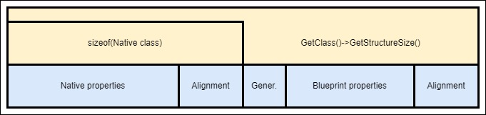
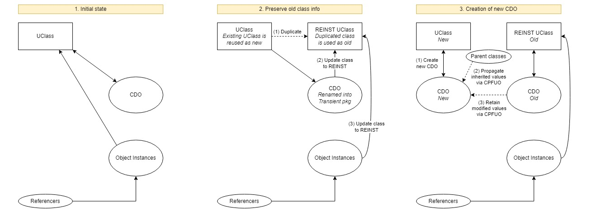
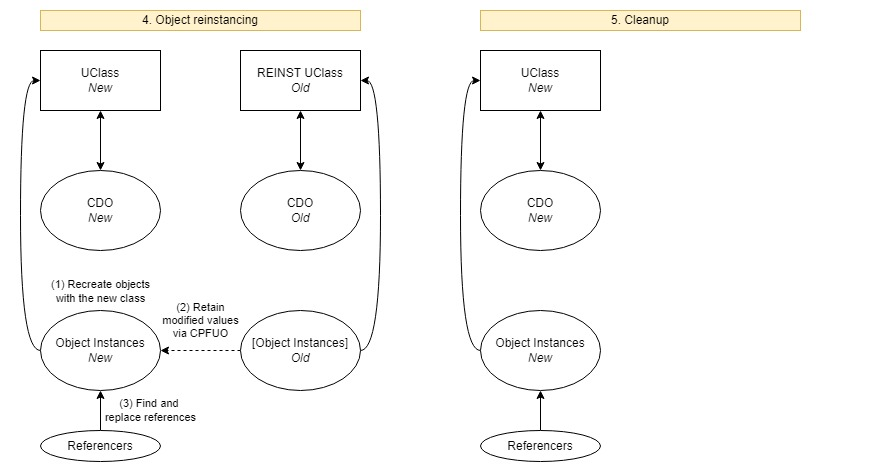
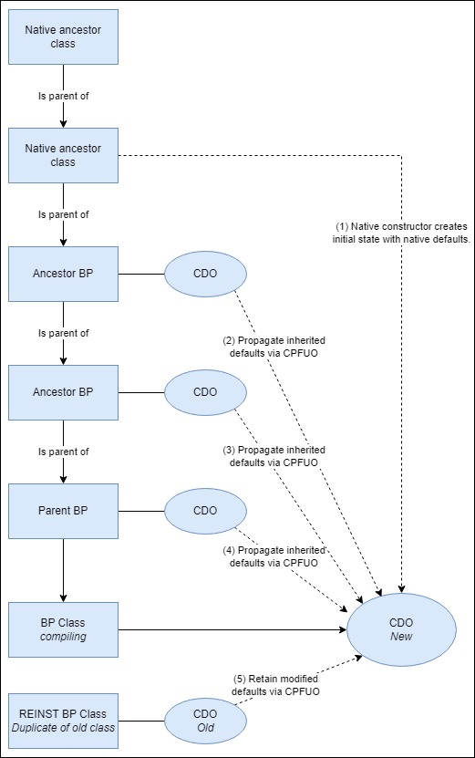
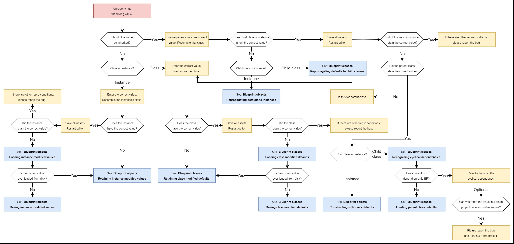

# 指南：调查虚幻引擎中的蓝图数据丢失问题

### 2.3 内存布局

UObject 在内存中的布局首先由本机声明的属性的值组成。它被填充，以便本机 Actor 类的大小是 8 字节的倍数：这是低级性能优化（对齐）。内存的下一部分保存生成的属性、蓝图成员变量的值以及用于对齐的填充。生成属性的示例包括当 Actor 蓝图未指定根组件时自动创建的 DefaultSceneRoot 以及当蓝图具有 ubergraph 时的 ubergraph 帧指针。蓝图类的总大小可以通过 UClass::GetStructureSize() 检索。引擎使用此大小为蓝图类的实例分配正确的内存量。



### 2.4 属性反映

反射是指具有运行时类型信息 (RTTI) 的编程语言功能，该功能使代码能够处理代码。虚幻引擎实现了虚幻引擎类的反射：用 UCLASS()、USTRUCT()、UENUM() 宏修饰的本机类、结构和枚举以及所有蓝图类、结构和枚举。这使得引擎代码和游戏代码能够在编辑器和游戏运行时循环遍历属性和函数。在虚幻引擎中，使用 UPROPERTY() 宏在代码中声明的属性和添加到蓝图类的成员变量都可以作为 UClass 的 FProperties 进行迭代。更多信息请参阅 Michael Noland 关于 [虚幻财产系统 (Reflection)](https://www.unrealengine.com/en-US/blog/unreal-property-system-reflection) 的博文。 UClass 的 FProperties 可以使用 TFieldIterator 进行迭代：

```cpp
void AMyActor::BeginPlay()
{
  Super::BeginPlay();
  const FString ClassName = GetClass()->GetName();
  for (TFieldIterator PropertyIt(GetClass()); PropertyIt; ++PropertyIt)
  {
    const FProperty* Prop = *PropertyIt;
    const FString PropClass = Prop->GetClass()->GetName();
    const FString PropName = Prop->GetName();
    UE_LOG(LogTemp, Error, TEXT("%s [%s] ’%s’"), *ClassName, *PropClass, *PropName);
```

上面的代码发现了本机属性和蓝图属性，包括：

```cpp
LogTemp: Display: BP_MyActor3_C [BoolProperty] ’bHidden’ <- engine native variable
LogTemp: Display: BP_MyActor3_C [IntProperty] ’MyActorNativeVariable’ <- game code native variable
LogTemp: Display: BP_MyActor3_C [BoolProperty] ’MyBlueprintVariable’ <- blueprint variable
```

在引擎代码中的多个位置，您还将通过 *GetClass()→PropertyLink* 和 *PropertyLinkNext* 以链表形式看到属性迭代。这是一种过时的迭代属性样式，但此链接列表对于其他目的很有用，例如在调试器中快速检查属性。有关此内容的更多信息，请参见第 4.3 节。除了迭代类的属性之外，您还可以按名称查找属性：

```cpp
FProperty* Prop = GetClass()->FindPropertyByName("MyBlueprintVariable");
```

属性具有 FBoolProperty、FIntProperty、FStrProperty 等运行时类型，具体取决于处理序列化、比较、字符串表示等的属性类型。请注意，从 UE5 开始，蓝图中的浮点变量为双精度 (FDoubleProperty) 以支持大世界坐标，而代码中的浮点变量仍为单精度 (FFloatProperty)。 ...

### 2.5 Delta序列化

```cpp
!Property->Identical(DataPtr, DefaultValue, UnderlyingArchive.GetPortFlags())
```

### 2.6 蓝图重新编译和重新实例化







### 3. 如何调查数据丢失问题



### 4. 一般断点提示

### 4.1 引擎关键功能

### CopyPropertiesForUnrelatedObjects()

### 连载（）

### 序列化版本标记属性()

```cpp
void UStruct::SerializeVersionedTaggedProperties(FStructuredArchive::FSlot Slot, uint8* Data, UStruct* DefaultsStruct, uint8* Defaults, const UObject* BreakRecursionIfFullyLoad) const
{
  if (UnderlyingArchive.IsLoading())
  {
    ... Property iteration for loading, i.e. deserialization (bytes -> object)
  }
  else
  {
    ... Property iteration for saving, i.e. serialization (object -> bytes)
  }
```

```cpp
if (Property->GetPathName().Contains("MyBlueprintValue"))
{
  // Breakpoint here
  UE_LOG(LogTemp, Warning, TEXT("[SerializeVersionedTaggedProperties][Save] About to write out ’%s’"), *Property->GetName());
}
```

### 构造后初始化()

### 4.2 通过反射检查蓝图值

### 直接属性

```cpp
AActor* SomeActor = ...;
if (FProperty* Prop = SomeActor->GetClass()->FindPropertyByName("MyBlueprintVariable1"))
{
  // Example: (unsafe) interpreting the property’s value address, only safe when knowing its type beforehand
  const int32* ValuePtr = Prop->ContainerPtrToValuePtr(SomeActor, 0);
  const int32 Value = *ValuePtr;
  UE_LOG(LogTemp, Display, TEXT("Value of MyBlueprintVariable1: %d"), Value);
}
```

```cpp
AActor* SomeActor = ...;
if (FProperty* Prop = SomeActor->GetClass()->FindPropertyByName("MyBlueprintVariable1"))
{
  if (const FIntProperty* IntProp = CastField(Prop))
  {
    // Example: (safe) Retrieving typed value from container address.
    const int32 Value = IntProp->GetSignedIntPropertyValue_InContainer(SomeActor);
    UE_LOG(LogTemp, Display, TEXT("Value of MyBlueprintVariable1: %d"), Value);

    // Example: (safe) Retrieving typed value from property address == container address + offset.
```

### 数组和结构体

```cpp
const UObject* MyObject = SomeActor;
const UClass* MyClass = SomeActor->GetClass();
for (TPropertyValueIterator<FIntProperty> It(MyClass, MyObject, EPropertyValueIteratorFlags::FullRecursion, EFieldIteratorFlags::ExcludeDeprecated); It; ++It)
{
  const FIntProperty* Property = It.Key();
  const int32 Value = Property->GetSignedIntPropertyValue(It.Value());
  if (It.GetPropertyPathDebugString().Contains("MyArray[3].MySubstruct.MyInt"))
  {
    UE_LOG(LogTemp, Warning, TEXT("%s = %.d"), *It.GetPropertyPathDebugString(), Value);
  }
```

### 子对象属性

```cpp
AActor* SomeActor = ...;
UClass* ObjectClass = SomeActor->GetClass();
if (FObjectProperty* SubobjectPtrProp = CastField(ObjectClass->FindPropertyByName("MySpringArmComponent")))
{
  // Resolve the subobject’s address and check if it’s non-null
  if (UObject* SubobjectPtr = SubobjectPtrProp->GetObjectPropertyValue_InContainer(SomeActor))
  {
    // Accessing the subobject, we can use its class info and address to access its properties
    UClass* SubobjectClass = SubobjectPtr->GetClass();
    if (FFloatProperty* SubobjectMemberProp = CastField(SubobjectClass->FindPropertyByName("TargetArmLength")))
```

### 4.3 使用数据断点捕获特定值变化
