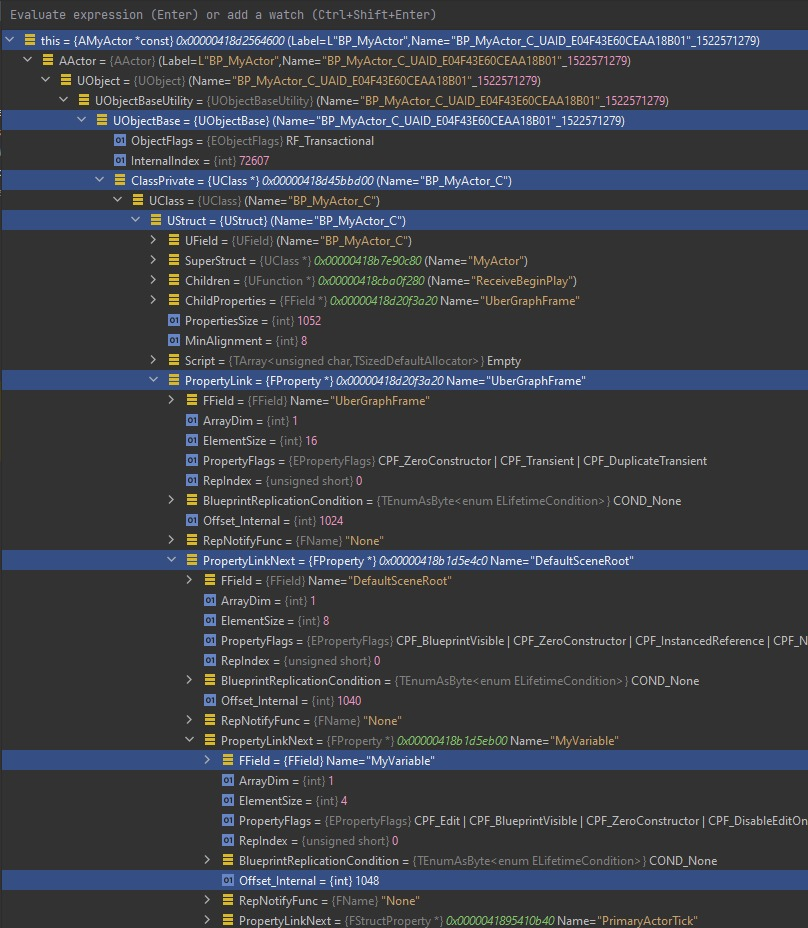

# 指南：调查虚幻引擎中的蓝图数据丢失问题

### 蓝图属性的数据断点




### 4.4 通过 FProperty 序列化捕获特定值变化

```cpp
void FIntProperty::SerializeItem(FStructuredArchive::FSlot Slot, void* ValueAddress, void const* Defaults) const
{
  // Default implementation from TProperty_WithEqualityAndSerializer
  Slot << *TTypeFundamentals::GetPropertyValuePtr(ValueAddress);
  if (GetName().Contains("MyActorNativeValue"))
  {
    // Example: Verbose logging
    UE_LOG(LogTemp, Warning, TEXT("FIntProperty::SerializeItem[%s]: Serializing MyActorNativeValue: %d"), *GetPathName(), GetSignedIntPropertyValue(ValueAddress));
```

### 5. 引擎代码参考

### 5.1 蓝图类

### 加载父类默认值

```cpp
[Inlined] FProperty::ContainerVoidPtrToValuePtrInternal(void *,int) UnrealType.h:685
[Inlined] FProperty::ContainerPtrToValuePtr(void *,int) UnrealType.h:755
[Inlined] FProperty::ContainerPtrToValuePtr(const void *,int) UnrealType.h:765
[Inlined] FProperty::CopyCompleteValue_InContainer(void *,const void *) UnrealType.h:878
FObjectInitializer::InitProperties(UObject *,UClass *,UObject *,bool) UObjectGlobals.cpp:4049
FObjectInitializer::PostConstructInit() UObjectGlobals.cpp:3783
FObjectInitializer::~FObjectInitializer() UObjectGlobals.cpp:3684
UClass::CreateDefaultObject() Class.cpp:4176
UClass::InternalCreateDefaultObjectWrapper() Class.cpp:4780
[Inlined] UClass::GetDefaultObject(bool) Class.h:3081
```

### 加载类修改值

```cpp
UStruct::SerializeVersionedTaggedProperties(FStructuredArchiveSlot,unsigned char *,UStruct *,unsigned char *,const UObject *) Class.cpp:1296
UStruct::SerializeTaggedProperties(FStructuredArchiveSlot,unsigned char *,UStruct *,unsigned char *,const UObject *) Class.cpp:1284
UClass::SerializeDefaultObject(UObject *,FStructuredArchiveSlot) Class.cpp:5176
UBlueprintGeneratedClass::SerializeDefaultObject(UObject *,FStructuredArchiveSlot) BlueprintGeneratedClass.cpp:408
UClass::SerializeDefaultObject(UObject *,FArchive &) Class.h:3252
FLinkerLoad::Preload(UObject *) LinkerLoad.cpp:4445
FLinkerLoad::ResolveDeferredExports(UClass *) BlueprintSupport.cpp:2156
FLinkerLoad::FinalizeBlueprint(UClass *) BlueprintSupport.cpp:1909
FLinkerLoad::Preload(UObject *) LinkerLoad.cpp:4540
22
```

```cpp
void UClass::SerializeDefaultObject(UObject* Object, FStructuredArchive::FSlot Slot)
{
  ...
  // Temp debug code
  if (UnderlyingArchive.IsLoading() && Object->GetPathName().Contains("BP_MyActor"))
  {
    UE_LOG(LogTemp, Warning, TEXT("Loading asset values for: %s"), *Object->GetName());
  }
  ...
  SerializeTaggedProperties(Slot, (uint8*)Object, GetSuperClass(), (uint8*)Object->GetArchetype());
```

### 认识循环依赖性

```cpp
AMyActor::AMyActor() MyActor.cpp:11 <- breakpoint hit for Default__BP_MyActor_Grandchild_C
UClass::CreateDefaultObject() Class.cpp:4217
UClass::InternalCreateDefaultObjectWrapper() Class.cpp:4814
[Inlined] UClass::GetDefaultObject(bool) Class.h:3175
...
LoadPackageInternal() UObjectGlobals.cpp <- BP_MyActor_Grandchild, this indicates cyclical dependency
...
LoadPackageInternal() UObjectGlobals.cpp <- BP_MyActor
...
LoadPackageInternal() UObjectGlobals.cpp <- BP_MyActor_Child
```

### 保存类修改后的默认值

```cpp
FIntProperty::SerializeItem(FStructuredArchiveSlot,void *,const void *) PropertyNumeric.cpp:304
FPropertyTag::SerializeTaggedProperty(FStructuredArchiveSlot,FProperty *,unsigned char *,unsigned char *) PropertyTag.cpp:254
UStruct::SerializeVersionedTaggedProperties(FStructuredArchiveSlot,unsigned char *,UStruct *,unsigned char *,const UObject *) Class.cpp:1627
UStruct::SerializeTaggedProperties(FStructuredArchiveSlot,unsigned char *,UStruct *,unsigned char *,const UObject *) Class.cpp:1287
UClass::SerializeDefaultObject(UObject *,FStructuredArchiveSlot) Class.cpp:5211
UBlueprintGeneratedClass::SerializeDefaultObject(UObject *,FStructuredArchiveSlot) BlueprintGeneratedClass.cpp:457
UClass::SerializeDefaultObject(UObject *,FArchive &) Class.h:3346
‘anonymous namespace’::WriteExports(FStructuredArchiveRecord &,FSaveContext &) SavePackage2.cpp:2072
‘anonymous namespace’::SaveHarvestedRealms(FSaveContext &,ESaveRealm) SavePackage2.cpp:2786
‘anonymous namespace’::InnerSave(FSaveContext &) SavePackage2.cpp:2961
```

### 5.2 蓝图对象（实例）

### 使用类默认值构建

```cpp
[Inlined] FProperty::ContainerVoidPtrToValuePtrInternal(void *,int) UnrealType.h:685
[Inlined] FProperty::ContainerPtrToValuePtr(void *,int) UnrealType.h:755
[Inlined] FProperty::ContainerPtrToValuePtr(const void *,int) UnrealType.h:765
[Inlined] FProperty::CopyCompleteValue_InContainer(void *,const void *) UnrealType.h:878
FObjectInitializer::InitProperties(UObject *,UClass *,UObject *,bool) UObjectGlobals.cpp:4049
FObjectInitializer::PostConstructInit() UObjectGlobals.cpp:3900
FObjectInitializer::~FObjectInitializer() UObjectGlobals.cpp:3717
StaticConstructObject_Internal(const FStaticConstructObjectParameters &) UObjectGlobals.cpp:4385
NewObject(UObject *,const UClass *,FName,EObjectFlags,UObject *,bool,FObjectInstancingGraph *,UPackage *) UObjectGlobals.h:1642
UWorld::SpawnActor(UClass *,const UE::Math::TTransform *,const FActorSpawnParameters &) LevelActor.cpp:666
```
