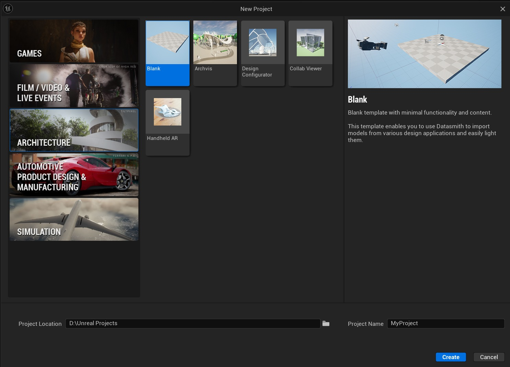
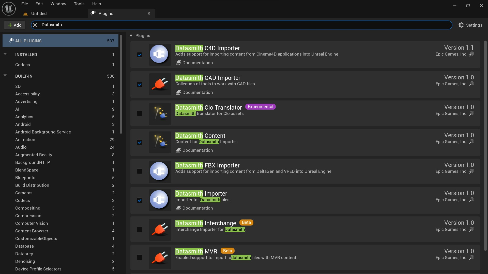
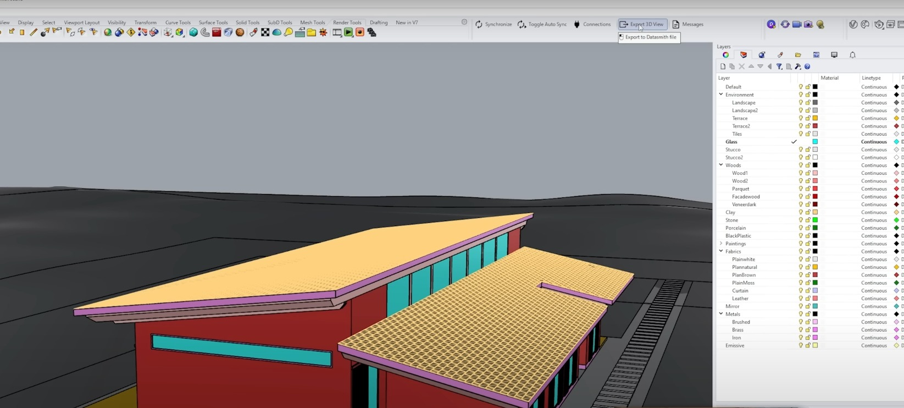
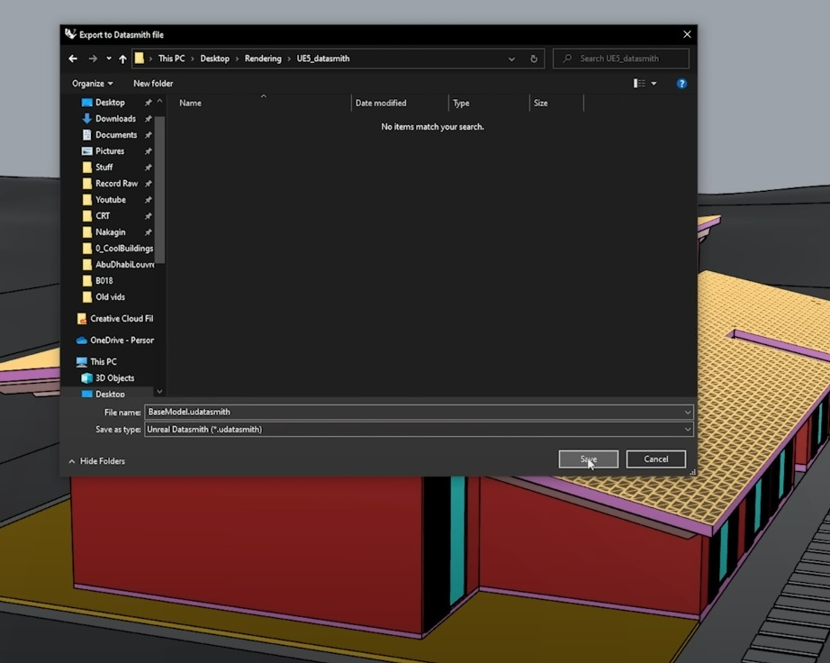
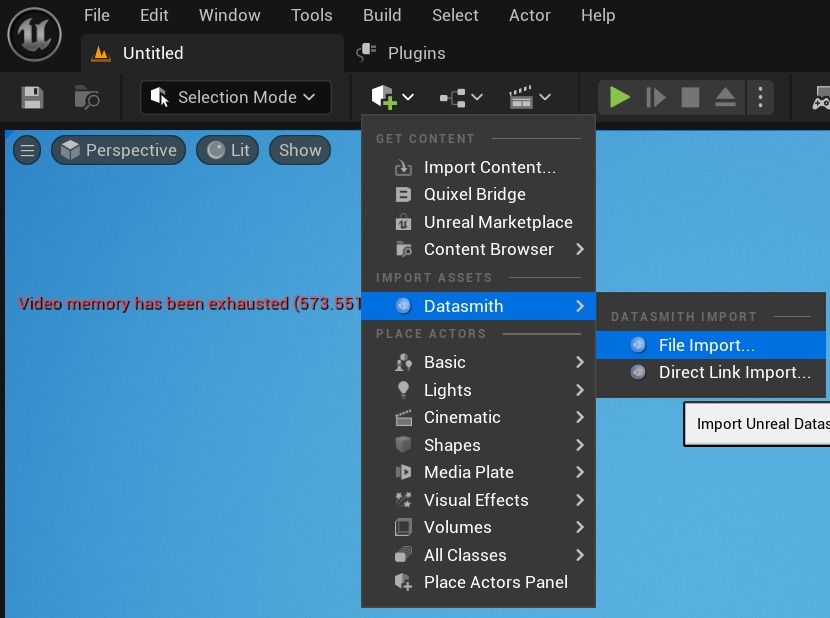
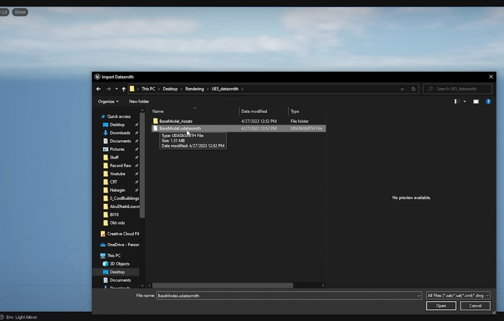
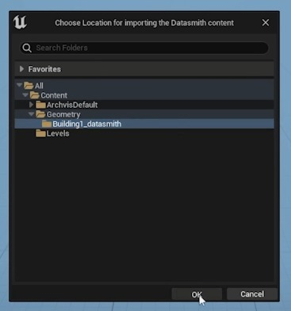
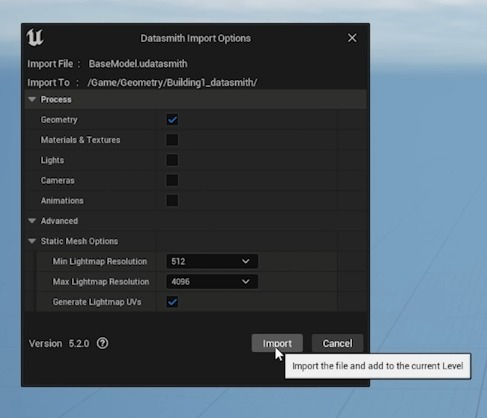
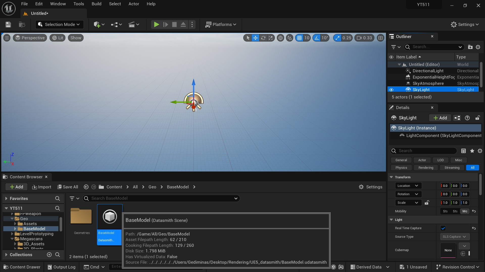

# 如何使用 Datasmith 插件将 3D 模型导入虚幻引擎 5

## 来源与状态

- 原始 URL：https://dev.epicgames.com/community/learning/tutorials/M6R5/how-to-import-3d-models-to-unreal-engine-5-with-the-datasmith-plugin

## 运行时分类

- 类型：图文教程
- 判断：API 未识别到核心视频信号，可整理正文约 1934 字符。

## 摘要

Datasmith插件是一个工具，允许您将3D模型从不同的建模软件导入到虚幻引擎中。这意味着您可以在 SketchUp、3ds Max、Revit、Rhino 等程序中创建 3D 模型，然后将其导入虚幻引擎以实时创建交互式体验。在本文中，我将引导您完成 Datasmith 插件的安装过程，并向您展示如何将模型从不同的 3D 建模软件导入到虚幻引擎中。

## 中文整理

### 1.

从虚幻引擎网站下载 Datasmith 插件。 （[Datasmith 导出器插件 - 虚幻引擎](https://www.unrealengine.com/en-US/datasmith/plugins)）。注意：从拥有 3D 模型的软件下载插件。

### 2.

启动虚幻引擎，创建一个新项目并选择最适合您的项目的模板。然后选择项目的位置并为其命名。单击“创建”按钮完成此步骤。

### 3.

在插件窗口（编辑 > 插件）内，检查以下插件是否已启用： - Datasmith C4D 导入器 - Datasmith CAD 导入器 - Datasmith 内容 - Datasmith 导入器 如果任何插件未启用，您需要启用它们，然后重新启动编辑器。

### 4.

来自 3D 建模软件（本例为 Rhino）。从 Datasmith 插件菜单中选择导出 3D 视图选项。

### 5.

为文件命名，选择位置并验证其是否保存为 Unreal Datasmith (*.udatasmith)，然后单击“保存”。

### 6.

在虚幻编辑器中，转到选项“快速添加到项目”>“Datasmith”>“文件导入”。

### 7.

在弹出窗口中搜索该文件（导入 Datasmith），然后将其打开。

### 8.

选择您想要导入资产的位置。

### 9.

从弹出窗口（Datasmith 导入选项）中，选择我们要从模型导入的对象类型，在本例中仅导入几何图形。保留“静态网格体选项”菜单的默认值，然后选择“导入”。

### 10.

最后，将文件拖到编辑器中。

