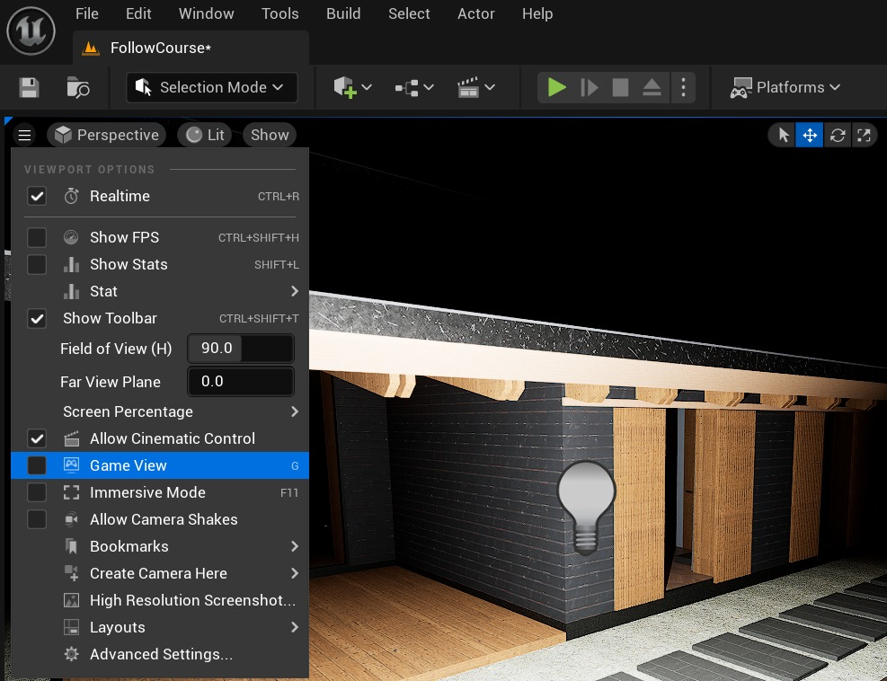
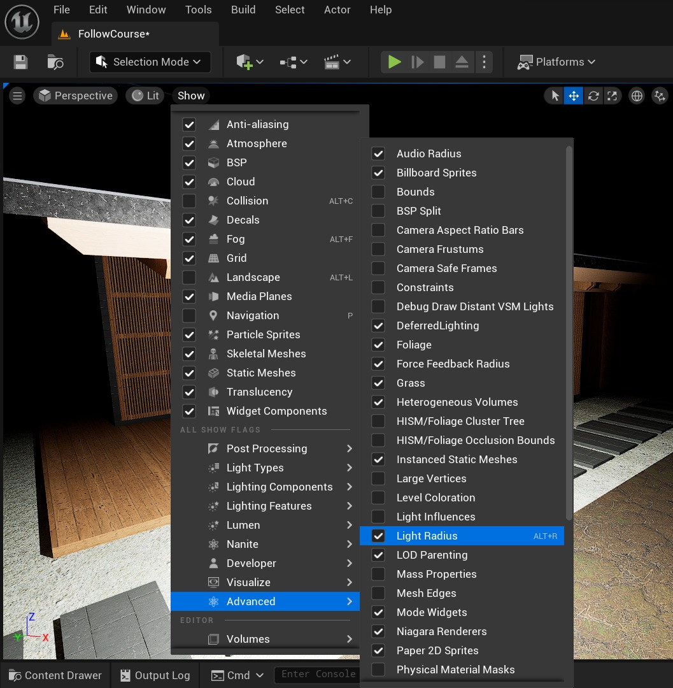
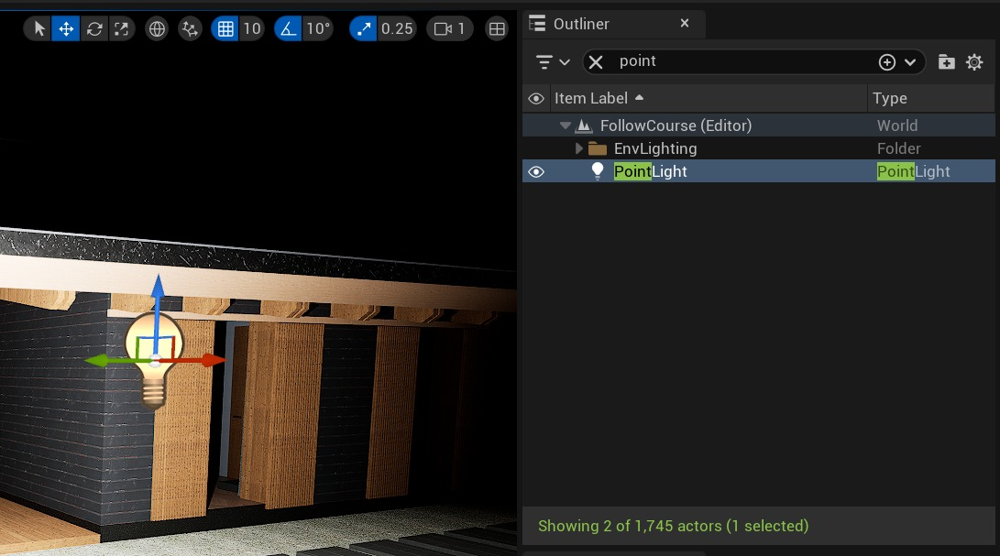
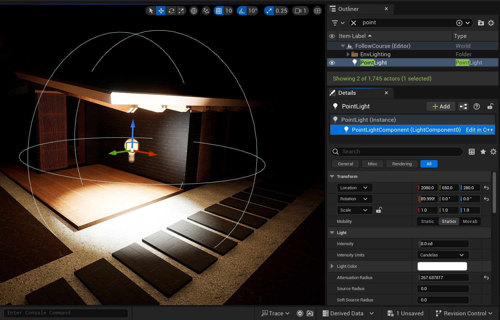

# 如何在虚幻引擎5.3中可视化光衰减半径

## 来源与状态

- 原始 URL：https://dev.epicgames.com/community/learning/tutorials/34jm/how-to-visualize-the-light-attenuation-radius-in-unreal-engine-5-3

## 运行时分类

- 类型：图文教程
- 判断：API 未识别到核心视频信号，可整理正文约 839 字符。

## 摘要

虚幻引擎的功能之一是能够在编辑器中可视化点光源、聚光灯和矩形光源的光衰减半径。这可以帮助您调整照明参数并优化场景的性能。

## 中文整理

### 概览

要在虚幻引擎 5.3 中查看衰减半径，请执行以下步骤：

### 1. 确认游戏视图未激活

```
Viewport Option > Game View Uncheked
```

***注意：****游戏视图的键盘快捷键是 G*



### 2. 启用光半径

```
Show > Advanced > Light Radius checked
```

***注意：**光半径的键盘快捷键是 Alt + R。*



### 3. 从编辑器或大纲视图中选择灯光 Actor

在编辑器或大纲中找到灯光演员，然后左键单击它。



### 4. 在细节面板中选择灯光演员的LighComponent

现在可以在编辑器中显示灯光演员的衰减半径。



