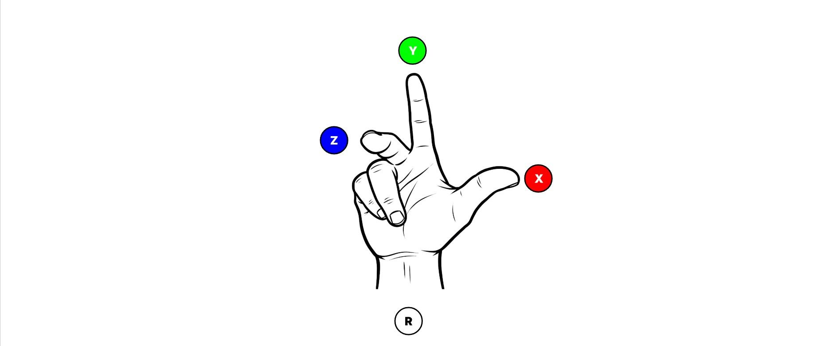
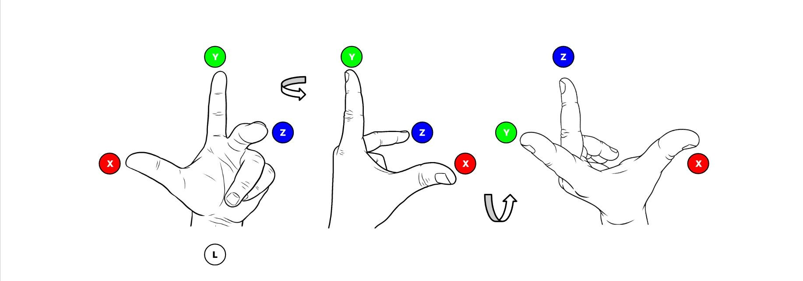

# Maya 到虚幻引擎 - 终极坐标转换备忘单

## 来源与状态

- 原始 URL：https://dev.epicgames.com/community/learning/knowledge-base/x4mk/maya-to-unreal-engine-the-ultimate-coordinate-conversion-cheat-sheet

## 运行时分类

- 类型：图文教程
- 判断：API 未识别到核心视频信号，可整理正文约 3162 字符。

## 摘要

从右手 Y 向上坐标系（如 Maya）到左手 Z 向上坐标系（如虚幻引擎）的匹配变换（位置、旋转和缩放）需要交换位置和缩放的 Y 和 Z 值。由于 Z 轴上的约定不同，旋转需要额外的符号翻转。

## 中文整理

### Maya 到虚幻引擎 - 终极坐标转换备忘单

默认情况下，Maya 使用右手坐标系并将正 Y 轴定义为向上（垂直）。要形象化此方向，请将右手放在身前，如下所示。

- 拇指代表 X 轴，食指代表 Y 轴（向上），中指代表 Z 轴。 **虚幻引擎** 使用左手坐标系并将正 Z 轴定义为向上。对轴的方向感到困惑吗？让我们将左手举到面前（见下图），将拇指标记为 X 轴，食指标记为 Y 轴，中指标记为 Z 轴。 - 旋转 1：现在，将手绕 Y 轴逆时针旋转 90 度。这会将 X 轴对齐到正确的方向，以与右手坐标系保持一致（仅是为了便于可视化）。 - 旋转 2：接下来，将手绕 X 轴逆时针旋转 90 度。

瞧！这就是 UE 坐标系：左手系统，其中 +Z 向上（垂直），+X 是拇指方向，+Y 是食指方向。

### 备忘单

从右手 Y 向上坐标系（如 Maya）到左手 Z 向上坐标系（如虚幻引擎）的匹配变换（位置、旋转和缩放）需要交换位置和缩放的 Y 和 Z 值。由于 Z 轴上的约定不同，旋转需要额外的符号翻转。

### 先决条件：将 Maya 旋转顺序设置为 XZY

至关重要的是，您必须将旋转顺序从 XYZ 设置为 XZY。这可确保旋转值按照以下转换规则正确对齐。

### 变换转换规则

我们以 Maya 单位立方体（默认单位为厘米）为例，定位在 (X = 10, Y = 15, Z = 30)，缩放 (X = 5, Y = 25, Z = 40)，并旋转 (X = 40, Y = 20, Z = 35)。我们的目标是在 UE 中的单位立方体上匹配这些变换（默认单位为 uu = cm）。核心规则很简单：X 保持不变，Y 和 Z 通过 Z 旋转翻转进行交换。 - 属性|玛雅 (X,Y,Z) |转换规则|虚幻（X、Y、Z）- 位置 | (10, 15, 30) |交换 Y 和 Z | (10, 30, 15) - 规模 | (5, 25, 40) |交换 Y 和 Z | (5, 40, 25) - 旋转 | (40, 20, 35) |交换 Y 和 Z，然后对新 Z 求反 | (40, 35, -20)

### 简而言之

- X 值保持不变。 - Maya Z 值变为虚幻 Y 值。 - Maya Y 值变为 Unreal Z 值，但翻转其符号仅用于旋转。为什么要翻转 z 轴？ 🤔 这一切都归结为正旋转的方向： - Maya：使用右手定则，这意味着从轴向下看时，正旋转是逆时针方向。 - 虚幻引擎：围绕 X 和 Y 的正旋转是逆时针方向，但 Z 轴是顺时针方向。为了使 Maya 逆时针旋转在 Unreal 的顺时针 Z 轴系统中看起来正确，您必须反转旋转值的符号！

