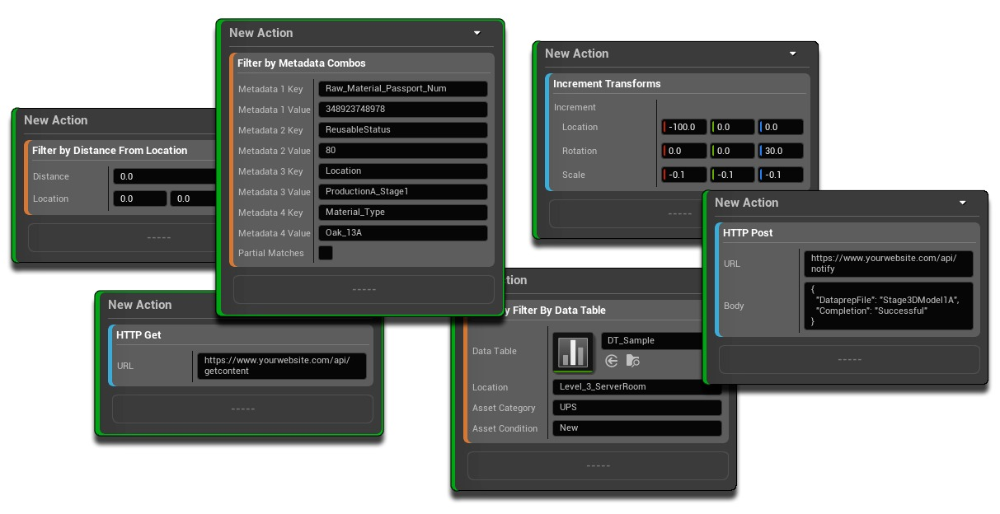
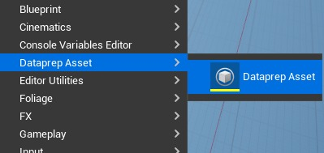
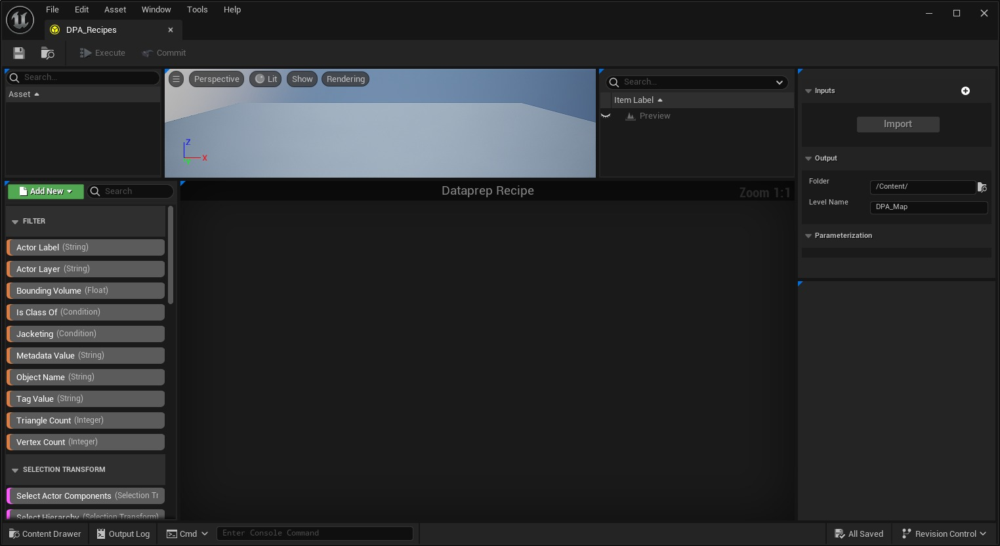
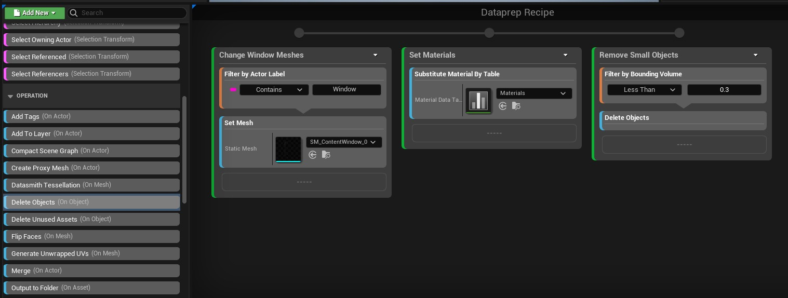
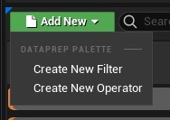
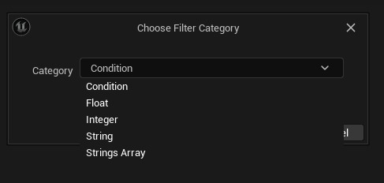
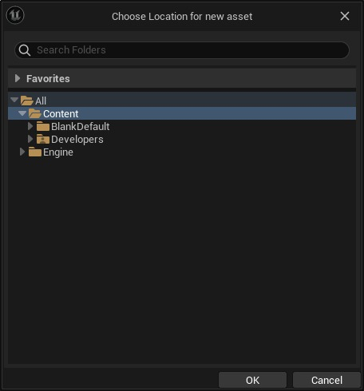
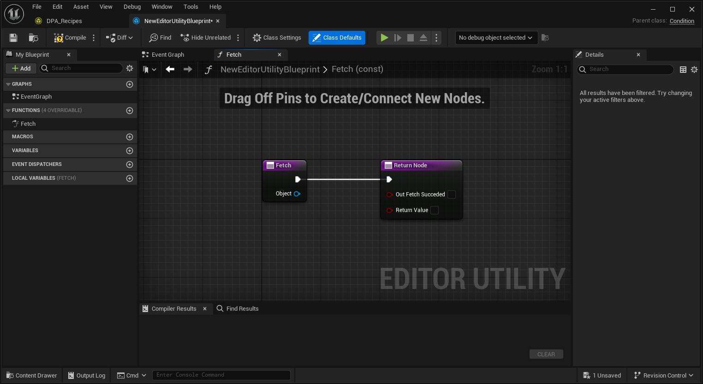
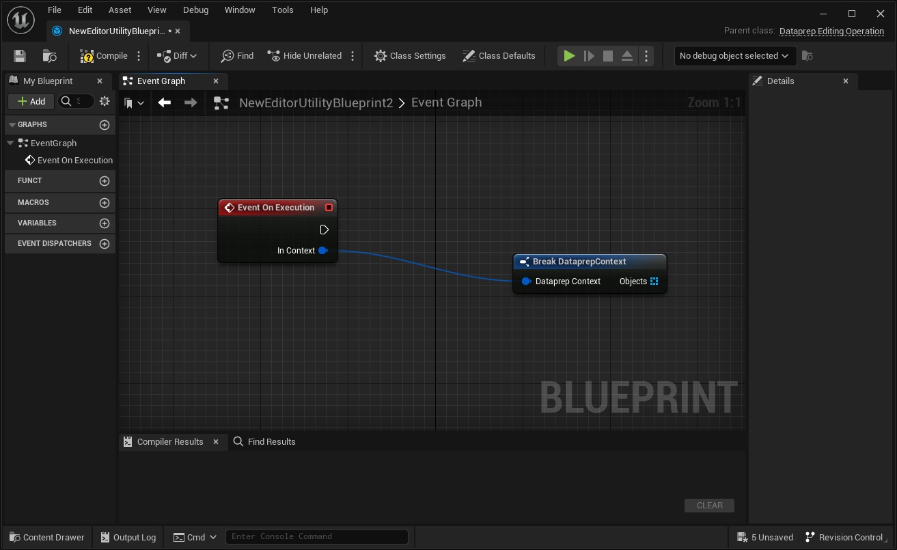
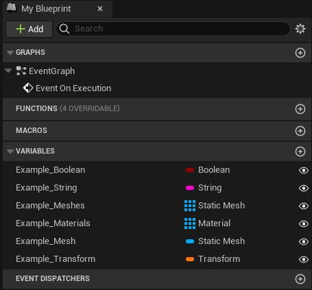

# 使用自定义 Dataprep 过滤器和操作实现自动化

## 来源与状态

- 原始 URL：https://dev.epicgames.com/community/learning/tutorials/XjZP/unreal-engine-automate-with-custom-dataprep-filters-operations

## 运行时分类

- 类型：图文教程
- 判断：API 未识别到核心视频信号，可整理正文约 26009 字符。

## 摘要

本教程介绍如何在 Dataprep 中设置您自己的自定义过滤器和操作，然后可用于根据您自己的定制需求自动导入项目。本教程包括我为帮助您入门而整理的一系列自定义 Dataprep 过滤器和操作，包括与 Web API、CSV 文件和元数据链接的解决方案！

## 中文整理

### 介绍

Unreal Engine Dataprep 可帮助用户自动化和简化准备和优化用于 UE 实时应用程序的大量数据的过程。它允许您定义规则和操作来处理和操作数据，例如导入、过滤、转换和组织资产。它对于批量处理材质分配、数据格式化和资产优化等任务特别有用，最终提高构建虚幻引擎场景的效率和速度。我们在 Dataprep UI 中包含一系列过滤器和操作，但您也可以选择创建自己的过滤器和操作。本教程介绍如何在 Dataprep 中设置您自己的自定义过滤器和操作，然后可用于根据您自己的定制需求自动导入项目。本教程包括我整理的一系列自定义 Dataprep 过滤器和操作，以帮助您入门。

Unreal Engine Datasmith 是一个功能强大的工具包，可将 CAD 和 3D 数据无缝导入并优化到 UE 中。它简化了将复杂设计文件从 Autodesk 3ds Max、Revit、Rhino、SketchUp 等软件转换为虚幻引擎项目的过程。 Datasmith 保留几何形状、材质、灯光和元数据，从而获得一致的可重复结果。总体而言，它简化了建筑师、设计师和其他希望将 UE 纳入其流程的专业人士的流程。下面，我提供了 Datasmith 导出插件的链接，它允许您将场景导出到 Datasmith 文件中。注意：使用最新版本的 Twinmotion，您可以直接导出为 Datasmith 格式，然后继续在虚幻引擎中处理 Twinmotion 场景数据。使用 Datasmith 导出插件导出场景或通过 Twinmotion 导出场景后，您可以通过 Dataprep 运行这些场景。 - [Datasmith 导出插件](https://unrealengine.com/en-US/datasmith/plugins) - [Datasmith 概述](https://docs.unrealengine.com/5.3/en-US/datasmith-plugins-overview)

### 插件

首先，我们将启用 Datasmith Importer、Datasmith Content、Dataprep Editor 和 Dataprep Geometry Operations（测试版）插件。添加插件后，请确保您已重新启动项目。注意：虚幻引擎中的架构模板已启用这些插件，但 Dataprep 几何操作（测试版）除外。

### 创建自定义过滤器或操作

我们现在将介绍如何创建我们自己的自定义过滤器和操作。在这里我们可以扩展Dataprep的功能以适应项目更具体的要求。要创建 Dataprep 资产，请在内容浏览器中右键单击，导航至 Dataprep 资产部分。创建 Dataprep 资产。

双击 Dataprep 资产以打开 Dataprep UI

以下是 Dataprep 配方的典型示例。它由三个操作组成，第一个操作是在过滤的 actor 的标签中包含单词 Window 时更改窗口网格，第二个操作引用数据表来交换材质，第三个操作过滤边界体积低于 0.3 UE 单位的 actor，然后从场景中删除这些 actor。即使这里有三个操作，我们也需要滚动页面以向配方添加更多内容。当我们处理非常复杂的大规模场景时，Dataprep 配方很快就会变得非常长且难以跟踪。在管道中使用自定义 Dataprep 过滤器和操作的好处之一是，我们可以灵活地开始将大量单独的过滤器和操作整合到更少的定制节点中。

如果您不熟悉 Dataprep 配方，我建议您在继续自定义过滤器和操作之前探索它们并阅读我们的文档。 - [Dataprep 概述](https://docs.unrealengine.com/5.3/en-US/dataprep-overview-in-unreal-engine) 让我们从自定义过滤器开始。按 Dataprep 窗口上的绿色“添加新项”按钮。选择创建新过滤器。

在下一个窗口中，我们可以选择过滤器类别。提供以下选项：条件、浮点型、整数、字符串、字符串数组。对于第一个创建，将类别设置为**条件**。

接下来指定要在内容浏览器中保存自定义过滤器资源的位置。选择内容或专用子文件夹（如果有）。 ** 注意：我们可以稍后更改资产的位置，它们仍会在 Dataprep UI 中拾取 **

自定义过滤器的新**蓝图图表**将如下所示。我们现在可以在 **Fetch BP** 节点和 **Return Node** 之间添加蓝图逻辑。

以下是设置为条件的自定义操作示例。在这里我们看到我们得到了一个可以迭代的对象引用数组。与自定义过滤器一样，我们可以在此处添加蓝图逻辑。

将变量添加到自定义过滤器和操作中时，我们可以通过单击变量旁边的闭眼图标将变量公开到主 Dataprep UI 中。这将使变量在节点上公开并可见。

最后，确保将自定义过滤器或自定义操作资产重命名为能够代表其功能的名称。资产的名称将重新用作 Dataprep UI 过滤器和操作列表上的名称。在资产名称中使用下划线 (_)。这样，UE将替换空格的下划线。例如 Increment_Transforms，将在 Dataprep UI 中将操作名称设置为 Increment Transforms。完成所有设置后，导航回 Dataprep UI 并从主 Dataprep UI 左侧列表中拖动新创建的自定义过滤器或自定义操作即可开始！ **注意：如果您需要将您开发的自定义 Dataprep 过滤器和操作资产移动到内容浏览器中的不同文件夹中，那很好，这不会中断 Dataprep UI 中这些资产的发现。如果你将这些资产迁移到不同的UE项目中。一旦它们到达内容浏览器，Dataprep 就会发现它们。 **

### 可下载的自定义过滤器

从下面的链接下载 Dataprep 自定义过滤器。该 zip 文件包含所有 Dataprep 自定义过滤器 .uasset 文件 (Unreal Engine 5.2)。要在您自己的虚幻引擎 5.2 或 5.3 项目中使用这些文件，请通过 Windows 文件资源管理器将 .uasset 文件复制到您的项目内容文件夹中。 - [下载自定义滤镜](https://epicgames.box.com/v/customfilters)
