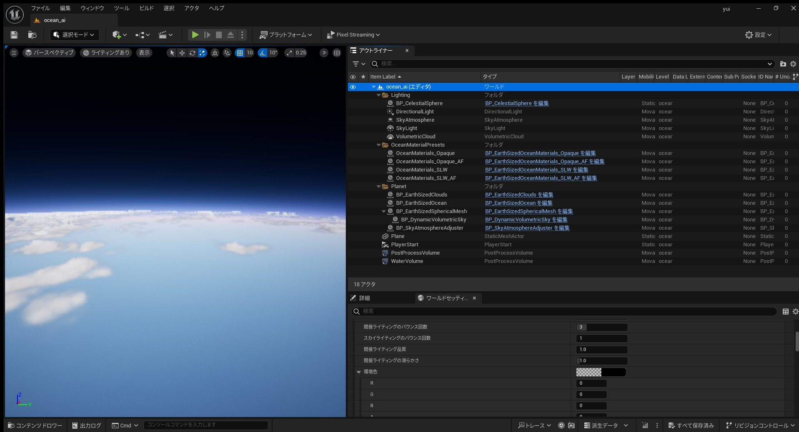

# 连接地球与太空

## 来源与状态

- 原始 URL：https://dev.epicgames.com/community/learning/tutorials/qX2V/unreal-engine-connecting-earth-and-space

## 运行时分类

- 类型：图文教程
- 判断：API 未识别到核心视频信号，可整理正文约 2502 字符。

## 摘要

标准游戏使用平面地图。这是一个理性的选择，因为没有必要创建游戏中看不见的部分，或者你不能去的地方。然而，在平面地图上，无论走多远，都永远无法到达太空。如果你想创建一个现实的世界，请参考本教程。

## 中文整理

### 使用什么

- UE 5.4.2 | https://dev.epicgames.com/documentation/ja-jp/unreal-engine/unreal-engine-5.4-release-notes - 动态体积天空 | https://www.unrealengine.com/marketplace/ja/product/dynamic-volumetric-sky/ - 海浪 | https://www.unrealengine.com/marketplace/ja/product/ocean-waves

### 海浪

首先，打开 EarthSizedOceanPlanet 地图，然后删除不需要的内容或复制需要的内容。列出你需要的东西。 Content/OceanWaves/Levels/EarthSizedOceanPlanet 1. Lighting/DirectionLight 2. OceanMaterialPresets/OceanMaterial_* 3. Planet/BP_EarthSizedOcean 4. Planet/BP_EarthSizedSphercialMesh 将其粘贴到新地图后，请在 BP_EarthSizedOcean 中输入必要的信息。如果您第一次进入海洋时感觉有些奇怪，请编辑 BP_EarthSizedOcean。将体积材质高度设置为 0。使用与水下相同的水上材质。 **详细信息（BP_EarthSizedOcean）：** - 水下材质 | M_海洋光散射_PP

### 动态体积天空

如果保持原样，地平线就会成为障碍。要删除它，请将 BP_DynamicVolumetricSky(self) 的详细信息设置为“高度雾最大不透明度：0”。内容/DynamicVoluemetricSky/蓝图/BP_Dynamic_VoluemetricSky **详细信息（BP_Dynamic_VoluemetricSky）：** - 云 |云飞行选项 - 高度雾最大不透明度| 0 接下来，将 SkyAtmosphere(BP_Dynamic_VoluemetricSky)) 的变换模式更改为“组件变换处的行星中心...”。通过将 SkyAtmosphere Transform 的 location-z 设置为负值（-6360），海洋中的涟漪将会消失，场景将正常显示。要使 SkyAtmosphere(BP_Dynamic_VoluemetricSky) 成为行星的中心，请将 BP_Dynamic_VoluemetricSky 设为 BP_EarthSizedSphericalMesh 的父子。

### 详细选项

- 云质量|超品质 |云质量提升-层底高度| 10 | 10云高-追踪开始最大距离| 400 |显示远处的云彩 - 追踪最大距离 | 400 |将云显示到远处 您无法更改它，因为它是“只读”变量。天气系统现在是完全模拟，而不是简单的线性插值。您可以通过更改月份、位置（纬度和经度）、海拔、时间、天气权重（最重要的一项）和生物群系来控制天气系统。

