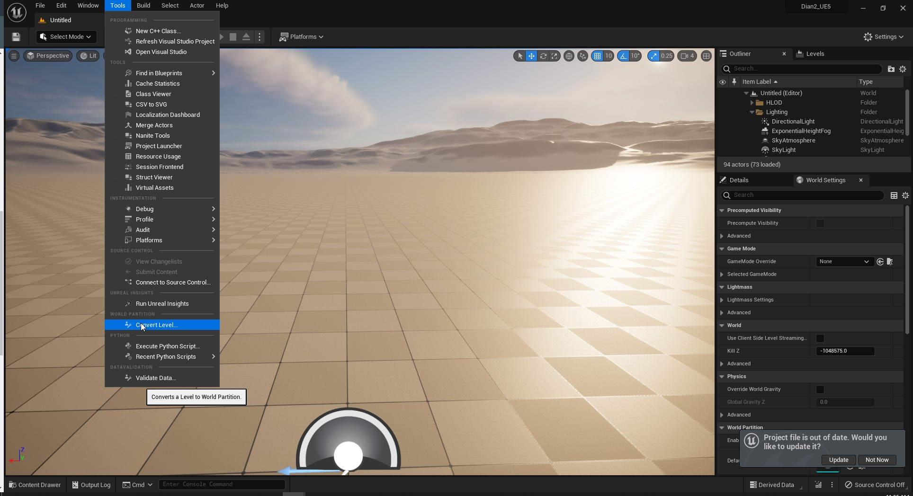

# 将现有关卡转换为世界分区

## 来源与状态

- 原始 URL：https://dev.epicgames.com/community/learning/tutorials/dLm9/unreal-engine-convert-existing-level-to-world-partition

## 运行时分类

- 类型：图文教程
- 判断：API 未识别到核心视频信号，可整理正文约 221 字符。

## 摘要

对于像我这样没有读完文档的人。这是为您提供的快速解决方案。

## 中文整理

### 概览

我最初遇到了麻烦，希望与与我有同样问题的人分享。 **工具 > 转换级别**

