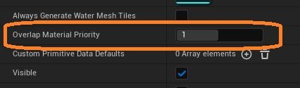
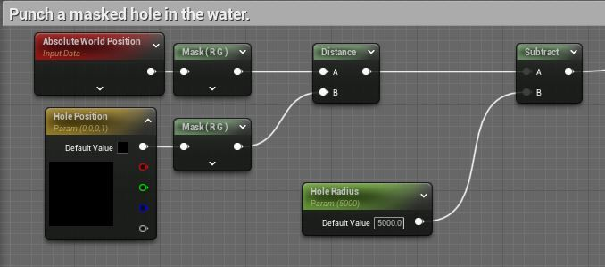
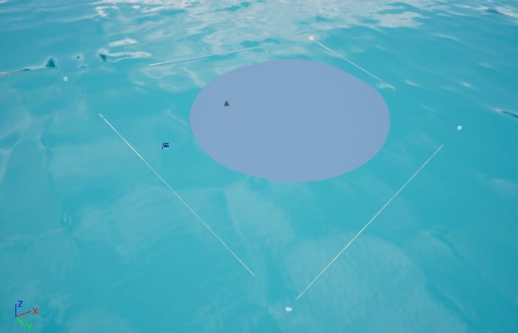
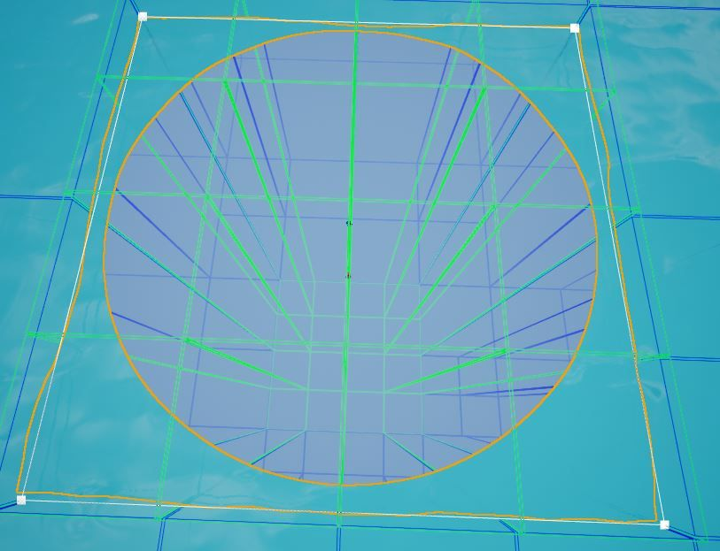
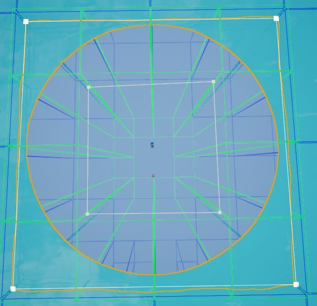
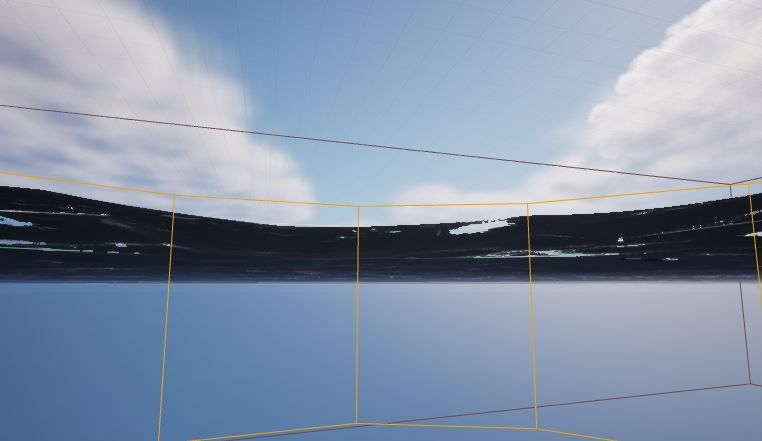

# 在水中打一个洞

## 来源与状态

- 原始 URL：https://dev.epicgames.com/community/learning/knowledge-base/2mlB/unreal-engine-creating-a-hole-in-water

## 运行时分类

- 类型：图文教程
- 判断：API 未识别到核心视频信号，可整理正文约 2264 字符。

## 摘要

在水中创建一个洞本文由 Ryan B 撰写。在水面上创建一个洞步骤以下是一个示例，该示例在性能方面相当高效，说明了如何在水面上创建一个洞，该示例使用...

## 中文整理

### 概览

*本文由 [Ryan B.](https://dev.epicgames.com/community/profile/23wL/RyanBickell) 撰写*

### 在水面上打一个洞

### 步骤

下面是一个在性能方面相当高效的示例，说明如何使用水体和 SingleLayerWater 着色模型在水面上创建孔： 1. 创建一个与底层水体具有相同高度和波浪参数的湖泊水体。该湖水体的材质将包含孔剪切逻辑。 2. 将湖泊的“重叠材质优先级”设置为高于底层水体：

1. 创建一个用于湖泊的材质实例（基于底层水体的材质）。它的混合模式应该设置为“Masked”。 2. 在 OpacityMask 属性上实现孔剪切逻辑。例子：

### 结果

以下是使用海洋水体作为基础水体时的结果：

### 提高性能（可选）

如果您想减少渲染的图块数量，例如减少移动设备的数量，那么您可以尝试使用具有线性点的 Lake 样条线来创建与图块网格匹配的正方形 (r.Water.WaterMesh.ShowTileBounds 1)。这将使远处的图块折叠变得有效，同时仍按预期近距离工作并分成许多图块进行镶嵌。

此外，通过在剪切区域内使用具有更高材质重叠优先级的另一个水体（空水材质）以及启用“始终生成水网格瓦片”属性（在 5.1 中添加），可以完全移除单个水网格瓦片，以获得额外的性能。

### 处理后处理（可选）

如果将相机移动到水面下方的孔中，您会发现后期处理仍然存在：

为了解决这个问题，可以使用 WaterBodyExclusionVolume。将 WaterBodyExclusionVolume 放置在与孔相同的位置，编辑画笔设置以匹配孔，并将湖泊水体添加到其“要排除的水体”列表中：

在[知识库！](https://forums.unrealengine.com/docs) 中获取更多答案

