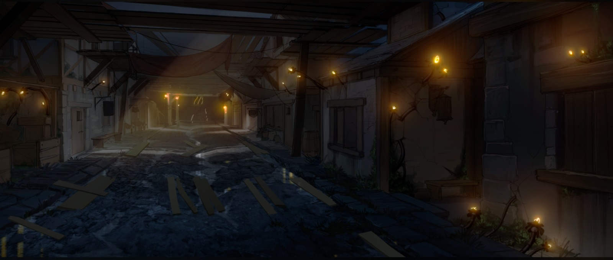
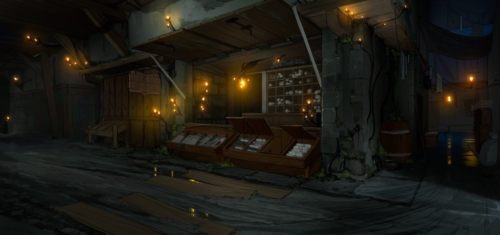
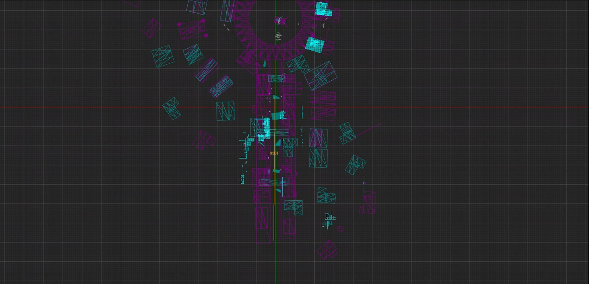
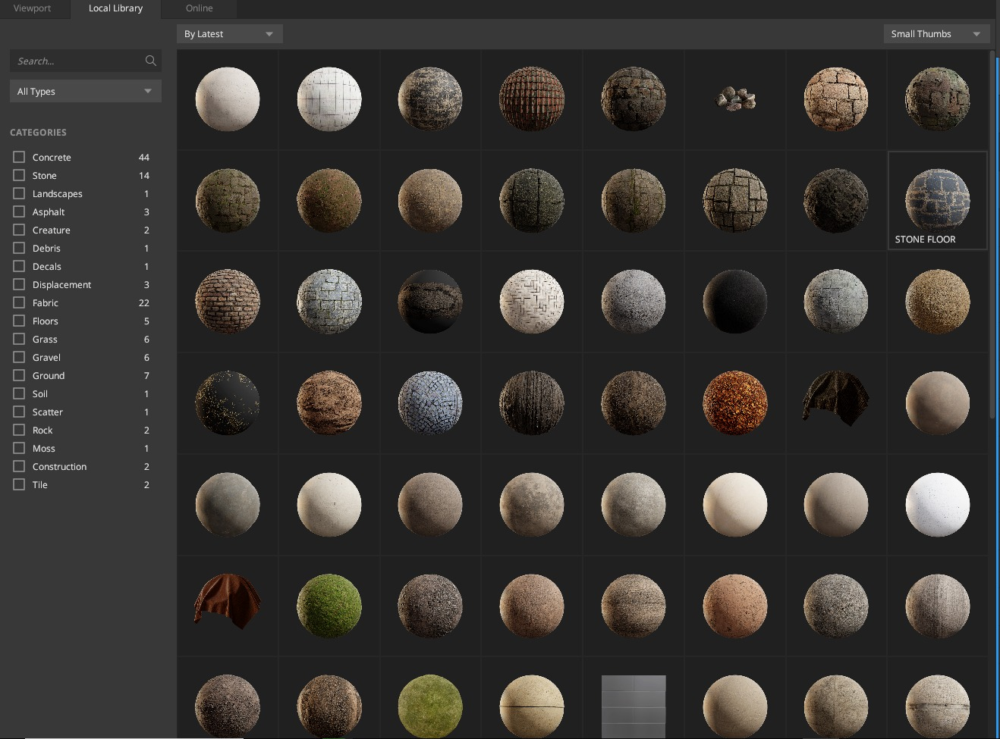
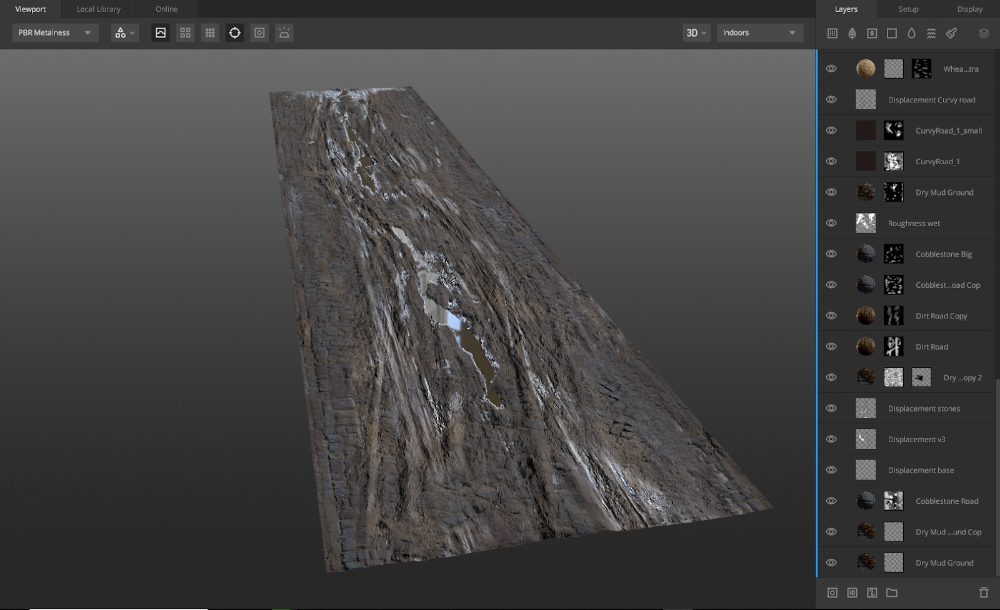
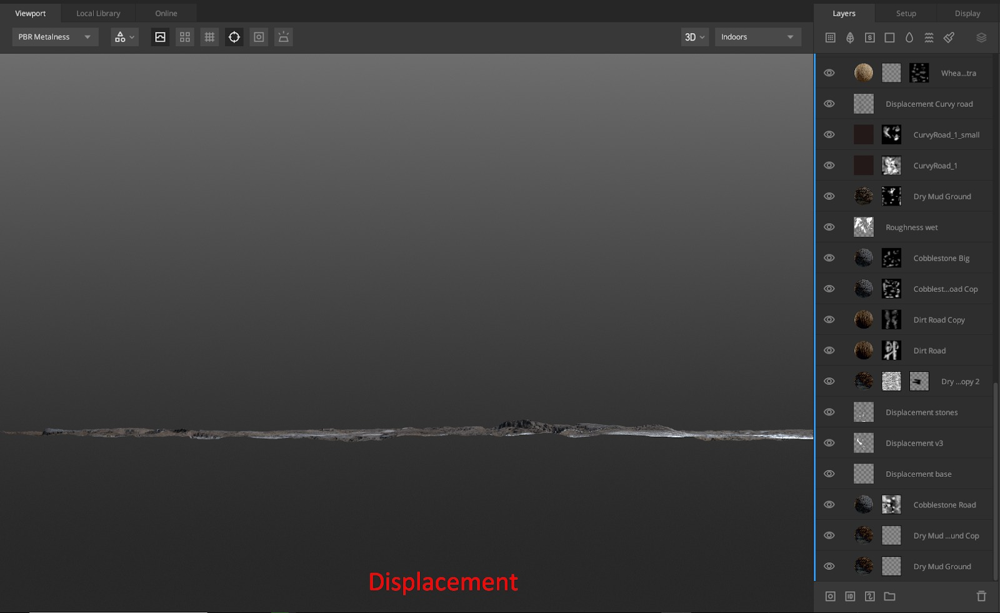
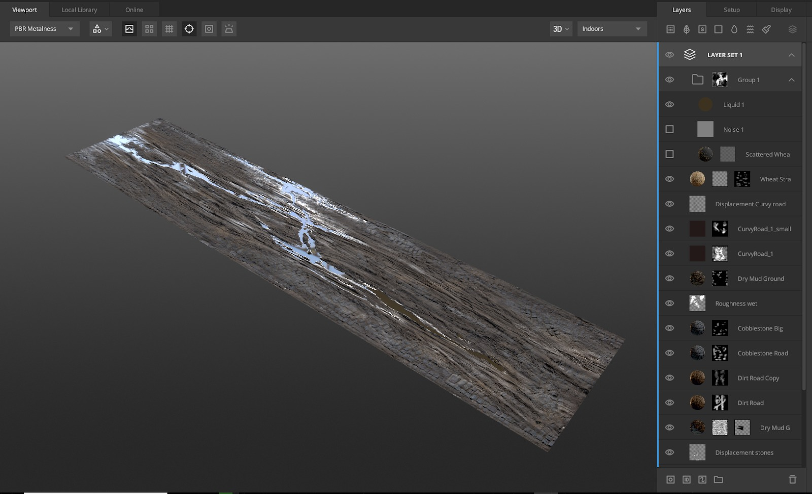
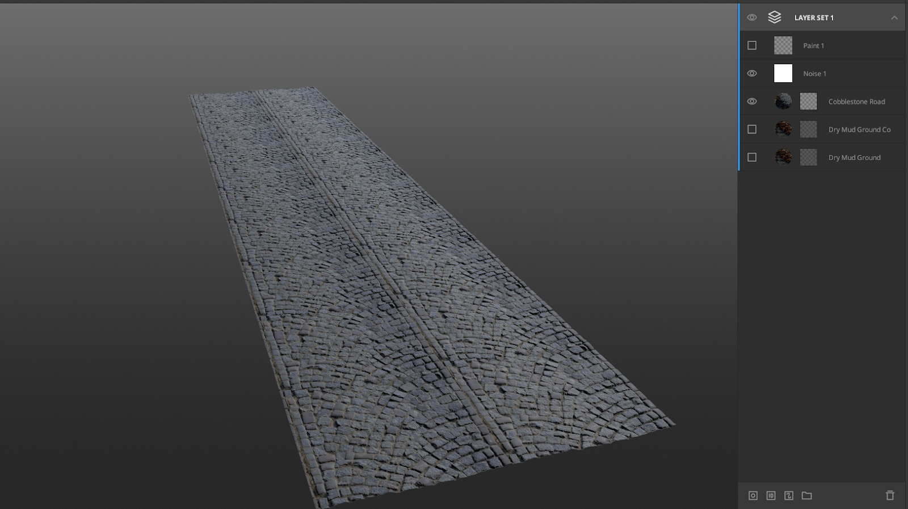
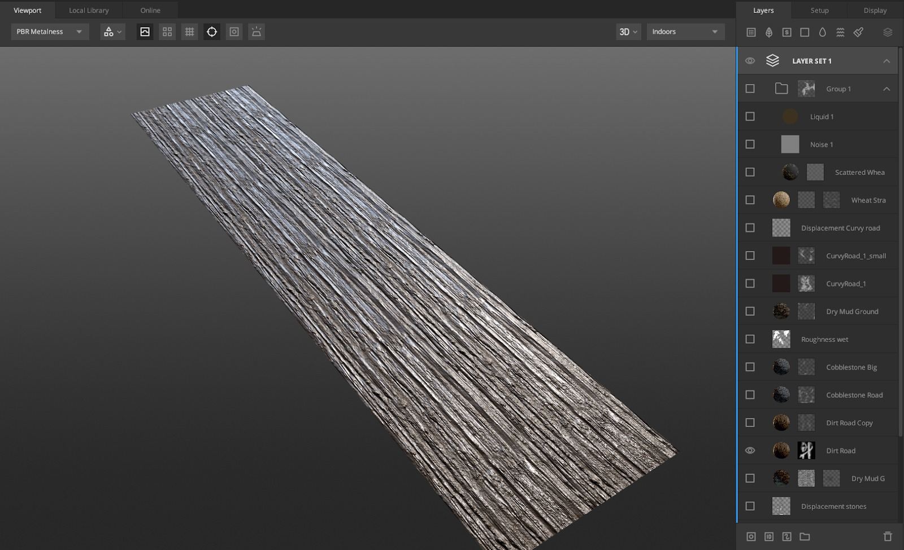
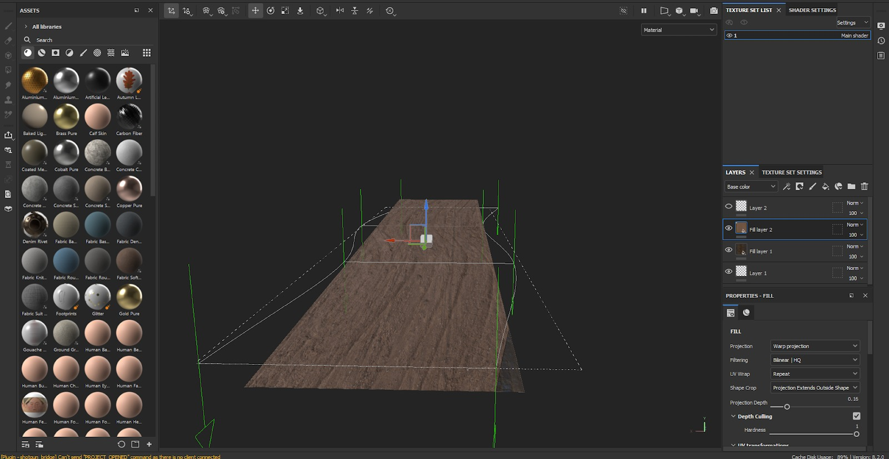

# 在 UE5 和 Substance Painter 中创建中世纪道路 | ICVR 光落

## 来源与状态

- 原始 URL：https://dev.epicgames.com/community/learning/tutorials/Gp6q/unreal-engine-creating-a-medieval-road-in-ue5-substance-painter-icvr-lightfall

## 运行时分类

- 类型：图文教程
- 判断：API 未识别到核心视频信号，可整理正文约 12072 字符。

## 摘要

本文提供了在虚幻引擎 5 和 Substance Painter 中创建中世纪乡村道路的全面指南，该道路是为我们的动画短片《Lightfall》构建的。它涵盖了从最初的 2D 概念设计到最终组装的整个过程，重点介绍了 UE5 的高级建模工具、Nanite 技术和 Quixel Megascans 进行纹理化的使用。

## 中文整理

### 在 UE5 和 Substance Painter 中创建中世纪道路 | ICVR 光落

*以下文档是在动画短片制作过程中编译的* [Lightfall](https://www.youtube.com/watch?v=bz-4ggzYGMY)*，2023 年 Epic MegaGrant 获奖项目。*

### 1. 2D概念设计

### 预生产阶段

为了成功建模和环境构建，强烈建议在预制作阶段进行 2D 概念设计。在此示例中，我们将组装一条中世纪村庄城市道路。我们的 2D 艺术家准备了以下设计的概念：

### 参考文献和说明

2D团队和艺术总监提供了以下参考和描述： - 历史背景：这条路原本是用鹅卵石铺成的，但随着时间的推移，由于潮湿而覆盖了一层泥土，导致其现在的状况恶化。

### 工作计划

在初始阶段，规划如何在引擎中实现该想法至关重要。有多种方法： - **经典方法：** - 卸载封锁。 - 在 DCC 中组装道路网格。 - 在 Substance Painter 中使用 UDIM 进行独特的建模和纹理。 - 导入到引擎中。 - **UE5 的现代方法：** - 利用 UE5 中提供的各种建模工具。 - 使用纳米技术。 - 利用 Quixel Megascans 库和 Quixel Mixer 创建和混合独特的纹理。因此，我们确实想测试引擎中新建模工具的人体工程学和多功能性。

### 2. 工作开始

### 纹理 - Quixel Mixer、Substance Painter

- **普通网格** - 我们测量了发动机中道路开口的大致长度，减去我们决定使其极其狭窄的路缘石的偏移量。 - 根据测量结果，我们确定道路将由 5 部分组成。 - 之后，我们在 Blender 中准备好普通网格并将其加载到 Quixel Mixer 中以进行进一步的工作。

- **纹理选择：** - 利用丰富的 Megascans 纹理库。

- **使用 UE 建模工具：** - 我们确定道路由两部分组成：鹅卵石和泥土。 - 我们需要在中间制作一层泥浆（水坑），称为沟渠。 - 道路材料本身非常复杂，有很多层，包括位移：

### 排量

- 我们利用位移从 2D 纹理创建 3D 资源。 - 位移立即在视口中可视化，使我们能够编辑各个区域，然后将其转换为物理几何形状 - 为了避免平铺，我们将来自不同部件的资产无缝地组装在一起。 （或者您可以最小化交汇点的差异，以便在引擎中您可以用其他资产小心地覆盖它） - 我们定义了道路的哪一部分将连接到引擎，并为此使用了合适的命名。

### 道路材料

- 我们需要单独收集带有少量污垢的铺路石材。在艺术指导阶段的引擎中，我们添加了鹅卵石穿过泥土出现的地方。

### 物质画家集成

- 增加了车轮线的多样性和扭结。 - 导出必要的纹理集并将其加载到 Substance Painter 中。（Quixel 混合器不具备弯曲纹理投影的能力（在项目中使用它时） - 在 Substance Painter 中使用纹理投影校正工具。 - 将校正后的纹理作为单独的层导出回 Quixel Mixer 中。您还可以添加可变性，进行多种变化，然后使用蒙版开发它们。这是品味和创造力的问题。在使用 Quxiel Mixer 时，建议积极使用蒙版，但应该注意的是，大量的图层和高分辨率纹理可能会很快使您的显卡超载。

### 水坑层

使用 Quixel Mixer 中的程序预设生成。

### 3. 纹理集导出

- 在我们拥有所需的资源后将纹理导出到引擎 - 对远距离相机镜头使用低分辨率纹理（例如，主要纹理上的 4k 纹理，包括位移），因为此类资源不会在特写相机镜头中显示。

### 4. 导入引擎和UE建模工具

### 角色资产

在道路拼装阶段，我们提前设置了角色资源以供比例参考，因此道路的所有细节（鹅卵石、车辙、水坑、沟渠等）都与实际尺寸相对应。

### 装配初始阶段的照明

使用遮光灯照亮工作表面。

### 组织架构

我们在使用模块化资产的同时保持了强大的组织结构，以帮助UE艺术家轻松区分和了解资产部件的具体位置。

### 网格和位移

由于我们使用了位移，因此我们需要： - 主网格，启用纳米粒子 (SM_Bolder_Road) - 我们应用位移的其他网格。为了创建它们，我们只需复制主要资源，并将它们放入具有不同部分的文件夹中，并使用命名版本。 - 这些文件夹包含特定于该版本的网格的独特纹理。

### 组装过程：

完成网格的准备工作后，我们就可以开始组装道路了。

我们首先使用基础网格构建道路的总体形状。

这就是我们开始充分利用发动机的全部动力和便利性的地方。

每个道路资源均通过建模工具按照以下顺序进行处理： - 将具有指定材质的道路网格安装到集合中 - 重新网格 - 位移的应用 - 安装和配置附加网格（道路的一部分：铺路石） - 使用大笔触进行调整（格子修改器） - 精确拟合，使用雕刻工具 - 最终确定和添加细节（小元素、树叶、道具、贴花） 要测试和配置所有道路元素，您可以将它们组装在具有明亮遮光照明的独立关卡，可清晰地看到细节。

组装完成后，将道路转移到工作子关卡（通过复制粘贴或使用不同的子关卡）。

或者，您可以直接在工作子层中工作，但继续使用遮光照明以获得更好的可见性。

通常更建议在工作级别执行所有工作，以使流程和变更更加直观。

作为示例，我们在基本的空关卡上演示管道。

- 我们使用带有 Nanite 的静态网格物体和指定的材质。

- 接下来，我们需要应用物理位移，这需要重新划分我们的平面。

三角形的数量取决于网格的面积、位移细节以及资源在相机视图中的位置（前景、中间或背景）。

如果资源位于背景中，则无需使用位移。

就我们的目的而言，具有 600,000 - 700,000 个三角形的网格就足够了。

至关重要的是，在使用remesh之前，一定要记得激活Nanite，否则很有可能导致引擎崩溃。

- 之后我们指定了物理位移。

由于我们使用的是 UE 5.2.1，位移过程与 UE 5.3.2 不同，它更加简化，并且可以应用于材质和资源本身，甚至允许使用顶点颜色来组合 Nanite 网格中的不同材质位移。

在建模工具中，我们选择了位移工具并相应地指定了 2D 纹理和挤压级别：我们应用了值 10。

- 然后我们可以进行粗略的描边并使用晶格修改器调整网格的形状。

因此，我们需要相对于边缘加深道路中心，以解决那里的沟渠问题。

- 在此阶段，重要的是要考虑修改器的分辨率，特别是穿过资产的线数。

逻辑将取决于所需编辑的类型。

还建议不要改变道路的最前边缘和最后边缘，因为在引擎中正确对齐它们并选择准确的高度将是一项挑战。

有些部分可以比其他部分更深或更高：我们的网格看起来像这样：在我们的示例中，我们故意夸大了深度。

建议在工作层面进行所有进一步的改变。

因此，我们进入了那个阶段。

- 组装完主要道路组件后，我们开始添加细节。

为此，我们准备了一套单独的纹理和干净（稍微脏）的铺路石。

然后我们以同样的方式组装网格。

在这种情况下，您可能需要稍微增加位移水平。

最好始终拥有一个干净的基础网格，其中包含所需数量的三角形并启用 Nanite 以允许回滚，或使用 Perforce（或其他版本控制系统）。

网格需要放置在前一个网格的精确位置。

之后，我们使用晶格修改器进行了重大编辑，然后对雕刻模式进行了细微调整。

对于这项工作，我们建议使用小半径和低强度值的画笔。

工具类型的选择取决于具体情况，应相应选择。

尽管我们更喜欢使用拖动工具：在这种情况下，我们希望铺路石出现在道路中间和两侧的某些区域，将它们从道路网格的下侧拉出。

在此操作期间考虑法线和相机的位置非常重要。

如果工作网格很难看清，我们可以增加其着色亮度以获得更好的可见性： 最终结果如下所示： 不幸的是，在使用模块化资产（例如道路的一部分）时，此方法不能保证理想的结果。

两个网格之间可能会有明显的连接处。

最初，您应该尝试使用 Lattice 和 Sculpt 进行几何调整来纠正此问题。

如果无法无缝闭合接缝区域，则应使用固定敷料元件覆盖这些部位。

在这种情况下，我们在街道中间有一个大水坑。

我们对此进行了如下介绍：这个设置的装饰元素是合乎逻辑和合理的，因为人们会避免踏入污水坑，并会在这些区域放置木板。

为此，我们使用了 Megascans 资产。

将资产实施到集合中的另一个重要工具是贴花。

我们可以使用各种贴花来创建额外的细节，直至微观层面：在这种情况下，我们可以使用贴花、泥土、泥土、水、干草以及我们在中世纪城市的城市道路上可以找到的任何其他东西：

### 结论

虚幻引擎的内置建模工具为环境艺术家提供了众多优势： - **集成：** 这些工具与虚幻引擎无缝集成，减少了对第三方程序的需求并简化了工作流程。 - **用户友好的界面：** 内置工具提供简单直观的界面，允许用户快速创建和修改环境对象。 - **资源效率：** 这些工具针对引擎内部的工作进行了优化，可以有效利用资源，减少系统负载并消除重新导出资产的需要。 - **细节增强：**使用贴花和其他布景元素使艺术家能够添加复杂的细节，创造出更加真实和引人入胜的场景。 - **兼容性：** 内置工具确保与其他引擎元素的兼容性，有助于在整个项目中创建统一且一致的视觉风格。总体而言，虚幻引擎的内置建模和布景工具（包括 Quixel Megascans 库集成）提供了便利、高效和兼容性，使其成为许多环境艺术家的首选。 *我们根据《Lightfall》的制作创建了一系列指南，如果您有兴趣了解更多信息，可以在[此处](https://dev.epicgames.com/community/profile/apAE8/ICVRService1)查看完整列表。*

