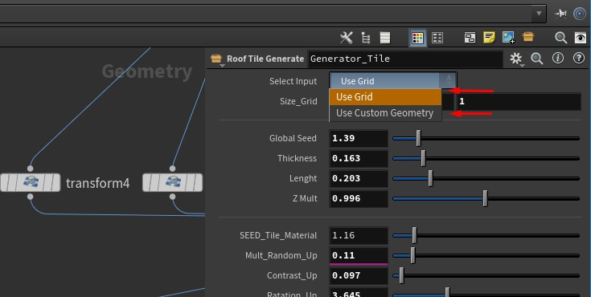
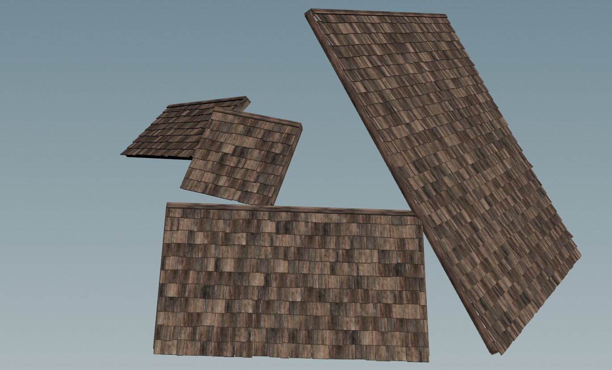
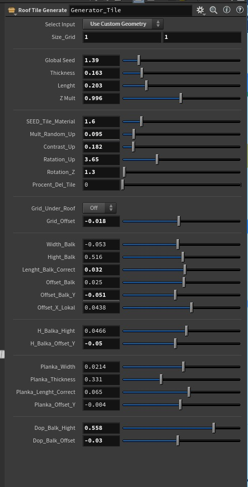
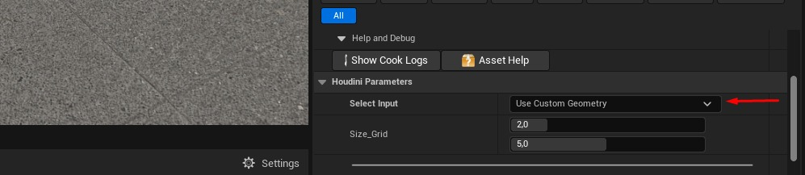
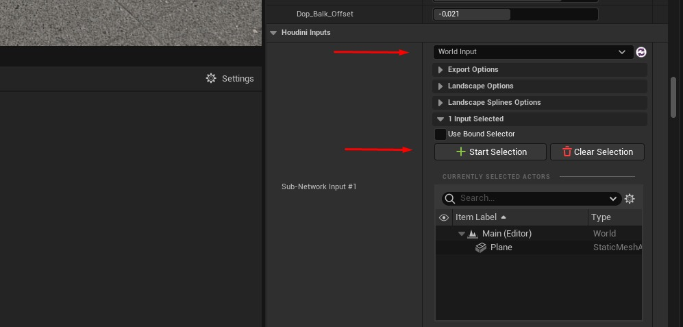
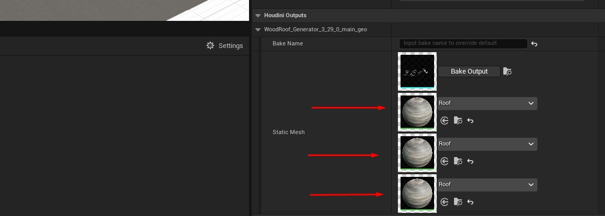
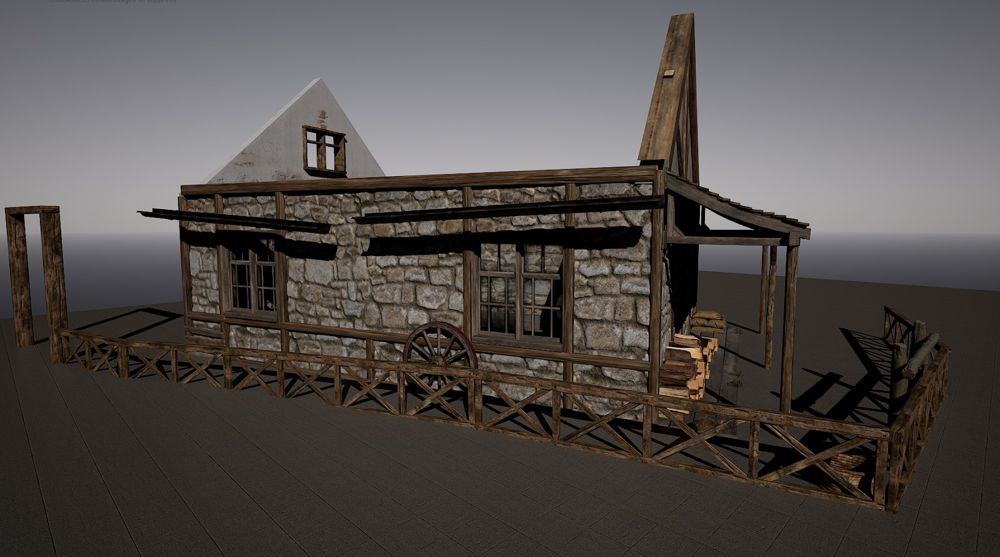
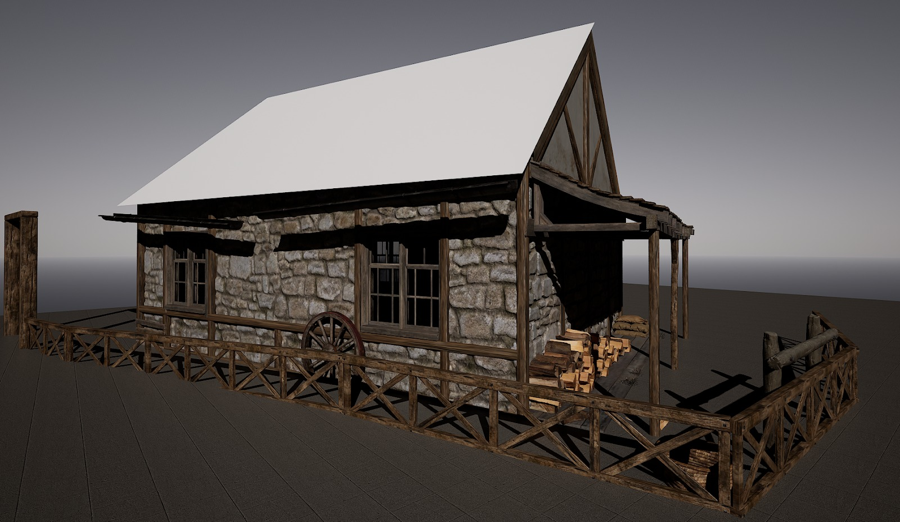
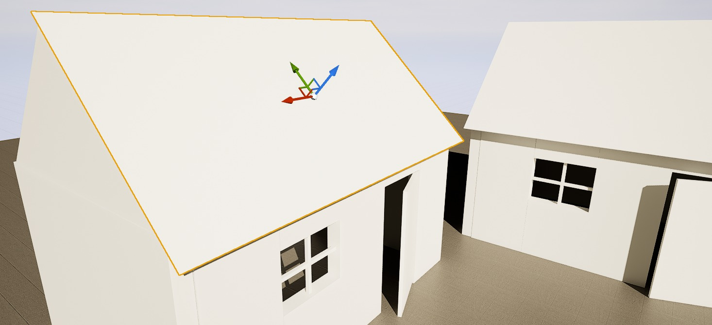
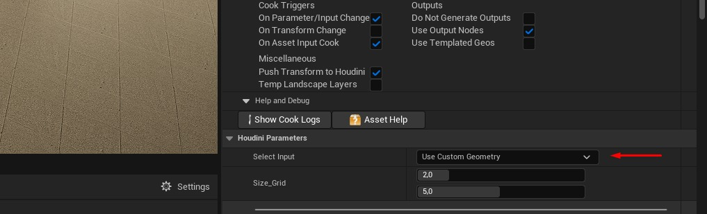

# 使用 Houdini 和 UE5 生成自定义程序屋顶 | ICVR 光落

## 来源与状态

- 原始 URL：https://dev.epicgames.com/community/learning/tutorials/jwne/unreal-engine-custom-procedural-roof-generation-with-houdini-ue5-icvr-lightfall

## 运行时分类

- 类型：图文教程
- 判断：API 未识别到核心视频信号，可整理正文约 6739 字符。

## 摘要

本文概述了我们的程序屋顶生成器工具在动画短片“Lightfall”中用于资产创建的使用。该工具现已公开发布，并附有说明和详细文档。在本文中，我们展示了如何利用屋顶生成器创建复杂的中世纪风格屋顶，提供对瓷砖尺寸、数量和各种其他参数的程序调整，以增强屋顶设计的复杂性和多样性。

## 中文整理

### 使用 Houdini 和 UE5 生成自定义程序屋顶 | ICVR 光落

*以下文档是在动画短片 [Lightfall](https://www.youtube.com/watch?v=bz-4ggzYGMY)（2023 年 Epic MegaGrant 接收项目）制作过程中编译的。* ***此屋顶生成器工具现已公开可用。您可以找到它及其具体说明和文档***[https://github.com/ICVRTeam/Asset-Roof-Generator-Plugin-for-UE](https://github.com/ICVRTeam/Asset-Roof-Generator-Plugin-for-UE)**[https://github.com/ICVRTeam/Asse t-Roof-Generator-Plugin-for-UE](https://github.com/ICVRTeam/Asset-Roof-Generator-Plugin-for-UE)*[此处。](https://github.com/ICVRTeam/Asset-Roof-Generator-Plugin-for-UE) ************** 现在我们将介绍如何在生产中应用该工具的一个用例。

### 屋顶生成器工具的用途

对于 Lightfall 项目，我们设计并完成了一座中世纪风格的城镇。我们的主要目标是收集大量屋顶上有木瓦的房屋。为了解决这个问题，我们需要一种能够从选定表面按程序高效生成图块的工具。该工具必须允许对图块的大小、数量和旋转进行程序调整。此外，它还需要移除部分或全部图块的功能。该工具还必须支持对梁的长度、宽度、数量及其间距和压痕的修改。这些要求对于提高屋顶外观的复杂性和多样性至关重要。

### 胡迪尼

### 概述

屋顶生成器是在 Houdini 程序中创建的，随后使用这些程序之间的特殊桥梁将其导入到虚幻引擎中。该工具的主要工作是根据提供给它的几何图形生成图块。它具有各种设置，可以控制不同的参数，例如尺寸、旋转、厚度、缩进和元素数量。

### 该工具如何工作

- 用户可以选择现成的网格或提交自定义几何图形。

- 选择“现成网格”时，应在 Size_Grid 参数中设置尺寸。 - 使用“自定义几何图形”时，必须选择“使用自定义几何图形”选项。屋顶将在您的平面（表面）位置自动生成。此外，您可以同时处理多个表面（平面）。

- 使用工具参数，您可以实现生成屋顶的不同选项。屋顶生成器具有适合大多数用户的基本设置。然而，为了进行微调，可以设置其他参数。有些参数既有正值也有负值。

### 虚幻引擎

### 将资产导入虚幻引擎

- 要将资源导入虚幻引擎，请在插件设置中启用相应的 Houdini 引擎插件，如屏幕截图所示。 - 然后将屋顶生成器资源导入或拖动到虚幻引擎中所需的文件夹中。 - 要开始使用屋顶生成器，请将资源从内容浏览器拖到视口中。

### 指定自定义几何图形

为了能够将资源分配给自定义（自定义几何体），您需要选择几个重要的设置。

- 将参数切换为**世界输入**，然后单击**开始选择**开始在视口中选择几何体。

- 该资源具有用于三种类型材料的三个插槽：一个用于梁，一个用于木瓦，一个用于分布瓷砖的底层（基材）。

- 配置屋顶外观后，单击“烘焙”以创建无法再更改的静态几何体。

### 在UE中应用屋顶生成器工具

例如，我们有两栋房子，我们需要为其生成瓦片屋顶。

- 使用UE中的网格并将它们放置在我们计划生成瓷砖的房屋上。

- 确保屋脊位于顶部且 Y 轴朝上非常重要。

- 接下来，我们将生成器设置切换为自定义几何体，因为我们想为生成器指定自定义几何体。

- 之后，在Houdini输入选项卡中，我们选择了世界输入而不是默认的“几何输入”。 - 然后，我们可以通过单击“**开始选择**”按钮在视口中选择曲面，在同一选项卡中选择用于生成屋顶的曲面。为方便起见，您可以使用 **SHIFT** 按钮一次选择多个屋顶表面。 - 选择屋顶后，我们的**开始选择**按钮将其名称更改为**使用当前**来应用选择。单击它，我们等待（3-5 个表面大约 3-5 秒）Rood Generator 完成工作。

### 自定义屋顶外观

这是我们的工具生成的基本生成。之后，我们还可以使用屋顶生成器设​​置自定义屋顶的外观。这些设置使我们能够调整瓦片的长度和宽度、瓦片的数量、屋脊厚度、屋顶坡度的悬挑长度以及支撑梁的厚度、长度和位置。我们还可以修改图块种子并启用或禁用特定参数。进行更改后，我们等待了几秒钟，以便生成器应用它们。

### 结果

选择所需的屋顶配置后，我们按下 BAKE 按钮来记录结果。

### 问题与解决方案

当我们指示该工具处理虚幻引擎中的内部几何体（平面）时，出现了一个问题。出现此问题的原因是几何体中包含碰撞，从而干扰了资产的操作。为了解决第一个问题，我们开发了一种算法来检查几何形状。在该工具开始工作之前，它会验证几何形状是否满足必要的要求。验证后，仅处理符合标准的图元。另一个问题是，如果工具的位置和旋转不为 0（即不在原点），则该工具无法正常工作或根本无法工作。为了解决这个问题，我们用数学方法计算了变换矩阵，将几何体移动到原点（0 坐标）。之后，屋顶生成器执行其任务，一旦屋顶生成完成，几何体就会返回到其原始位置。 *我们根据《Lightfall》的制作创建了一系列指南，您可以查看完整列表*[此处](https://dev.epicgames.com/community/profile/apAE8/ICVR)*如果您有兴趣了解更多信息。*

