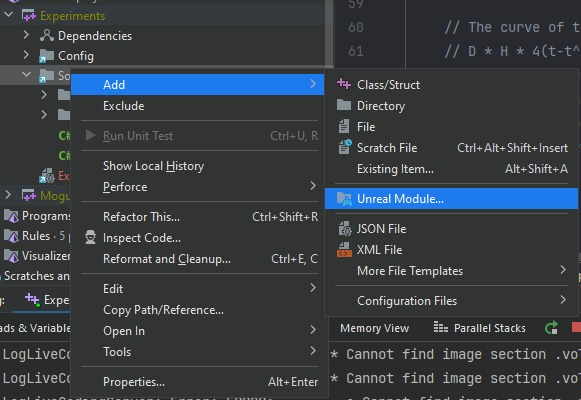

# 自定义可视化组件和显示标志

## 来源与状态

- 原始 URL：https://dev.epicgames.com/community/learning/tutorials/XaE8/unreal-engine-custom-visualization-component-and-show-flags

## 运行时分类

- 类型：图文教程
- 判断：API 未识别到核心视频信号，可整理正文约 15357 字符。

## 摘要

解释如何创建自定义可视化组件，包括自定义显示标志，使您可以轻松切换编辑器中可视化的可见​​性。

## 中文整理

### 概览

在本教程中，我将解释如何为演员创建自定义可视化效果。这可以包括绘制线条、形状（例如球体、盒子、胶囊），甚至定义要绘制的自定义网格。可视化效果将自动更新，与 FComponentVisualizers 不同，可视化效果甚至会在未选择参与者时显示。我还将解释如何向编辑器添加自定义显示标志以轻松启用和禁用可视化。

### 设置

### 编辑器模块

我喜欢将可视化组件移动到编辑器模块。这有利于将我们的游戏代码和编辑器代码分开，但是将我们的可视化组件放在编辑器模块中意味着我们的游戏模块无法直接使用我们的可视化组件。我通过创建 Actor CPP 类的 BP 子类（无论如何您通常都会这样做）并向其添加可视化组件来解决这个问题。如果您不喜欢这样，请随意跳过此步骤，只需在游戏模块中创建可视化组件即可。您也可能希望在构建中使用这些可视化来进行调试；在这种情况下，无论如何将它们放入编辑器模块中都是没有意义的，所以这实际上取决于您的用例。解释如何创建编辑器模块超出了本教程的范围，但 Unreal 社区 wiki 有一篇[好文章](https://unrealcommunity.wiki/creating-an-editor-module-x64nt5g3)，在 Rider 中甚至有一个按钮可以调出一个向导来轻松创建一个编辑器模块。



确保您的主游戏模块在 xxxEditor.Build.cs 中列为依赖项。我们希望能够从编辑器模块引用我们的游戏代码。我们还将引用其他几个模块。

**模块构建依赖关系**

```cpp
PublicDependencyModuleNames.AddRange(
    new string[]
    {
        "Core",
        "UnrealEd", // <--- Add this
        "RHI", // <--- And this
        "Experiments" // <--- My main game module
    }
);
```

### 测试演员

我要做的第一件事是创建一个测试参与者 (AIvyDebugDrawTestActor)，我们将为其创建一个可视化工具。这个测试演员将出现在我的主游戏模块中。如果您已经有一个演员，您正在尝试创建一个可视化组件，那么您显然不需要这样做。

**AIvyDebugDrawTestActor**

```cpp
UCLASS(Abstract)
class EXPERIMENTS_API AIvyDebugDrawTestActor : public AActor
{
	GENERATED_BODY()

public:
	AIvyDebugDrawTestActor();

public:
	// Our visualization component will draw a line to each of the actors in this array
```

我在测试参与者中添加并公开了一个虚拟数组，我们可以在关卡中填充不同的参与者。在这个简单的教程中，我将向 TestChildren 数组中的所有参与者绘制线条。另请注意，我在 UCLASS 宏中将我的演员标记为 Abstract。正如我之前提到的，我将创建一个 BP 子类，并且我想确保人们不会意外实例化这个 C++ 版本，而是使用 BP 版本。

### 创建可视化

创建可视化有两个主要类：实际的可视化组件和我们的自定义调试场景代理。我将此过程分为 3 个步骤：**1。 **我将首先展示可视化组件的轮廓，**2。**我将解释如何创建自定义调试场景代理，**3。 **我将回来实现我在第一部分中概述的可视化组件功能。

### 1. 可视化组件概要

我们要做的第一件事是实际创建可视化组件。我们将继承 UDebugDrawComponent 来创建可视化组件。它为我们的可视化组件提供了一个很好的起点，并为我们做了很多样板设置。

```cpp
UCLASS(ClassGroup=(Custom), meta=(BlueprintSpawnableComponent))
class EXPERIMENTSEDITOR_API UIvyDebugDrawComponent : public UDebugDrawComponent
{
	GENERATED_BODY()

public:
	UIvyDebugDrawComponent();

	virtual FDebugRenderSceneProxy* CreateDebugSceneProxy() override;
```

首先，您将需要覆盖几个函数。 CreateDebugSceneProxy() 是我们大部分工作完成的地方。您可以将场景代理视为我们对象的表示，它向渲染线程描述它应该如何渲染我们的对象。在此函数中，我们将构造一个 FDebugRenderSceneProxy，它是一个特殊的场景代理，具有许多内置功能。在 CalcBounds(const FTransform& LocalToWorld) 中，我们将构建 actor 的边界。这很重要，因为渲染时，如果对象的边界完全超出屏幕，则该对象将被剔除，并且将跳过其渲染。好的，这是我们的可视化组件将包含的内容的概述。我们将立即实现这些功能。首先，让我们快速创建一个自定义调试场景代理。

### 2. 自定义调试场景代理

正如我提到的，我们要做的核心工作是创建场景代理。但是，我们将创建一个自定义子类，而不是使用基本的 FDebugRenderSceneProxy。我们这样做是为了我们可以为场景代理设置一些默认值，并根据需要初始化一些标志。当我们稍后添加自定义显示标志时，它也会很有用。我在 DebugDrawComponent 类声明上方添加了 Scene Proxy 类的声明，它看起来像这样：

**自定义调试场景代理结构**

```cpp
class EXPERIMENTSEDITOR_API FIvyDebugSceneProxy final : public FDebugRenderSceneProxy
{
public:
	FIvyDebugSceneProxy(const UPrimitiveComponent* InComponent);

protected:
	virtual FPrimitiveViewRelevance GetViewRelevance(const FSceneView* View) const override;

	// You only need to override this if you want to perform custom drawing that isn't supported by FDebugRenderSceneProxy's preset shapes
	virtual void GetDynamicMeshElementsForView(const FSceneView* View, const int32 ViewIndex, const FSceneViewFamily& ViewFamily, const uint32 VisibilityMap, FMeshElementCollector& Collector, FMaterialCache& DefaultMaterialCache, FMaterialCache& SolidMeshMaterialCache) const override;
```

让我逐个功能地展示它的实现并解释它在做什么。

### 构造函数

**构造函数**

```cpp
FIvyDebugSceneProxy::FIvyDebugSceneProxy(const UPrimitiveComponent* InComponent)
	: FDebugRenderSceneProxy(InComponent)
{
	// When drawing a shape should we draw it as a solid mesh or a wireframe or both
	// Solid mesh can be much more expensive if drawing lots of shapes
	// We can also override the draw type for each individual shape
	DrawType = EDrawType::WireMesh;
	// Draw alpha is more or less useless and doesn't do at all what you'd expect it to do
	// It only applies to the SolidMesh draw type
	// The equation for the final alpha of a shape is (Color.A * DrawAlpha) % 255
```

首先，对于我们的构造函数，我们可以设置默认的 DrawType 和 DrawAlpha。 DrawType 本质上描述了我们的形状将被绘制的模式，而 DrawAlpha 影响使用 SolidMesh 绘制类型绘制的形状的透明度。请参阅评论以更深入地描述它们的作用。最终我们还将告诉场景代理在构造函数中使用我们的自定义显示标志，但我们会回到这一点。

### 获取视图相关性

**获取视图相关性**

```cpp
FPrimitiveViewRelevance FIvyDebugSceneProxy::GetViewRelevance(const FSceneView* View) const
{
	FPrimitiveViewRelevance ViewRelevance;

	ViewRelevance.bDrawRelevance = IsShown(View) && ViewFlagIndex != INDEX_NONE && View->Family->EngineShowFlags.GetSingleFlag(ViewFlagIndex);
	// We need to enable translucency for if we use DrawType SolidMesh
	ViewRelevance.bSeparateTranslucency = ViewRelevance.bNormalTranslucency = IsShown(View);
	ViewRelevance.bDynamicRelevance = true;
	ViewRelevance.bShadowRelevance = IsShadowCast(View);
	return ViewRelevance;
```

我们的场景代理的视图相关性确定该图元的元素与给定视图的相关性，并从渲染线程调用。在这里我们只是设置一些非常标准的标志。您还会注意到我已经包含了用于检查视图标志的代码。我们还没有实现自定义显示标志，因此目前不会执行任何操作，但是当我们返回并添加自定义显示标志时，这会派上用场。

### 可选功能

调试场景代理中的其余功能是可选的，但我想突出显示它们，以防您需要它们。如果您发现 FDebugRenderSceneProxy 的基本功能不够，则可以使用 GetDynamicMeshElementsForView(...) 执行更多自定义绘图。稍后我将在提示和技巧部分展示如何使用它的示例。如果您确实向 GetDynamicMeshElementsForView(...) 添加了一些功能，那么您可能会向 FDebugRenderSceneProxy 子类添加其他成员变量。如果这些成员变量中的任何一个执行动态分配，您将需要实现最后两个函数以确保您的结构正确地公布其大小。

### 3. 可视化组件实现

好的，现在我们已经创建了自定义调试场景代理，我们可以使用它来实际实现我们的可视化组件。让我们浏览一下可视化组件，看看实现是什么样的。
