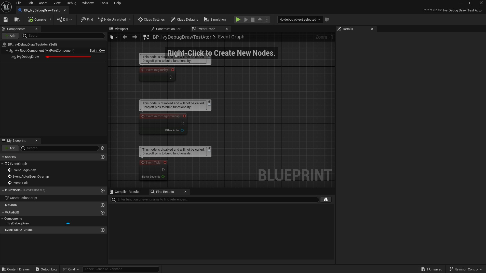
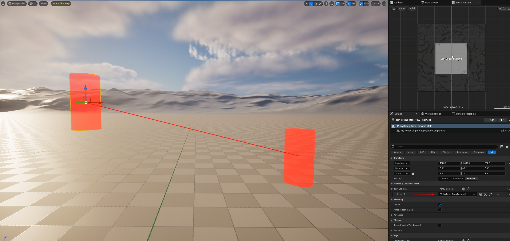
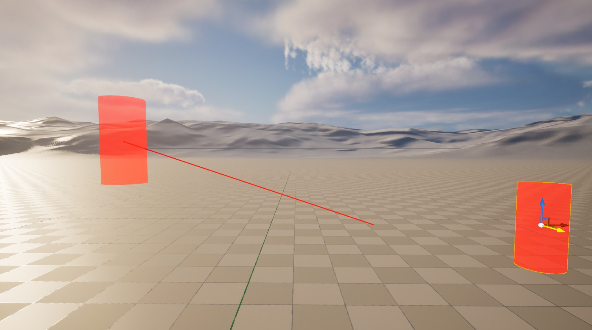

# 自定义可视化组件和显示标志

### 构造函数

**构造函数**

```cpp
UIvyDebugDrawComponent::UIvyDebugDrawComponent()
{
	PrimaryComponentTick.bCanEverTick = false;
	
	SetCastShadow(false);
	SetHiddenInGame(true);
	bVisibleInReflectionCaptures = false;
	bVisibleInRayTracing = false;
	bVisibleInRealTimeSkyCaptures = false;
	// Exclude this component from non-editor builds
```

与大多数构造函数一样，这里我们只是为可视化组件设置许多默认值。 bIsEditorOnly 确保我们的可视化组件被排除在非编辑器构建之外。如果您计划在构建中使用此组件进行调试，请明显关闭此功能。

### 创建调试场景代理

**创建调试场景代理**

```cpp
FDebugRenderSceneProxy* UIvyDebugDrawComponent::CreateDebugSceneProxy()
{
	FIvyDebugSceneProxy* Ret = new FIvyDebugSceneProxy(this);

	if(AIvyDebugDrawTestActor* TestActor = Cast<AIvyDebugDrawTestActor>(GetOwner()))
	{
		// Example drawing lines to all the actors we're referencing
		for(const AActor* OtherActor : TestActor->TestChildren)
		{
			if(OtherActor)
```

这是最重要的。 CreateDebugSceneProxy 是我们实际构建要显示的形状的地方。在这里您可以看到我正在获取该组件所附加的 actor，并检查它是否是我们之前创建的测试 actor。如果是，那么我将添加一条线来绘制数组中的每个有效演员。 FDebugRenderSceneProxy 包含一堆要绘制的形状的数组。我们告诉场景代理要绘制什么形状的方法是将它们的定义添加到这些数组中。这就是我通过放置 Lines 数组所做的事情。稍后，当 FDebugRenderSceneProxy 实际绘制时，它将使用此数据来决定绘制什么。我还向其各自的数组添加了一个圆柱体，以便在我们的组件位置（即我们所附加的演员的位置）绘制。在这里您还可以看到如何逐个形状地覆盖 DrawType。在这里，我决定让这个圆柱体成为一个实体网格。另请注意，当使用 SolidMesh 绘制类型时，我们可以通过更改传入颜色的 alpha 值（或通过更改 DrawAlpha 值，但请参阅我之前的评论，了解我认为您不应该使用它的原因）来制作半透明形状。

### 计算范围

**计算范围**

```cpp
FBoxSphereBounds UIvyDebugDrawComponent::CalcBounds(const FTransform& LocalToWorld) const
{
	FBoxSphereBounds::Builder BoundsBuilder;
	BoundsBuilder += Super::CalcBounds(LocalToWorld);
	// Add initial sphere bounds so if we have no TestChildren our bounds will still be non-zero
	BoundsBuilder += FSphere(GetComponentLocation(), 50.f);
	if(AIvyDebugDrawTestActor* TestActor = Cast<AIvyDebugDrawTestActor>(GetOwner()))
	{
		// Expand our bounds to include all our TestChildren
		for(const AActor* OtherActor : TestActor->TestChildren)
```

最后，我们必须确保组件边界正确，以便它在屏幕上和屏幕外时都能正确渲染。在这里，我所做的就是构建一些边界，其中包括我们要绘制线条的所有演员。

### 应重新创建代理更新变换

这是一个简单的覆盖，只是确保每当我们的变换更新时（即每当我们移动拥有的 Actor 时），我们总是重新计算我们的场景代理。

### 测试

现在我们可以在编辑器中测试我们的可视化组件。

### 创建 BP 测试 Actor



这一步非常简单。我只是创建测试参与者的蓝图子类并添加我们的可视化组件。

### 在关卡中使用可视化

现在我可以将多个测试参与者拖到测试关卡中。我将其中一个添加到另一个的 TestChildren 数组中，我们将在它们之间绘制一条线。



### 结论

这应该就是让可视化工具的核心功能正常工作所需的全部内容。在这里，我只是绘制了线条和圆柱体，但请记住，有大量的形状可供使用，您可以从父演员那里获取任何您想要的数据来驱动可视化。然而，我仍然有一些重要的提示、技巧和陷阱。最后，我还将快速向您展示如何通过可视化组件设置和使用自定义显示标志。

### 提示、技巧和陷阱

这里有一些制作您自己的可视化时的最后提示、技巧和陷阱。

### 可视化未更新

目前，只有当您移动拥有的 Actor 或对拥有的 Actor 进行更改时，可视化才会更新。但是，例如，如果您移动 TestChildren 数组中的参与者。该线条不会更新以指向演员的新位置。这是因为除非我们明确指示，否则我们的场景代理不会更新。



有几种方法可以解决这个问题，但它们几乎都涉及在我们的可视化组件上调用 MarkRenderStateDirty()。调用此函数将导致我们的场景代理更新，从而更新我们的可视化。有几种方法可以做到这一点。一般来说，您应该致力于检测可视化何时过时并进行更新。例如，在这种情况下，您可以覆盖可视化组件的 OnRegister 函数并监听 actor 何时移动，如果它是 TestChildren actor 之一，则 MarkRenderStateDirty()

**聆听演员的所有动作**

```cpp
void UIvyDebugDrawComponent::OnRegister()
{
	Super::OnRegister();

	IvyDebugDrawTestActorOwner = GetOwner<AIvyDebugDrawTestActor>();

	ActorMovedDelegateHandle = GEngine->OnActorMoved().AddWeakLambda(this, [this](AActor* MovedActor)
	{
		if(IvyDebugDrawTestActorOwner.IsValid())
		{
```

这有点矫枉过正，因为现在您正在监听编辑器中的所有演员动作。另一个解决方案是，如果我们可以将 TestChildren 数组限制为某些已知的 actor 类型 - 例如，如果您将 TestChildren 限制为仅包含其他测试 actor 的数组 - 那么您可以将 OnMoved 委托添加到我们的测试 actor 类中，并从 actor 的 PostEditMove 中广播它。然后，您的可视化组件可以侦听该特定事件，而不必检查每个演员的动作。我将把这个实现留给读者作为练习。最后，最简单的解决方案是只需勾选可视化组件并定期将渲染状态标记为脏。您可以将刻度间隔设置为 1 秒之类的低值，现在您的可视化只会暂时过时。

**更新构造函数**

```cpp
UIvyDebugDrawComponent::UIvyDebugDrawComponent()
{
	PrimaryComponentTick.bCanEverTick = true;
	PrimaryComponentTick.TickInterval = 1.f;
	bTickInEditor = true;

	// Rest of the constructor is the same
	// ...
}
```

**添加勾选功能**

```cpp
void UIvyDebugDrawComponent::TickComponent(float DeltaTime, ELevelTick TickType,
                                           FActorComponentTickFunction* ThisTickFunction)
{
	Super::TickComponent(DeltaTime, TickType, ThisTickFunction);

	MarkRenderStateDirty();
}
```

### 使用 GetDynamicMeshElementsForView 自定义形状

如果 FDebugRenderSceneProxy 提供的形状还不够，那么您可以随意重写 GetDynamicMeshElementsForView(...) 来执行您自己的绘制。您可以查看 FDebugRenderSceneProxy 对此函数的实现，以了解其工作原理。以下是一些注释，解释了使用圆弧绘制的方法，该圆弧绘制本身并不像其他形状那样公开为数组

```cpp
void FIvyDebugSceneProxy::GetDynamicMeshElementsForView(const FSceneView* View, const int32 ViewIndex,
	const FSceneViewFamily& ViewFamily, const uint32 VisibilityMap, FMeshElementCollector& Collector,
	FMaterialCache& DefaultMaterialCache, FMaterialCache& SolidMeshMaterialCache) const
{
	// This parent call is where the DebugRenderSceneProxy actually does the work of drawing all the lines and shapes we asked it to
	FDebugRenderSceneProxy::GetDynamicMeshElementsForView(View, ViewIndex, ViewFamily, VisibilityMap, Collector,
	                                                      DefaultMaterialCache, SolidMeshMaterialCache);

	// However we can also add our own manual draw commands as well.
	// FDebugRenderSceneProxy has some nice helpers to draw some other shapes that aren't exposed like the other shapes are
```
