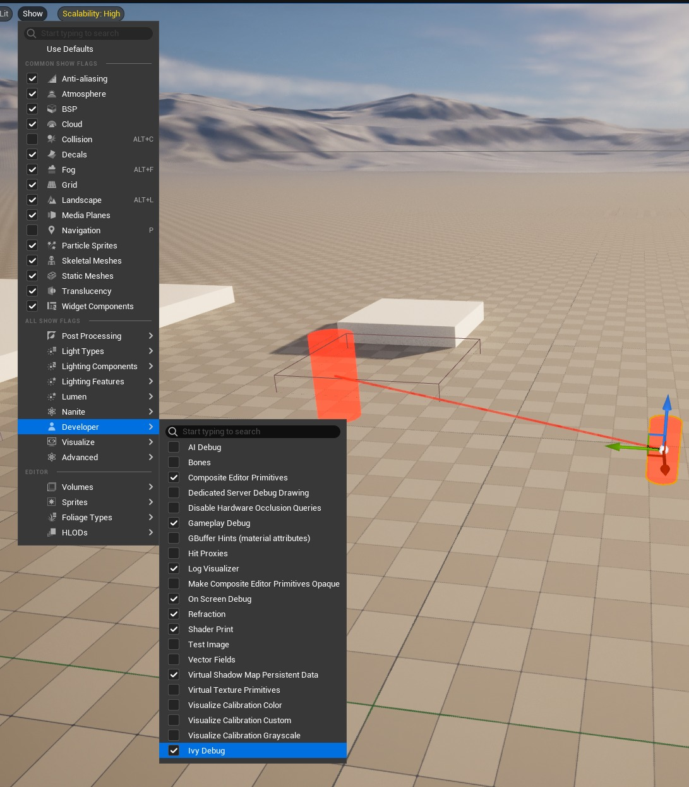

# 自定义可视化组件和显示标志

### 定制展示旗帜

现在我们已经启动并运行了可视化组件，我们可以添加自定义显示标志来启用和禁用可视化。您还可以在其他地方使用“显示标志”，而不仅仅是可视化组件。然而，将它们与可视化组件一起使用非常容易。首先我们必须创建我们的显示标志。我在 cpp 文件的顶部添加了我的可视化组件。

```cpp
namespace Ivy { namespace Editor {

	// Editor show flag used to turn on and off encounter visualization components
	TCustomShowFlag<> ShowIvyDebug(TEXT("IvyDebug"), true /*DefaultEnabled*/, SFG_Developer, FText::FromString("Ivy Debug"));
	
} } // Ivy::Editor
```

接下来，在调试场景代理构造函数中，您必须添加对我们创建的显示标志的引用。

```cpp
FIvyDebugSceneProxy::FIvyDebugSceneProxy(const UPrimitiveComponent* InComponent)
	: FDebugRenderSceneProxy(InComponent)
{
	// ...
	// Rest of constructor is the same

	// Set the show flag for this scene proxy to be the one we've created
	ViewFlagName = TEXT("IvyDebug");
	ViewFlagIndex = static_cast<uint32>(FEngineShowFlags::FindIndexByName(*ViewFlagName));
}
```

请记住，当我们为调试场景代理设置视图相关性时，我们让它检查显示标志，因此检查视图标志的代码现在实际上会执行某些操作。

```cpp
FPrimitiveViewRelevance FIvyDebugSceneProxy::GetViewRelevance(const FSceneView* View) const
{
	FPrimitiveViewRelevance ViewRelevance;

	ViewRelevance.bDrawRelevance = IsShown(View) && ViewFlagIndex != INDEX_NONE && View->Family->EngineShowFlags.GetSingleFlag(ViewFlagIndex);

	// ...
}
```

就这样吧。现在，一个新的显示标志应该出现在“显示标志”菜单的“开发人员”部分下（假设这是您选择的部分），启用和禁用它将会启用和禁用您的可视化。



此外，这里有一个函数可以轻松地从任何地方检索显示标志的状态。如果正在完成一些仅针对可视化的处理，并且在可视化关闭时可以将其禁用，那么检查它可能会很有用。

**检查自定义显示标志**

```cpp
bool UIvyDebugDrawComponent::IsIvyDebugDrawShowFlagSet(const UWorld* World)
{
	const uint32 ShowFlagIndex = static_cast<uint32>(FEngineShowFlags::FindIndexByName(TEXT("IvyDebug")));
	
	bool bShowFlagSet = false;

	FWorldContext* WorldContext = GEngine->GetWorldContextFromWorld(World);

#if WITH_EDITOR
	if(GEditor && WorldContext && WorldContext->WorldType != EWorldType::Game)
```

如果您不想禁用整个可视化，也可以使用它。例如，也许您只想禁用我们的测试可视化中的线条，但保留圆柱体。为了实现这一点，您可以删除显示标志与调试场景代理视图相关性的绑定，而是使用上述函数检查显示标志，以更改在 CreateDebugSceneProxy() 中构建场景代理的方式
