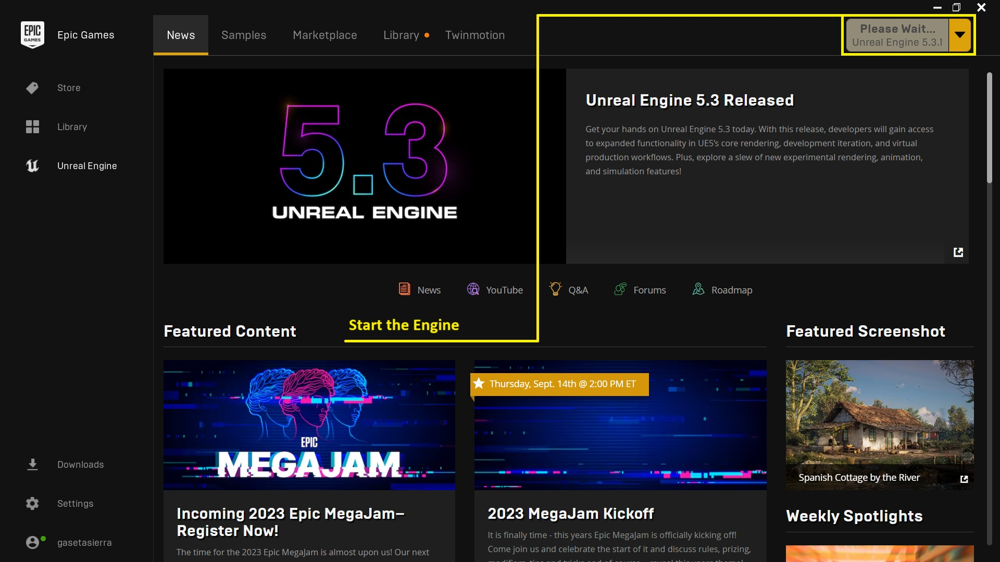
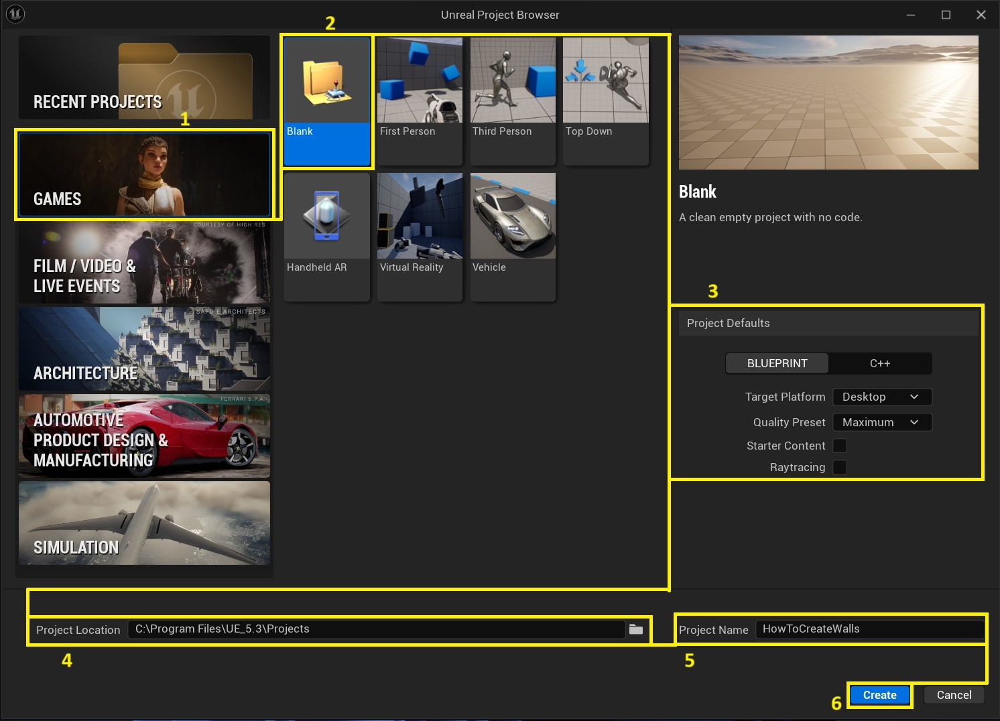
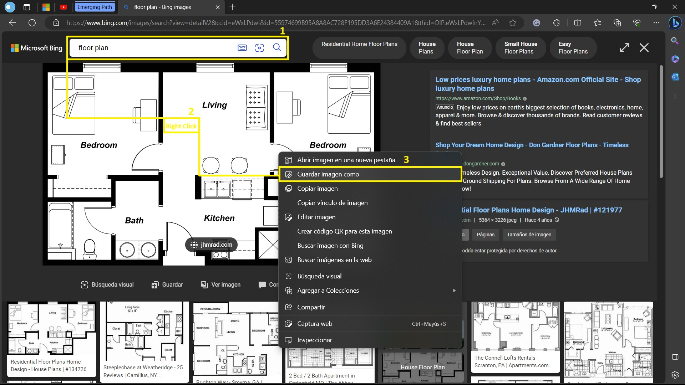
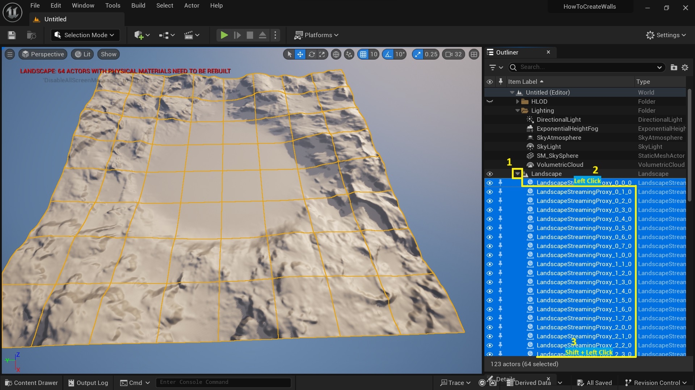
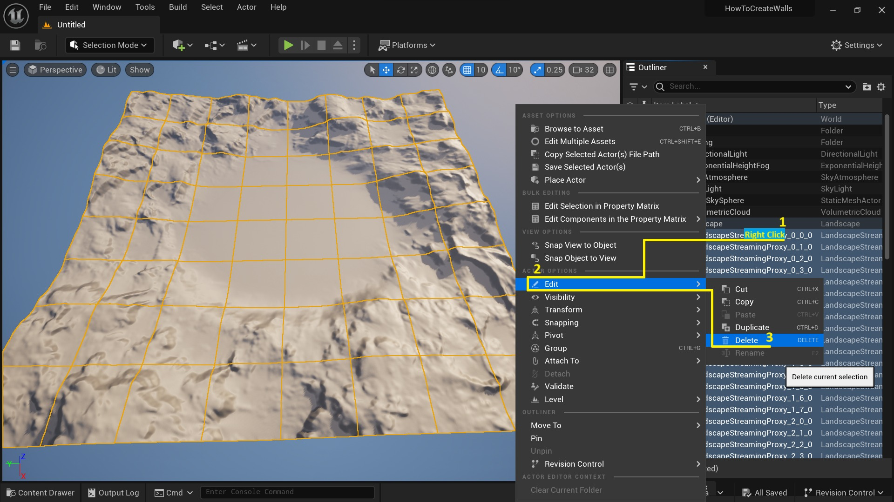
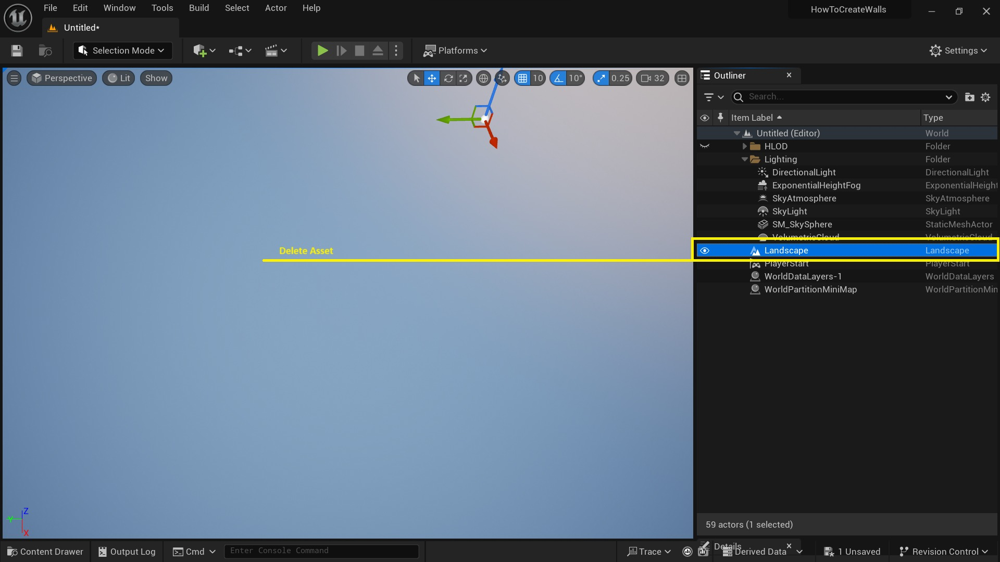
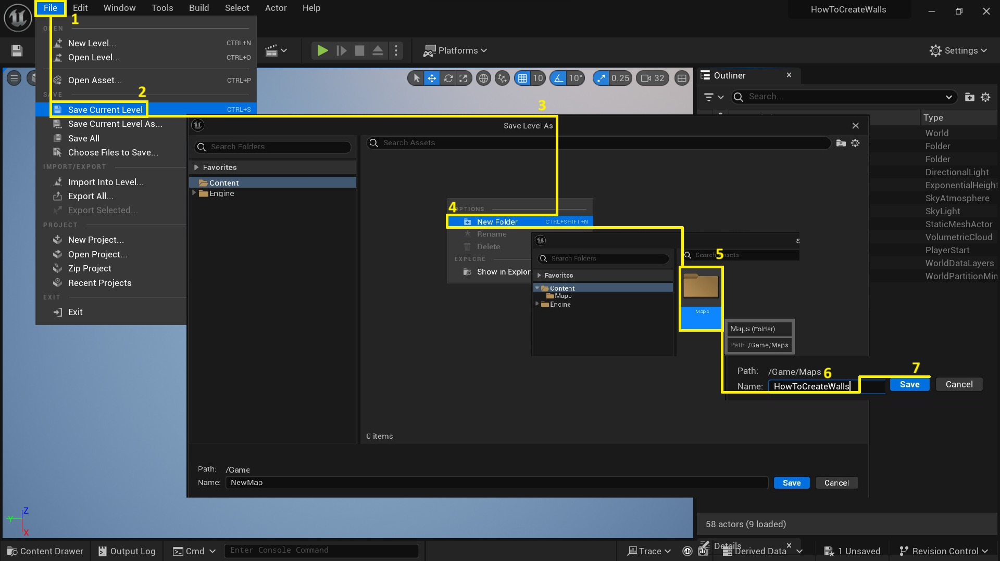
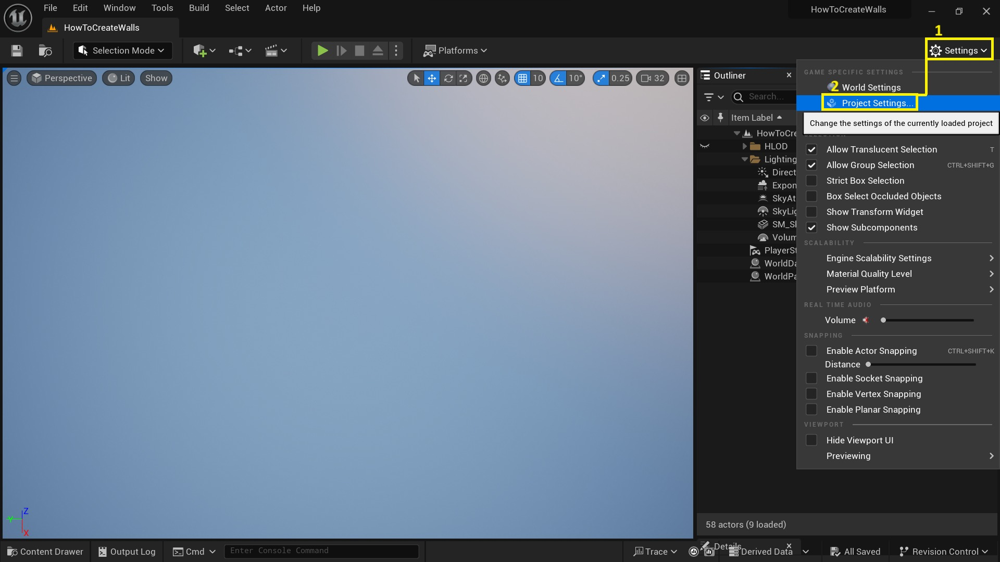
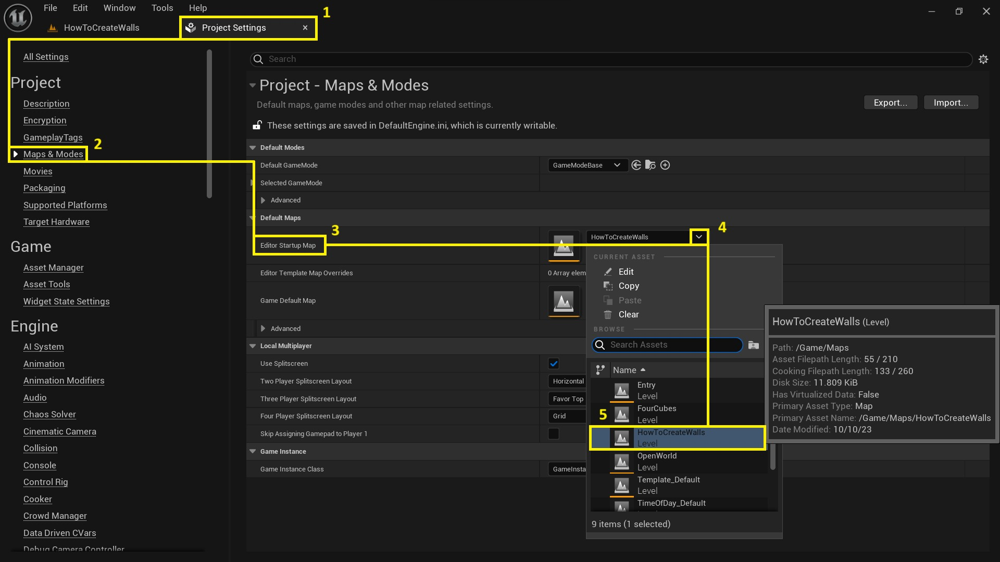
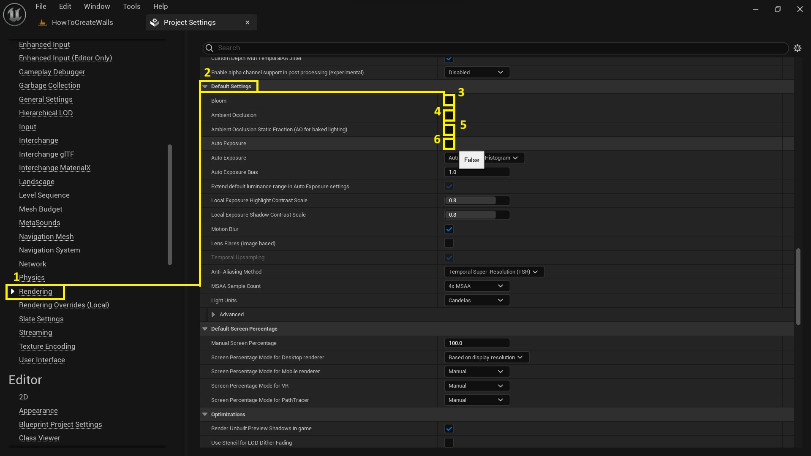

# 平面图建模教程

## 来源与状态

- 原始 URL：https://dev.epicgames.com/community/learning/tutorials/EDbW/unreal-engine-floor-plan-modeling-tutorial

## 运行时分类

- 类型：图文教程
- 判断：API 未识别到核心视频信号，可整理正文约 11565 字符。

## 摘要

虚幻引擎 5.3 是一款实时 3D 创建工具，允许用户创建建筑物和房间的数字表示。在本教程中，您将学习如何使用虚幻引擎 5.3 的建模模式从头开始对平面图进行建模。

## 中文整理

### 步骤1

从 Epic Games Launcher 启动引擎。

### 步骤2

使用游戏类别和空白模板创建一个项目，在项目默认值中选择虚幻引擎可视化编程语言“蓝图”，目标平台选择 Destokp，质量预设选择 Maximun 并取消选中 Starter Content 和 Raytracing 框，然后选择项目的位置，为其命名并单击“创建”按钮完成。

### 步骤3

启动引擎时，您可以在互联网上搜索植物（如果没有），转到网络浏览器，在搜索栏中输入平面图，选择您想要建模的图像并验证它是否可以免费下载，右键单击图像，然后在上下文菜单中选择选项保存并单击“保存”。

### 步骤4

在编辑器内，转到大纲视图并选择景观资源。展开资产的项目并通过单击第一个项目然后滚动到最后一个项目来选择它们。按 Shift + 单击以级联选择所有资源。

### 步骤5

右键单击所选资源，然后从编辑下拉菜单中选择删除选项（或按键盘上的删除键）。

### 步骤6

通过重复前面的过程或按键盘上的删除键来删除景观资源。

### 步骤7

转到文件菜单，选择保存当前级别选项。在“将级别另存为”弹出窗口中，右键单击并选择“新建文件夹”，在“内容”文件夹中创建一个新文件夹。将其命名为地图。然后，输入关卡名称（默认 NewMap）并单击“保存”按钮完成。

### 步骤8

转到设置菜单并选择项目设置选项。

### 步骤9

在“项目设置”中，转到“编辑器启动图”并选择您已保存的级别。

### 步骤10

在项目设置菜单中查找“渲染”选项，然后在“默认设置”类别中取消选中“Bloom”、“环境光遮挡”、“环境光遮挡静态分数”（用于烘焙光照的 AO）和“自动曝光”框。

### 第11步

关闭项目设置选项卡。

### 步骤12

转到设置菜单并打开世界设置窗口。

### 步骤13

在设置选项卡下查找“Lightmass”类别，然后下拉“Lightmass 设置”项目，取消选中“压缩 Lightmass”复选框。

### 第14步

关闭世界设置选项卡。

### 步骤15

转到“放置角色”下拉菜单，然后在其中选择“放置角色面板”选项，在“放置角色”面板中选择形状菜单。找到“平面”形状并将其拖到编辑器中。

### 第16步

单击“内容抽屉”（或按 Ctrl + 空格键）打开内容浏览器，然后通过右键单击并选择“新建文件夹”选项在内容中创建一个新文件夹，将其命名为 FloorPlan，然后按 Enter 完成操作。

### 步骤17

通过将平面图拖到创建的文件夹中来导入平面图，这将创建纹理。

### 步骤18

将纹理添加到之前创建的平面形状中，您可以将其从内容浏览器中拖放到资源平面上。

### 步骤19

关闭演员位置面板。

### 第20步

激活关卡视口的顶视图（可以使用快捷键 Alt + J）。

### 第21步

从大纲视图中选择资源，然后按 F 键将其聚焦在视口中。

### 第22步

进入查看模式并选择熄灭模式以显示平面图。

### 步骤23

然后从“显示”菜单中我们停用“网格”。

### 步骤24

我们从“创建”菜单中添加立方体形状。

### 步骤25

我们将立方体缩放到 0.9，相当于门的默认宽度 90 厘米。

### 步骤26

我们参考门的宽度来缩放资产平面。

### 步骤27

我们可以通过使用滚动（鼠标中键）+ Alt 键单击资产平面的 Gizmo 来移动它，一旦定位到所需位置，右键单击并在弹出窗口中选择菜单类别，然后单击“设置为轴偏移”。

### 步骤28

我们将立方体的一侧边缘放置在门的一侧边缘上。

### 步骤29

我们缩放资产平面，直到立方体的宽度与门的直径匹配。我们对相反轴上的另一扇门重复此过程。

### 步骤30

将视口更改为透视（快捷键 Alt + G）。

### 步骤31

从“模式”下拉菜单（或使用快捷键 Shift + 5）转到“建模模式”，选择“创建”类别并选择“长方体”，在“PolyGroup Mode”属性中选择“Per Face”选项。 *注意：在 Height 属性中使用值 300，它对应于 3 米，是房屋墙壁的平均高度。*

### 步骤32

我们将盒子放置在墙的边界处。

### 步骤33

选择资源并转到“模型”类别，然后选择“PolyGroup 编辑”工具。

### 步骤34

激活 PolyGroups 编辑工具后，我们选择与墙壁异相的面，并使用小控件拖动它，直到体积与计划中的墙壁具有相同的厚度。 *注意：请记住，如果您使用 ESC 键取消选择工具内的元素，您可以退出工具并删除进度，建议单击对象外部以取消选择面、边或顶点。*

### 步骤35

将体积调整为墙的厚度后，我们选择与边缘相对的面，然后拖动它，直到找到与墙的分叉。

### 步骤36

一旦找到新墙的边界，我们选择“拉伸”属性，并拉伸以完成我们找到的墙的厚度。

### 步骤37

再次，我们再次使用拉伸工具，直到到达新墙的边缘。

### 步骤38

我们重复此过程，直到完成所有墙壁，我们还挤出横向墙壁的面。 *注意：使用拉伸工具很重要，因为它将为横向壁的面创建必要的边缘。*

### 步骤39

如果我们省略了任何墙的边缘创建，我们可以使用“插入边缘循环”属性来创建相应的轴来挤出剩余的面。

### 步骤40

我们还可以使用合并属性来连接两个面，以防它们分开。为此，首先用左键单击选择一侧，然后按住 Shift 键，单击另一侧。

### 步骤41

要完成编辑并接受更改，请单击接受按钮，这将使用开发的模型创建静态网格体。

### 步骤42

如果工厂有隔热墙，我们返回到建模模式，创建类别并创建一个盒子，其高度与之前的盒子 300 相同。

### 步骤43

使用 PolyGroups 编辑工具，我们将面调整为墙的尺寸，并单击“接受”按钮接受更改。

### 步骤44

为了连接在单个静态网格体中创建的对象，我们将使用合并工具。从视口或大纲视图中选择资源，然后在建模模式下，转到“Xform”类别，选择“合并”工具，在属性面板中选择“新建对象”属性，写入我们想要的资源名称，选择“静态网格”作为输出类型，然后在“处理输入”中选择“删除输入”，使用“接受”按钮完成操作，这将使用所选输入创建一个静态网格，并将从视口中删除初始输入。

### 步骤45

我们使用键盘快捷键 Ctrl + Space 打开内容浏览器，创建一个新文件夹并将其命名为 Materials，在该文件夹中创建一个材质类，将其命名为 M_Walls，然后按 Enter 键完成。 *注意：要打开用于创建文件夹和材料的上下文菜单，请右键单击内容浏览器。*

### 步骤46

我们通过单击创建的材质打开材质编辑器，在编辑器中左键单击并写入常量，分配值 1 并将其连接到基色，我们可以在视口中看到材质将如何变成白色，保存更改并关闭选项卡。

### 步骤47

通过在视口中单击墙壁的静态网格体或从大纲视图中单击资源来选择墙壁的静态网格体，然后使用键盘快捷键 Ctrl + Space 或单击内容抽屉打开内容浏览器，转到我们之前创建的文件夹“Materials”并选择材质 W_Wall，从内容浏览器中选择的材质我们转到“详细信息”面板，在“材质”类别中，我们将找到“元素 0”，我们单击“使用内容浏览器中的选定资源”按钮，或者我们也可以通过将材质从内容浏览器拖放到视口中的活动材质上来应用该材质。

### 步骤48

现在，我们可以在视口中可视化应用了材质的墙壁。

### 步骤49

要在墙上创建窗孔，我们从视口或大纲视图中选择资源，然后将其隐藏。

### 步骤50

从建模模式中，转到创建类别并选择框工具。创建一个具有窗口尺寸的盒子。如果您没有尺寸，则可以使用多边形组编辑工具以平面图为指导来调整框的大小。

### 步骤51

我们创建与窗口数量相对应的盒子数量，如果窗口尺寸相同，我们可以通过在视口中选择资源并按住 Alt 键并沿某个轴移动它来创建资源的副本。

### 步骤52

为了将盒子放置在相应的高度，我们可以创建一个引导盒子，其窗口开始的平均高度约为 1.2m（盒子的高度为 120）。然后我们将盒子定位在参考盒子的顶部，我们可以帮助我们使用位于右上角的视口的位移控件来实现盒子的正确定位。

### 步骤53

然后，我们通过从视口或大纲视图中选择参考框并按删除键来删除参考框，然后隐藏墙壁的静态网格物体。 *注意：使用位于建模模式的 Xform 类别中的合并工具，我们创建一个包含所有窗孔框的新静态网格物体。为此，我们首先选择框，然后转到该工具。*

### 步骤54

为了创建孔，我们首先选择墙壁的静态网格物体，然后按住 CTRL 键选择盒子的静态网格物体。选择完成后，我们进入模型类别的建模模式，在此我们选择布尔工具，在操作属性中我们选择选项差异 A - B，并在写入“首先输入对象”中，最后在处理输入中我们选择删除输入并接受更改。

### 步骤55

要关闭门顶部的墙壁，我们将使用 PolyGroups 编辑工具，通过插入边缘循环属性，我们在窗户结束的高度处创建一条水平边缘，然后将墙壁上的面挤出。我们完成操作并接受更改。

### 步骤56

对于屋顶，我们创建一个盒子并将其放置在墙壁顶部的一个角落，使墙壁的外轴与盒子的末端重合。然后使用 PolyGroups 编辑工具选择面并使用小控件移动它们，直到覆盖相应的表面。

### 步骤57

我们使用拉伸属性在屋顶上创建植物分叉的边缘。

### 步骤58

一旦我们创建了必要的边缘来形成分叉区域的面，我们将使用推拉工具根据墙壁的形状来界定屋顶的周长。

### 步骤59

屋顶完成后，从大纲视图中选择资源，转到前视图 (ALT + H) 并激活无光照视图模式，通过在按住 Alt 键的同时沿 Z 轴（蓝色）移动资源来创建资源的副本，将资源放置在墙壁下方，我们可以使用线框视图模式来正确放置它，一旦放置资源，这将是我们模型的地板。

### 步骤60

我们已经成功完成了在虚幻引擎 5.3 中完全实现的植物模型。

