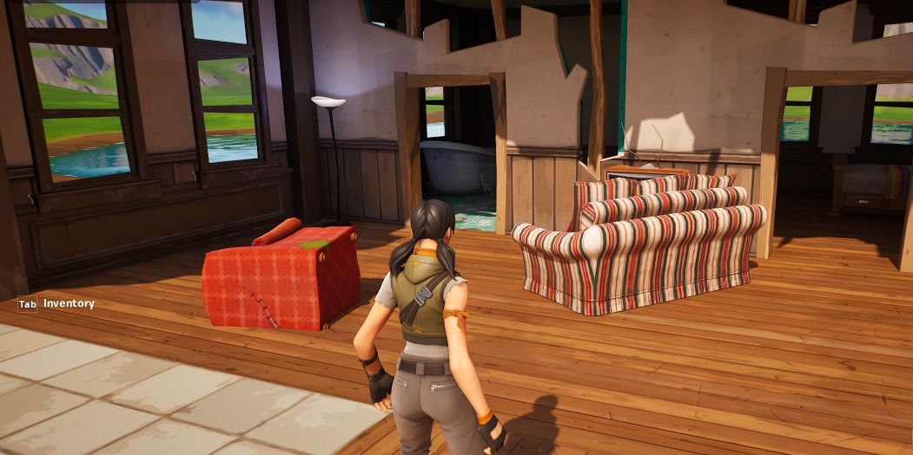
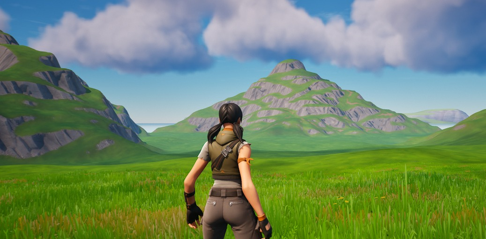
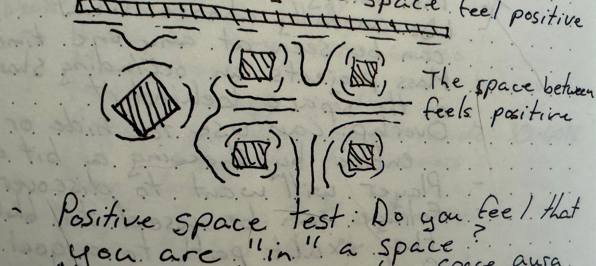
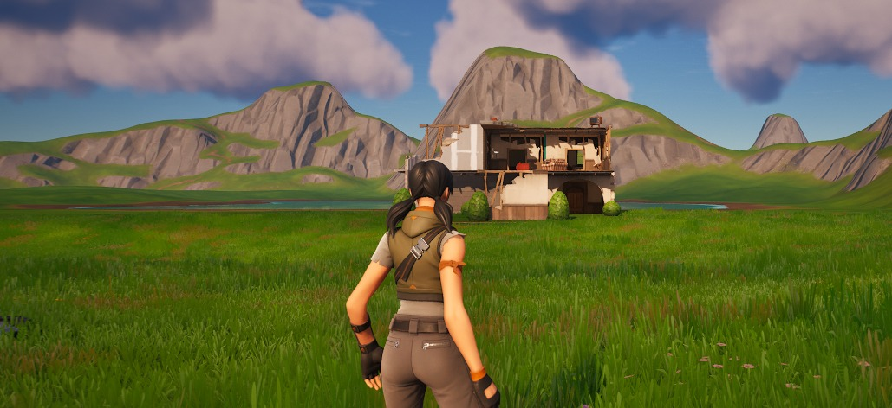
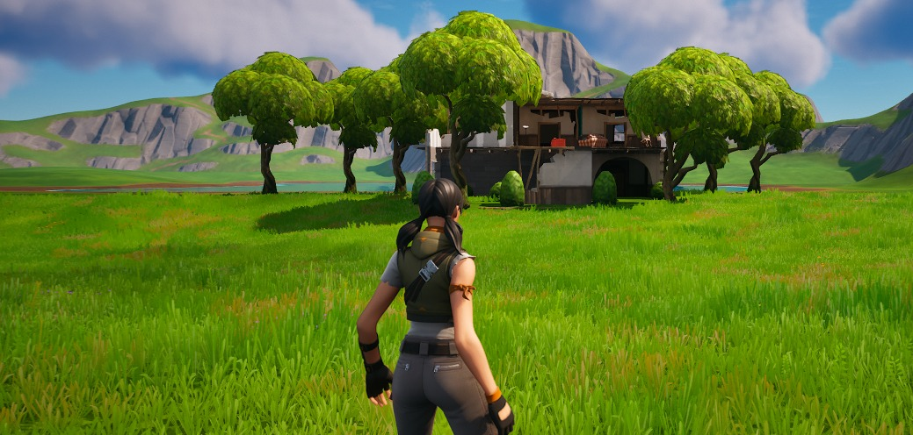
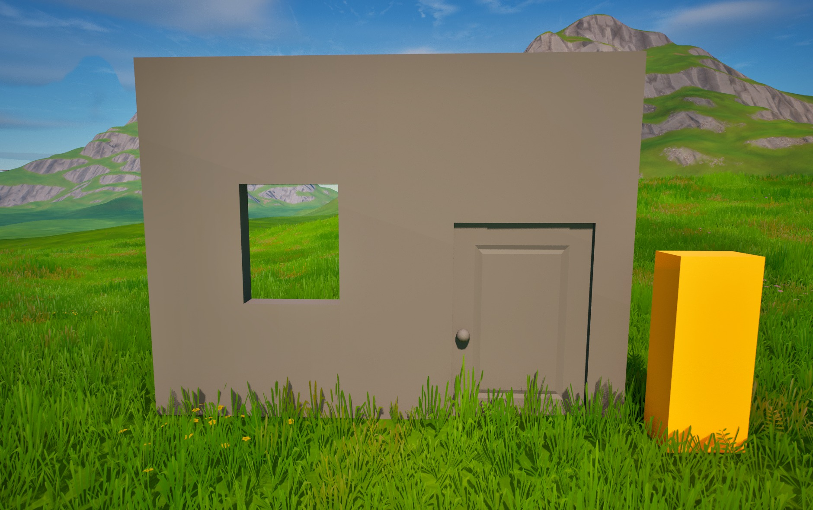
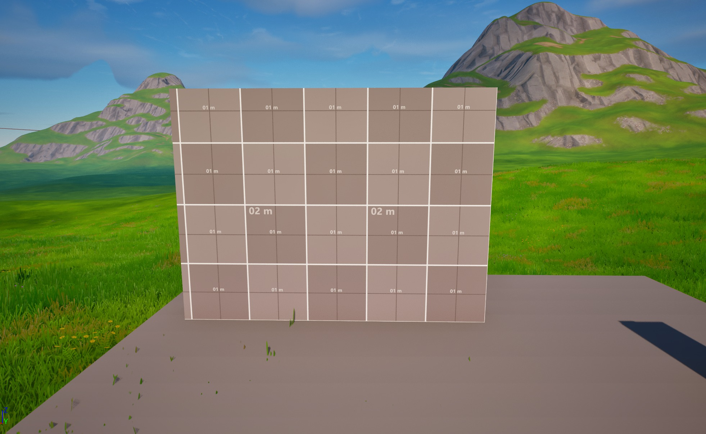
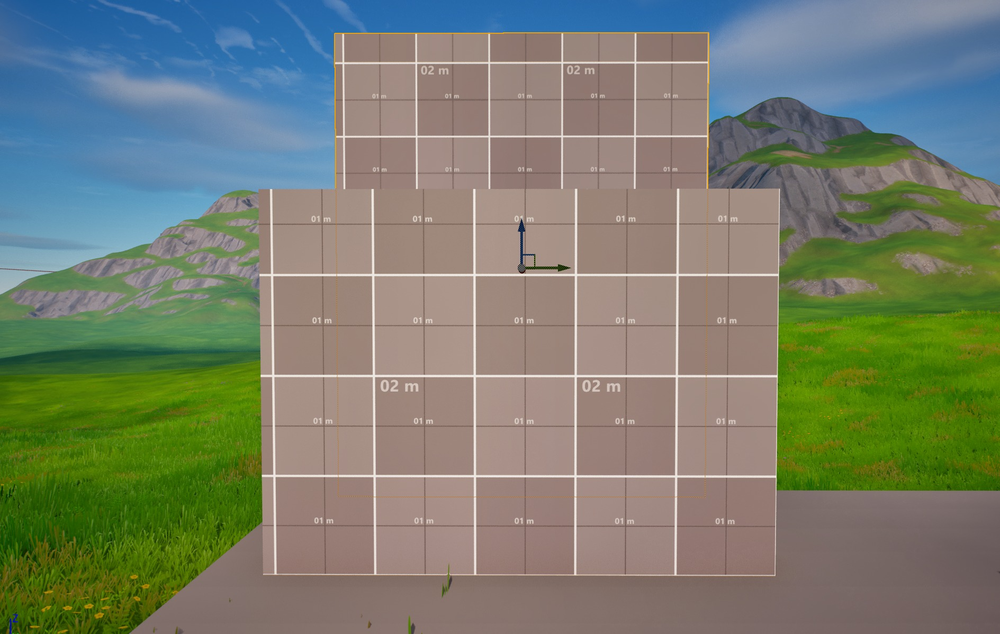
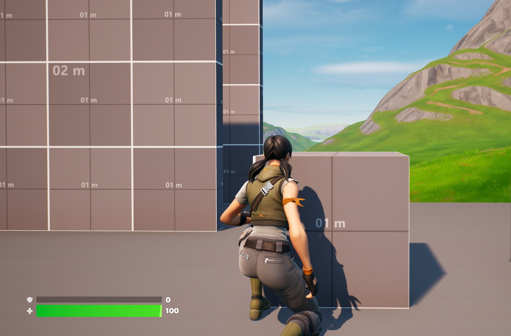
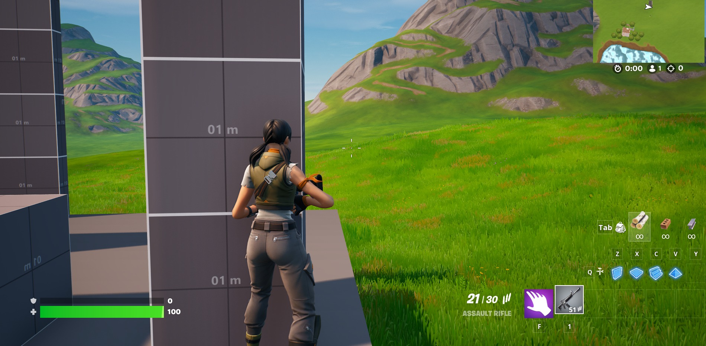

# 关卡设计基础知识

## 来源与状态

- 原始 URL：https://dev.epicgames.com/community/learning/tutorials/3VKJ/unreal-engine-fortnite-level-design-fundamentals

## 运行时分类

- 类型：图文教程
- 判断：API 未识别到核心视频信号，可整理正文约 32042 字符。

## 摘要

关卡设计包含多种技能。一般关卡设计师在设计游戏空间时会考虑整体游戏设计、基调、叙事、游戏玩法目标、关卡目标等。每个关卡都必须能够让玩家在短时间内阅读完毕，同时仍能提供有趣的体验。我将解释有效关卡设计背后的基本技术和理论，并提供在 Fortnite 虚幻引擎 (UEFN) 中创建的功能示例。这是一个持续进行的主题系列，本教程将随着更多信息的出现而更新。

## 中文整理

### 概览

- [原始 Twitter 帖子](https://twitter.com/DesignJunkie010/status/1712195467067421149)

### 第 1 部分：可能性空间、玩家动词和形状语言

游戏中的关卡可以定义为玩家尝试使用整体游戏设计提供给他们的机制来完成目标的设定空间。它们通常包括艺术、叙事和其他为动作提供背景的元素。这些东西可以为游戏玩法提供灵感，但关卡首先是游戏空间。这意味着当您为游戏设计关卡时，您需要考虑以下事项： - **可能性空间** - **玩家动词** - **形状语言**

### 可能性空间

任何关卡的主要目标之一都是为玩家设置舞台并定义玩家交互的空间。关卡具有定义空间并创建包含所有可能的操作和结果的脚手架区域的边界。这种可能性空间有助于控制玩家并向他们传达可用于获胜的资源。这些资源可以定义为效用和拒绝。实用资源是游戏关卡中提供诸如掩护或能量提升等好处的对象。拒绝与效用相反，是向玩家拒绝事物的游戏对象，例如拒绝视线的板条箱或消耗玩家资源的敌人。实用性和否认性的混合会产生障碍，迫使玩家即兴发挥并创造性地思考来解决挑战。

### 玩家动词

为了解决这些挑战，您需要向玩家提供一系列以工具、武器和能力形式出现的动作或动词。当您设计关卡时，重要的是它要服务于游戏玩法并满足整体游戏设计的目标。例如，除非有叙事或游戏玩法的原因，否则在游戏中添加一次性潜行关卡是没有意义的，而该游戏本来就是跑动和射击动作。当您为游戏设计关卡时，您可能会清楚地了解游戏的内容。创建动作词列表有助于定义玩家可以使用的工具。然后使用该动词列表来定义关卡中将发生的情况。这样，你的关卡始终服务于游戏的整体目的。那么玩家在《堡垒之夜》中可以执行哪些操作呢？他们可以： - **行走** - **奔跑** - **跳跃** - **滑动** - **蹲伏** - **射击** - **近战** - **拾取** - **使用** 使用 UEFN 和 Verse 编程语言，您可以定义其他动词，但此列表提供了许多动作游戏中的基本游戏玩法的良好图片。

### 形状语言

定义了关卡的可能性并列出了玩家的操作后，您现在可以使用形状语言将其传达给玩家。形状语言是一种看待关卡的方式，也是一种向玩家传授构成游戏的规则和机制的方式： - 动词是玩家的动作和机制 - 名词是关卡内的对象、想法和玩家 - 副词修饰动作。 - 形容词修饰名词并赋予它们目的。他们通过感知与玩家交谈。以下是副词的示例：玩家**安静地**接近守卫。通过这种方式，玩家选择隐身接近，而不是射击或近战守卫。以下是形容词的示例：玩家跳过了地板的**危险**部分。形容词会产生变化，对于关卡设计非常重要。在这里，您要传达的是地板带电、发热或有其他损坏。形状还可以传达实用、否认、危险、感受等信息： - 圆形传达安全性，通常代表发现。 - 方形传达实用性，通常定义具有某种使用形式的区域。它们通常是专门建造的区域和结构的一部分。 - 尖锐的形状传达危险和攻击性。它们告诉玩家这里已经发生或将要发生一些不好的事情。

### 第 2 部分：正/负空间和水平流

关卡设计中的**空间理论**指的是正空间和负空间之间的相互作用，以及它如何影响玩家在关卡中的路径。质量和空白空间之间的相互作用会影响玩家的决策，同时也会产生情感影响。这些功能用于定义您向玩家提供的体验。

### 正空间

**正空间**是固体、有质量或感觉封闭的空间。在积极的空间内，玩家可以更容易地感知边界，并且距离变得可测量。正因为如此，积极的空间很容易让玩家在心理上进行映射，并且他们经常会留在那里。它也有一个身份。当你使用正空间来创造一个房间时，你可以说这是一个壁橱或一个宝藏室。在开放区域更难做到的事情。

正空间中的可能性更加有限，因为它是封闭的并且有明确的界限。这对于驱使玩家进入特定情况非常有用，例如战斗或与特定游戏元素的交互。

### 负空间

实体形状之间的空间称为**负空间**。这可以指大片开放区域，有时也称为空隙。负空间对于玩家来说更难在心理上绘制地图，从而阻碍了玩家测量它的尝试。正因为如此，玩家倾向于快速穿过它并寻找更封闭的空间，这样他们就不会那么暴露。尽管负空间中可以有积极的元素，例如树木或灌木丛，但这些积极的元素通常会混合在一起。

在负空间中感觉可能性是无限的，这可能会导致玩家迷失下一步该做什么。然而，这种类型的空间确实有其用途。

### 玩家认知

玩家对积极和消极的看法不同，关卡设计师可以利用这一点来创造他们的体验。空间对玩家产生拉力，就像重力或磁力一样。

玩家被驱使去寻找积极的空间，因为它们可以很容易地测量和互动，但它也因其坚固和不变的性质而排斥玩家。玩家厌恶负空间，因为他们认为负空间是神秘且永无止境的。然而，他们被可能性和新冒险的承诺所吸引。空间也有情感效应。积极的空间会让玩家感到封闭和受到保护，但如果空间太小，就会产生幽闭恐惧症和紧张感。负空间可以让玩家在狭小的空间中感受到新体验的希望，但将其留在那里太久，玩家会感到暴露并迷失在虚空中。

### 闭塞

实体形状形式的正空间通常用于遮挡关卡中的视线。这称为**遮挡**。形状会投射出阴影，遮挡其后面的内容，例如当玩家使用掩体或使用山丘来设置位置的显示时。关卡设计师使用遮挡来执行以下操作： - 树叶可用于隐藏或模糊玩家到达目标的路径 - 遮挡可用于淡化关卡中不重要的部分 - 重叠形状可以给区域带来深度感 - 重叠还可以强调关卡部分的差异并创建对比度。

三角形是一个有趣的例子。三角形利用其线条和角度将玩家推向左侧或右侧。玩家还明白，越过山等三角形是可能的，但难度更大，而且可能会有所回报。它们阻挡了后面的东西，但当玩家绕过它们的末端时，它们也提供了自然的显示。任天堂在最近的《塞尔达传说》游戏中充分利用了这一点。

### 第 3 部分：测量和标准

在游戏项目早期建立标准测量和比例非常重要。您不仅希望您的关卡根据玩家既定的尺寸感到自然，而且您的关卡还需要能够容易地被玩家理解。改变艺术资产的大小也会产生敬畏、恐惧、幽闭恐惧症和其他情绪的时刻。尽早建立规模对于团队合作也很重要。标准测量对于与团队中的其他设计师以及根据您的草稿创建艺术资产的环境艺术家进行沟通至关重要。

### UEFN 尺寸

在为 Fortnite 使用虚幻引擎时，请务必记住，Fortnite 的设计者已为您设置了一些比例和尺寸值： - 虚幻引擎使用厘米作为其测量标准。 - Fortnite 基于 512 网格构建。 - 大多数尺寸基于 2 的幂。 - 角色平均高 192 厘米，宽 80 厘米。这可以在 UEFN 提供的 **GrayBox ** 示例网格中看到。

墙的宽度为 512 以适合网格，高度为 384 (256+128)。门宽 144，高 216，适合玩家的平均尺寸。窗户宽 105，高 128，以支持普通玩家的操作并保持正确的比例。靠墙的橙色盒子有一个玩家那么大。在关卡周围放置玩家的代表可以帮助您在设计过程中保持规模。了解这些尺寸对于构建关卡和设计自己的艺术资源至关重要。

### 规模对玩家的重要性

设计一个好的游戏关卡的一个重要部分是它能够被玩家**阅读**或快速理解和记忆。玩家应该能够看到一堵墙，知道他们是否可以越过它，或者看到一个网格，知道它是否能很好地掩护其他玩家的攻击。这是通过尽早为关卡元素建立适当的比例值来完成的。例如，在 UEFN 中，玩家可以覆盖任何高度为 520 及以下的网格。

当创建一堵玩家无法攀爬的墙时，您需要创建一堵高度大于 520 的墙。但是，当您设计用于阻挡玩家的墙的尺寸与他们可以覆盖的墙的尺寸太接近时，玩家可能不会注意到其中的差异并感到沮丧。这可能会导致玩家停止玩您的关卡。为了让玩家更容易阅读墙壁，可以定义一个缓冲区大小，将其添加到墙壁元素中，以表明这是无法通过的。例如，这堵墙有 640（512+ 128 缓冲区）高，很容易被认为是不可通行的。

动作游戏中的封面元素也是如此。 **高掩护**元素应该足够高，以将玩家隐藏在较高地面上的敌人面前。 **低掩护**元素应该能够在玩家蹲下时为他们提供合理的掩护。

这可以通过在开发早期设定封面的标准尺寸来实现。例如： - 高掩护应为玩家身高的 1.5 倍或大于 288 - 低掩护应为玩家尺寸的一半或 96 这些值将根据您在项目中建立的尺寸值而变化。支持摄像头 您的关卡设计还必须支持游戏设计的 3C。它们是： - 角色 - 控件 - 摄像机 虽然所有这些都是关键概念，但在谈论关卡设计时讨论摄像机很重要。您的关卡应该足够大，以便能够舒适地容纳游戏中的玩家摄像头。这意味着要有足够大的门、走廊和空间，以便玩家网格和玩家相机能够舒适地安装。根据 UEFN 中建立的比例，使用以下值： - 多层建筑中的每层楼高为 384。 - 走廊的宽度至少应为 256。 - 走廊平均宽度应为 512。 - 走廊宽度不应超过 768。在此示例中，右侧的走廊宽度为 256。它可以容纳玩家的尺寸和摄像头，同时仍然传达出这是一个狭窄的空间。中间的走廊有512宽，感觉就像是一个普通的走廊。中心的走廊有768宽，足够宽以容纳敌人遭遇，而不会感觉像是在街道上进行战斗。

### 第 4 部分：认知绘图

**认知映射**是人们用来理解和记忆空间的心理过程。人们每天在去陌生的地方旅行或进入以前从未去过的空间时都会使用它。认知映射使用以下过程： - 您尝试根据您的进入点获得对新空间位置的一般感觉。 - 您探索小区域，通常是那些有某些激励的区域，例如食物、购物或其他需求。 - 你开始在你所知道的空间之间建立联系，并填充你更大的心理地图的连接空白空间。 - 您根据新知识修改原始地图，试图掌握该空间。我们学习空间的方式取决于我们如何使用空间。想想上次您必须了解一个新城市或购物中心是什么时候。你的大脑可能遵循这个过程。

### 游戏中的认知映射

玩家使用这些相同的技能来绘制新的游戏关卡。为了支持这一过程，关卡设计师需要使空间具有可读性。这意味着要创造一个简单、清晰、可探索、容易满足玩家期望并具有吸引玩家注意力的空间。 - 玩家在游戏中使用认知映射的方式与在现实生活中的使用方式类似： - 玩家将尝试根据他们的入口点获得对关卡空间的总体感觉。这是一个大揭露、远景或让玩家大致了解目标所在位置的好地方。 - 他们探索兴趣点和定义的空间，通常是那些有某种激励的空间，例如资源或能力提升。 - 他们开始在他们所知道的空间之间建立联系，并填补更大的心理地图的空白。 - 他们根据新知识修改原始地图，试图掌握该空间。掌控一个空间可以让玩家感到舒适和成就感。 LD 通过使用形状、颜色、灯光和图案与玩家交流来为他们提供支持。可读空间具有以下属性： - **简单性**：关卡使用可以在头脑中识别的形状。 - **铰接**：关卡中使用的形状易于识别。内部空间界限明确，正/负空间流用于创建穿过楼层的清晰路径。 - **可想象**：玩家可以轻松地在脑海中记住该空间的心理地图，这意味着它不会太大，遵循模式，并且与玩家过去见过的空间相似。 - **心理学**：该计划...

### 技巧

### 第 5 部分：节点、设计模式和城市

### 基于节点的映射

### 设计模式

### 城市

### 第六部分：玩家经济

### 玩家动机

### 玩家奖励类型

### 玩家选择

## 相关链接

- [Original Twitter thread](https://twitter.com/DesignJunkie010/status/1712195467067421149)

