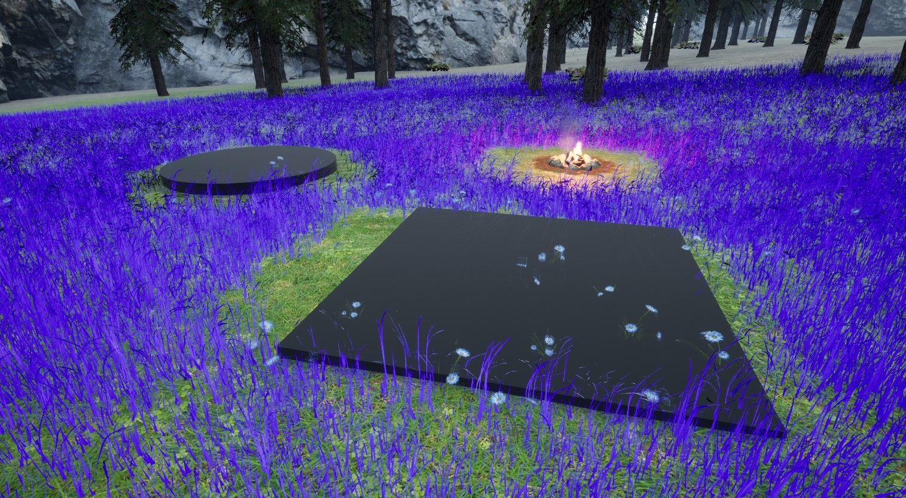
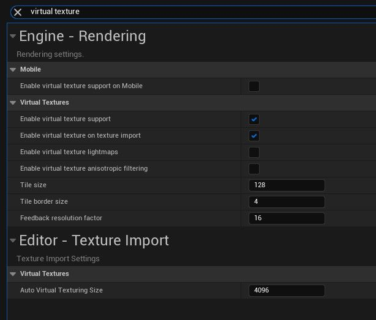
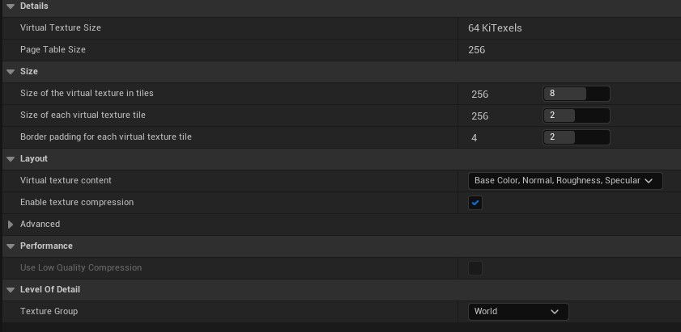
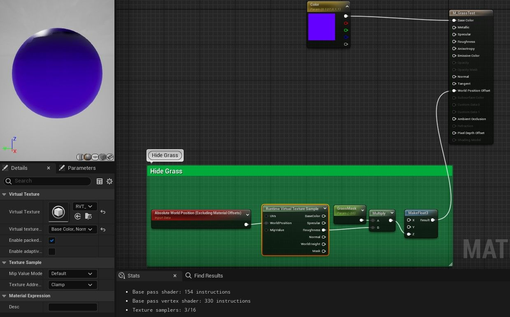
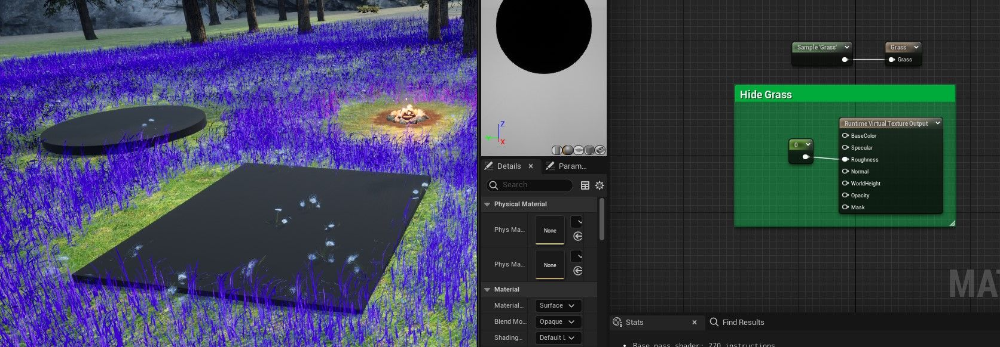
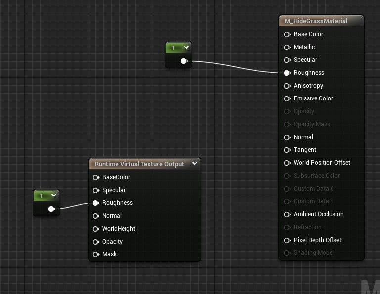
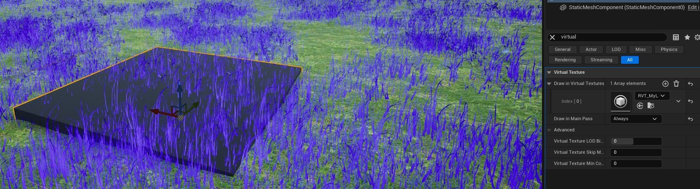
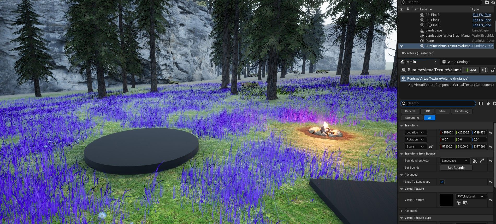
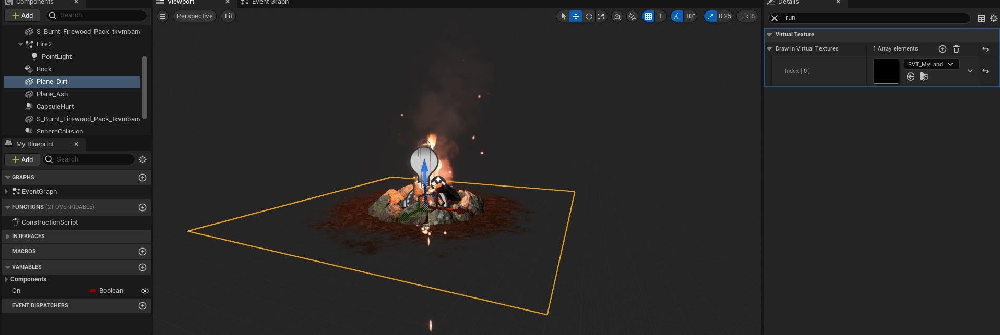
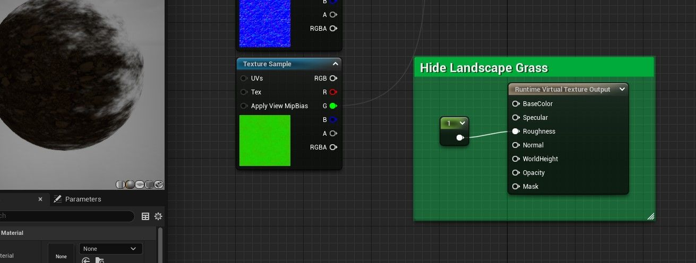

# 隐藏篝火和可放置物品的景观草

## 来源与状态

- 原始 URL：https://dev.epicgames.com/community/learning/tutorials/aqyD/unreal-engine-hide-landscape-grass-for-campfires-placeables

## 运行时分类

- 类型：图文教程
- 判断：API 未识别到核心视频信号，可整理正文约 2600 字符。

## 摘要

我将向您展示如何在放置某些物体（例如篝火或房屋地基）的景观中隐藏草。对我来说，这是最难以弄清楚的事情之一。我们将使用运行时虚拟纹理来完成此操作。

## 中文整理

### 概览

### 概述

除了第一步之外，顺序并不重要。步骤 1-7 必须全部到位，然后才能起作用。 1. **项目设置**：启用虚拟纹理。重新启动。 2. 在内容浏览器中，**创建运行时虚拟纹理**（可在“材质”下找到）。 3. 更新您的**草材质**。在示例节点中设置 RVT。 4.更新**景观材质**。 5. 创建测试道具（立方体或圆柱体）+材料。 6. 选择道具。在细节下，将RVT添加到*在虚拟纹理中绘制*。 （可以默认在主通道中绘制。） 7. 将**运行时虚拟纹理体积**添加到场景并根据您的景观进行缩放。 8. 篝火🏕示例：将污垢网格设置为*在VT中绘制*（如步骤6）+更新污垢材质（如步骤3）。 9. 对于 **Brushify**、**PLE** 等，请跳过步骤 4（景观材质不需要更新），请参阅下面的示例。现在，每当您想要一个新对象来隐藏草时，有 2 个步骤：1. 添加 RVT（请参阅 #6）+ 2. 更新其材质（请参阅 #3）。注意：您可能会注意到花朵并没有隐藏在结果中。您将更新与草材质相同的花材质（步骤 3）。感谢 XenoHiraeth 帮助我解决了这个问题。 *注意：如果您的 Quixel 材质开始变得模糊...当您启用虚拟纹理时，可以选择将纹理导入为虚拟纹理。当此功能关闭时，引擎可能会忽略。因此，下次导入 Quixel 材质（或可能任何其他纹理）时，如果它显示模糊，那是因为纹理设置为虚拟。他们会说“VT”。要解决此问题，请打开纹理文件并关闭流虚拟纹理。 Quixel 主材质中的纹理参数很可能设置为非虚拟，并且参数只能是其中之一。*

### 篝火示例

### Brushify、PLE 等

像这样的系统已经在其叶子材料中实现了风的世界位置偏移。您需要添加新的偏移量，如下所示。 They can be a bit weird without some additional numbers thrown in. I'm not sure exactly how those numbers compute but the example shown below work fine as far as I can tell. *Once you've got the first one done, a practical thing to do in UE5 is to collapse nodes in the hide grass portion so you can easily copy/paste it as a single node into each foliage material needed.* - [UE Docs: Runtime Virtual Textures](https://docs.unrealengine.com/5.0/en-US/runtime-virtual-texturing-in-unreal-engine)

## 相关链接

- [UE Docs: Runtime Virtual Textures](https://docs.unrealengine.com/5.0/en-US/runtime-virtual-texturing-in-unreal-engine)

