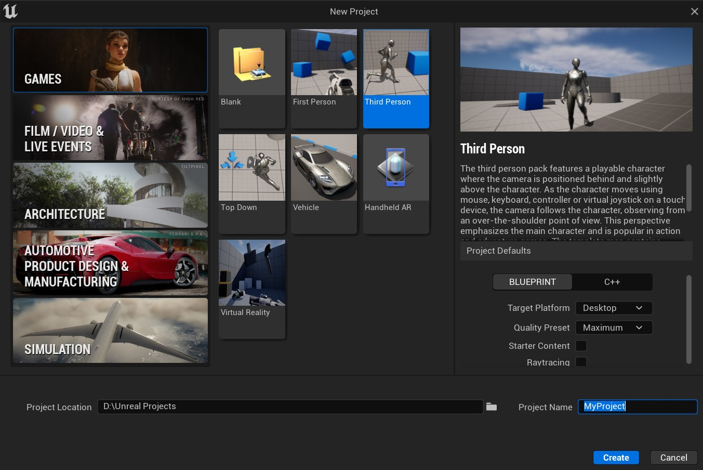
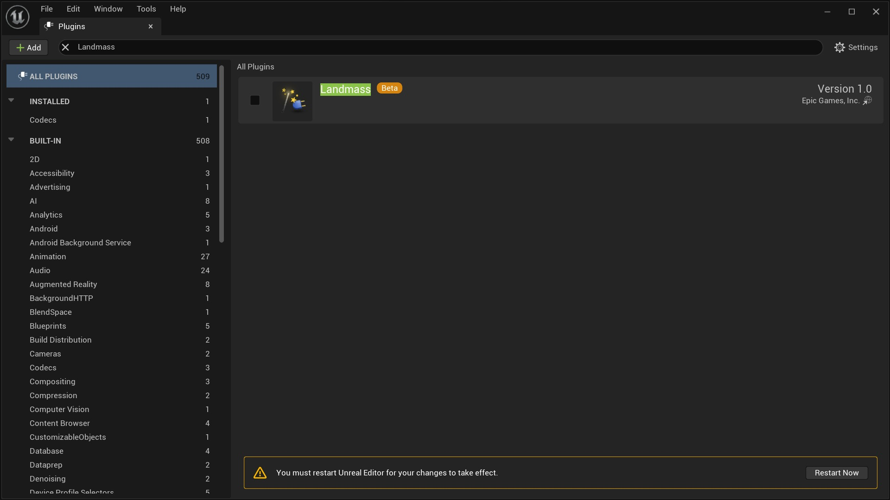
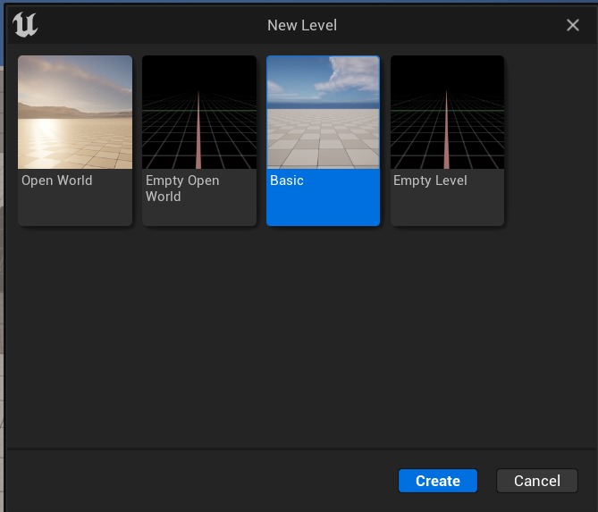
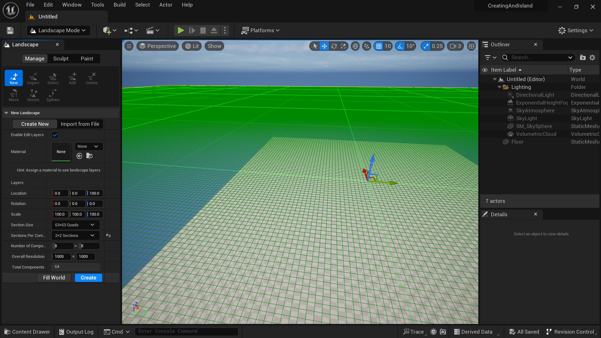
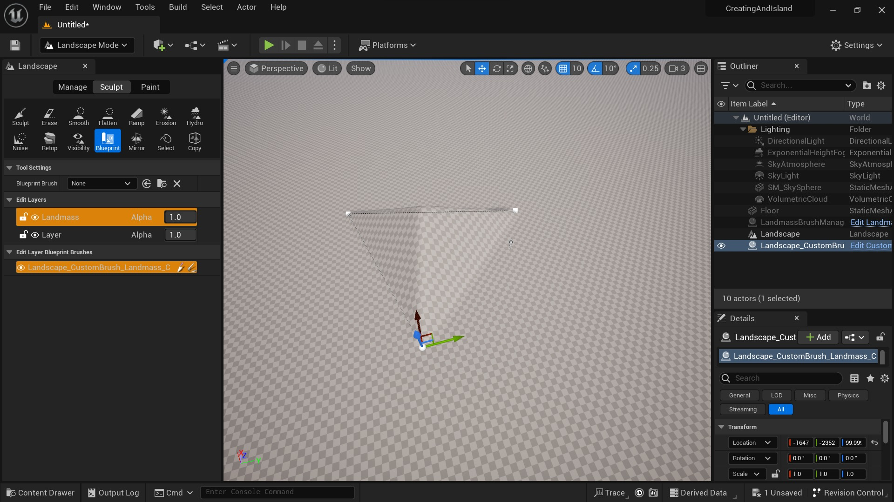
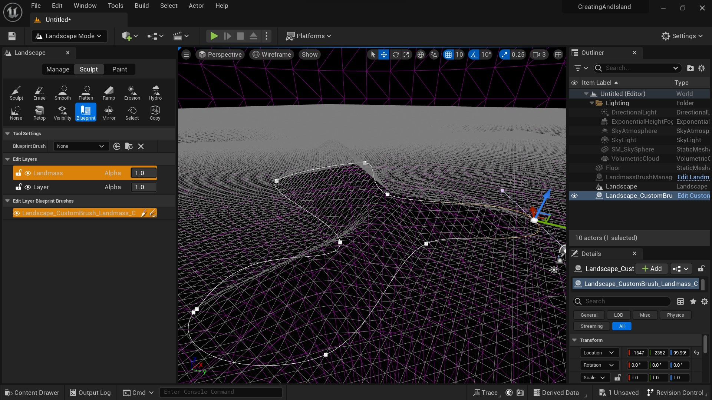
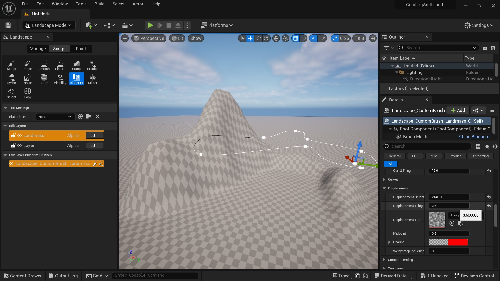
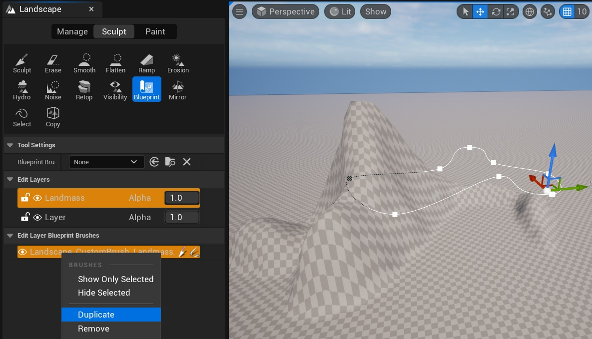

# 使用蓝图画笔创建风景

## 来源与状态

- 原始 URL：https://dev.epicgames.com/community/learning/tutorials/ELRe/unreal-engine-landscape-creation-using-blueprint-brushes

## 运行时分类

- 类型：图文教程
- 判断：API 未识别到核心视频信号，可整理正文约 3476 字符。

## 摘要

这是使用蓝图画笔创建景观的快速入门指南。

## 中文整理

### 创建项目

1. 单击 **开始** 按钮，从 epic Games 启动器启动引擎。 2. 在*游戏类别*中选择**第三人称**模板。在*项目默认部分*中选择**蓝图**。检查 Starter Content 和 Raytracing 项目的复选框是否未选中。 3. 选择项目位置，为其命名并**创建**项目。

### 启用陆地插件

1. 转到*编辑*菜单并选择**插件**。 2. 在*搜索栏*中输入**Landmass**并选中该框。通过单击 **立即重新启动** 按钮或简单地关闭并重新打开它来重新启动项目。

### 创建关卡

1. 转到 **文件** 菜单并选择 **新关卡** *（或使用键盘快捷键 CTRL+N）*。 2. 选择**基本**模板。 3. 单击“**创建**”。

### 创造景观

1. 在 **模式菜单** 中选择 **横向***（或使用键盘快捷键 SHIFT+2）。* 2. 在横向模式下，默认情况下 **管理** 菜单将从 **新建** 工具开始 *（如果没有，请转至此部分并选择新建工具）*。 3. 验证**启用编辑图层**复选框已选中*（不添加材质）*。 4. 在 **Section Size** 项中选择 **63x63 Quads。** 5. 在 **Sections Per Components **中选择 **2x2 Sections。** 6. 使用默认值** Number of Components** **(8 x 8)。** 7. 总体分辨率 (1009 x 1009) 和组件总数 (64)。 8. 单击“**创建**”按钮。

### 添加陆地

1. 在 **Sculpt** 菜单中 *（您也可以从 Paint 菜单中执行此操作）* 转到 ** Edit Layers**，然后 ** 右键单击​​初始图层 ** *（默认称为 Layer）** ***** 创建一个新图层 ** *（选择 **Create** 选项）*。然后右键单击我们创建的图层并选择**重命名**选项并将新图层命名为**Landmass**。 2. 在 **雕刻** 菜单中选择 **蓝图工具**，然后在 **蓝图画笔** 部分中选择 ** CustomBrush_Landmass**，检查是否已选择 Landmass 图层（*要选择一个图层，请在其上单击鼠标左键，它将呈现黄色阴影*）。 3. 在编辑器上左**单击**并创建 Landmass 组件。

### 使用样条点修改陆地

1. 通过单击 *Outliner* **Landscape_CustomBrush_Landmass_C** 中的资源，选择样条线点进行修改。通过在样条线的任何位置**左键单击**，我们可以添加一个新点。 2. 添加您需要的点。

### 从详细信息面板修改陆地

1. 我们可以从 **Details** 面板修改 Landmass 的几何形状，对于这个初始体积的情况，我将修改 **Falloff** 部分的参数：将 **Falloff Angle** 的值更改为 **66**。 2. 在效果部分，修改**模糊**组件，将**模糊大小**值更改为**3**。 3. 在 **Curl Noise** 中，我将 **Curl 1 Strength** 的参数更改为 **0.3**，**Curl 2 Strength** 更改为 **0.6**，**Curl 1 Tiling** 更改为 **3.0**，**Curl 2 Tiling** 更改为 **15.0**，以实现拉长的形状，作为我的景观结构的初始参考。 4. 在 **Displacement** 部分中，将 **Displacement Height 更改为 2143.0**，将 **Displacement Tiling 更改为 3.6**，实现更有机的形状。在我们获得引人注目的形状之前，使用这些参数非常重要。

### 复制陆地

1. 通过右键单击**编辑图层蓝图画笔**中的**陆地**来复制**蓝图。

您可以使用基本变换工具从编辑器中修改您创建或复制的每个陆地蓝图，而无需更改详细信息菜单中的效果参数。

