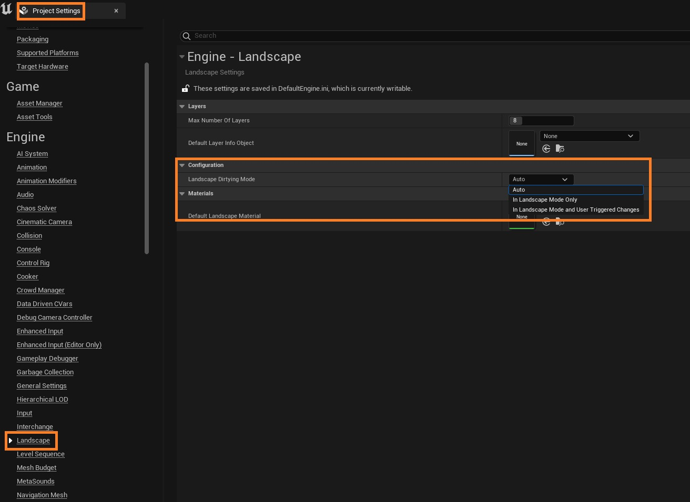

# 负载上的景观脏污

## 来源与状态

- 原始 URL：https://dev.epicgames.com/community/learning/knowledge-base/Xde9/unreal-engine-landscape-dirty-on-load

## 运行时分类

- 类型：图文教程
- 判断：API 未识别到核心视频信号，可整理正文约 6041 字符。

## 摘要

本文由 Ryan Bickell 撰写 景观文件很容易变脏，因为许多不同的来源（例如材质、景观草资产、样条线、水体等）都会影响它们。 Encountering landsca…

## 中文整理

### 概览

*本文由 [Ryan Bickell](https://dev.epicgames.com/community/profile/23wL/RyanBickell) 撰写* 景观文件很容易变脏，因为许多不同的来源（例如材质、景观草资产、样条线、水体等）都会影响它们。遇到加载时脏的景观 Actor 通常是对任何这些源进行某些更改的结果，如果不是直接对景观 Actor 本身进行更改，并且很可能意味着景观 Actor 需要在某个时候提交。如果没有，使用过时的景观 Actor 可能会导致打包构建中出现明显的接缝等伪影，因为无论其状态如何，烹饪都会使用当前数据。话虽如此，我们在 5.2 中引入了 **景观脏污模式** 设置，以便对此提供更多控制，因为我们从自己在《堡垒之夜》的内部经验以及用户的反馈中了解到，经常处理景观演员在加载时被标记为脏的情况以及经常弹出的“选择要签出的文件”对话框是多么不可取。此景观脏污模式设置允许您控制引擎是否在加载时自动将景观角色标记为脏，并且可以在 **项目设置 > 引擎 > 景观** 下找到。

该设置具有三个不同的选项： - **自动：** 加载时检测为脏的景观 Actor 将被标记为脏，这意味着它们将出现在下一个“选择要保存的文件”对话框中。

这种遗留模式被保留为默认选项，因为它是最安全的，并且仍然适合许多项目，例如那些不与许多合作者一起开发大世界的项目。

- **仅限横向模式：** 此模式可以被视为“手动横向保存模式”，因为它将在不处于横向模式时提交更改的责任交给用户。

在此模式下，加载时检测为脏的景观 Actor 将不会被标记为脏，也不会出现在下一个“选择要保存的文件”对话框中。

相反，视口将显示一条消息，指示某些景观 Actor 不是最新的，需要“手动”重新保存，这可以通过使用“构建”菜单中的“保存修改的景观”来完成。

- I**n 景观模式和用户触发的更改：** 与仅景观模式相同，除了用户触发的更改即使通过间接方式影响景观参与者（即启用 AffectLandscape 的水插件中的水体）也会检查这些景观参与者。

建议使用此模式，因为它可以避免在加载时将景观 Actor 标记为脏，但仍有助于确保提交他们修改的景观 Actor。

如果与多个协作者一起开发大型世界（世界分区）游戏，我们建议避免使用“自动”并使用其他选项之一。

这将简化团队之间的协作，并允许在景观上工作的少数用户负责检查景观的输入/输出并保持其最新。

与此同时，其他人可以继续以典型的方式工作。

这就是我们在 Fortnite 内部所做的，特别是因为我们使用了 Water 插件，无论是否使用 World Partition（使用景观 BP 笔刷 actor 时在引擎中引入的临时措施，以避免在景观仅部分加载时可能发生的不确定结果），它都会强制将整个景观加载到编辑器中，从而增加了未处理景观的用户意外修改景观的可能性。

不过，对于仅由一个或有限数量的合作者开发的大型世界游戏，自动可能仍然是最佳选择，因为让所有景观参与者尽可能保持最新状态总是一个好主意。

如前所述，许多来源都会影响并导致景观演员变脏。

虽然这并不是所有可能原因的详尽列表，但您可以在 **ULandscapeInfo::ModifyObject** 或简单地 **UObject::Modify** 中放置一个断点，以查看是什么导致对象变脏。

如果有兴趣查找更多信息，另一个有用的提示是 5.3 中的以下 CVar，可用于可视化导致弄脏任何景观演员的任何高度图/权重图更改： - **landscape.DumpHeightmapDiff：** 这将为回读高度图纹理保存在上一个编辑层混合阶段中已更改的图像。

设置：0 = 无差异，1 = Mip 0 差异，2 = 所有 Mips 差异。

- **landscape.DumpWeightmapDiff：** 这将为在上一个编辑层混合阶段中更改的读回权重贴图纹理保存图像。

设置：0 = 无差异，1 = Mip 0 差异，2 = 所有 Mips 差异。

- **landscape.DumpDiffDetails：** 当转储高度图 (landscape.DumpHeightmapDiff) 或权重图 (landscape.DumpWeightmapDiff) 的差异时，转储有关不同像素的其他详细信息。

最后，我们注意到，在运行编辑层合并时，使用某些 GPU 很少会引入精度错误，从而在同一景观上运行两次时导致非常微妙但不同的结果。

这种情况很少遇到，迄今为止仅在 D3D12 中观察到。

不过，值得一提的是，可以通过以下 CVar 调整“脏检测阈值”来避免此类非确定性问题： - **landscape.DirtyHeightmapHeightThreshold：** 在检测高度图高度变化时避免某些 GPU 上出现不精确问题的阈值，即只有大于此阈值的高度差（N 超过 16 位 uint 高度）才会被检测为变化。

- **landscape.DirtyWeightmapThreshold：** 在检测权重图何时发生变化时避免某些 GPU 上出现不精确问题的阈值，即只有大于此阈值的差异（每个 8 位 uint 权重图通道上的 N）。

在[知识库！](https://forums.unrealengine.com/docs) 中获取更多答案

