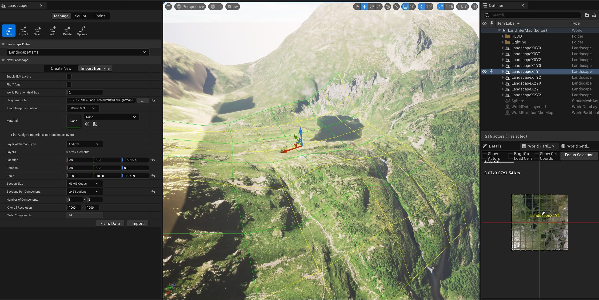
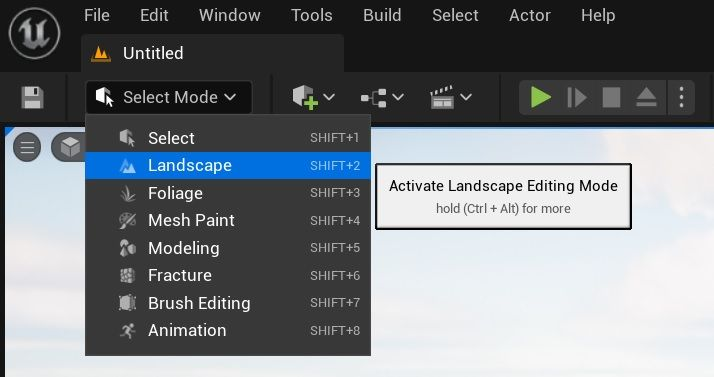
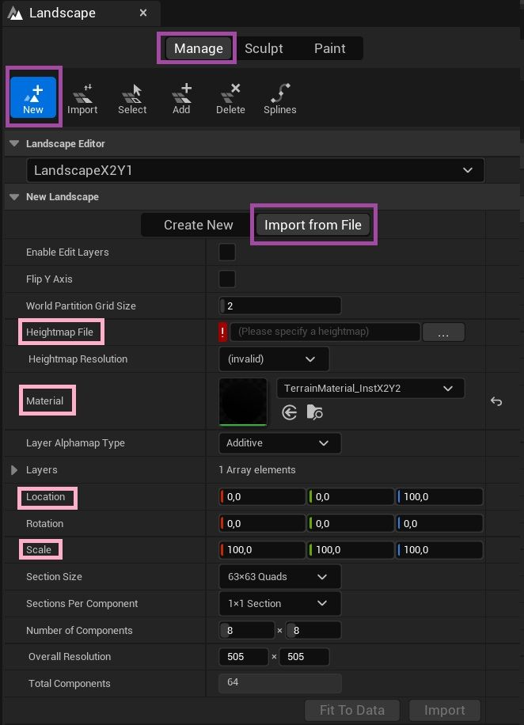
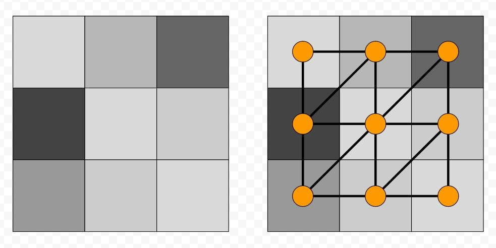
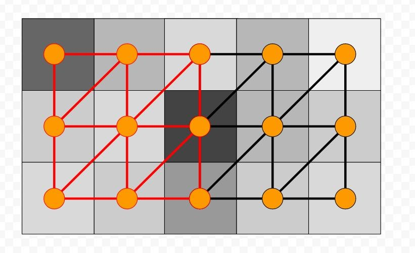
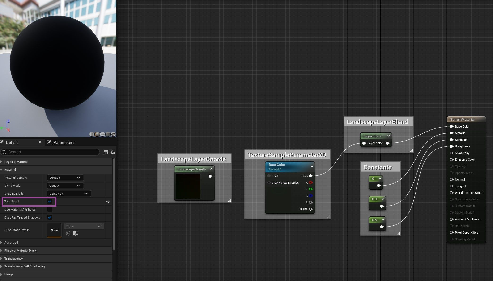
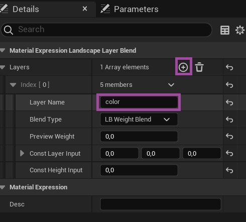
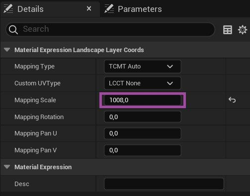
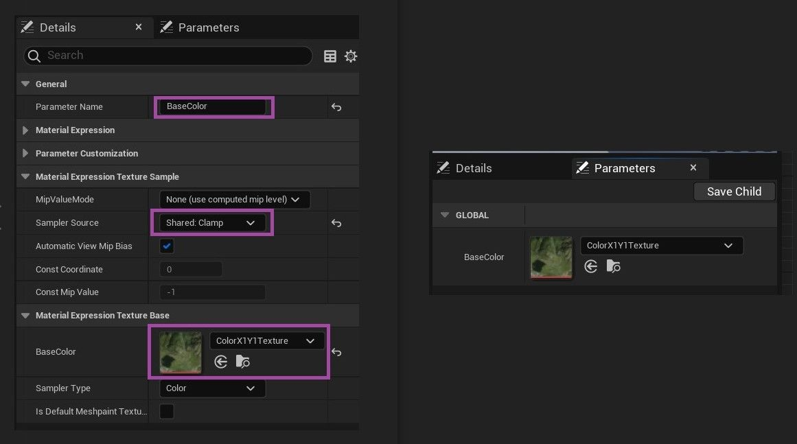
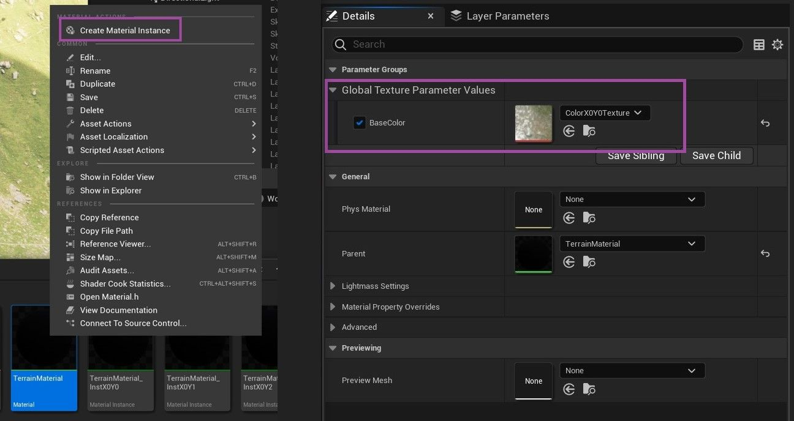

# 景观导入基础知识

## 来源与状态

- 原始 URL：https://dev.epicgames.com/community/learning/tutorials/KJ7l/unreal-engine-landscape-import-basics

## 运行时分类

- 类型：图文教程
- 判断：API 未识别到核心视频信号，可整理正文约 5893 字符。

## 摘要

有关从高度图创建景观的基本技巧。

## 中文整理

### 概览

在虚幻引擎 5 中，借助 ** 景观 ** 系统和 ** 世界分区 **，可以在真实地形数据中导入和导航，并具有良好的渲染质量和性能。一旦了解了基础知识，这相当容易:)。捕获中可见的所有真实景观数据（高度图和色彩图）均从 [IGN 开放数据](https://geoservices.ign.fr)（通过 WMS 服务下载）进行处理。

### 开放世界关卡

要从最佳设置开始，应使用开放世界模板中的新关卡。从这个级别，您应该能够通过**删除其所有景观流代理子级**来删除默认景观，然后**删除空景观**。

### 横向用户界面

要从高度图导入创建新景观： - 从编辑模式组合中选择景观编辑模式。 - 在横向面板中选择管理/新建/从文件导入。 - 配置高度图文件、材质、位置和比例。其他字段可以自动计算。

### 距离单位

默认情况下，虚幻单位为 1 厘米。因此，**100 比例**通常用于将厘米映射到米。

### 高度图文件

### 格式

最容易使用的高度图格式是 **16 位 .raw 格式**。它只是每个点的 16 位无符号整数高度数据（在 [0, 65535] 中）。

### 自动平铺

他们可以（没有明确记录）加载**多个高度图**并将它们合并到一个景观中。因此，它们的文件名必须以 x0_y0 前缀样式结尾。这样做不允许每个高度图使用完整的 16 位范围，因为它们必须共享相同的最小和最大高度。因此可能会失去精度。

### 虫子

当 .raw 高度图附近存在具有相同名称和其他扩展名的文件（例如 .json 文件）时，它可能会阻止 UE 识别原始文件。

### Z 轴比例

虚幻引擎将 [0, 65535] 高度图值重新映射为 [-256, 255.992] 厘米（**511.992 范围**）。如果高度图存储（在 16 位范围内）X 米的高度幅度，则要应用的 Z 比例将为：100 * X / 511.992。例如，如果高度图存储的海拔高度在 10 到 100 米之间 ([0, 65535] => [10, 100])，则比例将为 100 * 90 / 511.992。

### Z位置

由于位置定义了地形中心，因此要获得正确的 Z 位置，您必须将其设置为高度图的中高度。对于 (10, 100] m 示例，应输入 (100+10)/2 * 100 (5500)。

### X、Y 比例和位置

要配置这些字段，必须了解一些概念：高度图大小、像素分辨率和地形大小。这是一个基本示例：

具有 R 米像素分辨率（现实世界中的像素大小）的 WxH 高度图尺寸将生成具有 WxH 顶点的 (W-1)*R x (H-1)*R 米地形。这就是景观 **X 和 Y 比例** 的理解方式，这是高度图像素分辨率（以厘米为单位），也是地形两个顶点之间的距离。值得注意的是，要充分合并相邻地形，它们必须位于 (W-1)*R x (H-1)*R 距离处，并且它们应该对相同的高度图像素边界进行采样。因此，在 2x2 米大小的地形示例中，如果第一个位于 (0, 0)，那么第二个位于其右侧 (+x) 的位置应位于 (2x100, 0)。

### 材料

景观材质基于多个层。每个层都可以通过层信息进行配置。图层信息是指定图层可见位置的遮罩（请参阅 **导入和绘制图层信息** 部分）。将使用简单的材质来绘制从真实数据导入的基色图，因此只需要一层。如果我们想要导入具有相同材质的多个景观，只需更改基色，最好只创建**一种基础材质**和**每个景观一个材质实例**。

在基础材质中检查**两侧**将允许有正确的阴影。更好的方法应该是构建景观实体边界（这也可以避免一些漏光），但它更复杂。需要一些节点（设置如下所示）： - 常量用于设置非常基本的地形渲染样式。 - LandscapeLayerBlend 用于设置基色层。 -TextureSampleParameter2D 是纹理参数材质实例，将使用正确的地形纹理数据覆盖。 - LandscapeLayerCoords 是纹理坐标的设置。需要添加一层并命名（用于基色）：

纹理坐标比例应设置为地形大小，因为默认值 (1) 将在每个四边形上重复纹理。这里 1008 用于 1008x1008 米地形和 1009x1009 像素高度图：

要设置的最后一个节点是将被材质实例覆盖的纹理参数。它必须被**命名**。 **采样器源**必须设置为 **clamp **以避免景观边缘出现插值伪影。奇怪的是，必须设置**默认纹理**才能使覆盖正常工作。在参数选项卡中，您应该看到可用的纹理参数。

最后，您必须从基础材质创建一个**材质实例**，并使用正确的纹理覆盖**基础颜色参数**。这是必须在景观导入中使用的材质实例。

### 进口

一旦一切设置完毕，**导入**就可以完成。导入后，您应该更改景观名称以使事情变得清晰。

### 油漆层信息

但风景似乎没有什么素材。实际上它还需要一件事：图层信息。目前，由于我们使用材质仅显示基色贴图，因此完全绘制的图层就很好。在风景 UI 的绘画部分中，可以为材质中设置的唯一图层（颜色）添加新的图层信息（或者可以选择现有的图层信息）。

### 世界分区小地图

要刷新小地图，请使用 **构建** 菜单中的 **构建小地图**。另外，**构建所有级别**来刷新所有内容也许是个好主意。 - [推荐的高度图尺寸](https://docs.unrealengine.com/5.0/en-US/landscape-technical-guide-in-unreal-engine#recommishedlandscapesizes)

## 相关链接

- [recommended heightmap sizes](https://docs.unrealengine.com/5.0/en-US/landscape-technical-guide-in-unreal-engine#recommendedlandscapesizes)

