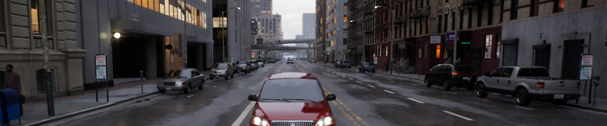
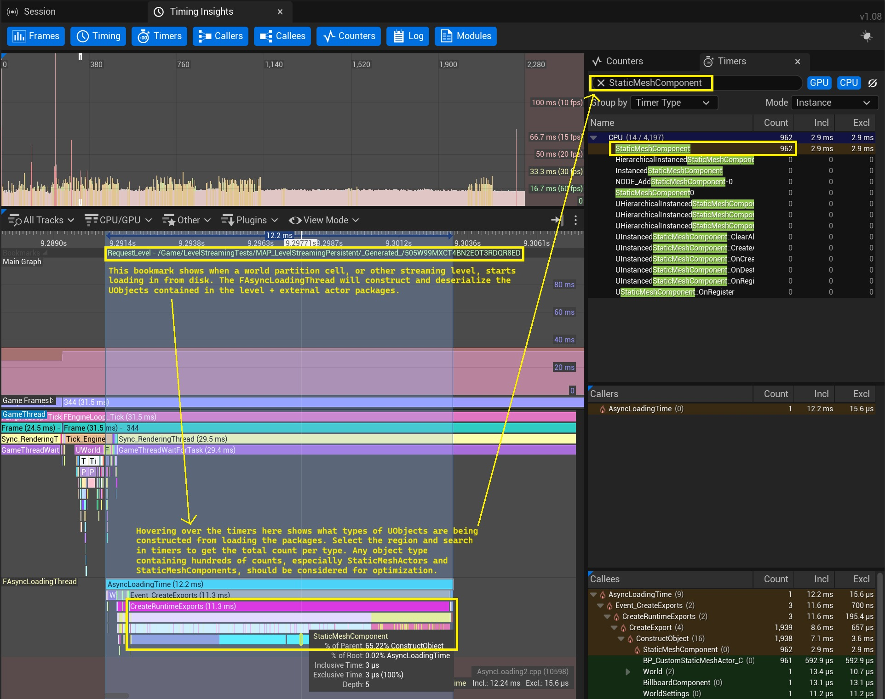
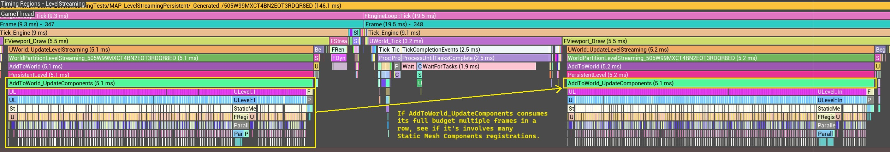
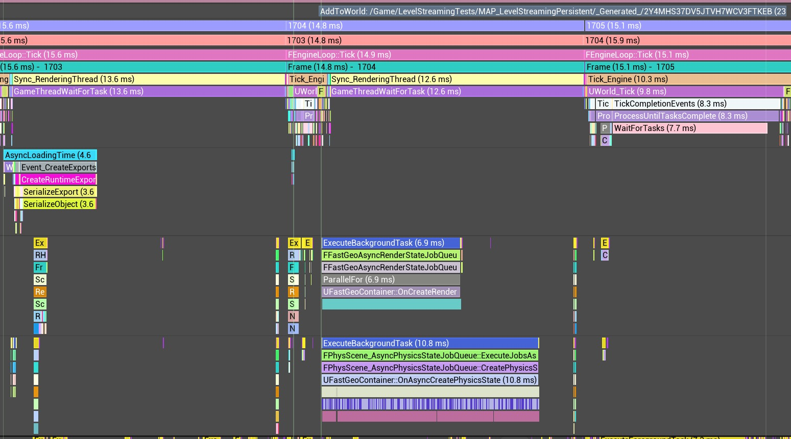
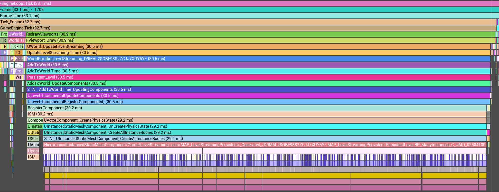
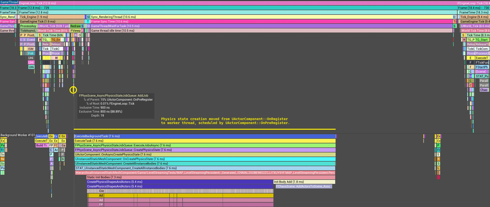
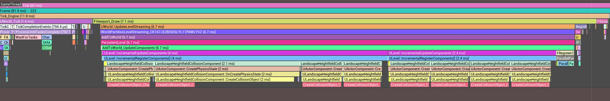
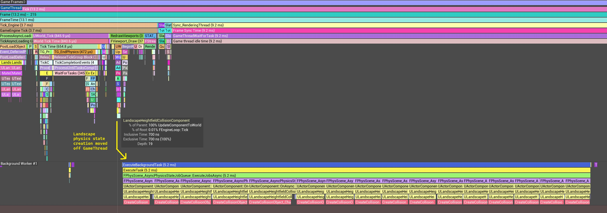

# 关卡流媒体连接指南

### 物理

**异步物理状态创建：** 景观等大型高分辨率几何体的物理状态创建和销毁非常耗时，与许多实例发生碰撞的 InstancedStaticMeshComponents (ISMC) 的物理状态创建也是如此。可以使用选择加入的异步物理体创建功能将其从游戏线程中移出，该功能在 UE 5.6 中引入，但从 UE 5.7 开始仍处于实验阶段：

**默认引擎.ini**

```
[ConsoleVariables]
p.Chaos.EnableAsyncInitBody=True ;(default: False)
LevelStreaming.AllowIncrementalPreRegisterComponents=True ;(default: False)
LevelStreaming.AllowIncrementalPreUnregisterComponents=True ;(default: False)
p.Chaos.AsyncPhysicsStateTask.TimeBudgetMS=5 ;(default: 0)
```

UE 5.6+：考虑启用异步物理状态创建和组件预注册，以将注册具有昂贵碰撞形状的组件的工作负载移出 GameThread。 **初始重叠：** 默认情况下，具有可移动移动性的碰撞组件将在关卡流送入时计算初始重叠。在关卡流送期间计算初始重叠的成本可能相当高。除非有必要，否则禁用碰撞，并禁用图元组件上的“生成重叠事件”。默认情况下，在关卡流传输期间，不会检查具有静态移动性的组件的初始重叠。尽可能将原始组件设置为静态移动性。您可以覆盖关卡流传输期间检查初始重叠的行为，例如即使对于静态移动组件也启用它，或者对于可移动组件禁用它。 [Great Hitch Hunt](https://dev.epicgames.com/community/learning/tutorials/6XW8/unreal-engine-the-great-hitch-hunt-tracking-down-every-frame-drop#disableunnecessaryoverlaps) 涵盖了这一点。即使禁用“生成重叠事件”，仍然可以在场景查询中找到组件。重叠事件不需要阻止角色移动（执行场景查询）。在预设的帮助下，为组件正确设置对象和跟踪通道，有助于不检查不相关的参与者对。请查看 Studio Gobo 的 [Unreal Fest 演示](https://www.youtube.com/watch?v=xIQI6nXFygA) 了解更多相关信息。

### 游戏玩法

****程序员的一个常见错误是从游戏代码的软对象路径同步加载资源，从而导致调用**FlushAsyncLoading**。这会停止游戏线程，直到异步加载线程加载请求的资源。许多工作室不允许游戏程序员通过编辑器验证同步加载资源。自 UE 5.3 以来，FlushAsyncLoading 的惩罚性较小，但它仍然是一个不好的做法。在任何 actor 的 BeginPlay 函数中执行昂贵的工作都可能会在 actor 进入游戏时导致出现问题，包括当地图放置的 actor 进入关卡流时。该问题的一种常见形式是从一个地图放置的 actor 的 BeginPlay 中生成多个昂贵的 actor。对于这种类型的初始化逻辑，请考虑在开始播放后将其分散到多个帧上。请考虑“搭便车大亨特”中有关[演员生成故障](https://dev.epicgames.com/community/learning/tutorials/6XW8/unreal-engine-the-great-hitch-hunt-tracking-down-every-frame-drop#theactorspawninghitch) 的提示。

### 渲染

许多关卡流触发的故障都是由于第一次渲染对象而发生的。这涉及到分配资源，例如用于新激活渲染功能的渲染目标，以及需要与材质相关的 PSO。 PSO 编译和预缓存故障是许多游戏面临的一类问题。许多特定于 UE 的资源专门用于解释该问题并提供处理该问题的方法。请参阅：[游戏引擎和着色器卡顿：UE 的解决方案](https://dev.epicgames.com/community/learning/tutorials/xjzE/unreal-engine-epic-for-indies-game-engines-shader-stuttering-ue-s-solution) 和 [PSO 编译搭便车](https://dev.epicgames.com/community/learning/tutorials/6XW8/unreal-engine-the-great-hitch-hunt-tracking-down-every-frame-drop#thepsocompilationhitch) 搭便车大狩猎的部分。一个特别的提示：当您在 Unreal Insights 中观察到很长的 **PSOPrecache: Precached **时间时，它可能与某些图形驱动程序有关。某些驱动程序在从驱动程序缓存中检索 PSO 时性能缓慢。该等待时间可能会导致渲染线程停顿，最终导致游戏线程停顿。您可以选择在内存中保留更多 PSO，而不是通过图形驱动程序检索它们。这是以使用更多 RAM 为代价的； Fortnite 约为 2 GB。将以下 CVar 从其零默认值更改为解决长 PSOPrecache：预缓存时间。有关详细信息，请参阅 [PSO 预缓存](https://dev.epicgames.com/documentation/en-us/unreal-engine/pso-precaching-for-unreal-engine)。

**默认引擎.ini**

```
[ConsoleVariables]
r.PSOPrecache.KeepInMemoryUntilUsed=2 ;(default: 0)
```

### 联网

当参与者从服务器复制到客户端时，客户端可能需要加载包来生成这些参与者，例如参与者蓝图类和依赖项。通过德法...

**默认引擎.ini**

```
[ConsoleVariables]
net.AllowAsyncLoading=1 ;Enable async loading of dependencies for networked actors
net.DelayUnmappedRPCs=1 ;Defer RPC execution when an object isn't ready yet due to async loading dependencies
```

### 垃圾收集

### 宽松资产管理费用

### 先进的UE解决方案


### 3. 分析注意事项

### 3.1 构建配置

### 3.2 编辑器与打包

### 3.3 PSO驱动缓存

### 3.4 核心数

### 3.5 流级别复用



### 4. 仔细观察挂钩

### 4.1 许多非实例静态网格物体







```cpp
FHitResult Result;
if (IPhysicsBodyInstanceOwner* PhysBodyInstOwner = IPhysicsBodyInstanceOwner::GetPhysicsBodyInstanceOwnerFromHitResult(Result))
{
	UPhysicalMaterial* PhysMat = PhysBodyInstOwner->GetPhysicalMaterial();
}
```

### 4.2 一个 InstancedStaticMeshComponent 上有多个实例



**默认引擎.ini**

```
[ConsoleVariables]
p.Chaos.EnableAsyncInitBody=True
p.Chaos.AsyncPhysicsStateTask.TimeBudgetMS=5
LevelStreaming.AllowIncrementalPreRegisterComponents=True
LevelStreaming.AllowIncrementalPreUnregisterComponents=True
```



### 4.3 景观流挂接装置



```
[ConsoleVariables]
p.Chaos.EnableAsyncInitBody=True
p.Chaos.AsyncPhysicsStateTask.TimeBudgetMS=5
LevelStreaming.AllowIncrementalPreRegisterComponents=True
LevelStreaming.AllowIncrementalPreUnregisterComponents=True
```



### 4.4 异步物理寄存器停顿

**默认引擎.ini**

```
[ConsoleVariables]
p.Chaos.EnableAsyncInitBody=True
p.Chaos.AsyncPhysicsStateTask.TimeBudgetMS=5
```

### 4.5 物理推送数据故障

```
[ConsoleVariables]
p.Chaos.EnableAsyncInitBody=True
p.Chaos.AsyncPhysicsStateTask.TimeBudgetMS=5
LevelStreaming.AllowIncrementalPreRegisterComponents=True
LevelStreaming.AllowIncrementalPreUnregisterComponents=True
```

### 4.6 不必要的初始重叠事件

### 4.7 垃圾收集挂钩

### 4.8 Pawn 和摄像机传送挂钩

### 4.9 增量开始播放故障

### 4.10 增量末端游隙挂钩

```cpp
s.LevelStreamingRouteActorEndPlayForRemoveFromWorldGranularity=10 (default: 0)
```
