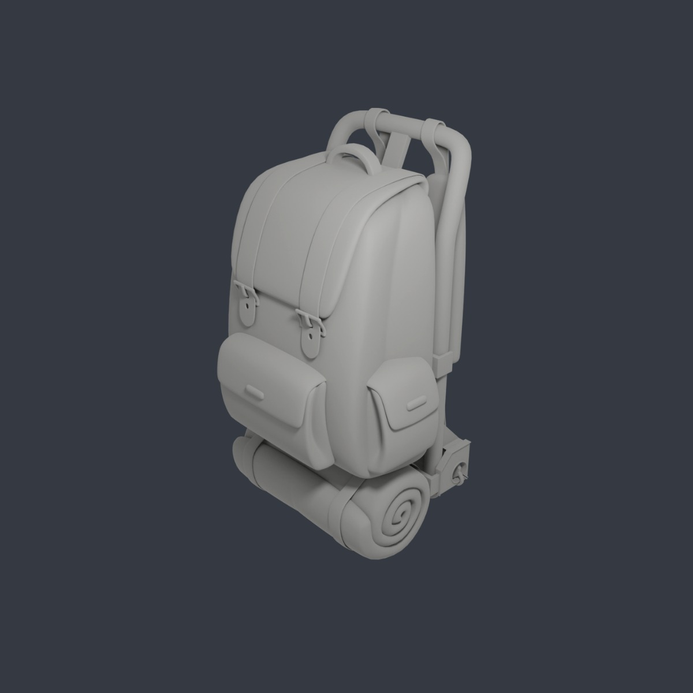
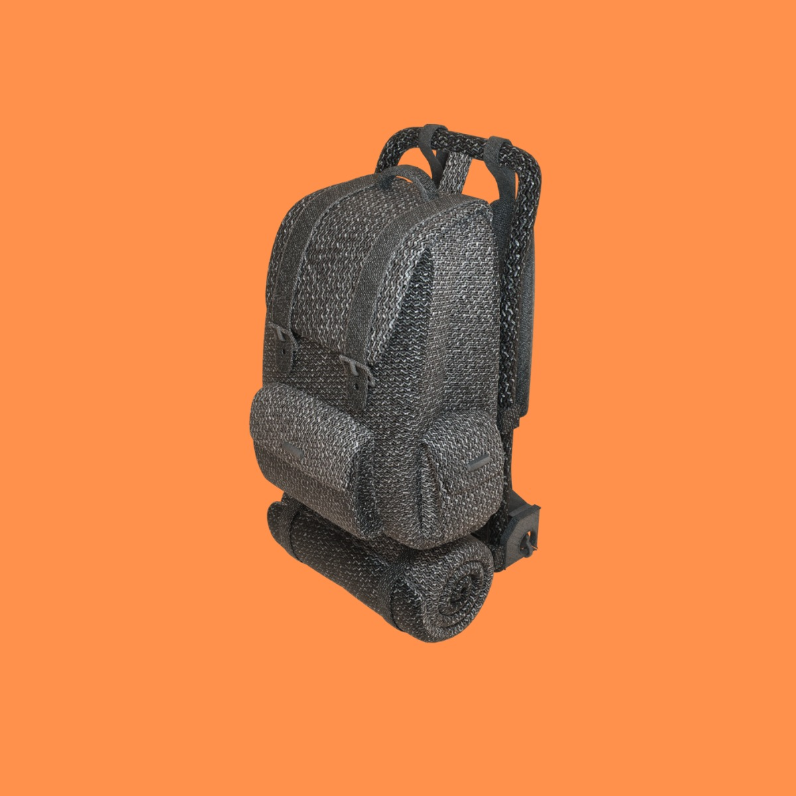
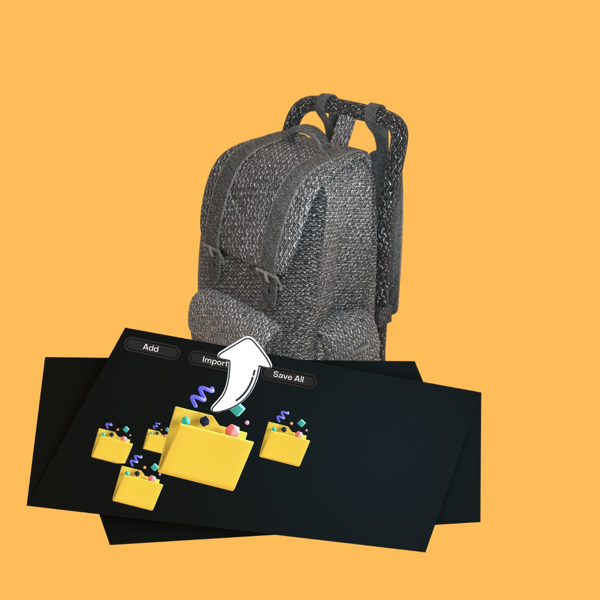
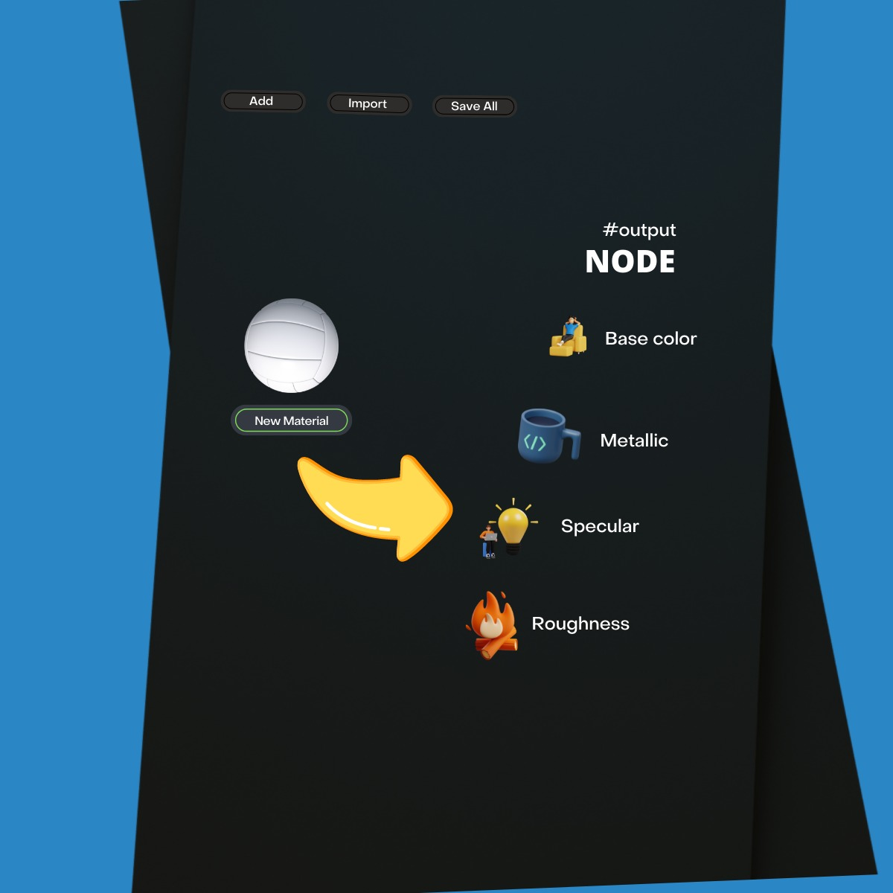
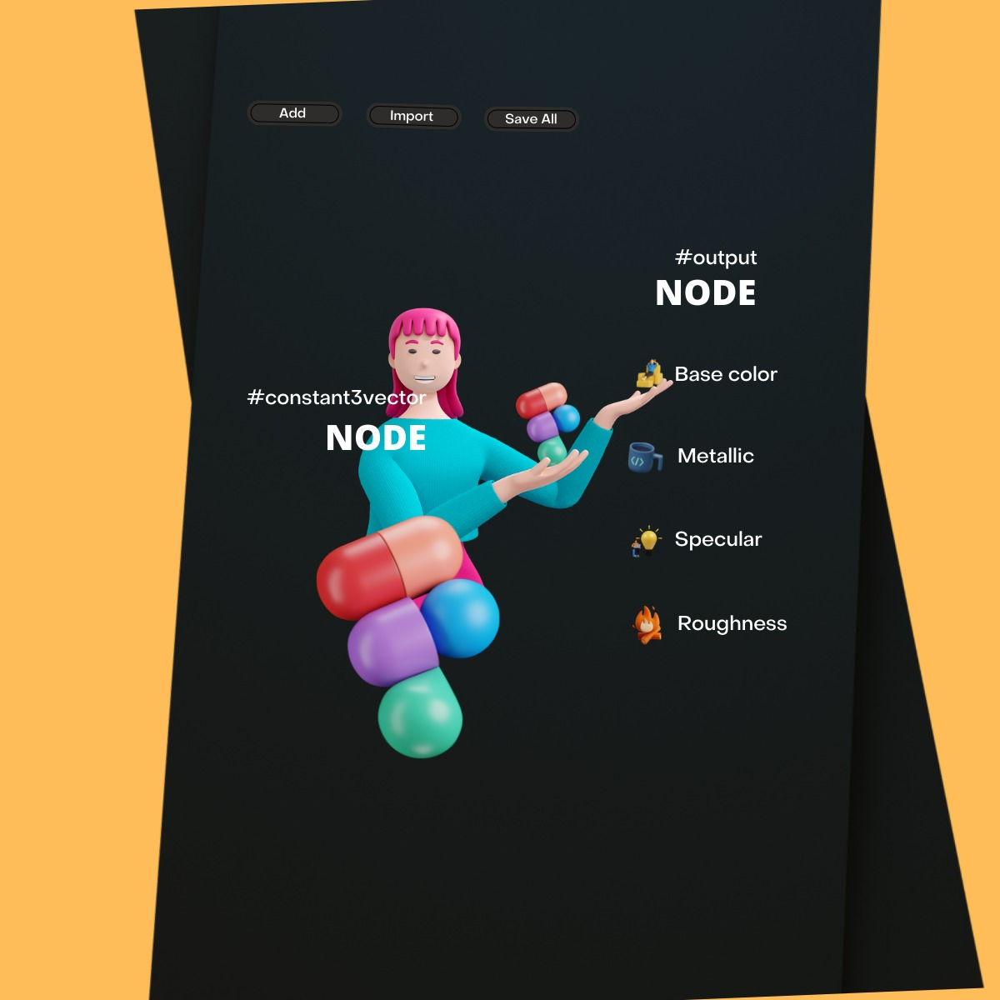
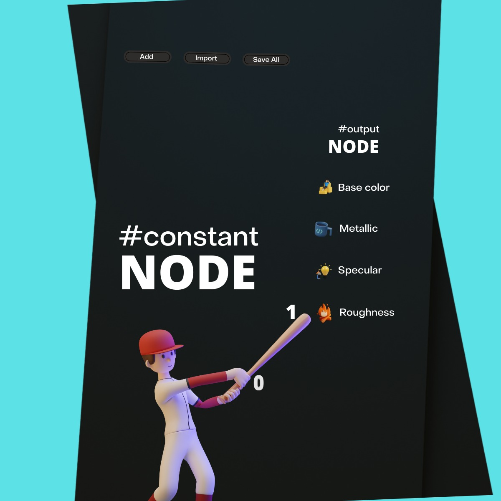
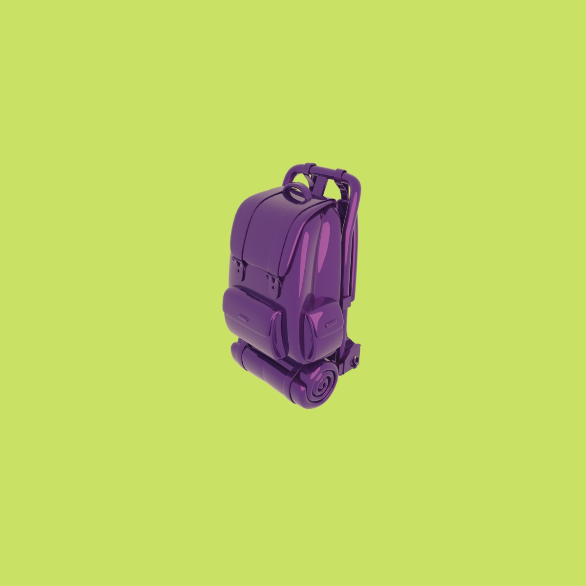
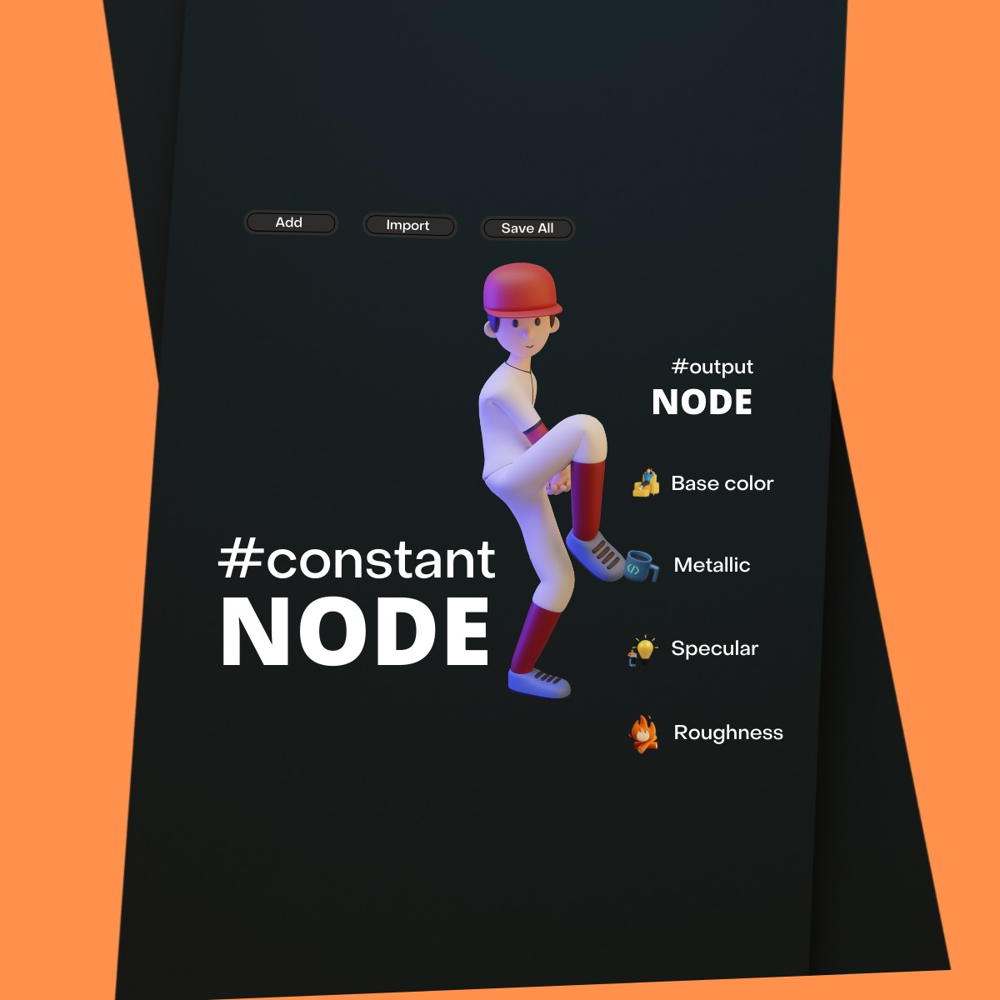

# 材料应用

## 来源与状态

- 原始 URL：https://dev.epicgames.com/community/learning/tutorials/dL85/unreal-engine-material-application

## 运行时分类

- 类型：图文教程
- 判断：API 未识别到核心视频信号，可整理正文约 12969 字符。

## 摘要

当我向 3D 项目添加各种材质时，它们会变得栩栩如生，变得更加真实且更具视觉吸引力。幸运的是，在虚幻引擎中，只需简单的拖放过程即可完成此操作。正如您在附图中所看到的，没有任何材质的 3D 项目与有材质的同一项目之间的差异非常显着。添加的纹理、颜色和其他细节增强了对象的整体外观和感觉，为观看者创造了更加身临其境的体验。

## 中文整理

### 概览

当我向 3D 项目添加各种材质时，它们会变得栩栩如生，变得更加真实且更具视觉吸引力。幸运的是，在虚幻引擎中，只需简单的拖放过程即可完成此操作。正如您在附图中所看到的，没有任何材质的 3D 项目与有材质的同一项目之间的差异非常显着。添加的纹理、颜色和其他细节增强了对象的整体外观和感觉，为观看者创造了更加身临其境的体验。





如前所述，将缺乏材质的 3D 项目转换为充满材质的 3D 项目的过程非常简单。所需要做的就是从内容抽屉中拖动所需的材质并将其放到 3D 项目上。下图突出显示了这个直观的过程，该图演示了通过添加材质来变换 3D 对象的外观是多么简单。通过利用这种技术，可以实现大量独特的视觉效果，从纹理的微妙变化到大胆而戏剧性的配色方案。最终，向 3D 项目添加材质可以成为提升其视觉冲击力并使其在虚拟环境中脱颖而出的高效方法。



材质调整 人们可能出于多种原因想要更好地控制材质在 3D 项目上的显示方式。可能是材料的平铺效果不令人满意，或者可能只是缺乏预期应用所需的真实感水平。值得庆幸的是，借助虚幻引擎，完全可以对材质及其在 3D 项目上的显示方式进行高度的创意控制。要开始此过程，只需添加一种新材料并根据需要重命名即可。打开材质后，用户会看到一个材质图，其中包含一个可以调整以创建材质外观变化的节点。这种调整是修改材料属性的关键，使用户能够获得所需的外观和感觉。通过尝试不同的调整和参数，人们可以将材料微调到其确切的规格，从而产生更加精致和专业的最终产品。总的来说，能够以如此精确的方式控制材质是使用虚幻引擎的一个主要优势，并且可以帮助将 3D 项目的视觉质量提升到新的高度。

```
Content Drawer > Add > Material
```



当在虚幻引擎中创建新材质时，它会配备一个包含输出节点的材质图。该输出节点包含多种选项，可以修改这些选项以获得所需的结果。因此，材质调整是指调整这些选项以微调材质外观并实现特定外观或效果的过程。可用于材质调整的选项可能会有所不同，具体取决于正在处理的特定材质，但一些常见的示例包括调整材质的颜色、反射率、透明度和纹理。通过对这些参数和其他参数进行精确修改，可以创建高度详细和逼真的材料，并能够准确模拟各种现实世界的材料和表面。最终，通过虚幻引擎中的材质调整实现的创意控制水平对于 3D 艺术家和设计师来说是一个主要优势，因为它允许几乎无限范围的视觉可能性。通过仔细的调整和实验，可以创建真正独特且视觉效果令人惊叹的材料，有助于以令人兴奋的新方式将 3D 项目变为现实。 - 基色 - 金属 - 镜面 - 粗糙度

```
#basecolor  to begin the material adjustment, let me right click on the graph and select constant3vector you can simply search for it - if you can not find it. constant3vector is a color node in unreal engine, I will feed this node to the base color option of my output node to control the color of my material.
```

这意味着如果我的constant3vector节点是紫色的，我的输出节点的基色也将是紫色的。下图说明了问题#constant3vector




虚幻引擎材质图的输出节点中可用的另一个关键选项是粗糙度，可以对其进行调整以在材质上创建特定效果。要调整此选项，必须提供标量值，它是一次保存单个值的变量。在粗糙度的情况下，标量值必须落在 0 到 1 的范围内。为了实现这一点，可以使用常量，它是虚幻引擎中的数字节点，允许用户输入特定值。通过将此常数节点输入到输出节点的粗糙度选项中，可以将材料的粗糙度控制到精确的程度。这种控制级别对于实现所需的视觉效果至关重要，因为它允许用户将粗糙度微调到特定值，以补充 3D 项目的整体外观和感觉。总之，通过将标量值和常量与虚幻引擎材质图中的粗糙度选项结合使用，可以对 3D 项目中材质的外观进行高度的创造性控制。这可以帮助实现各种效果，从微妙的纹理到戏剧性的视觉变换，并且是任何使用虚幻引擎的 3D 艺术家或设计师的必备工具。需要注意的是，在调整虚幻引擎材质图的输出节点中的粗糙度选项时，常量节点的值将直接影响材质的外观。具体来说，常数节点的值越高，应用于材料的粗糙度就越大。常量节点值与材质粗糙度之间的这种关系是虚幻引擎中材质调整的关键要素，因为它允许精确控制 3D 项目的外观。通过尝试不同的常量节点值，可以实现各种视觉效果，从高度抛光和反射的表面到粗糙和有纹理的表面。所提供的插图强调了此过程的重要性，该插图演示了材料的粗糙度如何随着常数节点值的增加而变化。通过仔细调整此参数和其他参数，可以创建高度逼真且具有视觉吸引力的材质，以令人兴奋的新方式将 3D 项目变为现实。






如果您正在寻找更多选项来自定义材料，请考虑探索金属选项。通过调整此设置，您可以在材质上创建不同的效果。要在虚幻引擎中使用“金属”选项，您需要输入一个标量值。这意味着该选项将寻找 0 到 1 之间的值。为了实现这一点，我们可以在虚幻引擎中使用 Constant 节点。该节点将保存一个特定值，我们可以将其输入到输出节点的“粗糙度”选项中。通过这样做，我们可以控制材料的粗糙度以产生所需的效果。本质上，可以理解为我的常量节点分配的值越大，我打印的材料上的金属效果就越突出。下面提供的随附视觉辅助工具清楚地演示了这一概念。 ＃持续的



纹理样本 嘿那里！我一直在尝试为我的材质添加颜色，这非常酷。但如果您真的想将材质外观提升到一个新的水平并使其看起来更加真实，纹理就是您的最佳选择。借助虚幻引擎，您可以尝试使用纹理，真正让您的材质变得栩栩如生。看到转变真是太神奇了！虚幻引擎中的一个方便的节点是纹理样本，它允许我将 PNG 或 JPG 文件带入引擎并将它们直接输入到我的材质输出节点。令人惊奇的是，这个简单的功能如何改变我的材料并让它们变得栩栩如生！通过将纹理样本节点输入到输出节点的基色中，我能够实现下图所示的结果。线性插值结合颜色和纹理可以为材质添加额外的细节级别。借助虚幻引擎，我可以使用线性插值节点来混合纹理和颜色，然后将结果提供给材质输出节点。这使得在处理材料时拥有更多的创作自由。但它并不止于此。我还可以调整材质的平铺，使其出现或多或少的重复。使用纹理坐标节点，我可以决定材质的平铺数量。通过平铺调整，纹理坐标节点与另一个称为“乘法”的节点协同工作。这个想法是将纹理坐标乘以常量节点的值，创建平铺效果。如果我需要调整材质的外观而无需重新编译更改，我可以使用材质参数。通过创建材质实例并将材质中的值辅助节点转换为参数，我可以公开材质实例内的相关值。这使得我的材料的外观具有更大的灵活性和控制力。在虚幻引擎中，有一个名为“线性插值”的强大节点，它允许您混合不同的纹理和颜色来创建独特的材质输出。该节点对于创建需要大量微调的复杂着色器特别有用。通过使用线性插值，您可以实现各种效果，从微妙的颜色变化到大胆的高对比度图案。使用线性插值的优点之一是它可以让您更好地控制材料的最终输出。您可以调整不同输入之间的混合比例，这使您可以微调着色器的外观和感觉，直到恰到好处。此外，您可以将其与其他节点结合使用来创建更复杂的效果。线性插值的另一个主要优点是它非常高效。由于它是虚幻引擎中的内置节点，因此您不必担心性能问题或兼容性问题。您只需将其插入您的材料网络即可立即开始使用。总的来说，如果您希望在虚幻引擎中创建高质量的材质，线性插值是您绝对希望在工具包中拥有的一个节点。凭借其强大的混合功能和微调控制，它是任何认真的游戏开发人员或设计师的必备工具。纹理坐标 在虚幻引擎中，有多种方法可以调整材质的外观，其中之一是控制平铺量。这可以实现最佳结果，并且取决于个人的创意要求。通过使用纹理坐标节点，我们可以决定材质将具有的平铺数量。纹理坐标节点与另一个称为乘法的节点一起工作，后者将纹理坐标乘以常量节点的值以产生平铺效果。通过将纹理和常量节点提供给乘法节点，然后将结果连接到纹理样本，可以实现所需的平铺级别。根据需要，可以增加或减少瓷砖。这种调整可以在 3D 项目上的材质外观中观察到。

```
So, there's this thing called Texture coordinate in unreal engine. It's pretty sweet because it lets me decide how much tiling my material has. Basically, I can use the texture coordinate node with another node called multiply to adjust the tiling. The trick is to multiply the texture coordinate by the value of a constant node, and that's what gives me the tiling effect.
```

参数 因此，材质参数是这些节点，可让我调整材质的外观，而无需重新编译更改的麻烦。很甜蜜吧？好的，在我们创建参数之前，我们必须创建一个材质实例。为此，只需右键单击材质并选择“创建材质实例”即可。现在，神奇的事情发生了：抓取材质中的值辅助节点并将其转换为参数。这让我们可以调整材质实例内的内容。并且不要忘记编译并保存，好吗？ #makesureyoucompileandsave。

