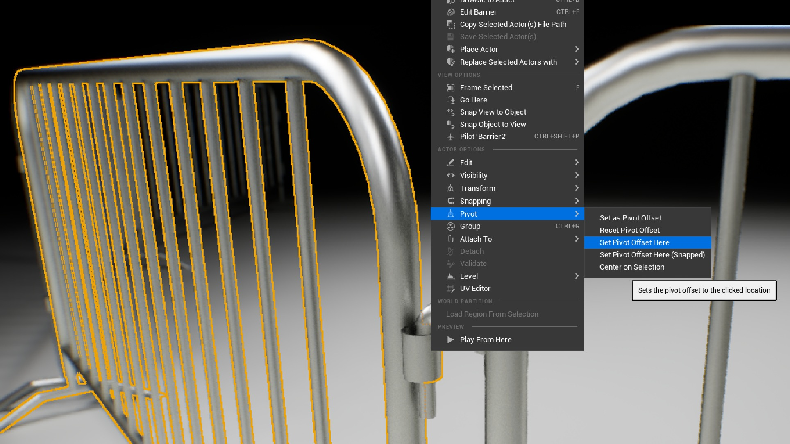
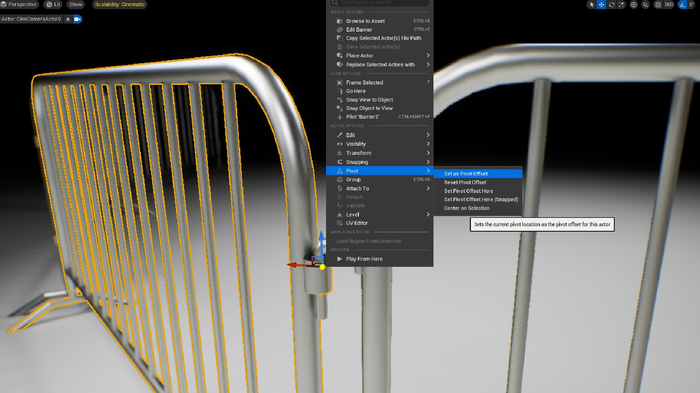
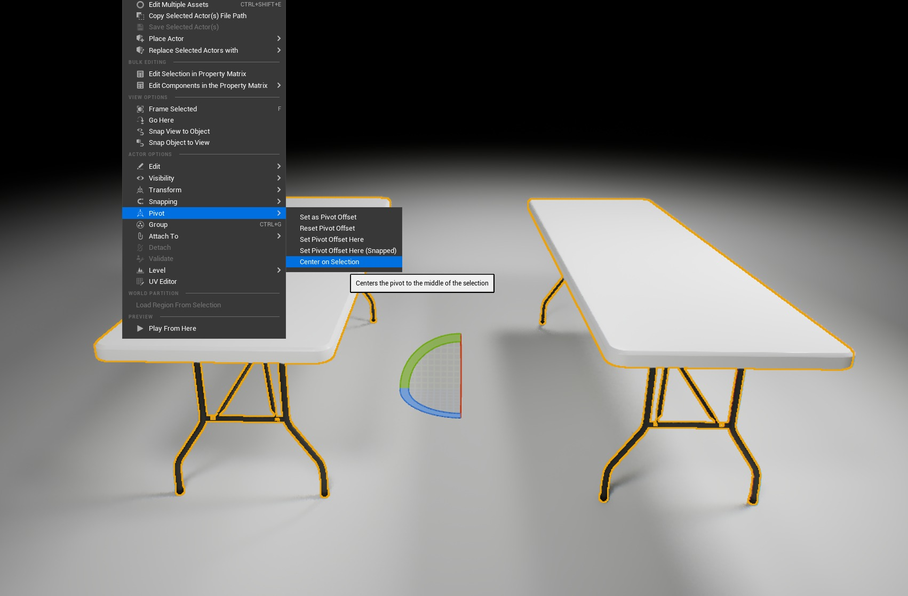

# 枢轴点技术

## 来源与状态

- 原始 URL：https://dev.epicgames.com/community/learning/tutorials/8dB8/unreal-engine-pivot-point-techniques

## 运行时分类

- 类型：图文教程
- 判断：API 未识别到核心视频信号，可整理正文约 1393 字符。

## 摘要

这是有关在视口中使用枢轴修改工具的快速教程。

## 中文整理

### 枢轴点技术

在虚幻引擎中平移和旋转角色时，有时将枢轴点移动到特定位置更有意义。为此，右键单击 Actor，然后在上下文菜单中选择“枢轴”，然后选择“在此处设置枢轴偏移”。

这会将枢轴点移动到您右键单击以打开上下文菜单的位置。取消选择对象将丢失该枢轴点位置，这可能是您有意或无意的操作。要在复制对象后将枢轴点保持在同一位置，请再次右键单击该对象，然后在上下文菜单中选择“枢轴”，然后选择“设置为枢轴偏移”。

“枢轴”菜单中的另一个有用的工具是“选择中心”。选择多个对象时，右键单击其中之一，然后在上下文菜单中选择“枢轴”，然后选择“以选择为中心”。这将为您提供两个或多个选定对象之间的枢轴点，这对于对称旋转非常有用。

默认情况下，虚幻从最后选定的对象开始移动/旋转，因此这非常有用，因此您不必使用“分组”、修改导入位置或在外部建模软件中进行编辑。对于与动画或物理有关的更精确的偏移或复杂问题，您可能需要在建模软件中编辑枢轴。

